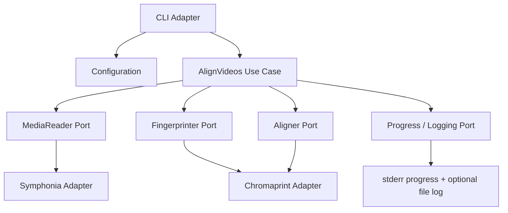
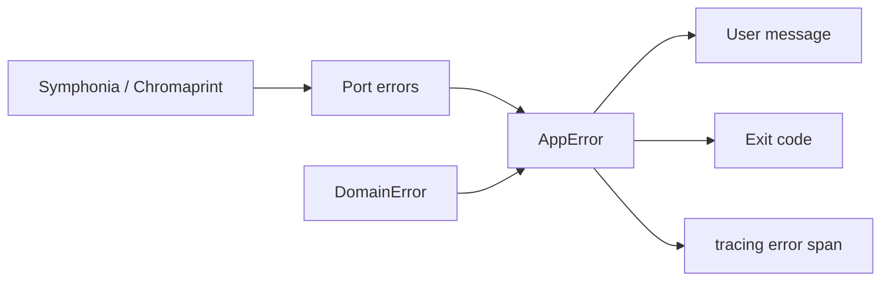

# clip-sync — Application Sketch

## Purpose

`clip-sync` is a Rust command-line tool that aligns two video files by comparing their audio. It opens each file, selects the best audio track, extracts one or more clips (from the start, end, and evenly spaced positions between), fingerprints them, and computes the time offset between matching segments.

The tool is intended for workflows where two recordings of the same event (e.g. different cameras or re-encoded copies) need to be synchronized without manual scrubbing.

## High-level workflow

1. Parse CLI arguments and load configuration.
2. Open video A and video B.
3. For each video:
   - Discover audio tracks.
   - Select the highest-quality track (domain policy).
   - Compute clip windows from duration and `ClipConfig` (see [Clip window policy](#clip-window-policy)).
   - Decode, down-mix to mono, and produce one PCM clip per window.
4. Fingerprint all clips (same count per video).
5. Compare fingerprints pairwise by clip index and compute offset (merging multiple estimates when `num_clips > 1`).
6. Emit result (offset, confidence, diagnostics) via CLI output; log progress throughout.



## Architecture

Hexagonal (ports and adapters) with three inner layers and a composition root.

| Layer | Responsibility | Depends on |
|-------|----------------|------------|
| **Domain** | Entities, value objects, pure policies | Nothing external |
| **Application** | Use cases, port traits, orchestration | Domain |
| **Infrastructure** | Adapters (Symphonia, Chromaprint, CLI, logging) | Application ports |
| **Composition root** (`main`) | Wire adapters to ports, parse config | All layers |

Dependency rule: domain ← application ← infrastructure. No inward dependencies from domain or application on Symphonia, Chromaprint, or `clap`.

## Domain layer

### Entities and value objects

| Type | Description |
|------|-------------|
| `MediaSource` | Path or identifier for an input file |
| `AudioTrack` | Track index, codec, channel count, sample rate, bitrate (if known) |
| `ClipWindow` | Start/end time range within a track |
| `MonoPcmClip` | Sample rate, channel count (1), PCM samples for one window |
| `Fingerprint` | Opaque fingerprint blob for a clip |
| `MatchSegment` | Start/end in clip A and clip B, match score |
| `AlignmentResult` | Offset (seconds or samples), confidence, matched segments, metadata |

### Domain policies (pure functions)

- **`select_best_track(tracks) -> AudioTrack`** — Prefer higher sample rate, then channel count, then bitrate. Fail if no audio tracks.
- **`clip_windows(duration, clip: &ClipConfig) -> Vec<ClipWindow>`** — See [Clip window policy](#clip-window-policy).

### Clip window policy

Clips are defined by two settings only:

| Setting | Default | Minimum | Description |
|---------|---------|---------|-------------|
| `clip_length` | 15 min | 1 min | Target duration of each extracted window |
| `num_clips` | 2 | 1 | How many windows to extract per video |

There is no separate max-size or threshold setting. Effective clip count and window positions are derived from duration, `clip_length`, and `num_clips`.

#### Effective clip count

```text
if duration < clip_length:
    effective_num_clips = 1        # short media — see single-clip rule
else:
    effective_num_clips = num_clips
```

When the video is shorter than `clip_length`, **`num_clips` is ignored** and a single start clip covering the full duration is used.

#### Window placement

**One clip** (`effective_num_clips == 1`):

- Always from the **start**: `[0, min(duration, clip_length))`.
- When `duration < clip_length`, this covers the full file. When `num_clips == 1` on longer media, only the first `clip_length` is used.

**Two or more clips** (`effective_num_clips >= 2`):

Always anchor the **first clip at the start** and the **last clip at the end**. Any remaining clips sit between them, centered in equal subdivisions of the full timeline.

1. **Start clip:** `[0, clip_length)`
2. **End clip:** `[duration - clip_length, duration)`
3. **Interior clips** (when `effective_num_clips > 2`): divide `[0, duration)` into `effective_num_clips` equal segments. For each interior segment (indices `1 .. effective_num_clips - 1`), place a window of length `clip_length` centered on that segment’s midpoint (clamp to `[0, duration)`).

Return windows in chronological order (start → interior(s) → end).

#### Examples (default `clip_length` 15m, `num_clips` 2)

| Duration | Effective clips | Windows |
|----------|-----------------|---------|
| 12m | 1 | `[0, 12m)` — full file |
| 45m | 2 | `[0, 15m)`, `[30m, 45m)` |
| 60m | 2 | `[0, 15m)`, `[45m, 60m)` |

#### Examples (`clip_length` 10m, `num_clips` 3, duration 60m)

| Clip | Window |
|------|--------|
| 1 (start) | `[0, 10m)` |
| 2 (middle — center of segment 20m–40m) | `[25m, 35m)` |
| 3 (end) | `[50m, 60m)` |

#### Validation and logging

- Reject at config load: `clip_length < 1 min`, `num_clips < 1`.
- Reject at runtime: `duration == 0` → `InvalidDuration`.
- Log effective clip count, each window boundary, and labels (`start`, `interior`, `end`) when `num_clips > 2`.

### Domain errors

```rust
enum DomainError {
    NoAudioTracks,
    InvalidDuration,
    EmptyClip,
}
```

Domain errors carry no I/O or library context; they describe business rule violations only.

## Application layer

### Primary use case: `AlignVideos`

**Input:** two `MediaSource` values, effective `AppConfig`.

**Output:** `AlignmentResult` or mapped application error.

**Steps:**

1. Log phase start: `Opening media`.
2. Open both sources via `MediaReader::open`.
3. For each source, list tracks; apply `select_best_track`.
4. Log: track chosen (index, sample rate, channels).
5. Query duration; compute `clip_windows(duration, &config.clip)`.
6. Log: effective clip count and each window boundary.
7. Extract mono PCM for each window via `MediaReader::extract_mono`.
8. Log: extraction progress (see Progress port).
9. Fingerprint each clip via `Fingerprinter::fingerprint`.
10. Log: fingerprint complete.
11. For each clip index `i`, run `Aligner::find_offset` on clip *i* from A vs clip *i* from B; merge offsets (prefer start-clip match when estimates disagree — see `AlignmentConfig`).
12. Log: match result summary.
13. Return `AlignmentResult`.

### Ports (traits)

| Port | Role |
|------|------|
| `MediaReader` | Open file, list tracks, read duration, decode time range to mono PCM |
| `Fingerprinter` | `MonoPcmClip` → `Fingerprint` |
| `Aligner` | Compare fingerprint pairs; return offset and match segments |
| `ProgressReporter` | Phase messages and granular progress callbacks (see Logging) |

### Application DTOs

- `AlignVideosRequest` — paths to video A and B, optional config overrides.
- `AlignVideosResponse` — `AlignmentResult` plus optional diagnostic details for verbose mode.

### Application errors

```rust
enum AppError {
    Domain(DomainError),
    Media(MediaError),
    Fingerprint(FingerprintError),
    Alignment(AlignmentError),
    Config(ConfigError),
}
```

Application errors aggregate domain and port failures; infrastructure maps library errors into `MediaError`, etc., before the use case sees them.

## Infrastructure layer

### CLI adapter (`clap`)

- Subcommand or default: align two positional paths `VIDEO_A` `VIDEO_B`.
- Global flags wired into `AppConfig` (see Configuration).
- On success: print human-readable offset to stdout (JSON with `--format json`).
- On failure: print mapped user message to stderr, exit code from `ExitCode` mapping.
- Verbose / quiet flags control `ProgressReporter` and log level.

### Symphonia adapter (`MediaReader`)

- Demux container, enumerate audio tracks, decode selected track.
- Down-mix to mono during decode (or post-decode mix).
- Honor `ClipWindow` time bounds; stream decode for long segments.
- Map Symphonia/decode failures → `MediaError` (see Error mapping).

### Chromaprint adapter (`Fingerprinter` + `Aligner`)

- `rusty-chromaprint` for fingerprint generation.
- Alignment: compare fingerprints by matching clip index; merge multiple offset estimates per use-case rules.
- Map library failures → `FingerprintError` / `AlignmentError`.

### Logging and progress adapter

Two channels:

| Channel | Audience | Content |
|---------|----------|---------|
| **Progress** (`ProgressReporter`) | User on stderr | Phase labels, percent complete during long decode, ETA optional |
| **Diagnostic log** (`tracing`) | Developers / `--log-file` | Structured events, spans per video and phase, debug detail |

Progress is always human-oriented and respects `--quiet`. Diagnostic logging respects `RUST_LOG` and `--log-level`.

## Configuration

Configuration merges defaults, optional config file, and CLI overrides (CLI wins).

### `AppConfig` structure

```rust
struct AppConfig {
    clip: ClipConfig,
    alignment: AlignmentConfig,
    output: OutputConfig,
    logging: LoggingConfig,
}

struct ClipConfig {
    clip_length: Duration,            // default: 15 min, minimum: 1 min
    num_clips: u32,                   // default: 2, minimum: 1
    target_sample_rate: Option<u32>,  // optional resample target for fingerprinting
}

struct AlignmentConfig {
    min_match_score: f32,             // minimum confidence to report success
    prefer_start_clip: bool,          // when clip-pair offsets disagree, prefer the first clip’s estimate
}

struct OutputConfig {
    format: OutputFormat,         // Human | Json
    show_diagnostics: bool,     // tied to --verbose
}

struct LoggingConfig {
    level: LogLevel,              // error | warn | info | debug | trace
    log_file: Option<PathBuf>,    // optional file appender
    progress: ProgressMode,       // Auto | Quiet | Verbose
}
```

### Sources and precedence

1. Built-in defaults (constants in `application` or `domain`).
2. Optional config file: TOML at `--config` or `%APPDATA%/clip-sync/config.toml` (platform-specific path in infrastructure).
3. CLI flags: `--clip-length`, `--num-clips`, `--log-level`, `--quiet`, etc.

Invalid config → `ConfigError` at startup before media work begins (e.g. `clip_length < 1 min`, `num_clips < 1`).

## Logging and progress

### Phases (progress messages)

| Phase | Message example |
|-------|-----------------|
| Startup | `clip-sync: aligning <A> with <B>` |
| Open | `Opening video A...` / `Opening video B...` |
| Track select | `Selected track 1 (48000 Hz, stereo)` |
| Clip plan | `Clip plan: 2 clips (15m each) — [0:00–15:00] start, [30:00–45:00] end` or `Clip plan: 1 clip — [0:00–12:00] start (media shorter than clip length)` |
| Extract | `Extracting clip 1/2 (video A): 42%` — throttled updates |
| Fingerprint | `Fingerprinting 4 clips...` (2 × effective_num_clips) |
| Align | `Searching for match...` |
| Done | `Offset: +12.340 s (confidence: 0.94)` |

### `ProgressReporter` port

```rust
trait ProgressReporter {
    fn phase(&self, message: &str);
    fn progress(&self, label: &str, current: u64, total: u64); // no-op when quiet
}
```

Infrastructure implements with stderr TTY detection (no progress bar when not a TTY unless `--verbose`).

### `tracing` integration

- Spans: `align_videos`, `open_media`, `extract_clip`, `fingerprint`, `align`.
- Fields: `path`, `track_index`, `window_start`, `window_end`, `offset`, `score`.
- Errors recorded with `tracing::error!` after mapping; user still sees sanitized message from CLI.

## Error mapping

Errors flow: **library → port error → AppError → user message + exit code**.

### Port-level errors (infrastructure boundary)

```rust
enum MediaError {
    FileNotFound(PathBuf),
    UnsupportedFormat(String),
    OpenFailed(String),
    DecodeFailed { track: u32, detail: String },
    SeekFailed(String),
}

enum FingerprintError {
    InvalidPcm(String),
    EngineFailed(String),
}

enum AlignmentError {
    NoMatch,
    AmbiguousMatch { candidates: usize },
    EngineFailed(String),
}

enum ConfigError {
    FileRead(PathBuf),
    Parse(String),
    InvalidValue { field: String, reason: String },
}
```

Infrastructure adapters implement `From<symphonia::...>` (etc.) into these enums at the adapter boundary; domain never sees library types.

### User-facing messages and exit codes

| AppError variant | User message (stderr) | Exit code |
|------------------|----------------------|-----------|
| `Config(...)` | `Configuration error: ...` | 2 |
| `Domain(NoAudioTracks)` | `No audio tracks found in <path>` | 3 |
| `Media(FileNotFound)` | `File not found: <path>` | 4 |
| `Media(UnsupportedFormat)` | `Unsupported format: ...` | 4 |
| `Media(...)` | `Failed to read audio: ...` | 4 |
| `Fingerprint(...)` | `Fingerprint failed: ...` | 5 |
| `Alignment(NoMatch)` | `Could not find a matching segment` | 6 |
| `Alignment(AmbiguousMatch)` | `Multiple equally likely matches; try shorter clips or higher quality source` | 6 |
| `Alignment(...)` | `Alignment failed: ...` | 6 |

CLI adapter owns `Display for AppError` (user-safe) and `impl From<AppError> for ExitCode`. Internal causes remain in logs when `--verbose` or `RUST_LOG=debug`.

### Error mapping flow



## CLI surface (sketch)

```
clip-sync [OPTIONS] <VIDEO_A> <VIDEO_B>

Arguments:
  VIDEO_A, VIDEO_B    Paths to input video files

Options:
  -c, --config <FILE>           Config file path
      --clip-length <DUR>         Clip window length [default: 15m, min: 1m]
      --num-clips <N>             Clips per video [default: 2, min: 1]
      --format <human|json>     Output format
  -v, --verbose                 Diagnostics on stdout/stderr
  -q, --quiet                   Errors only; no progress
      --log-level <LEVEL>       Log level for tracing
      --log-file <FILE>         Write logs to file
  -h, --help
  -V, --version
```

## Module layout

```
clip-sync/
├── Cargo.toml
├── src/
│   ├── main.rs                 # composition root
│   ├── domain/
│   │   ├── mod.rs
│   │   ├── audio_track.rs
│   │   ├── clip_window.rs
│   │   ├── alignment.rs
│   │   ├── policies.rs         # select_best_track, clip_windows
│   │   └── error.rs
│   ├── application/
│   │   ├── mod.rs
│   │   ├── config.rs
│   │   ├── align_videos.rs     # use case
│   │   ├── ports.rs            # MediaReader, Fingerprinter, Aligner, ProgressReporter
│   │   └── error.rs
│   └── infrastructure/
│       ├── mod.rs
│       ├── cli/
│       │   ├── mod.rs
│       │   ├── args.rs
│       │   ├── output.rs       # human + JSON formatters
│       │   └── exit_code.rs
│       ├── config/
│       │   └── file.rs         # TOML load + merge
│       ├── logging/
│       │   ├── mod.rs
│       │   └── progress.rs     # ProgressReporter impl
│       ├── symphonia/
│       │   ├── mod.rs
│       │   └── media_reader.rs
│       └── chromaprint/
│           ├── mod.rs
│           ├── fingerprinter.rs
│           └── aligner.rs
```

## Dependencies (planned)

| Crate | Use |
|-------|-----|
| `clap` | CLI parsing |
| `symphonia` | Demux/decode audio |
| `rusty-chromaprint` | Fingerprint and match |
| `tracing`, `tracing-subscriber` | Structured logging |
| `serde`, `serde_json` | JSON output and config (de)serialization |
| `toml` | Config file |
| `thiserror` | Error enum definitions |
| `anyhow` | Optional at composition root only for top-level crash reporting |

## Testing strategy (sketch)

- **Domain:** unit tests for `select_best_track`, `clip_windows` — short media forces one full start clip; `num_clips == 1` on long media; two-clip start/end; three+ clip interior placement; config validation (min clip length, min num clips); zero duration.
- **Application:** use case tests with fake `MediaReader`, `Fingerprinter`, `Aligner`, and `ProgressReporter`.
- **Infrastructure:** integration tests with short fixture WAV/MP4 files in `tests/fixtures/` (kept small).

## Out of scope (initial version)

- Video frame alignment or visual sync.
- Batch processing of more than two files.
- Writing aligned output files (report offset only).
- Network or streaming sources (local files only).
