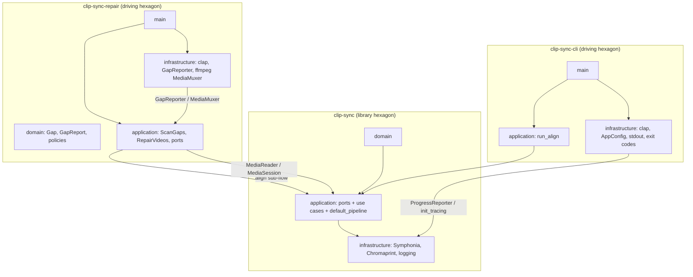

# clip-sync — Architecture & Application Sketch

## Purpose

`clip-sync` is a Rust workspace for synchronizing video recordings by comparing audio. The primary tool **`clip-sync`** aligns two video files: it opens each file, selects the best audio track, extracts clips, fingerprints them, and computes the time offset between matching segments.

A companion tool **`clip-sync-repair`** reuses the same alignment engine to detect silent gaps in one recording and (when the write path ships) patch them from an aligned partner file.

The workspace is intended for workflows where two recordings of the same event (e.g. different cameras or re-encoded copies) need to be synchronized or repaired without manual scrubbing.

| Application | Binary | Scope |
|-------------|--------|-------|
| **Analyzer** | `clip-sync` | Read-only: report offset and per-clip alignment |
| **Repair** | `clip-sync-repair` | Gap scan + patched output via WAV + optional ffmpeg mux ([write-path plan](docs/archive/repair-write-path-plan.md), shipped R0–R5) |

Implementation status: workspace migration Phases 1–4 are complete — the analyzer ships as `crates/clip-sync-cli`, repair as `crates/clip-sync-repair`. The repair **write path** (R0–R5) shipped 2026-06-09 — see [docs/archive/repair-write-path-plan.md](docs/archive/repair-write-path-plan.md), which supersedes the thin migration Phase 5 stub in [docs/archive/workspace-refactor-plan.md](docs/archive/workspace-refactor-plan.md). This document describes the **target** architecture; keep it aligned with those plans when decisions change.

---

## Workspace structure

```text
clip-sync/                              # workspace root
├── Cargo.toml                          # [workspace] members only
├── PLAN.md
├── BACKLOG.md
├── docs/archive/workspace-refactor-plan.md  # migration plan (phases 1–3 complete; 4–5 tracked in BACKLOG)
├── docs/                               # corpus-matrix, corpus-validation, error-mapping, …
├── scripts/                            # generate_corpus.ps1 / .sh
├── tests/
│   └── corpus/                         # DATA ONLY: manifest, README, wav/ (not Rust tests)
└── crates/
    ├── clip-sync/                      # library hexagon
    ├── clip-sync-cli/                  # analyzer driving hexagon → binary `clip-sync`
    └── clip-sync-repair/               # repair driving hexagon → binary `clip-sync-repair`
```

| Crate | Package name | Role |
|-------|--------------|------|
| `crates/clip-sync` | `clip-sync` | Shared alignment engine (domain + application + default adapters) |
| `crates/clip-sync-cli` | `clip-sync-cli` | Analyzer CLI; thin orchestration + driving adapters |
| `crates/clip-sync-repair` | `clip-sync-repair` | Repair CLI; own domain/use cases + ffmpeg mux adapter |

---

## Hexagonal architecture

The workspace contains **three separate hexagons**. Each binary `main` is a **composition root** for its crate only.



### Layer responsibilities

| Layer | Responsibility | Depends on |
|-------|----------------|------------|
| **Domain** | Entities, value objects, pure policies | Nothing external |
| **Application** | Use cases, port traits, orchestration | Domain |
| **Infrastructure** | Adapters (Symphonia, Chromaprint, CLI, ffmpeg, logging) | Application ports |
| **Composition root** (`main`) | Wire adapters to ports, parse config | All layers in that crate |

**Dependency rule:** domain ← application ← infrastructure. Domain and application never depend on Symphonia, Chromaprint, `clap`, or ffmpeg.

### Cross-crate dependency rules

| Crate | May depend on | Must not depend on |
|-------|----------------|---------------------|
| **`clip-sync`** | Internal domain ← application ← infrastructure | `clap`, ffmpeg, either CLI crate |
| **`clip-sync-cli`** | `clip_sync` **facade re-exports** + own application/infrastructure | `clip_sync::infrastructure::…` internals, repair crate |
| **`clip-sync-repair`** | `clip_sync` **facade re-exports** + own domain/app/infra | analyzer CLI crate, ffmpeg in lib |

### Library role

`clip-sync` is an **alignment hexagon with bundled default adapters** — not a ports-only kernel. Symphonia, Chromaprint, and shared logging adapters ship in the library so both applications reuse one implementation.

**Module visibility:** `domain`, `application`, and `infrastructure` are private inside the lib. The public surface is a **facade** of `pub use` re-exports at `lib.rs` only.

**Anti-patterns (forbid in review):**

- Repair copying or forking `align_videos.rs`.
- CLI or repair importing `clip_sync::infrastructure::symphonia::extract` (or any non-facade internal path).
- Lib deserializing `AppConfig` or owning `OutputConfig`.
- Repair use cases living in lib without an explicit shared-use-case decision.
- `align_with_defaults` as the *only* documented entry point — ports + `AlignVideos` must stay public.
- Repair-specific variants on lib `AppError`.

---

## Analyzer workflow (`clip-sync`)

1. Parse CLI arguments and load configuration (`AppConfig`).
2. Call `run_align` → lib alignment pipeline.
3. Open video A and video B.
4. For each video:
   - Discover audio tracks.
   - Select the highest-quality track (domain policy).
   - Compute clip windows from duration and `ClipConfig` (see [Clip window policy](#clip-window-policy)).
   - Decode, down-mix to mono, and produce one PCM clip per window.
5. Fingerprint all clips (same count per video).
6. Compare fingerprints pairwise by clip index and compute offset (merging multiple estimates when `num_clips > 1`).
7. Optionally refine the recommended offset with a native-rate hold-out PCM pass (`refine_offset_high_rate`).
8. Emit result (offset, confidence, diagnostics) via CLI output; log progress throughout.

---

## Repair workflow (`clip-sync-repair`)

> **Phase naming:** Report-only repair = workspace **migration Phase 4** (shipped). The write path = migration **Phase 5** umbrella, implemented per feature phases **R0–R5** in [docs/archive/repair-write-path-plan.md](docs/archive/repair-write-path-plan.md) (shipped; not the thin Phase 5 checklist in the archived refactor plan).

**Report-only (migration Phase 4 — shipped):**

1. Parse CLI arguments and load `RepairAppConfig` (align + repair + logging sections).
2. Run in-process alignment via `clip_sync::align_with_defaults` (same offset semantics as analyzer).
3. Scan video A timeline in chunks: extract mono PCM via `MediaSession`, detect internal silent runs.
4. Map video B timeline using `recommended_offset_secs` (skip B mapping when alignment produced no offset — see write-path plan § Alignment gate).
5. For each candidate gap: report whether B has energy.
6. Output gap table (human + JSON). Exit **0** when analysis completes. **No file writes.**

**Write path (R0–R5 in [docs/archive/repair-write-path-plan.md](docs/archive/repair-write-path-plan.md), shipped):**

- **R0–R1 (lib):** native multi-channel `extract_interleaved` for fill-quality PCM.
- **R2–R3 (repair):** track compatibility, overlap on report, bidirectional silence scan, mutual-silence cross-check.
- **R4 (repair):** `PatchAudio` / `gap_fill` → multi-channel **WAV** (default deliverable; crossfade + optional normalization).
- **R5 (repair, optional):** `RepairVideos` + `MediaMuxer` ffmpeg subprocess behind `ffmpeg-mux` feature.

Repair always aligns in-process; it does not require piping JSON from a prior `clip-sync` run.

---

## Library hexagon (`clip-sync`)

### Domain layer

#### Entities and value objects

| Type | Description |
|------|-------------|
| `MediaSource` | Path or identifier for an input file |
| `AudioTrack` | Track index, codec, channel count, sample rate, bitrate (if known) |
| `ClipWindow` | Start/end time range within a track |
| `MonoPcmClip` | Sample rate, channel count (1), PCM samples for one window |
| `Fingerprint` | Opaque fingerprint blob for a clip |
| `ClipMatchEstimate` | Raw offset + confidence from comparing one clip pair |
| `ClipMatch` | Per-clip report: window, aligned or not, offset if matched |
| `AlignmentResult` | Full report: start/end alignment flags, per-clip results, recommended offset |

#### Domain policies (pure functions)

- **`select_best_track(tracks) -> AudioTrack`** — First decodable track in container order. Fail if no audio tracks. When the main program is not first, use `alignment.try_all_tracks` or `--try-all-tracks` (see [docs/corpus-validation.md](docs/corpus-validation.md)).
- **`clip_windows(duration, clip: &ClipConfig) -> Vec<ClipWindow>`** — See [Clip window policy](#clip-window-policy).
- **`pcm_preparation`** — Peak normalization, silence trimming, energy gates (shared with repair gap detection).

#### Clip window policy

Clips are defined by two settings only:

| Setting | Analyzer default | Repair default | Minimum | Description |
|---------|------------------|----------------|---------|-------------|
| `clip_length` | 15 min | 15 min | 1 min | Target duration of each extracted window |
| `num_clips` | 1 | **2** | 1 | How many windows to extract per video |

There is no separate max-size or threshold setting. Effective clip count and window positions are derived from duration, `clip_length`, and `num_clips`.

##### Effective clip count

```text
if duration < clip_length:
    effective_num_clips = 1        # short media — see single-clip rule
else:
    effective_num_clips = num_clips
```

When the video is shorter than `clip_length`, **`num_clips` is ignored** and a single start clip covering the full duration is used.

##### Window placement

**One clip** (`effective_num_clips == 1`):

- Always from the **start**: `[0, min(duration, clip_length))`.
- When `duration < clip_length`, this covers the full file. When `num_clips == 1` on longer media, only the first `clip_length` is used.

**Two or more clips** (`effective_num_clips >= 2`):

Always anchor the **first clip at the start** and the **last clip at the end**. Any remaining clips sit between them, centered in equal subdivisions of the full timeline.

1. **Start clip:** `[0, clip_length)`
2. **End clip:** `[duration - clip_length, duration)`
3. **Interior clips** (when `effective_num_clips > 2`): divide `[0, duration)` into `effective_num_clips` equal segments. For each interior segment (indices `1 .. effective_num_clips - 1`), place a window of length `clip_length` centered on that segment’s midpoint (clamp to `[0, duration)`).

Return windows in chronological order (start → interior(s) → end).

##### Examples (`clip_length` 15m, `num_clips` 2)

| Duration | Effective clips | Windows |
|----------|-----------------|---------|
| 12m | 1 | `[0, 12m)` — full file |
| 45m | 2 | `[0, 15m)`, `[30m, 45m)` |
| 60m | 2 | `[0, 15m)`, `[45m, 60m)` |

##### Examples (`clip_length` 10m, `num_clips` 3, duration 60m)

| Clip | Window |
|------|--------|
| 1 (start) | `[0, 10m)` |
| 2 (middle — center of segment 20m–40m) | `[25m, 35m)` |
| 3 (end) | `[50m, 60m)` |

##### Validation and logging

- Reject at config load: `clip_length < 1 min`, `num_clips < 1`.
- Reject at runtime: `duration == 0` → `InvalidDuration`.
- Log effective clip count, each window boundary, and labels (`start`, `interior`, `end`) when `num_clips > 2`.

#### Domain errors

```rust
enum DomainError {
    NoAudioTracks,
    InvalidDuration,
    EmptyClip,
}
```

Domain errors carry no I/O or library context; they describe business rule violations only.

### Application layer

#### Primary use case: `AlignVideos`

**Input:** two video paths, `AlignConfig`.

**Output:** `AlignmentResult` or mapped application error.

**Steps:**

1. Log phase start: `Opening media`.
2. Open both sources via `MediaReader::open`.
3. For each source, list tracks; apply `select_best_track` (or try all track pairs when configured).
4. Log: track chosen (index, sample rate, channels).
5. Query duration; compute `clip_windows(duration, &config.clip)`.
6. Log: effective clip count and each window boundary.
7. Extract mono PCM for each window via `MediaSession::extract_mono`.
8. Log: extraction progress (see Progress port).
9. Fingerprint each clip via `Fingerprinter::fingerprint`.
10. Log: fingerprint complete.
11. For each clip index `i`, run `Aligner::find_offset` on clip *i* from A vs clip *i* from B; build `AlignmentResult` with per-clip alignment and recommended offset.
12. Optionally apply PCM refinement (`refine_offset_with_pcm`) and high-rate hold-out refinement (`refine_offset_high_rate`).
13. Log alignment summary (start/end aligned, per-clip status, recommended offset).
14. Return `AlignmentResult` (always on successful analysis, even when no clips match).

#### Default pipeline: `align_with_defaults`

Optional composition helper — same adapter wiring as the analyzer composition root:

```rust
pub fn align_with_defaults(
    request: AlignVideosRequest,
    progress: &dyn ProgressReporter,
) -> Result<AlignVideosResponse, AppError>
```

Wires `SymphoniaMediaReader`, `ChromaprintFingerprinter`, `ChromaprintAligner` from `AlignConfig.clip.chromaprint_preset`. Use **`AlignVideos` + port injection** for tests and custom composition roots.

#### Ports (traits)

| Port | Role |
|------|------|
| `MediaReader` | Open file → `MediaSession` |
| `MediaSession` | List tracks, extract mono PCM for a `ClipWindow`, optional `reset_io` |
| `Fingerprinter` | `MonoPcmClip` → `Fingerprint` |
| `Aligner` | Compare fingerprint pairs; return offset and match segments |
| `ProgressReporter` | Phase messages and granular progress callbacks |

#### Application DTOs

```rust
struct AlignVideosRequest {
    video_a: PathBuf,
    video_b: PathBuf,
    config: AlignConfig,   // not AppConfig
}

struct AlignVideosResponse {
    result: AlignmentResult,
}
```

#### Application errors

```rust
enum AppError {
    Domain(DomainError),
    Media(MediaError),
    Fingerprint(FingerprintError),
    Alignment(AlignmentError),
    Config(ConfigError),
}
```

Application errors aggregate domain and port failures; infrastructure maps library errors at the adapter boundary. See [docs/error-mapping.md](docs/error-mapping.md).

#### Offset refinement

`offset_refinement` and `high_rate_refinement` implement sub-second and native-rate correction after Chromaprint discovery. Selected helpers (`aligned_slice_starts`, boundary correlation) are re-exported on the lib facade for repair.

### Infrastructure layer (library)

#### Symphonia adapter (`MediaReader`)

- Demux container, enumerate audio tracks, decode selected track.
- Down-mix to mono during decode (or post-decode mix).
- Honor `ClipWindow` time bounds; stream decode for long segments.
- **Session reuse:** one probe and `FormatReader` per file per alignment run; per-track decoders cached across clip windows (see [docs/archive/session-reuse-plan.md](docs/archive/session-reuse-plan.md)).
- Map Symphonia/decode failures → `MediaError`.

#### Chromaprint adapter (`Fingerprinter` + `Aligner`)

- `rusty-chromaprint` for fingerprint generation.
- Alignment: compare fingerprints by matching clip index; merge multiple offset estimates per use-case rules.
- Map library failures → `FingerprintError` / `AlignmentError`.

#### Config adapter (align only)

- `load_align_config(path) -> AlignConfig` — deserializes `[clip]` + `[alignment]` from TOML; ignores other top-level sections.
- Does **not** load `AppConfig` or repair config.

#### Logging and progress adapter

Shared driving-adapter infrastructure used by both applications:

| Channel | Audience | Content |
|---------|----------|---------|
| **Progress** (`ProgressReporter`) | User on stderr | Phase labels, percent complete during long decode |
| **Diagnostic log** (`tracing`) | Developers / `--log-file` | Structured events, spans per video and phase |

`LoggingConfig`, `init_tracing`, and `StderrProgressReporter` live in `infrastructure::logging`. Progress respects `--quiet`; diagnostic logging respects `RUST_LOG` and `--log-level`.

### Library public API (facade)

`crates/clip-sync/src/lib.rs` — private modules, documented re-exports:

```rust
// Application
pub use application::config::{AlignConfig, AlignmentConfig, ClipConfig, ChromaprintPreset};
pub use application::{
    default_pipeline::align_with_defaults,
    AlignVideos, AlignVideosRequest, AlignVideosResponse,
    AppError, ConfigError,
};
pub use application::ports::{Aligner, Fingerprinter, MediaReader, MediaSession, ProgressReporter};
pub use application::offset_refinement::aligned_slice_starts;

// Domain (selected)
pub use domain::{
    AlignmentResult, AudioTrack, ClipMatch, ClipMatchEstimate, ClipWindow, ClipLabel,
    DomainError, Fingerprint, MediaSource, MonoPcmClip,
};

// Default adapter types + shared infra
pub use infrastructure::chromaprint::{ChromaprintAligner, ChromaprintFingerprinter};
pub use infrastructure::symphonia::SymphoniaMediaReader;
pub use infrastructure::config::file::load_align_config;
pub use infrastructure::logging::{
    init_tracing, LoggingConfig, LogLevel, ProgressMode, StderrProgressReporter,
};
```

**Repair facade allow-list** (extend in Phase 4 as needed):

| Repair need | Lib export |
|-------------|------------|
| Alignment | `align_with_defaults`, `AlignVideos`, `AlignConfig` |
| PCM extract | `MediaReader`, `MediaSession`, `SymphoniaMediaReader` |
| Silence / prep | `domain::pcm_preparation` re-exports |
| Boundary correlation | `application::offset_refinement` re-exports |
| Whole-timeline chunked extract | New `application::timeline_scan` helper if gap scan cannot use repeated `extract_mono` alone |

---

## Analyzer application (`clip-sync-cli`)

Thin driving hexagon. The alignment use case lives in the library; this crate owns CLI concerns only.

### Application layer

**`run_align`** — orchestrates one analyzer run:

```rust
pub fn run_align(
    config: &AppConfig,
    video_a: PathBuf,
    video_b: PathBuf,
    progress: &dyn ProgressReporter,
) -> Result<AlignmentResult, AppError>
```

Builds `AlignVideosRequest` from `config.align`, calls `align_with_defaults` (or wires ports explicitly in tests).

### Infrastructure layer

| Module | Role |
|--------|------|
| `infrastructure/cli/args.rs` | `clap` definitions |
| `infrastructure/cli/mod.rs` | Parse args, load config, init tracing, call `run_align`, print output |
| `infrastructure/cli/output.rs` | Human + JSON formatters (`OutputConfig`) |
| `infrastructure/cli/exit_code.rs` | `AppError` → process exit code |
| `infrastructure/config.rs` | `AppConfig`, `OutputConfig`, `load_app_config` |

### Composition root

`main.rs` → `infrastructure::cli::run()` → maps errors to `ExitCode`.

---

## Repair application (`clip-sync-repair`)

Own driving hexagon. Uses the library as a **downstream dependency** for alignment and media decode — not as its parent application layer.

### Domain layer

| Type | Description |
|------|-------------|
| `Gap` | Start/end time of a silent run in video A |
| `GapReport` | List of gaps with fillability, correlation, reason |
| `GapFillPlan` | PCM splice regions for write path ([R4](docs/archive/repair-write-path-plan.md)) |

Pure policies: minimum gap duration, silence peak fraction (aligned with fingerprint prep), crossfade length.

### Application layer

| Use case | Description |
|----------|-------------|
| `ScanGaps` | Align → chunk-scan A → map B → produce `GapReport` |
| `RepairVideos` | `ScanGaps` → `gap_fill` → `PatchedAudioWriter` (R4) → optional `MediaMuxer` (R5) |

#### Ports

```rust
trait GapReporter {
    fn report(&self, report: &GapReport) -> Result<(), RepairError>;
}

trait MediaMuxer {   // R5 (`ffmpeg-mux` feature)
    fn mux_video_with_replaced_audio(
        &self,
        source_video: &Path,
        replacement_audio_wav: &Path,
        output: &Path,
        options: &MuxOptions,
    ) -> Result<(), MuxError>;
}
```

#### Repair errors

```rust
enum RepairError {
    Align(clip_sync::AppError),
    Config(/* repair-specific */),
    Scan(/* gap detection */),
    Mux(/* ffmpeg failures */),
    // ...
}
```

Do **not** extend lib `AppError` with repair variants. Wrap `AppError` at the align boundary.

### Infrastructure layer

| Module | Role |
|--------|------|
| `infrastructure/cli/` | Args, human/JSON gap output, exit codes |
| `infrastructure/config.rs` | `RepairAppConfig`, `RepairConfig`, `load_repair_app_config` |
| `infrastructure/wav_writer.rs` | `PatchedAudioWriter` via hound (R4) |
| `infrastructure/ffmpeg_mux.rs` | `MediaMuxer` via ffmpeg subprocess (R5, `ffmpeg-mux` feature) |

Repair does **not** require ffmpeg for report-only mode or WAV output. ffmpeg on PATH is required only for video mux (`--mux`, R5).

---

## Configuration

Configuration merges defaults, optional config file, and CLI overrides (CLI wins).

### Ownership by crate

| Type | Crate | Drives |
|------|-------|--------|
| `ClipConfig`, `AlignmentConfig`, `AlignConfig` | **lib** | `AlignVideos` |
| `LoggingConfig`, `LogLevel`, `ProgressMode` | **lib** `infrastructure::logging` | Shared tracing + progress adapters |
| `AppConfig`, `OutputConfig`, `OutputFormat` | **clip-sync-cli** | Analyzer CLI |
| `RepairConfig`, `RepairAppConfig` | **clip-sync-repair** | Repair CLI |

### `AlignConfig` (library)

```rust
struct AlignConfig {
    clip: ClipConfig,
    alignment: AlignmentConfig,
}

struct ClipConfig {
    clip_length: Duration,            // default: 15 min, minimum: 1 min
    num_clips: u32,                   // default: 1, minimum: 1
    target_sample_rate: Option<u32>,  // default: 11025 (Chromaprint native)
    normalize_loudness: bool,
    trim_silence: bool,
    window_slide_secs: u32,           // extra seconds extracted either side of window for subclip sliding (0 = disabled)
    chromaprint_preset: ChromaprintPreset,
}

struct AlignmentConfig {
    min_match_score: f32,
    prefer_start_clip: bool,
    require_consistent_offsets: bool,
    refine_offset_with_pcm: bool,
    refine_offset_high_rate: bool,    // default off
    high_rate_refine_secs: u32,       // default 3
    high_rate_refine_max_adjustment_secs: f64,  // default 0.1
    try_all_tracks: bool,
}
```

### `AppConfig` (analyzer CLI)

```rust
struct AppConfig {
    #[serde(flatten)]
    align: AlignConfig,
    output: OutputConfig,
    logging: LoggingConfig,
}

struct OutputConfig {
    format: OutputFormat,         // Human | Json
    show_diagnostics: bool,
}
```

TOML on disk is **unchanged** for analyzer users — top-level `[clip]`, `[alignment]`, `[output]`, `[logging]` deserialize into `AppConfig` via `#[serde(flatten)]` on `align`.

### `RepairAppConfig` (repair CLI)

```toml
[clip]          # repair defaults num_clips = 2 (analyzer default is 1)
num_clips = 2
[alignment]
[logging]

[repair]
min_gap_ms = 1000
silence_peak_fraction = 0.01
scan_block_ms = 250
decode_chunk_secs = 10
min_fill_correlation = 0.35
crossfade_ms = 10
dry_run = true                      # default true until mux phase

[repair.output]
path = "repaired.mp4"               # required when dry_run = false
video_codec = "copy"
audio_codec = "aac"
```

### Sources and precedence

1. Built-in defaults.
2. Optional config file (`--config` or platform default path in each CLI crate).
3. CLI flags.

Invalid config → startup error before media work begins.

---

## Logging and progress

### Output tiers

| Tier | Mechanism | stderr | stdout |
|------|-----------|--------|--------|
| Default | `ProgressMode::Auto` | Major `phase()` lines + TTY progress bars | Human report or JSON at end |
| Verbose | `-v` / `progress = "verbose"` | `phase()` + `phase_verbose()` + labeled `%` off-TTY | Extra diagnostics when applicable |
| Quiet | `-q` / `progress = "quiet"` | Errors only | Unchanged |

**stdout** carries the final report (alignment, gaps, patch outcomes). **stderr** carries stages, progress, and `tracing`. See [README.md](README.md) § Progress and verbosity.

### Major phases (default stderr)

| Phase | Message example |
|-------|-----------------|
| Startup | `clip-sync: aligning <A> with <B>` or `clip-sync-repair: aligning <A> with <B>` |
| Align | `Aligning audio fingerprints...` (repair) |
| Match | `Searching for match...` |
| Scan | `Scanning video A for gaps...` (repair) |
| Patch | `Aligning N fill region(s)...`, `Splicing N fill(s)...` (repair) |
| Mux | `Muxing video with patched audio...` (repair, when `--mux`) |

### Verbose-only phases (`phase_verbose`)

| Phase | Message example |
|-------|-----------------|
| Open | `Opening media` |
| Track select | `Selected track 1 (48000 Hz, stereo)` |
| Clip plan | `Clip plan for video A: 2 clip(s) — [0:00–15:00] start, ...` |
| Extract | `Extracting clip 1/2 (video A, 15:00):` (with `%` progress) |
| Per-clip align | `start clip [0:00–15:00]: offset +12.340s (confidence: 0.94)` |
| Mid-run summary | `Recommended offset: +12.340s (clip offsets agree)`, overlap windows |
| High-rate refine | `High-rate offset refinement...` |
| Per-gap patch | `gap 1/3: A [1183.5s – 1184.5s]` |

### `ProgressReporter` port

```rust
trait ProgressReporter {
    fn phase(&self, message: &str);           // major stages — Auto + Verbose
    fn phase_verbose(&self, message: &str);    // detail — Verbose only
    fn progress(&self, label: &str, current: u64, total: u64);
}
```

`StderrProgressReporter` implements the above. `ProgressMode`: `Auto` (default), `Verbose`, `Quiet`.

### `tracing` integration

- Default filter (when `RUST_LOG` unset): `clip_sync=<level>,clip_sync_repair=<level>,warn` — third-party crates at `warn`.
- Operational messages (structure-match trust, ffmpeg mux) at **debug**; skipped fills at **warn**.
- Spans: `align_videos`, `open_media`, `extract_clip`, `fingerprint`, `align`, `scan_gaps`.
- Fields: `path`, `track_index`, `window_start`, `window_end`, `offset`, `score`.
- Errors logged after mapping; see [docs/error-mapping.md](docs/error-mapping.md).

Shipped design notes: [docs/archive/cli-output-ux-plan.md](docs/archive/cli-output-ux-plan.md).

---

## Output

**JSON contract:** [docs/json-output.md](docs/json-output.md) (v1, frozen). JSON output is serialized from application-layer report DTOs (`application/report.rs`: `AlignmentReport` and friends), never from domain types — `domain/` is serde-free. Repair embeds the same `AlignmentReport` in its `GapReport`.

### Analyzer (`AlignmentResult`)

The analyzer reports **whether each clip pair aligns** and **any offset identified**, not just a single number. `AlignmentResult` is the domain type; the wire format is its `AlignmentReport` DTO mirror.

```rust
struct ClipMatch {
    label: ClipLabel,
    window_start_secs: f64,
    window_end_secs: f64,
    aligned: bool,
    offset_secs: Option<f64>,
    confidence: f32,
}

struct AlignmentResult {
    clips: Vec<ClipMatch>,
    start_aligned: bool,
    end_aligned: Option<bool>,
    recommended_offset_secs: Option<f64>,
    offsets_consistent: bool,
    high_rate_refinement: Option<HighRateRefinement>,
}
```

**Human output example:**

```text
Alignment report
  Start clip aligned: yes
  End clip aligned: yes
  Start clip [0:00–15:00]: aligned, offset +12.340s (confidence 0.94)
  End clip [30:00–45:00]: aligned, offset +12.355s (confidence 0.91)
  Recommended offset: +12.340s (clip offsets agree)
```

When clips do not match, `aligned` is false, `offset_secs` is omitted, and `recommended_offset_secs` is `none`. Analysis still succeeds; only engine failures produce errors.

### Offset reporting semantics

Video **A** (`VIDEO_A`, the first CLI argument) is always the **reference timeline** (t = 0).

**`offset_secs` = seconds to add to video A's timeline to align with video B.**

Equivalently: at the matched moment, the same audio event occurs at time **t** on A and time **t + offset** on B.

| Sign | Meaning |
|------|---------|
| **+offset** | B's matching audio appears later on B's clock |
| **−offset** | B's matching audio appears earlier on B's clock |
| **0** | Clips are already aligned at the matched point |

The Chromaprint adapter maps library segment positions into this convention at the infrastructure boundary (`offset2 − offset1`, scaled by fingerprint item duration).

### Repair (`GapReport`)

JSON shape: `{ "scan": GapReport, "patch": PatchSummary? }` — field-by-field contract in [docs/json-output.md](docs/json-output.md). `GapReport.alignment` embeds the analyzer's `AlignmentReport`.

Report-only mode always exits **0** when analysis completes.

---

## Error mapping

**Authoritative reference:** [docs/error-mapping.md](docs/error-mapping.md)

### Analyzer exit codes

| Code | Category | When |
|------|----------|------|
| 0 | Success | Alignment report printed to stdout |
| 2 | Config | Invalid or unreadable configuration |
| 3 | Domain | Business rule violation |
| 4 | Media | File I/O, probe, decode, or seek failure |
| 5 | Fingerprint | Fingerprint generation failure |
| 6 | Alignment | Alignment engine failure |

Mapped in `clip-sync-cli/src/infrastructure/cli/exit_code.rs`.

### Repair exit codes

Documented in [docs/error-mapping.md](docs/error-mapping.md) when repair ships. Mapped in `clip-sync-repair/src/infrastructure/cli/exit_code.rs`.

### Plan-level notes

- Domain and application code must not depend on Symphonia or Chromaprint types.
- Low-confidence alignment returns exit **0** with a report (`aligned: false`, `recommended_offset_secs: none`). The aligner returns `Ok` with zero confidence; only `AlignmentError::EngineFailed` is an alignment error (library failure, exit 6).

---

## CLI surfaces

### Analyzer

```text
clip-sync [OPTIONS] <VIDEO_A> <VIDEO_B>

Arguments:
  VIDEO_A, VIDEO_B    Paths to input video files

Options:
  -c, --config <FILE>             Config file path
      --clip-length <DUR>         Clip window length [default: 15m, min: 1m]
      --num-clips <N>             Clips per video [default: 1, min: 1]
      --format <human|json>       Output format
  -v, --verbose                   Diagnostics on stdout/stderr
  -q, --quiet                     Errors only; no progress
      --log-level <LEVEL>         Log level for tracing
      --log-file <FILE>           Write logs to file
      --try-all-tracks            Try all decodable track pairs
      --refine-offset-high-rate   Native-rate hold-out FFT refinement (default off)
  -h, --help
  -V, --version
```

### Repair (report-only shipped; write path R0–R5 planned)

```text
clip-sync-repair [OPTIONS] <VIDEO_A> <VIDEO_B>

  VIDEO_A    Recording with gaps (patched in write mode)
  VIDEO_B    Aligned reference recording

Options:
  -c, --config <FILE>
      --dry-run                   Report gaps only (default)
  -o, --output <PATH>             Output path (required when not dry-run)
      --format <human|json>
  # align overrides mirror analyzer where useful
  -h, --help
```

---

## Module layout

### Current (pre-workspace)

Single crate at repo root — see [docs/archive/workspace-refactor-plan.md](docs/archive/workspace-refactor-plan.md) for migration phases.

### Target

Same tree as [docs/archive/workspace-refactor-plan.md](docs/archive/workspace-refactor-plan.md) § Target layout. Summary:

```text
clip-sync/
├── Cargo.toml
├── docs/
├── scripts/
├── tests/corpus/                       # DATA ONLY
└── crates/
    ├── clip-sync/
    │   └── src/
    │       ├── lib.rs                  # facade
    │       ├── domain/
    │       ├── application/
    │       │   ├── align_videos.rs, config.rs, default_pipeline.rs, error.rs
    │       │   ├── high_rate_refinement.rs, offset_refinement.rs, ports.rs
    │       │   └── testing/            # test-utils: fakes, audio_fixtures, corpus_fixtures, ffmpeg_util
    │       └── infrastructure/
    │           ├── chromaprint/, symphonia/
    │           ├── config/file.rs      # load_align_config
    │           └── logging/
    │
    ├── clip-sync-cli/
    │   ├── src/
    │   │   ├── main.rs
    │   │   ├── application/run_align.rs
    │   │   └── infrastructure/cli/, config.rs
    │   └── tests/                      # driving-adapter only (no corpus)
    │       ├── config_roundtrip.rs
    │       └── cli_output.rs
    │
    └── clip-sync-repair/
        └── src/
            ├── main.rs
            ├── domain/                 # gap.rs, policies.rs
            ├── application/            # scan_gaps, repair_videos, gap_fill, ports, error
            └── infrastructure/         # cli/, config.rs, ffmpeg_mux.rs
```

---

## Testing strategy

| Layer | Location | Approach |
|-------|----------|----------|
| **Domain** | lib | Unit tests for `select_best_track`, `clip_windows`, PCM prep |
| **Application** | lib | Use case tests with fake ports (`test-utils`: `fakes`, `audio_fixtures`) |
| **Infrastructure** | lib | Symphonia/Chromaprint adapter tests; `ffmpeg_util` in `#[cfg(test)]` |
| **Corpus (align E2E)** | lib | `application/testing/corpus_fixtures.rs`; fixture **data** at workspace `tests/corpus/` |
| **CLI driving adapter** | `clip-sync-cli/tests/` | TOML round-trip, stdout/JSON shape, exit codes — not the corpus harness |
| **Repair use cases** | repair application | Fake `MediaReader`, fake `MediaMuxer`, synthetic PCM gaps |
| **Repair ffmpeg** | repair infrastructure | `#[ignore]` integration test (like corpus generated tier) |

Corpus manifest and committed WAVs stay at workspace **`tests/corpus/`** (data only — not Rust tests). Harness (`corpus_fixtures.rs`) and `corpus_*` test functions stay in the **library** — they exercise `AlignVideos` + default adapters, not the CLI. `corpus_root()` resolves via `corpus_fixtures.rs` (`CARGO_MANIFEST_DIR/../..`, or `CLIP_SYNC_WORKSPACE_ROOT`). Full layout and rejected alternatives: [docs/archive/workspace-refactor-plan.md](docs/archive/workspace-refactor-plan.md) § Documents and tests.

### CI commands (after workspace migration)

```powershell
cargo test -p clip-sync                              # unit + adapter + corpus
cargo test -p clip-sync --features test-utils corpus_
cargo test -p clip-sync --features he-aac,test-utils corpus_
cargo test -p clip-sync-cli                          # CLI adapter tests only
cargo test --workspace
```

Default PR gate: `cargo test -p clip-sync corpus_` (committed tier; no ffmpeg).

---

## Dependencies

### Library (`clip-sync`)

| Crate | Use |
|-------|-----|
| `symphonia` | Demux/decode audio |
| `rusty-chromaprint` | Fingerprint and match |
| `rubato`, `cross_correlate` | Resample and PCM correlation |
| `tracing`, `tracing-subscriber` | Structured logging |
| `serde`, `serde_json` | Config (de)serialization |
| `toml` | Align config file |
| `thiserror` | Error enums |

Features: `he-aac` (optional HE-AAC decode), `test-utils` (`fakes`, `audio_fixtures`, `corpus_fixtures` helpers for dependents; corpus `#[test]` fns remain in lib).

### Analyzer CLI (`clip-sync-cli`)

| Crate | Use |
|-------|-----|
| `clip-sync` | Alignment engine |
| `clap` | CLI parsing |
| `serde`, `toml` | `AppConfig` load / deserialize |

### Repair CLI (`clip-sync-repair`)

| Crate | Use |
|-------|-----|
| `clip-sync` | Alignment + media decode |
| `clap` | CLI parsing |
| `serde`, `serde_json`, `toml`, `thiserror` | Config + gap report JSON |
| `tracing`, `tracing-subscriber` | Logging (same pattern as analyzer) |
| ffmpeg (subprocess) | Mux patched output only; not a Cargo dependency |

---

## Out of scope

- Video frame alignment or visual sync.
- Batch processing of more than two files.
- Analyzer writing patched or re-muxed output files.
- Network or streaming sources (local files only).
- Repair requiring a prior `clip-sync` JSON pipe in v1.
- Interactive splice review UI.

---

## Documentation

| Document | Scope |
|----------|--------|
| [PLAN.md](PLAN.md) | Target architecture (this file) |
| [docs/archive/workspace-refactor-plan.md](docs/archive/workspace-refactor-plan.md) | Workspace migration phases 0–5; phases 1–3 complete (2026-06-07) |
| [BACKLOG.md](BACKLOG.md) | Deferred work |
| [docs/development.md](docs/development.md) | Features per crate, build, full test matrix |
| [docs/error-mapping.md](docs/error-mapping.md) | Exit codes, user messages, Symphonia mapping |
| [docs/corpus-validation.md](docs/corpus-validation.md) | Corpus tiers, CI commands, findings |
| [docs/corpus-matrix.md](docs/corpus-matrix.md) | Case matrix (↔ `tests/corpus/manifest.toml`) |
| [tests/corpus/README.md](tests/corpus/README.md) | Fixture size budget, regenerate commands |
| [docs/archive/](docs/archive/) | Completed plans — historical paths, do not edit |
| [docs/archive/clip-self-repetition-plan.md](docs/archive/clip-self-repetition-plan.md) | Archived (2026-06-10): clip repetition diagnostic — all phases complete |
| [docs/TEMP-offset-verification-plan.md](docs/TEMP-offset-verification-plan.md) | Active: hold-out offset verification → archive when shipped |

Per-crate README files are omitted until crates are published. Feature TEMP plans are **workspace product docs**, not library crate docs — see below.

### Feature plans vs crate docs

[Clip self-repetition](docs/archive/clip-self-repetition-plan.md) and [hold-out offset verification](docs/TEMP-offset-verification-plan.md) describe **alignment-engine features** that span the library and analyzer CLI:

| Concern | Crate after refactor |
|---------|----------------------|
| `ValidationConfig` knobs, `AlignVideos` wiring | **lib** (`AlignConfig` or nested `ValidationConfig` — not `AppConfig`) |
| `ClipMatch.repetition`, `AlignmentResult.offset_verification` | **lib** domain + application |
| `detect_clip_repetition`, `verify_offset_at_holdout` | **lib** infrastructure / application |
| `--check-clip-repetition`, `--verify-offset`, human/JSON lines | **clip-sync-cli** |

Shipped behaviour is summarized in **PLAN.md** and [docs/error-mapping.md](docs/error-mapping.md); the TEMP plans archive to **`docs/archive/`** and are not copied into `crates/clip-sync/`.
