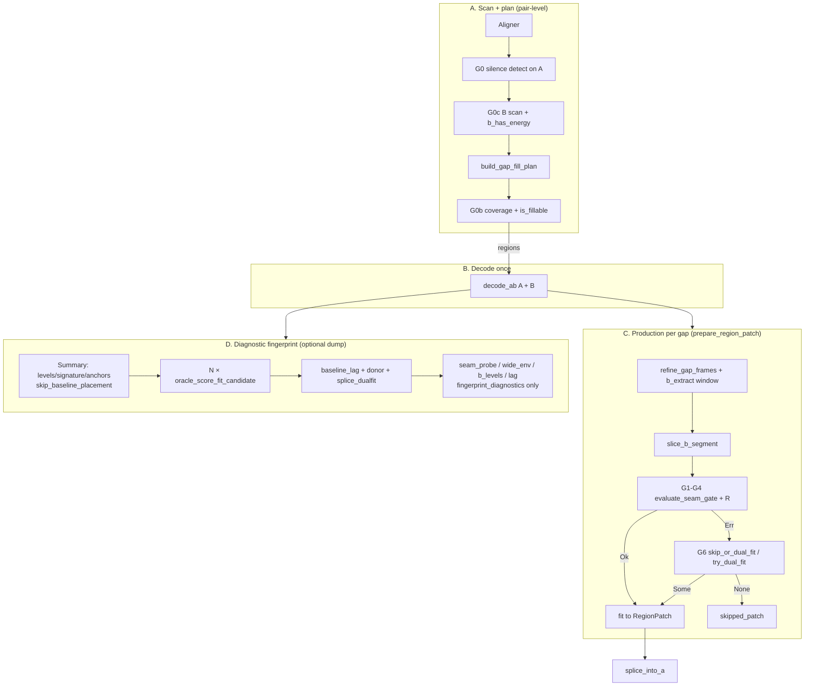

# Pipeline performance redesign — audit + plan

**Purpose.** The detect→gate→fingerprint pipeline grew organically to *explore* gap classification; it was
never reviewed for throughput. This doc (1) **audits** what the pipeline does today — every gate, its minimum
inputs, cost, and overlaps — then (2) proposes a **performant re-assembly** that returns exactly two things:
a **list of gaps to fix** and the **repair-params to fix them**, with everything else deferred.

**Relationship to other docs.** The [status ledger](TEMP-seam-repair-status-ledger.md) is the index (one row
per claim); this is the detail doc for the *perf/pipeline* workstream (D12). It **absorbs** the ledger's
scattered perf notes (D5 FFT, "Perf (before a long rescan)", the "Pipeline (detect → repair)" order) — those
now point here. The [ledger §4 wire spec](TEMP-seam-repair-status-ledger.md#4-dual-fit-repair--wire-spec-a3-shipped)
owns the dual-fit *algorithm*; this owns the pipeline *assembly*. Gap **classification** (cells, axes,
placement): [gap-vocabulary.md](gap-vocabulary.md). (A3 is **shipped** — see §2.4.)

**Hard wall.** §1 is **descriptive** ("what the pipeline does today") and stays factually true regardless of
plan revisions. §2–§4 are **prescriptive** ("what it should become"). Keep them separate so the audit can
graduate to a permanent `docs/pipeline-architecture.md` later if useful.

**Status:** §1 audit populated from code (2026-07-01, audit v1). **§2 updated to match code (2026-07-03).**
§4 harness **built** (golden + footguns); **§4.7 CI / live-path gaps audited (2026-07-03), Tier A (A1–A3)
landed same day.** A3 + G5 production landed. §3 migration status tracked in §2.4.

---

## §1 — Audit (what the pipeline does today)

### §1.0 There are two paths, and that's the core finding

- **Production repair (`PatchAudio`):** detect → gate (structure → waveform → residual) → fill. Relatively
  lean; computes only what the fill/skip decision needs.
- **Diagnostic fingerprint (`characterize_gaps_with_gate` / `dump_gap_fingerprints`):** runs the *same gate*
  **plus every measurement** (`baseline_lag`, `seam_probe`, `donor_interior`, `wide_envelope`,
  `splice_dualfit`, diagnostic `lag`, …) on **every matched gap**, for analysis.

The perf problem is that the **future dual-fit-capable production pipeline** needs *some* of the fingerprint
measurements (registration, step, donor, program-quiet) but **not** the diagnostic-only ones — yet today
they're computed together, unconditionally, per gap. The audit's job is to split the fingerprint set into
**decision / repair / diagnostic** so the production path carries only the first two.

### §1.1 Phase / gate inventory

Ordered as data flows. "Rejects" = what this gate filters out.

| # | Gate | Where | Decides | Minimum decision inputs | Cost class | Rejects |
|---|------|-------|---------|-------------------------|-----------|---------|
| G0 | **Silence-run detect** | `scan_gaps.rs` (`ScanGaps`) | Is there a gap? | A block-RMS vs `silence_peak_fraction`/`absolute_silence_rms`; `silence_hold_blocks`; `min_gap_secs` | `O(N)` decode + RMS | non-silent regions |
| G0b | **Fillable coverage** | `scan_gaps.rs` (`limit_fill_to_mapped_region`) | Is the gap inside mapped clip coverage? | gap time vs alignment coverage | scalar | out-of-coverage → **Tail** / unfillable (P6) |
| G0c | **B cross-check** (opt) | `scan_gaps.rs` (`scan_both`, `cross_check`) | Does B agree / have energy there? | B silence scan; `gap_offset_agreement`; `b_has_energy_in_range` | `O(N)` (B decode) | offset-disagreeing / B-empty; plan-time `!b_has_energy` → unfillable (**Program-quiet** at scan) |
| G1 | **Structure align** | `patch_region.rs` (`gate_structure_align`) | Is there *a* B placement? | A border templates + gap signature (energy/bool) + B haystack; unified search over `search_radius` | `O(N·radius)` **per bracket** | no placement → **No-placement** (`StructureAlignmentFailed`) |
| G2 | **Structure threshold** | `patch_region.rs` (`structure_passes_gate`) | Is the envelope match strong enough? | `structure_pre/post` ≥ `min_structure_match_score` (short-gap mean adj.) | scalar (from G1) | weak envelope → `StructureBelowThreshold` |
| G3 | **Waveform seam** | `patch_region.rs` (`classify_fill_waveform_confidence`) | Do the seams match at sample level? | pre/post Pearson @ placement vs `min_fill_correlation` / `fill_marginal_margin` / `fill_absolute_floor` | `O(seam)` | dead seam → `waveform_below_threshold` |
| G4 | **Residual** | `patch_region.rs` (`finalize_fit_outcome_residual`) | Same-source confirm for a *marginal* seam | least-squares cancellation @ throat vs floor | `O(seam)`, **at selection only** | veto marginal; rescue marginal |
| R | **Bracket ranking** | `patch_region.rs` (`fit_candidate_ranking_score`) | Which *passing* bracket wins | `min(pre,post)`, `boundary_move` | scalar | — (selection, not reject) |
| **G5** | **Program-quiet label** *(D11 — **analyzer / dual-fit only**, not production pre-gate)* | `domain/donor.rs` (`program_quiet_at_nominal`); fingerprint `donor_interior_nominal`; `try_dual_fit` decline | Is B nominal span mostly silent? | nominal-span B `silence_fraction` @ `b_mapped` | `O(N)` | → **Program-quiet** cell (Donor — nominal). Plan: `!b_has_energy` → unfillable. Patch: seam gate decides; dual-fit declines program-quiet donors |
| **G6** | **Dual-fit rescue** *(A3 — **shipped**, default **on**)* | `patch_audio.rs` (`skip_or_dual_fit` → `domain/dual_fit.rs::try_dual_fit`) | Rescue a bracket-exhausted skip? | **Production:** gate skip (not `StructureAlignmentFailed`) ∧ `dual_fit` (default true) → seam-local peaks + step-real + donor + ¬program-quiet + re-validate fill. **Analyzer scope** (`dualfit_target()`): additionally requires `bracket_exhausted` ∧ `splice_dualfit.gate_pass` (degenerate post-±600 — see ledger P2). **NOT** uniqueness/`peak_z`. | `seam_local_peak` ±600 ms + interior trim | declines → stay skipped; success → **Silence-splice** rescued (post-rescue patch tier, not a new cell — [gap-vocabulary.md](gap-vocabulary.md) W7) |

### §1.2 Measurement → gate map (decision / repair / diagnostic)

Every fingerprint field, what produces it, its cost, which gate consumes it, and its **label**. Label =
**D**ecision (a gate branches on it) · **R**epair (needed to build the fix, survivors only) · **X** = diagnostic
(no gate reads it — report/exploration only).

| Measurement | Produced by | Cost | Consumed by | Label |
|-------------|-------------|------|-------------|-------|
| A block-RMS / silence runs | `scan_gaps` | `O(N)` | G0 | **D** |
| alignment / `gap_offset` | aligner | (align) | G0b, geometry | **D** |
| border templates (`a_pre`/`a_post` + per-ch) | `border_templates_for_gap` | `O(border)` | G1, G3 **(+ lag, seam_probe, wide_env, dualfit)** | **D** (shared — see §1.4) |
| gap signature (energy/bool) | `build_gap_signature` | `O(context)` | G1 | **D** |
| unified placement (`structure_pre/post`, `start_frame`, `pre/post_correlation`) | `match_gap_fill_unified` | `O(N·radius)`/bracket | G1, G2, G3 | **D** |
| `levels` (A `LevelProfile`) | `build_gap_fingerprint` | `O(N)` | `gap_floor_db`/`noise_floor_db` → **G5**; `speech_peak`/`profile_db` → none | **D** (2 fields) / **X** (rest) |
| `silence` / `contour` / `anchors` | `build_gap_fingerprint` | `O(N)` | **gate recomputes its own** (`build_gap_signature`) — these fields feed no gate | **X** (records; but anchor *detection* is a shared computation — §1.4) |
| `brackets[]` (seam + `failure_stage`) | `oracle_score_fit_candidate` ×N_br | N_br × G1–G3 | G3, dual-fit `bracket_exhausted` | **D** |
| `baseline_lag` (lag sweep, **mono only** — `selected: None`) | `lag_at_placement` | **`O(n·L)`** (1 sweep) | G6, uniqueness (`peak_z`/`prom`), `splice` | **R** (+ X today) |
| `residual` | `oracle_measure_residual` | `O(seam)` | G4 | **D** |
| `seam_probe` (R2/R4/spectrum/env/recov) | `seam_probe_at_placement` | `O(seam)` + FFT | **none** | **X** |
| `donor_interior` (aligned span) | `donor_interior_at` | `O(N)` | G6 | **R** |
| `donor_interior_nominal` (nominal span) | `donor_interior_at` | `O(N)` | **G5** | **D** |
| `b_levels` (symmetric B profile) | `level_profile` (B) | `O(N)` | validation only | **X** |
| `splice` (step + peaks) | derived from `baseline_lag` | ~free | G6, repair | **R** |
| `wide_envelope` | `wide_envelope_at_placement` | `O(env sweep)` | **none** | **X** |
| `splice_dualfit` (+ validators) | `splice_dualfit_at` | `O(seam)` + small sweeps | **G6** | **R**/D |
| diagnostic `lag` (best-energy bracket) | `place_on_b` + `lag_at_placement` (**mono + selected**) | `O(N·radius)` + `O(n·L)`×2 | **none** | **X** |
| `outcome` (tier / skip_reason) | classification | scalar | (output) | **D** |

### §1.3 Cost hierarchy (what actually dominates)

1. **Structure search per bracket** — `N_brackets × O(N·radius)` unified fill search (G1). The single
   largest per-gap cost; the fingerprint re-runs the oracle for *every* bracket to get per-bracket
   `failure_stage`, even when production only needs the winner.
2. **Lag sweep** — `O(n·L)` mono, naive time-domain (`n≈48k`, `L≈57.6k`). One sweep for `baseline_lag`
   (feeds `peak_z`/`prom`/`splice`); the diagnostic `lag` adds **two more** (mono re-sweep + selected, both
   X). **FFT target** (§3, was D5) — ~50–150×; dropping diagnostic `lag` removes the two extra sweeps.
3. **Decode** — A and B (once); `dump_gap_fingerprints` re-decodes after repair.
4. Cheap (`O(N)` RMS or `O(seam)`): `levels`/`silence`/`contour`, `donor_*`, `b_levels`, `seam`,
   `residual`, `splice_dualfit` seams.

### §1.4 Overlaps & redundancy (share once / defer)

- **Border templates** are rebuilt in G1, `lag_at_placement`, `seam_probe`, `wide_envelope`, and
  `splice_dualfit`. → **Hoist one extract per gap** and pass down. (Perf note already flagged this.)
- **`place_on_b` runs ≥3×** — summary pre-gate, gate-throat overlay, diagnostic `lag`. → **Dedup to one**
  (the gate throat is authoritative; F1).
- **RMS binning happens ~7×** over decoded audio — A `levels`, `silence`, `contour`, A `gap_floor`,
  `donor_interior`, `donor_interior_nominal`, `b_levels`. → **One binned-RMS pass per side**, all consumers
  index in.
- **Lag sweep — `baseline_lag` is one mono sweep** (`selected: None`) feeding 4 consumers (`baseline_lag`,
  `peak_z`, `prominence`, `splice.step`). The **diagnostic `lag`** re-sweeps at a *different* placement and
  adds a **selected-channel** sweep → **2 extra `O(n·L)` sweeps, both X**. Dropping diagnostic `lag` from the
  production path removes them entirely. *(Confirmed 2026-07-01: audit open item (a).)*
- **Gate is independent of the fingerprint** — `patch_region.rs` never reads `GapFingerprint`; it recomputes
  `build_gap_signature` (structure) and its own anchor brackets. So the fingerprint's `levels`/`silence`/
  `contour`/`anchors` fields are **diagnostic records**, *not* gate inputs. But both sides compute
  overlapping things (RMS profile, anchors, signature) → a **shared-computation** opportunity if the
  production dual-fit path and the gate are unified. *(Confirmed 2026-07-01: audit open item (b).)*
- **Diagnostic-only, computed unconditionally per gap:** `seam_probe`, `wide_envelope`, diagnostic `lag`
  (incl. its 2 sweeps), `b_levels`, per-bracket structure. → **Defer behind a flag / compute lazily** (only
  near-threshold gaps).

### §1.5 The two outputs, mapped to the audit

- **Fix-list (detect):** gaps that should receive repair work — patched **Bracket patch** (G1–G4 pass)
  plus rescuable **Silence-splice** (`dualfit_target()` / G6). Produced by G0→G0b→G1→G2→G3→G4, plus G6
  for bracket-exhausted skips. Needs: silence runs, coverage, nominal-donor, structure placement, seam,
  residual. **Tail**, **No-placement**, and **Program-quiet** gaps never enter the fix-list.
- **Repair-params (fix, survivors only):** placement `start_frame` (from G1); for dual-fit — `baseline_lag`
  per-shoulder, `splice.step`, trim (`splice_dualfit.trim_frames`), donor span.
- **Everything labeled X** (`seam_probe`, `wide_envelope`, diagnostic `lag`, `b_levels`) is **not** on either
  output path — it exists to *explain* decisions, and belongs behind a diagnostics flag.

Cell definitions and corpus counts: [gap-vocabulary.md](gap-vocabulary.md).

> **Audit open items:**
> - **(a) RESOLVED (2026-07-01)** — selected-channel lag sweep is **diagnostic-only**. `baseline_lag`
>   (both sites) passes `selected: None` ⇒ mono sweep only; the selected sweep runs only in the diagnostic
>   `lag` (`gap_fingerprint.rs:2340`, `p.selected_channels.first()`). So the production/repair path has **one**
>   lag sweep; diagnostic `lag` adds two more (mono re-sweep at a different placement + selected).
> - **(b) RESOLVED (2026-07-01)** — the gate (`patch_region.rs`) **does not read `GapFingerprint`**; it
>   recomputes `build_gap_signature` and its own anchors. Fingerprint `levels`/`silence`/`contour`/`anchors`
>   are diagnostic records. Only `levels.gap_floor_db`/`noise_floor_db` are decision-relevant (→ G5). Anchor
>   detection is decision-relevant but done *inside* the gate — a shared-computation opportunity, not a
>   fingerprint dependency.
> - **(c) RESOLVED (2026-07-01)** — G0c cross-check is **on by default**: `scan_both: default_true()`
>   (`config.rs:420`).
> - **(d) PENDING** — measure per-gate reject rates on the corpus for the §2 ordering; report by
>   [gap-vocabulary.md](gap-vocabulary.md) **cell** where possible (e.g. bracket-exhausted skips split into
>   program-quiet vs donor-aligned decline vs silence-splice targets). Needs the fresh scan
>   (`donor_interior_nominal` for G5's rate); not code-confirmable.

---

## §2 — Target architecture (current code + remaining work)

**Updated 2026-07-03** from `scan_gaps.rs`, `gap_fill.rs`, `patch_audio.rs`, `patch_region.rs`,
`gap_fingerprint.rs`, and `composition.rs`. §2.1–§2.2 are **descriptive** (what runs today). §2.3 is the
data-flow DAG. §2.4 tracks §3 migration status.

### §2.1 Gate-order tables (current code)

There are **three pipeline stages** — scan (pair-level), fill-plan (report-level), and per-gap work
(repair or fingerprint). G0/G0b/G0c run at scan/plan time; G5–G6 run only after A/B decode and B-window
extract for a gap.

#### A. Scan + fill plan (`ScanGaps` → `build_gap_fill_plan`)

| Order | Gate | Where | What happens | Notes |
|-------|------|-------|--------------|-------|
| 1 | **G0** Silence-run detect | `scan_gaps.rs` | Block-RMS on A → gap list | `O(N)` decode + RMS |
| 2 | **G0c** B cross-check | `scan_gaps.rs` (`scan_both`, default **on**) | B silence map; `b_has_energy`; `gap_offset_agreement` | Metadata on each `Gap` |
| 3 | **G0b** Fillable coverage | `gap_fill.rs` (`build_gap_fill_plan`) | Skip gaps outside alignment coverage when `limit_fill_to_mapped_region` | Before decode; also `Gap::is_fillable()` (needs B mapping + `b_has_energy`) |

`PatchAudio::execute` decodes A+B **once** (`decode_ab`) only if the fill plan has regions.

#### B. Production repair — per gap (`prepare_region_patch`)

| Order | Step / gate | Where | What happens | Notes |
|-------|-------------|-------|--------------|-------|
| 1 | Geometry | `patch_audio.rs` | `refine_gap_frames` on A; compute `b_extract_*`; zero-length → skip | Not a reject gate |
| 2 | B extract | `patch_audio.rs` | `slice_b_segment` | `BExtractFailed` if window empty |
| 3 | **G1–G4 + R** Seam gate | `patch_region.rs` (`evaluate_seam_gate`) | Per-bracket structure search (G1/G2) → waveform (G3) → residual at selection (G4) → rank (R) | Dominant per-gap cost |
| 4a | Fill | `patch_audio.rs` | `fit_fill_to_gap_frames` / gate outcome → `RegionPatch` | On gate **Ok** |
| 4b | **G6** Dual-fit fallback | `skip_or_dual_fit` → `domain/dual_fit.rs` | On gate **Err** (except `StructureAlignmentFailed`) when `dual_fit` enabled (default **on**): `try_dual_fit` → re-validate fill with unchanged gate floors | `--no-dual-fit` to disable (D6 regression path); **G5** program-quiet check runs inside dual-fit decline only |
| 5 | Anchored retry (opt) | `patch_audio.rs` | Pass 2 re-runs failed gaps with anchor table | `FillOffsetMode::AnchoredRetry` only |

**G5 (D11):** `program_quiet_at_nominal` is an **analyzer / dual-fit label**, not a production pre-gate skip.
Plan-time `b_has_energy = false` covers shared pauses; fillable gaps always reach the seam gate.

**G6 production vs analyzer scope:** `skip_or_dual_fit` fires on any scored gate failure except
`StructureAlignmentFailed` (no bracket scored). The analyzer's `dualfit_target()` additionally requires
`bracket_exhausted` and records `splice_dualfit.gate_pass` (degenerate on the re-anchor corpus — ledger P2).
Production `try_dual_fit` re-checks seam floors, step-real, donor, and program-quiet directly.

#### C. Diagnostic fingerprint — per selected gap (`characterize_gaps_with_gate`)

| Order | Work | Where | Always / flag-gated | Label |
|-------|------|-------|---------------------|-------|
| 0 | Decode A+B | `decode_ab` (shared with repair) | Always | — |
| 1 | Summary pass | `characterize_gaps` → `build_gap_fingerprint(..., skip_baseline_placement: true)` | Always | `levels`/`silence`/`contour`/`signature`/`anchors` → mostly **X** (gate recomputes structure/anchors) |
| 2 | Gate overlay | `oracle_score_fit_candidate` × N brackets | Always | **D** — same oracle as production |
| 3 | Registration + donor | `baseline_lag`, `donor_interior`, `donor_interior_nominal`, `splice_dualfit` | Always | **D/R** |
| 4 | Diagnostic X-set | `seam_probe`, `wide_envelope`, `b_levels`, diagnostic `lag` (+ extra `place_on_b`) | `--fingerprint-diagnostics` only (`RepairConfig.fingerprint_diagnostics`, default **off**) | **X** |

Fingerprint dump (`composition.rs::dump_gap_fingerprints`) does **not** re-decode after repair — it
decodes once, characterizes, writes corpus. Repair decode reuse is already shared; post-repair re-decode
(§1.4) is **not** current behavior.

### §2.2 Design principles — landed vs still open

| Principle | Target | Current (2026-07-03) |
|-----------|--------|----------------------|
| **Cheap-first** | G0 → G0b → G1–G4 | **Production:** G0/G0b at scan/plan; fillable gaps reach seam gate. **G5 (D11)** analyzer label + dual-fit decline only. |
| **Two outputs** | Fix-list + repair-params | Production emits patch/skip per gap; fingerprint JSON for calibration. |
| **Lazy diagnostics** | X-set behind flag | **Partial** — X fields gated; per-bracket oracle + lag + `splice_dualfit` still always on in scan. |
| **Compute-once-share** | One decode · binned-RMS · border extract · lag curve | Decode shared ✓; `skip_baseline_placement` dedup ✓; binned-RMS hoist · border hoisting · FFT lag **open**. |
| **Shared primitives** | No scan/prod drift | `domain/seam_local.rs`, `domain/donor.rs`, `domain/dual_fit.rs` ✓ |
| **FFT lag sweep** | §3 step 4 | Still naive `lag_correlation_curve` in `seam_local.rs` |

**Remaining perf targets** (in priority order after A3/G5): hoist binned-RMS + border extract (§3.1) → FFT lag
with `fft ≈ naive` test (§3.4) → gate per-bracket oracle behind diagnostics or shared gate cache → optional
scan-time G5 (would need nominal B occupancy without full patch window).

### §2.3 Data-flow DAG



Solid arrows = always on the path. `G6` is default **on** (`--no-dual-fit` to disable). `fingerprint_diagnostics`
is default **off** (`--fingerprint-diagnostics` to enable Tier-3 X-set).

### §2.4 Migration status (§3 steps)

| Step | Work | Status | Evidence / notes |
|------|------|--------|------------------|
| **1** | Hoist shared subexpressions (border extract, binned-RMS, dedup `place_on_b`) | **Partial** | `skip_baseline_placement` in `build_gap_fingerprint` / `characterize_gaps` ✓. Border extract + binned-RMS still rebuilt per consumer (§1.4). |
| **2** | Gate diagnostics (X-set) behind a flag | **Done** | `RepairConfig.fingerprint_diagnostics` + `--fingerprint-diagnostics`; gates `seam_probe`, `wide_envelope`, `b_levels`, diagnostic `lag`. Per-bracket oracle **not** gated. |
| **3** | Cheap early-reject (G0b at plan) | **Partial** | G0b at fill-plan ✓. G5 (D11) analyzer + dual-fit only — not production pre-gate (2026-07-03). |
| **4** | FFT lag sweep + `fft ≈ naive` equivalence test | **Done (2026-07-04)** | `lag_correlation_curve_fft` (B1) wired behind cost-crossover `lag_correlation_curve_auto` in `domain/seam_local.rs`; `seam_local_peak` and `gap_fingerprint.rs::lag_side_sweep` (the `baseline_lag` ±600 ms / ~1 s-window sweep, the dominant diagnostic-scan cost per §1.3) both switched from naive to auto. |
| **5** | A3 production dual-fit + split from diagnostic dump | **Done** | `--dual-fit` → `skip_or_dual_fit` / `try_dual_fit`; shared `domain/` primitives. §5 build plan superseded by code. |
| **§4** | Decision-invariance harness | **Partial** | Golden schema + diff landed (`golden_baseline.rs`, `golden_baseline_invariance.rs`/`golden_baseline_smoke.rs`, frozen `golden/re-anchor-dual-fit-on-nominal.golden.json`). **§4.7 Tier A (A1–A3) landed 2026-07-03 — footguns + harness `--lib` now run in default CI.** **B2 landed** (`validate_dual_fit_oracle.rs`, validation tier). C1, C2 still open — see §4.7. |

> **Sequencing (updated 2026-07-04):** A3 (step 5), G5 production, §4.7 **Tier A (A1–A3)**, **B1**, **B2**, and
> **step 4 FFT wiring** are landed. **Next:** step 1 hoists (behind the now-CI-pinned harness) → optimize
> diagnostic scan last (~1.7 h/pair calibration cost, not product cost). Do not reorder gates or drop D/R
> measurements until the §4 harness passes (full workflow: §4.7 C1).

---

## §3 — Migration steps

Each step behavior-preserving; land behind the §4 regression harness. **Status column → §2.4.**

| # | Step | Status |
|---|------|--------|
| 1 | Hoist shared subexpressions (border extract, binned-RMS, dedup `place_on_b`) | **Partial** — throat-placement dedup landed (2026-07-04): `oracle_score_fit_candidate` now also returns `structure_start_frame` (already computed inside the gate, previously discarded); `characterize_gaps_with_gate`'s throat-placement read reuses it instead of a second `gate_structure_align` call via `oracle_throat_structure_frame` when the zero-move bracket scored `Ok` (falls back to the original call otherwise, so no behavior change — pinned by `golden_baseline_footguns`). Border-extract/binned-RMS hoists across `gap_fingerprint.rs`/`patch_audio.rs`/`patch_region.rs` remain open — most other call sites use genuinely different search radii (`gap_border_frame_range`'s silence-skip walk is bounded by `border_frames`, so results at different radii aren't interchangeable; can't cache-and-slice from one shared max-radius computation). |
| 2 | Gate diagnostics (X-set) behind `--fingerprint-diagnostics` | **Done** |
| 3 | Cheap early-reject gates (G0b at plan; G5 in production before seam gate) | **Partial** |
| 4 | **FFT lag sweep** — numerator via FFT, denominator via prefix sums; naive fallback for small `L`; gate on `fft_curve ≈ naive_curve` test (§4.7 **B1**). *(Full spec: ledger "FFT lag sweep" block.)* | **Done (2026-07-04)** — `lag_correlation_curve_auto` (cost-crossover) wired into `seam_local_peak` and `lag_side_sweep` |
| 5 | A3 production dual-fit (`--dual-fit`) + shared `domain/` primitives | **Done** |

Step 1 is the remaining perf work on a stable baseline. Step 5 historical note: built **before**
scan optimization (2026-07-01 sequencing decision) — complete.

---

## §4 — Validation: the decision-invariance harness

Every perf step is behavior-preserving, so the harness's job is narrow and strong: **prove a refactor did
not change any repair decision or repair parameter** on the corpus (dirs 1–7), while *allowing* the drift
perf actually needs (FFT ≈ naive at ~1e-10; diagnostics recomputed differently or skipped). The harness
snapshots the **axis coordinates** from [gap-vocabulary.md](gap-vocabulary.md) (D/R fields tagged with
**placement**), not whole fingerprint blobs and not W-tier readouts — so a failure is meaningful
("`donor-nominal` silence changed on 2·g7") rather than "some JSON field differs." **Cells** (Bracket patch,
Silence-splice, Program-quiet, …) are *derived* from those coordinates; the golden JSON stores the axes,
not a single cell enum. Axis derivation background: [archive/TEMP-gap-vocabulary-redesign-plan.md](archive/TEMP-gap-vocabulary-redesign-plan.md) §2;
D/R/X label map: [status ledger](TEMP-seam-repair-status-ledger.md).

### §4.0 Prerequisites

The harness is a **characterization** harness — it pins whatever the pipeline currently emits.

1. **Golden baseline — FROZEN (2026-07-02).** `golden/re-anchor-dual-fit-on-nominal.golden.json`; P2 and
   `b_levels` cross-checks passed. §4.1–§4.7 define the schema, assertion tiers, and test backlog.
2. **P2 orthogonality gate — done.** Axes validated on the re-anchor rescan; `gate_pass` degeneracy documented
   in ledger P2 (discrimination = step-real ∧ donor-occupancy on this corpus).
3. **Test coverage audit — done (2026-07-03).** §4.7 records what the harness catches today, what it does
   not, and the backlog to land before hoists / FFT. The harness **design** is sound; **execution** is partial
   (validation tier + manual corpus; not default CI).

### §4.1 Golden record — capture the D/R axes, each tagged with its placement

Per gap, snapshot **only** the decision/repair-bearing coordinates, each stamped with the **placement** it is
measured at (placement is part of the key — the two bugs we hit were placement conflations, so a refactor
must not silently move a measurement across placements):

| Field(s) | Placement | Tier (see §4.2) |
|----------|-----------|-----------------|
| `outcome.tier`, `dualfit_target()`, `program_quiet_skip()`, `bracket_exhausted()` | derived | **1 — exact** |
| `splice_dualfit.gate_pass`; `donor_interior.continuous`; `donor_interior_nominal.continuous`; `edge_pinned` | seam-local / aligned / nominal | **1 — exact** |
| `brackets_total`, `brackets_passing` | gate throat | **1 — exact (ints)** |
| `baseline_lag` pre/post `peak_r`, `frac_lag_ms`; `splice.step_ms` | **gross** `b_mapped` (1 s) | **2 — ε** |
| `splice_dualfit` `pre/post_seam_r`, `post_seam_global_r`, `trim_frames` | **seam-local** (250 ms ±`SEAM_LOCAL_REFINE_MS`) | **2 — ε** |
| `donor_interior_nominal.silence_fraction` | **nominal** `b_mapped` span | **2 — ε** |
| `donor_interior.silence_fraction`, `rms_db` | **aligned** bridge span | **2 — ε** |
| `residual` chosen/floor dB | gate throat | **2 — ε** |
| `levels.gap_floor_db`, `noise_floor_db`; `structure_min` | gate throat / A | **2 — ε** |
| `peak_z`, `prominence` | gross `b_mapped` (1 s) | **2 — ε** — [derived readouts](gap-vocabulary.md) (diagnostic projections, not decision primitives; FFT step pins these for regression) |
| `seam_probe`, `wide_envelope`, `b_levels`, diagnostic `fp.lag` | (various) | **3 — ignore / presence-only** (X — not on the fix-list or repair-params) |

**Fix-list** = gaps where `dualfit_target()` ∨ patched (= **Silence-splice** targets ∪ patched **Bracket
patch**). **Repair-params** = per-shoulder seam-local lags → `b_pre`/`b_post`, `trim_frames`, donor span.
Both are functions of Tier-1/2 fields only.

### §4.1a Gap-class categorization (from the golden corpus, 2026-07-03)

Grouping all 62 golden gaps (`golden/re-anchor-dual-fit-on-nominal.golden.json`) by the §4.1 D/R axes gives
six harness **causal classes** — mapped to [gap-vocabulary.md](gap-vocabulary.md) **cells** below. This is
the licensing-safe substitute for the real media (the corpus JSON is derived numeric/boolean measurements
only, no audio) and is what the synthetic fixtures replicate:

| Class | [Vocab cell](gap-vocabulary.md) | Axes | Real examples | Synthetic coverage |
|-------|----------------------------------|------|---------------|---------------------|
| 1 | **No-placement** | `brackets_total=0`, `bracket_exhausted=False`, `gate_pass=null` | 1·g0, 3·g0, 4·g0, 6·g0, 7·g0 | **Precondition only** — `skip_or_dual_fit` excludes `StructureAlignmentFailed` (bug #2 fix, 2026-07-03); **no unit test yet** (§4.7 A2) |
| 2 | **Program-quiet** (early / no bracket scored) | `brackets_total=0`, `program_quiet_skip=True`, `nominal_donor_silence` 0.5–1.0 | 2·g0, 6·g2 | Same precondition as class 1; **no unit test yet** (§4.7 A2) |
| 3 | **Silence-splice** (dual-fit addressable) | `bracket_exhausted=True`, seams 0.9–1.0 at own lag, `post_global` low (real step), `aligned_donor_continuous=True`, `dualfit_target=True` | the golden 9: 1·g3/g5/g22, 2·g1/g2, 5·g6, 7·g2/g3/g4 | `dual_fit.rs::recovers_a_stepped_silence_splice` |
| 4 | *(not a cell — silence-splice **candidate** declined on **Donor — aligned**)* | `bracket_exhausted=True`, seams score as well as class 3, real step, but `aligned_donor_continuous=False` (internal silent run ≥150 ms) | 14/62 gaps: 1·g4/g7/g9-19/g21, 6·g1/g3/g6-g11 (matches §4.4's `1·g19` footgun) | `dual_fit.rs::declines_donor_broken_bridge` (added 2026-07-03) |
| 5 | **Program-quiet** (extreme — fully dead nominal donor) | seams score 0.97–0.99 but `nominal_donor_silence=1.0` (bridge 100% dead) | 6·g2 | `dual_fit.rs::declines_program_quiet_donor` (fully-silent variant; less extreme than class 4) |
| 6 | **Bracket patch** (negative control) | `tier=patch`, `brackets_passing>0` | e.g. 1·g1/g2/g6/g8/g20/g23 | Existing `energy_signature_fixtures.rs` F1–F4 / patch-path tests; dual-fit code path never engages |

**Vocab edge case not in this table:** **Bracket-exhausted, gate unmeasured** (`5·g0` — donor continuous but
`splice_dualfit` absent; not in the nine silence-splice targets). **Tail** gaps (n=7) are filtered at G0b
before the matched denominator — see [gap-vocabulary.md](gap-vocabulary.md).

Classes 1–2 are collapsed by the same precondition (`bracket_exhausted`) in code, but are kept distinct here
because they arrive at that precondition via different upstream reasons (no structure placement at all vs. an
early program-quiet read) — useful if the precondition is ever split. Class 4 is the largest bucket with
**zero** test coverage before 2026-07-03 despite being explicitly anticipated in §4.4's "Donor gate necessity"
footgun — vocab's key lesson: **`1·g19` looks like silence-splice at the seams** (0.998) but is
**Program-quiet / donor-dead** on Donor — aligned, not a separate cell.

### §4.2 Two-tier assertion (the FFT is what forces this)

- **Tier 1 — derived verdicts + booleans + integer counts: bit-exact.** A perf refactor must **never flip a
  decision.** `tier`, `gate_pass`, `dualfit_target`, `program_quiet`, `bracket_exhausted`, `continuous`,
  `edge_pinned`, bracket counts — identical, no tolerance.
- **Tier 2 — continuous D/R inputs: within ε.** Pick ε so a real regression trips but f64-FFT / reassociation
  noise (~1e-10 relative) does not. This tolerance is *exactly what lets the FFT lag sweep (step 4) land* —
  it moves `baseline_lag`/`peak_z` at 1e-10 but must not move a Tier-1 verdict. (Layered guarantee:
  continuous inputs may drift within ε; the booleans they derive must not flip. If an ε drift *does* flip a
  verdict, the gap sits on a threshold — flag it, don't widen ε.)
- **Tier 3 — diagnostics (X): not asserted** (or presence-only). They may be recomputed differently, skipped
  behind the lazy-diagnostics flag (step 2), or dropped entirely without failing the harness.

### §4.3 Placement-provenance guard

Because the golden record keys on `(field, placement, value)`, the harness fails if a refactor changes the
**placement** a field is measured at — even if the value looks plausible. This directly guards the planned
"share one border extract at the throat" hoist (step 1) from dragging a **seam-local** score onto the
**gross/throat** placement (the exact class of bug behind `2·g1`).

### §4.4 Footgun characterization tests (pin the post-fix behavior — values TBD post-scan)

Lock in the two fixes so no refactor silently reverts them. Concrete expected values get pinned once the scan
confirms them (§4.0); the *assertions* are defined now:

- **Seam-local placement** — a **Silence-splice** gap whose gross and seam-local lags diverge (`2·g1`) keeps
  `pre_seam_r` at its seam-local peak (~0.98), **not** the gross-placed dead value (−0.008); `gate_pass` = true.
- **Donor placement split** — a large-step gap that is silent at the **nominal** span but occupied at the
  **aligned** span classifies **Program-quiet** (nominal wins) — guards D11's registration-independence and
  the W5 vs silence-splice distinction ([gap-vocabulary.md](gap-vocabulary.md)).
  **Partial:** harness JSON test `program_quiet_skip_leaves_addressable_denominator` (analyzer predicates on
  synthetic `corpus.json`); **not** a live `characterize_gaps_with_gate` path (§4.7 B2).
- **Donor gate necessity** — a gap with `gate_pass` = true but Donor — aligned BROKEN (`1·g19`: seams 0.998,
  interior silent) yields `dualfit_target()` = false — looks like **Silence-splice** at seams, stays skipped as
  **Program-quiet**/donor-dead, not a vocab cell of its own. **LANDED (2026-07-03)** — synthetic regression test
  `dual_fit.rs::declines_donor_broken_bridge`: both seams re-fit at ~0.9–1.0 with a genuine 500 ms step (rules
  out step-not-real as the decline reason), but a 200 ms silent hole punched into the middle of the aligned
  bridge (clear of both seam windows) makes `donor_interior_at` read `continuous=false`, and `try_dual_fit`
  declines. This is class 4 in §4.1a — the largest real-corpus decline bucket (14/62 gaps) and previously
  the only one of the four §4.4 footguns with zero test coverage anywhere in the codebase.
- **Edge-pin validity** — an edge-pinned shoulder flags its step GIGO and is excluded (0/55 today, so this is
  a guard against a future regression, not a live case). **No test** (§4.7 Tier D).

### §4.5 Per-axis localization + wall-clock

- Diff **per axis**, not per gap-blob: the orthogonal axes let a failure name the responsible axis + placement.
- Track **wall-clock per phase** to confirm wins land where the cost model predicts (§1.3) — a step that
  passes the invariance harness but doesn't move the predicted phase cost is suspect. **Not automated**
  (§4.7 Tier D); manual benchmark when validating a perf PR.

### §4.6 What the harness deliberately does NOT cover

- **Decoy / wrong-placement safety (D8)** — the corpus has no genuine negatives; the harness proves
  *invariance*, not *correctness of the fill*. D8 (audible/decoy validation) is separate, post-A3.
- **The `different`/`ambiguous` shared-source regime** — untested; not a live axis (shared-source collapsed
  to a constant on this corpus, B2/C1).
- **Production `PatchAudio` outcomes** — the golden harness is analyzer-scoped (`analyze_dirs` on
  `corpus.json` → D/R predicates). It does not run `prepare_region_patch` / `skip_or_dual_fit` on media.
  D6 byte-identical `--no-dual-fit` and dual-fit rescue on the 9 targets are **not** golden-locked in CI
  (§4.7 C2). Live-media production wiring itself is now covered (§4.7 B2, `validate_dual_fit_oracle.rs`).
- **Live fingerprint recompute** — `golden_baseline_corpus_invariance` reads committed `corpus.json`; it
  does not call `characterize_gaps_with_gate`. Computation drift is caught only after a **rescan** + diff
  (§4.7 C1). `gap-files/re-anchor-dual-fit-on-nominal` is not in the repo.

### §4.7 Test coverage — landed, gaps, and backlog (2026-07-03)

Audit of whether F5/D12 refactors (hoists, FFT lag, shared subexpressions) would trip tests if they changed
decisions or repair params. **Track all open items here** — do not spin a separate TEMP doc; the ledger D12
row points to this section.

#### What exists today

| Layer | Test / artifact | Tier | Runs in CI (`pr-repair`)? | What it catches |
|-------|-----------------|------|---------------------------|-----------------|
| Golden footguns | `golden_baseline_footguns` (`tests/golden_baseline_smoke.rs`) | pr-repair | **Yes** (2026-07-03 — A1) | Frozen JSON satisfies §4.4 pins: `2·g1`, `1·g19`, 9 targets |
| Full invariance | `golden_baseline_corpus_invariance` (same; `#[ignore]`) | validation | **No** (needs local `gap-files`) | Tier-1 exact + Tier-2 ε diff vs golden after rescan |
| Diff machinery | `golden_baseline::diff_catches_tier1_flip` | unit (harness lib) | **No** | Diff helper works |
| Dual-fit synthetic | `dual_fit.rs::{recovers_a_stepped_silence_splice, declines_donor_broken_bridge, declines_program_quiet_donor}` | unit | **Yes** (`--lib`) | Classes 3–5 on production `try_dual_fit` |
| Bracket path | `energy_signature_fixtures` F1–F4, `integration_energy_patch`, etc. | integration | **Yes** (subset on PR) | Class 6 — dual-fit never engages |
| Lag primitives | `gap_fingerprint.rs` `lag_curve_*`, `lag_pair_sequential_decouples_*`; `seam_local.rs` `seam_local_peak_recovers_offset_seam` | unit | **Yes** (`--lib`) | Lag math, seam-local search, A2 sequential post — not end-to-end D/R |
| Analyzer predicates | `gap_fingerprint_corpus.rs` tests (`program_quiet_skip_*`, `splice_diag_*`, …) | unit (harness lib) | **No** | Predicate logic the golden diff depends on |
| FFT equivalence | `seam_local.rs` `fft_curve_matches_naive_*`, `auto_picks_naive_for_small_probe_and_fft_for_full_sweep` | unit | **Yes** (`--lib`) | B1 gate + auto-crossover wiring into `seam_local_peak`/`lag_side_sweep` (step 4) |

**CI default (updated 2026-07-03 — A1/A3):** `.github/workflows/ci.yml` runs `test-tier.ps1 -Tier pr`, which
now includes `golden_baseline_footguns` (via `golden_baseline_smoke`) and `clip-sync-repair-harness --lib`.
This pins Tier-1 footguns on the frozen JSON and the analyzer-predicate/diff-machinery unit tests on every PR.
Still **not** covered by default CI: `golden_baseline_corpus_invariance` (the live rescan-vs-golden diff — needs
local `gap-files`, §4.7 C1) and the live production `PatchAudio` path (§4.7 B2, C2) — B2 is now covered by
`validate_dual_fit_oracle.rs`, but only under `-Tier validation` (needs `ffmpeg` + fetched corpus), not `pr-repair`.
A hoist or FFT change can still land with green CI and regress *computation* (not the frozen decision
surface) unless someone runs `-Tier validation` locally with the corpus.

**Invariance test semantics:** `analyze_dirs` parses **static** `corpus.json` and applies `gap_row` /
`dualfit_target()` etc. It does **not** re-decode media or call `characterize_gaps_with_gate`. To catch
**computation** changes: re-run `--gap-fingerprints` on dirs 1–7, then run invariance against the frozen
golden.

#### Backlog — ranked by risk ÷ effort

Land **Tier A before step 1 hoists**; **B1 before step 4 FFT**; Tier C before calling F5 done.

| ID | Item | Blocks | Status | Where / how |
|----|------|--------|--------|-------------|
| **A1** | Promote `golden_baseline_footguns` to `pr-repair` | hoists | **DONE (2026-07-03)** | Split into `tests/golden_baseline_smoke.rs` (no `validation-tests` gate); wired into `Invoke-RepairPrRepair` in `test-tier.ps1` |
| **A2** | Unit test: `skip_or_dual_fit` excludes `StructureAlignmentFailed` | hoists, classes 1–2 | **DONE (2026-07-03)** | Extracted pure predicate `dual_fit_eligible` in `patch_audio.rs`; unit test `dual_fit_eligible_excludes_structure_alignment_failed` pins `StructureAlignmentFailed` never qualifies, regardless of `--dual-fit` |
| **A3** | Run `clip-sync-repair-harness --lib` in `pr-repair` | hoists | **DONE (2026-07-03)** | `Invoke-RepairPrRepair` now runs `cargo test -p clip-sync-repair-harness --lib` |
| **B1** | `fft_curve ≈ naive_curve` equivalence | FFT step 4 | **DONE (2026-07-04)** | `lag_correlation_curve_fft` added in `domain/seam_local.rs` (FFT numerator via `rustfft` conjugate-multiply + prefix-sum Pearson denominator — not a full FFT-Pearson primitive that existed before). 4 tests: scaled-down full-sweep, small-probe, ragged-edge-mask, and derived-readout (`peak_z`/`prominence`/`frac_lag_ms` via `summarize_lag_curve`) equivalence, ε=1e-8. **Wired (2026-07-04)** — `lag_correlation_curve_auto` cost-crossover swap into `seam_local_peak` and `gap_fingerprint.rs::lag_side_sweep`, step 4. |
| **B2** | Live re-characterization smoke (≥1 gap) | hoists | **DONE** | `tests/validate_dual_fit_oracle.rs` — real jump-cut media through the actual production entry point (`residual_gate::run_built_floor_oracle_cfg` → `PatchAudio::execute`), asserting `dual_fit_used`; validation tier (needs `ffmpeg` + fetched corpus), not `pr-repair` |
| **C1** | Document + script pre-release invariance workflow | release sign-off | **OPEN** | Rescan dirs 1–7 → `test-tier.ps1 -Tier validation`; optional `scripts/perf-invariance.ps1` checking `gap-files/re-anchor-dual-fit-on-nominal` |
| **C2** | `--no-dual-fit` D6 smoke on committed gap corpus | production wiring | **OPEN** | `PatchAudio` with `dual_fit: true` vs `false` on bracket-patch gaps ⇒ byte-identical PCM when dual-fit not needed |
| **C3** | `fingerprint_diagnostics` flag smoke | step 2 regression | **OPEN** | Flag off ⇒ X fields absent; flag on ⇒ `seam_probe`, `wide_envelope`, diagnostic `lag`, `b_levels` present |
| **D1** | Edge-pin footgun synthetic | low | **OPEN** | 0/55 on corpus; defer |
| **D2** | Wall-clock per phase (§4.5) | perf validation | **OPEN** | Manual benchmark script, not unit test |
| **D3** | Production golden for all 9 dual-fit targets | high value, high cost | **OPEN** | Needs real media or large fixtures; defer until B2 proves pattern |
| **D4** | Nightly CI with corpus fetch | infra | **OPEN** | Defer; C1 script sufficient for now |

**Minimum viable package** (if scope is tight): **A1 + A2 + B1** — CI pins frozen decision surface, production
wiring guard for the 2026-07-03 bug fix, numerical gate for the dominant cost win. **All three landed
(A1/A2 2026-07-03, B1 2026-07-04).** Step 4 is now also landed (`lag_correlation_curve_auto` wired into
`seam_local_peak` and `lag_side_sweep`, 2026-07-04), as is B2 (`validate_dual_fit_oracle.rs`). Step 1 hoists
remain the largest open item.

#### Sequencing vs migration steps

```text
Before hoists (step 1):  A1 → A3 → A2   [DONE 2026-07-03]
Before FFT (step 4):     B1  (+ existing Tier-2 ε in golden diff)   [DONE 2026-07-04]
                         B2 (`validate_dual_fit_oracle.rs`)         [DONE]
Before calling F5 done:  C1 (+ run validation tier locally)
Optional polish:         C2, C3
```

---

## §5 — A3 production build plan (= §3 step 5, built FIRST)

Wire the dual-fit repair into **production `PatchAudio`**, flag-gated, as a fallback for gaps the existing
gate skips. Viability is proven (9 targets, golden baseline frozen); this section is the **production wiring**.
Algorithm = ledger **§4 wire-spec**; scope predicate = `dualfit_target()` (= `G6`). Build lean per §1.5/§2:
the production path carries only the **D/R** set for the survivors, never the diagnostic **X-set**.

### §5.1 Where it plugs in
- **Entry:** `application/patch_audio.rs::prepare_region_patch`. Today: build gate params → `evaluate_seam_gate`
  → on success build `RegionPatch` (fill), on `SeamGateFailure` → `skipped_patch(reason)` → `splice_into_a`
  writes nothing. **Change:** when the gate skips **and** the gap is bracket-exhausted **and** the dual-fit
  flag is on, fall through to a **dual-fit branch** instead of returning the skip. Everything else unchanged
  (D6: flag off ⇒ byte-identical — **not yet automated**; §4.7 C2).
- **Shared primitive:** extract `seam_local_peak` (nominal-anchored ±600 ms seam search) from
  `application/gap_fingerprint.rs` to a shared home (e.g. `domain/`) so production and the diagnostic scan
  call the **same** function (no second implementation to drift — the bug class we just fixed twice).

### §5.2 The dual-fit branch (per gap, only reached on a bracket-exhausted skip)
1. **Detect (`G6` = `dualfit_target`)** — on the already-decoded A/B window:
   - per-shoulder seam-local lag via `seam_local_peak` at nominal `b_mapped` → `pre_lag`/`post_lag`;
   - score the two 250 ms seams (reuse `policies::fill_splice_seam_correlations_interleaved`) → `gate_pass`
     (`min ≥ min_fill_correlation ∧ ≥ fill_absolute_floor`);
   - `post@pre` (post seam at the pre lag) → **step-real** (`post_own − post@pre ≥ 0.15`);
   - `donor_interior` (aligned) `.continuous` **and** `donor_interior_nominal` `.silence_fraction < 0.5`.
   - All hold ⇒ dual-fit target; else return the skip as today. *(D/R measurements only — no `seam_probe`,
     `wide_envelope`, `b_levels`; those stay in the scan.)*
2. **Fit + reconcile (§4 steps 2–3)** — `b_pre = b_mapped_start + pre_lag`, `b_post = b_mapped_start +
   gap_frames + post_lag`; bridge `= B[b_pre..b_post]`; `trim = bridge − gap`. **New primitive
   `trim_at_lowest_energy_interior`**: find the min-RMS interior frame of the bridge and trim/pad `|trim|`
   there with a short crossfade — the smallest audible splice. *(Existing `fit_fill_to_gap_frames` /
   `pick_fill_length_anchor` trim only at head/tail; this is the one genuinely new audio op.)*
3. **Validate with the UNCHANGED gate (§4 step 4)** — score the assembled fill's pre/post seams with
   `fill_splice_seam_correlations_interleaved` + `classify_fill_waveform_confidence` at the existing floors.
   Accept iff `min(pre,post) ≥ floors`; else skip. **No loosening** — the fix earns the current validator.
4. **Splice** — wrap into `RegionPatch { b_samples, gain, a_start_frame, a_end_frame, crossfade }`; existing
   `splice_into_a` crossfades it into A. Unchanged.

### §5.3 Reuse vs. new
- **Reuse (production, unchanged):** `fill_splice_seam_correlations_interleaved`, `classify_fill_waveform_
  confidence` + floors, border templates, the decode window from `prepare_region_patch`, `splice_into_a`.
- **New:** the dual-fit branch in `prepare_region_patch`; `trim_at_lowest_energy_interior`; the `G6`/
  `dualfit_target` detect logic in production (port the predicate; do **not** re-derive uniqueness).
- **Move (share):** `seam_local_peak` → shared module.

### §5.4 Validation (before this ships)
- **§4 golden-baseline harness (regression guard):** analyzer-scoped — frozen **9** dual-fit targets and
  Tier-1/2 D/R axes on the re-anchor corpus (`golden/re-anchor-dual-fit-on-nominal.golden.json`). With dual-fit
  **on**, production target set must match the golden (validated in-scan + media D7). With it **off**, the 23
  existing patches should be byte-identical (D6) — **manual / not yet in CI** (§4.7 C2).
- **D7 (the real test):** run on the media, **listen** to the 9 fills — gate-pass is necessary, not
  sufficient; the interior trim point must sound clean. First bad fill = the first labeled negative (→ D8).

### §5.5 Open decisions
- **Detect wiring:** (a) self-contained — production recomputes detection on-demand *(recommended)*; vs
  (b) scan-fed — read targets from a prior fingerprint. The *repair* is production either way.
- **Interior trim crossfade length** — audibility knob (D7); start with the existing `crossfade_secs`.
- **Flag surface** — `RepairConfig.dual_fit` / `--no-dual-fit` on the request (default **on**, F1).
