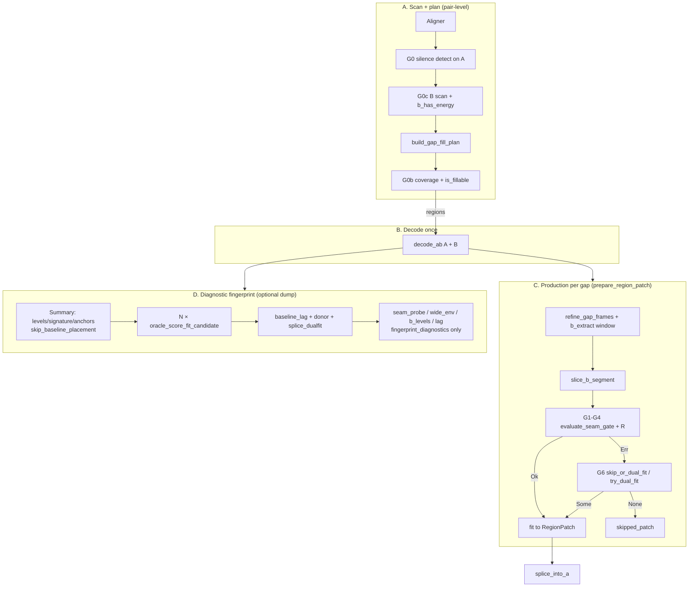
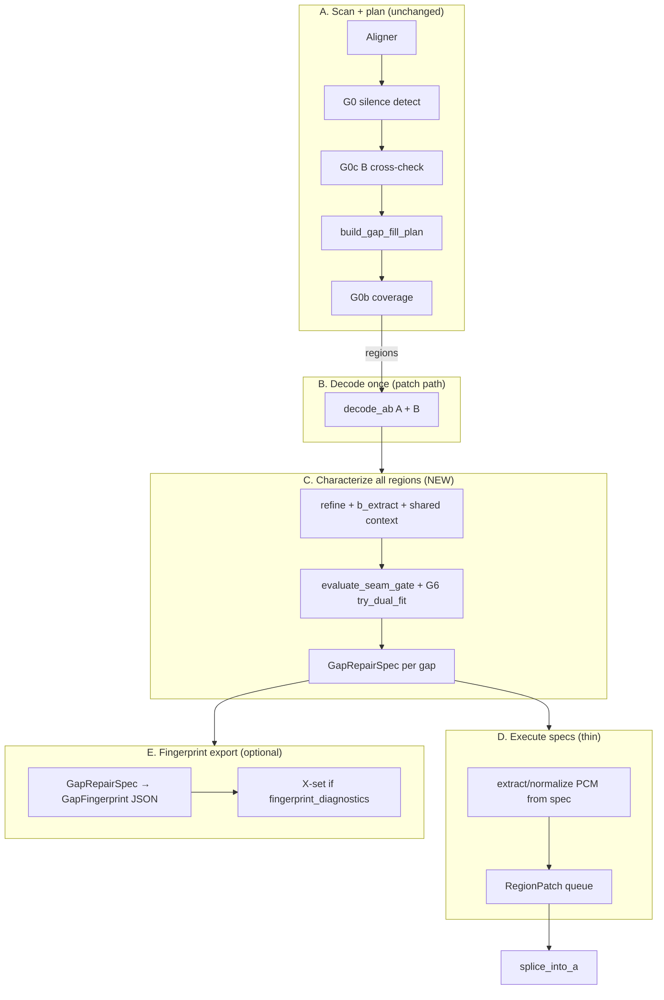

# Pipeline performance & assembly redesign — audit + plan

**Purpose.** The detect→gate→fingerprint pipeline grew organically to *explore* gap classification; it was
never reviewed for throughput or assembly. This doc (1) **audits** what the pipeline does today — every gate,
its minimum inputs, cost, and overlaps — then (2) proposes a **performant re-assembly** with an explicit
**characterize → execute** boundary: a typed **fix-list** (`GapRepairPlan`) and per-gap **repair-params**
(`GapRepairSpec`), with diagnostic **X-set** deferred behind a flag.

**Relationship to other docs.** The [status ledger](TEMP-seam-repair-status-ledger.md) is the index (one row
per claim); this is the detail doc for the *perf/pipeline* workstream (D12). It **absorbs** the ledger's
scattered perf notes (D5 FFT, "Perf (before a long rescan)", the "Pipeline (detect → repair)" order) — those
now point here. The [ledger §4 wire spec](TEMP-seam-repair-status-ledger.md#4-dual-fit-repair--wire-spec-a3-shipped)
owns the dual-fit *algorithm*; this owns the pipeline *assembly*. Gap **classification** (cells, axes,
placement): [gap-vocabulary.md](gap-vocabulary.md). (A3 is **shipped** — see §2.4.)

**Hard wall.** §1 is **descriptive** ("what the pipeline does today") and stays factually true regardless of
plan revisions. §2–§4 are **prescriptive** ("what it should become"). Keep them separate so the audit can
graduate to a permanent `docs/pipeline-architecture.md` later if useful.

**Status:** §1 audit populated from code (2026-07-01, audit v1). **§2 updated to match code (2026-07-03).**
§4 harness **built** (golden + footguns); **§4.7 CI / live-path gaps audited (2026-07-03), Tier A (A1–A3)
landed same day.** A3 + G5 production landed. §3 migration status tracked in §2.4. **§2.5 added (2026-07-05)** —
`GapRepairSpec` wire type + characterize→execute refactor plan (next structural milestone before step 1 hoists).
**Five production dual-fit bugs found + fixed (2026-07-05) — see §4.7 A3b–A7; A7 is the media-confirmed
root cause of the 11:50 & 21:46 false skips, A3b/A4 were narrowing fixes that didn't move the media.**
**Step 6 design complete (2026-07-06/07): all six §2.5.7 spec items resolved, `GapRepairCell` model
source-grounded (7 cells, "reconcile to an action"), C4/C4b harness skeletons + vocab cells written — 6a
(`domain/gap_repair_spec.rs`) is unblocked and is the next implementation step.**

---

## §1 — Audit (what the pipeline does today)

### §1.0 There are two paths, and that's the core finding

- **Production repair (`PatchAudio`):** detect → gate (structure → waveform → residual) → fill. Relatively
  lean; computes only what the fill/skip decision needs.
- **Diagnostic fingerprint (`characterize_gaps_with_gate` / `dump_gap_fingerprints`):** runs the *same gate*
  **plus every measurement** (`baseline_lag`, `seam_probe`, `donor_interior`, `wide_envelope`,
  `splice_dualfit`, diagnostic `lag`, …) on **every matched gap**, for analysis.

The perf problem is that the **future dual-fit-capable production pipeline** needs *some* of the fingerprint
measurements (registration, step, donor, program-quiet) but **not** the diagnostic-only ones — yet today
they're computed together, unconditionally, per gap. The audit's job is to split the fingerprint set into
**decision / repair / diagnostic** so the production path carries only the first two.

### §1.1 Phase / gate inventory

Ordered as data flows. "Rejects" = what this gate filters out.

| # | Gate | Where | Decides | Minimum decision inputs | Cost class | Rejects |
|---|------|-------|---------|-------------------------|-----------|---------|
| G0 | **Silence-run detect** | `scan_gaps.rs` (`ScanGaps`) | Is there a gap? | A block-RMS vs `silence_peak_fraction`/`absolute_silence_rms`; `silence_hold_blocks`; `min_gap_secs` | `O(N)` decode + RMS | non-silent regions |
| G0b | **Fillable coverage** | `scan_gaps.rs` (`limit_fill_to_mapped_region`) | Is the gap inside mapped clip coverage? | gap time vs alignment coverage | scalar | out-of-coverage → **Tail** / unfillable (P6) |
| G0c | **B cross-check** (opt) | `scan_gaps.rs` (`scan_both`, `cross_check`) | Does B agree / have energy there? | B silence scan; `gap_offset_agreement`; `b_has_energy_in_range` | `O(N)` (B decode) | offset-disagreeing / B-empty; plan-time `!b_has_energy` → unfillable (**Program-quiet** at scan) |
| G1 | **Structure align** | `patch_region.rs` (`gate_structure_align`) | Is there *a* B placement? | A border templates + gap signature (energy/bool) + B haystack; unified search over `search_radius` | `O(N·radius)` **per bracket** | no placement → **No-placement** (`StructureAlignmentFailed`) |
| G2 | **Structure threshold** | `patch_region.rs` (`structure_passes_gate`) | Is the envelope match strong enough? | `structure_pre/post` ≥ `min_structure_match_score` (short-gap mean adj.) | scalar (from G1) | weak envelope → `StructureBelowThreshold` |
| G3 | **Waveform seam** | `patch_region.rs` (`classify_fill_waveform_confidence`) | Do the seams match at sample level? | pre/post Pearson @ placement vs `min_fill_correlation` / `fill_marginal_margin` / `fill_absolute_floor` | `O(seam)` | dead seam → `waveform_below_threshold` |
| G4 | **Residual** | `patch_region.rs` (`finalize_fit_outcome_residual`) | Same-source confirm for a *marginal* seam | least-squares cancellation @ throat vs floor | `O(seam)`, **at selection only** | veto marginal; rescue marginal |
| R | **Bracket ranking** | `patch_region.rs` (`fit_candidate_ranking_score`) | Which *passing* bracket wins | `min(pre,post)`, `boundary_move` | scalar | — (selection, not reject) |
| **G5** | **Program-quiet label** *(D11 — **analyzer / dual-fit only**, not production pre-gate)* | `domain/donor.rs` (`program_quiet_at_nominal`); fingerprint `donor_interior_nominal`; `try_dual_fit` decline | Is B nominal span mostly silent? | nominal-span B `silence_fraction` @ `b_mapped` | `O(N)` | → **Program-quiet** cell (Donor — nominal). Plan: `!b_has_energy` → unfillable. Patch: seam gate decides; dual-fit declines program-quiet donors |
| **G6** | **Dual-fit rescue** *(A3 — **shipped**, default **on**)* | `patch_audio.rs` (`skip_or_dual_fit` → `domain/dual_fit.rs::try_dual_fit`) | Rescue a bracket-exhausted skip? | **Production:** gate skip (not `StructureAlignmentFailed`) ∧ `dual_fit` (default true) → seam-local peaks + step-real + donor + ¬program-quiet + re-validate fill. **Analyzer scope** (`dualfit_target()`): additionally requires `bracket_exhausted` ∧ `splice_dualfit.gate_pass` (degenerate post-±600 — see ledger P2). **NOT** uniqueness/`peak_z`. | `seam_local_peak` ±600 ms + interior trim | declines → stay skipped; success → **Silence-splice** rescued (post-rescue patch tier, not a new cell — [gap-vocabulary.md](gap-vocabulary.md) W7) |

### §1.2 Measurement → gate map (decision / repair / diagnostic)

Every fingerprint field, what produces it, its cost, which gate consumes it, and its **label**. Label =
**D**ecision (a gate branches on it) · **R**epair (needed to build the fix, survivors only) · **X** = diagnostic
(no gate reads it — report/exploration only).

| Measurement | Produced by | Cost | Consumed by | Label |
|-------------|-------------|------|-------------|-------|
| A block-RMS / silence runs | `scan_gaps` | `O(N)` | G0 | **D** |
| alignment / `gap_offset` | aligner | (align) | G0b, geometry | **D** |
| border templates (`a_pre`/`a_post` + per-ch) | `border_templates_for_gap` | `O(border)` | G1, G3 **(+ lag, seam_probe, wide_env, dualfit)** | **D** (shared — see §1.4) |
| gap signature (energy/bool) | `build_gap_signature` | `O(context)` | G1 | **D** |
| unified placement (`structure_pre/post`, `start_frame`, `pre/post_correlation`) | `match_gap_fill_unified` | `O(N·radius)`/bracket | G1, G2, G3 | **D** |
| `levels` (A `LevelProfile`) | `build_gap_fingerprint` | `O(N)` | `gap_floor_db`/`noise_floor_db` → **G5**; `speech_peak`/`profile_db` → none | **D** (2 fields) / **X** (rest) |
| `silence` / `contour` / `anchors` | `build_gap_fingerprint` | `O(N)` | **gate recomputes its own** (`build_gap_signature`) — these fields feed no gate | **X** (records; but anchor *detection* is a shared computation — §1.4) |
| `brackets[]` (seam + `failure_stage`) | `oracle_score_fit_candidate` ×N_br | N_br × G1–G3 | G3, dual-fit `bracket_exhausted` | **D** |
| `baseline_lag` (lag sweep, **mono only** — `selected: None`) | `lag_at_placement` | **`O(n·L)`** (1 sweep) | G6, uniqueness (`peak_z`/`prom`), `splice` | **R** (+ X today) |
| `residual` | `oracle_measure_residual` | `O(seam)` | G4 | **D** |
| `seam_probe` (R2/R4/spectrum/env/recov) | `seam_probe_at_placement` | `O(seam)` + FFT | **none** | **X** |
| `donor_interior` (aligned span) | `donor_interior_at` | `O(N)` | G6 | **R** |
| `donor_interior_nominal` (nominal span) | `donor_interior_at` | `O(N)` | **G5** | **D** |
| `b_levels` (symmetric B profile) | `level_profile` (B) | `O(N)` | validation only | **X** |
| `splice` (step + peaks) | derived from `baseline_lag` | ~free | G6, repair | **R** |
| `wide_envelope` | `wide_envelope_at_placement` | `O(env sweep)` | **none** | **X** |
| `splice_dualfit` (+ validators) | `splice_dualfit_at` | `O(seam)` + small sweeps | **G6** | **R**/D |
| diagnostic `lag` (best-energy bracket) | `place_on_b` + `lag_at_placement` (**mono + selected**) | `O(N·radius)` + `O(n·L)`×2 | **none** | **X** |
| `outcome` (tier / skip_reason) | classification | scalar | (output) | **D** |

### §1.3 Cost hierarchy (what actually dominates)

1. **Structure search per bracket** — `N_brackets × O(N·radius)` unified fill search (G1). The single
   largest per-gap cost; the fingerprint re-runs the oracle for *every* bracket to get per-bracket
   `failure_stage`, even when production only needs the winner.
2. **Lag sweep** — `O(n·L)` mono, naive time-domain (`n≈48k`, `L≈57.6k`). One sweep for `baseline_lag`
   (feeds `peak_z`/`prom`/`splice`); the diagnostic `lag` adds **two more** (mono re-sweep + selected, both
   X). **FFT target** (§3, was D5) — ~50–150×; dropping diagnostic `lag` removes the two extra sweeps.
3. **Decode** — A and B (once); `dump_gap_fingerprints` re-decodes after repair.
4. Cheap (`O(N)` RMS or `O(seam)`): `levels`/`silence`/`contour`, `donor_*`, `b_levels`, `seam`,
   `residual`, `splice_dualfit` seams.

### §1.4 Overlaps & redundancy (share once / defer)

- **Border templates** are rebuilt in G1, `lag_at_placement`, `seam_probe`, `wide_envelope`, and
  `splice_dualfit`. → **Hoist one extract per gap** and pass down. (Perf note already flagged this.)
- **`place_on_b` runs ≥3×** — summary pre-gate, gate-throat overlay, diagnostic `lag`. → **Dedup to one**
  (the gate throat is authoritative; F1).
- **RMS binning happens ~7×** over decoded audio — A `levels`, `silence`, `contour`, A `gap_floor`,
  `donor_interior`, `donor_interior_nominal`, `b_levels`. → **One binned-RMS pass per side**, all consumers
  index in.
- **Lag sweep — `baseline_lag` is one mono sweep** (`selected: None`) feeding 4 consumers (`baseline_lag`,
  `peak_z`, `prominence`, `splice.step`). The **diagnostic `lag`** re-sweeps at a *different* placement and
  adds a **selected-channel** sweep → **2 extra `O(n·L)` sweeps, both X**. Dropping diagnostic `lag` from the
  production path removes them entirely. *(Confirmed 2026-07-01: audit open item (a).)*
- **Gate is independent of the fingerprint** — `patch_region.rs` never reads `GapFingerprint`; it recomputes
  `build_gap_signature` (structure) and its own anchor brackets. So the fingerprint's `levels`/`silence`/
  `contour`/`anchors` fields are **diagnostic records**, *not* gate inputs. But both sides compute
  overlapping things (RMS profile, anchors, signature) → a **shared-computation** opportunity if the
  production dual-fit path and the gate are unified. *(Confirmed 2026-07-01: audit open item (b).)*
- **Diagnostic-only, computed unconditionally per gap:** `seam_probe`, `wide_envelope`, diagnostic `lag`
  (incl. its 2 sweeps), `b_levels`, per-bracket structure. → **Defer behind a flag / compute lazily** (only
  near-threshold gaps).

### §1.5 The two outputs, mapped to the audit

- **Fix-list (detect):** gaps that should receive repair work — patched **Bracket patch** (G1–G4 pass)
  plus rescuable **Silence-splice** (`dualfit_target()` / G6). Produced by G0→G0b→G1→G2→G3→G4, plus G6
  for bracket-exhausted skips. Needs: silence runs, coverage, nominal-donor, structure placement, seam,
  residual. **Tail**, **No-placement**, and **Program-quiet** gaps never enter the fix-list.
- **Repair-params (fix, survivors only):** placement `start_frame` (from G1); for dual-fit — `baseline_lag`
  per-shoulder, `splice.step`, trim (`splice_dualfit.trim_frames`), donor span.
- **Everything labeled X** (`seam_probe`, `wide_envelope`, diagnostic `lag`, `b_levels`) is **not** on either
  output path — it exists to *explain* decisions, and belongs behind a diagnostics flag.

Cell definitions and corpus counts: [gap-vocabulary.md](gap-vocabulary.md).

> **Audit open items:**
> - **(a) RESOLVED (2026-07-01)** — selected-channel lag sweep is **diagnostic-only**. `baseline_lag`
>   (both sites) passes `selected: None` ⇒ mono sweep only; the selected sweep runs only in the diagnostic
>   `lag` (`gap_fingerprint.rs:2340`, `p.selected_channels.first()`). So the production/repair path has **one**
>   lag sweep; diagnostic `lag` adds two more (mono re-sweep at a different placement + selected).
> - **(b) RESOLVED (2026-07-01)** — the gate (`patch_region.rs`) **does not read `GapFingerprint`**; it
>   recomputes `build_gap_signature` and its own anchors. Fingerprint `levels`/`silence`/`contour`/`anchors`
>   are diagnostic records. Only `levels.gap_floor_db`/`noise_floor_db` are decision-relevant (→ G5). Anchor
>   detection is decision-relevant but done *inside* the gate — a shared-computation opportunity, not a
>   fingerprint dependency.
> - **(c) RESOLVED (2026-07-01)** — G0c cross-check is **on by default**: `scan_both: default_true()`
>   (`config.rs:420`).
> - **(d) PENDING** — measure per-gate reject rates on the corpus for the §2 ordering; report by
>   [gap-vocabulary.md](gap-vocabulary.md) **cell** where possible (e.g. bracket-exhausted skips split into
>   program-quiet vs donor-aligned decline vs silence-splice targets). Needs the fresh scan
>   (`donor_interior_nominal` for G5's rate); not code-confirmable.

---

## §2 — Target architecture (current code + remaining work)

**Updated 2026-07-03** from `scan_gaps.rs`, `gap_fill.rs`, `patch_audio.rs`, `patch_region.rs`,
`gap_fingerprint.rs`, and `composition.rs`. §2.1–§2.2 are **descriptive** (what runs today). §2.3 is the
data-flow DAG. §2.4 tracks §3 migration status.

### §2.1 Gate-order tables (current code)

There are **three pipeline stages** — scan (pair-level), fill-plan (report-level), and per-gap work
(repair or fingerprint). G0/G0b/G0c run at scan/plan time; G5–G6 run only after A/B decode and B-window
extract for a gap.

#### A. Scan + fill plan (`ScanGaps` → `build_gap_fill_plan`)

| Order | Gate | Where | What happens | Notes |
|-------|------|-------|--------------|-------|
| 1 | **G0** Silence-run detect | `scan_gaps.rs` | Block-RMS on A → gap list | `O(N)` decode + RMS |
| 2 | **G0c** B cross-check | `scan_gaps.rs` (`scan_both`, default **on**) | B silence map; `b_has_energy`; `gap_offset_agreement` | Metadata on each `Gap` |
| 3 | **G0b** Fillable coverage | `gap_fill.rs` (`build_gap_fill_plan`) | Skip gaps outside alignment coverage when `limit_fill_to_mapped_region` | Before decode; also `Gap::is_fillable()` (needs B mapping + `b_has_energy`) |

`PatchAudio::execute` decodes A+B **once** (`decode_ab`) only if the fill plan has regions.

#### B. Production repair — per gap (`prepare_region_patch`)

| Order | Step / gate | Where | What happens | Notes |
|-------|-------------|-------|--------------|-------|
| 1 | Geometry | `patch_audio.rs` | `refine_gap_frames` on A; compute `b_extract_*`; zero-length → skip | Not a reject gate |
| 2 | B extract | `patch_audio.rs` | `slice_b_segment` | `BExtractFailed` if window empty |
| 3 | **G1–G4 + R** Seam gate | `patch_region.rs` (`evaluate_seam_gate`) | Per-bracket structure search (G1/G2) → waveform (G3) → residual at selection (G4) → rank (R) | Dominant per-gap cost |
| 4a | Fill | `patch_audio.rs` | `fit_fill_to_gap_frames` / gate outcome → `RegionPatch` | On gate **Ok** |
| 4b | **G6** Dual-fit fallback | `skip_or_dual_fit` → `domain/dual_fit.rs` | On gate **Err** (except `StructureAlignmentFailed`) when `dual_fit` enabled (default **on**): `try_dual_fit` → re-validate fill with unchanged gate floors | `--no-dual-fit` to disable (D6 regression path); **G5** program-quiet check runs inside dual-fit decline only |
| 5 | Anchored retry (opt) | `patch_audio.rs` | Pass 2 re-runs failed gaps with anchor table | `FillOffsetMode::AnchoredRetry` only |

**G5 (D11):** `program_quiet_at_nominal` is an **analyzer / dual-fit label**, not a production pre-gate skip.
Plan-time `b_has_energy = false` covers shared pauses; fillable gaps always reach the seam gate.

**G6 production vs analyzer scope:** `skip_or_dual_fit` fires on any scored gate failure except
`StructureAlignmentFailed` (no bracket scored). The analyzer's `dualfit_target()` additionally requires
`bracket_exhausted` and records `splice_dualfit.gate_pass` (degenerate on the re-anchor corpus — ledger P2).
Production `try_dual_fit` re-checks seam floors, step-real, donor, and program-quiet directly.

#### C. Diagnostic fingerprint — per selected gap (`characterize_gaps_with_gate`)

| Order | Work | Where | Always / flag-gated | Label |
|-------|------|-------|---------------------|-------|
| 0 | Decode A+B | `decode_ab` (shared with repair) | Always | — |
| 1 | Summary pass | `characterize_gaps` → `build_gap_fingerprint(..., skip_baseline_placement: true)` | Always | `levels`/`silence`/`contour`/`signature`/`anchors` → mostly **X** (gate recomputes structure/anchors) |
| 2 | Gate overlay | `oracle_score_fit_candidate` × N brackets | Always | **D** — same oracle as production |
| 3 | Registration + donor | `baseline_lag`, `donor_interior`, `donor_interior_nominal`, `splice_dualfit` | Always | **D/R** |
| 4 | Diagnostic X-set | `seam_probe`, `wide_envelope`, `b_levels`, diagnostic `lag` (+ extra `place_on_b`) | `--fingerprint-diagnostics` only (`RepairConfig.fingerprint_diagnostics`, default **off**) | **X** |

Fingerprint dump (`composition.rs::dump_gap_fingerprints`) does **not** re-decode after repair — it
decodes once, characterizes, writes corpus. Repair decode reuse is already shared; post-repair re-decode
(§1.4) is **not** current behavior.

### §2.2 Design principles — landed vs still open

| Principle | Target | Current (2026-07-03) |
|-----------|--------|----------------------|
| **Cheap-first** | G0 → G0b → G1–G4 | **Production:** G0/G0b at scan/plan; fillable gaps reach seam gate. **G5 (D11)** analyzer label + dual-fit decline only. |
| **Two outputs** | Typed fix-list + repair-params (`GapRepairPlan` / `GapRepairSpec`) | **Open** — production interleaves gate + fill inline (`prepare_region_patch`); fingerprint JSON is a parallel re-run, not consumed by repair (§2.5). |
| **Characterize → execute** | One D/R oracle pass per gap; executor is fill-only | **Open** — gate, dual-fit detect, and fill extraction run in one function today (§2.5). |
| **Lazy diagnostics** | X-set behind flag | **Partial** — X fields gated; per-bracket oracle + lag + `splice_dualfit` still always on in fingerprint scan. |
| **Compute-once-share** | One decode · binned-RMS · border extract · lag curve | Decode shared inside patch ✓; scan still re-decodes A/B; `skip_baseline_placement` dedup ✓; binned-RMS · border hoists **open** (step 1, after §2.5 step 6). |
| **Shared primitives** | No scan/prod drift | `domain/seam_local.rs`, `domain/donor.rs`, `domain/dual_fit.rs` ✓ |
| **FFT lag sweep** | §3 step 4 | **Done** — `lag_correlation_curve_auto` in `domain/seam_local.rs` (2026-07-04). |

**Remaining perf targets** (in priority order after A3/G5): hoist binned-RMS + border extract (§3.1) → FFT lag
with `fft ≈ naive` test (§3.4) → gate per-bracket oracle behind diagnostics or shared gate cache. **G5-as-a-
production-pre-gate was investigated and withdrawn — see §2.2a.**

### §2.2a G5-before-seam-gate — investigated and withdrawn (2026-07-04)

**The idea:** push a cheap donor-occupancy check ahead of the seam gate's per-bracket structure search (the
dominant per-gap cost, §1.3) so gaps whose B donor is provably empty skip straight to a reject instead of
paying for `N_brackets × O(N·radius)` first. Motivated by `try_dual_fit` already computing
`program_quiet_at_nominal` (G5) — just too late, only after the full gate has already failed.

**Why the obvious version is unsafe:** `program_quiet_at_nominal`'s own doc comment says it is deliberately
**not** a pre-gate skip — nominal-span silence can't distinguish true program-quiet from a patchable gap whose
real content simply sits off-nominal (registration drift), which the bracket search's `search_radius` exists
to find. Widening the *same kind* of check (avg `silence_fraction` over the full bracket-search neighborhood,
not just the nominal point) does not fix this — it reintroduces the identical failure at a wider radius.

**Empirical test (2026-07-04):** backtested three formulations directly against the real captured fingerprint
data at `gap-files/re-anchor-dual-fit-on-nominal/{1..7}` (69 gaps with `b_levels`, no rescan — this data
already existed from a prior scan), using the recorded `outcome.tier` as ground truth:

| Formulation | Fires | False skips (fired but `tier` was actually `patch`) |
|---|---|---|
| Loose — avg `silence_fraction ≥ 0.5` over the whole window | 21/69 | **3/69 (~4.3%)** |
| Strict — the *entire* window is one uninterrupted silent run (a true exhaustion proof) | 0/69 | 0/69 |
| Sliding-window pocket check (250/500/1000 ms), no window-length coherent pocket clears floor | 3-7/69 | **1-2/69** |

Concrete counterexample: `1/…g001_full_patch.json` has `donor_interior_nominal.silence_fraction = 1.0` (B is
**100% silent at the exact nominal span**) and still ends up `tier: patch` — the gate found real content off
nominal, exactly the registration-drift case the docstring warns about.

**Conclusion:** every formulation tested is either safe-but-useless (the strict proof never fires on real
skips — closest approach was 82% of the window silent, never 100%, across all 46 real `skip` gaps in the
corpus) or fires-but-unsafe (every variant that actually rejects a meaningful number of gaps also
misclassifies 1-3 real patches). This isn't a threshold-tuning problem: RMS/floor-crossing occupancy answers
"is there energy here," while the gate answers "does a *structurally/waveform-correlated* placement exist
here" — those are different questions, and no window size closes that gap to zero. A wider capture (matching
the true `border_search_secs` production search radius, which the diagnostic `b_levels` field doesn't reach)
would only make the strict check *harder* to satisfy, not easier, since one non-silent bin anywhere breaks it
— so a rescan would not rescue this idea.

**Decision:** withdrawn. Do not re-propose an RMS/floor-based G5 pre-gate without first solving the
underlying accuracy problem (e.g. a correlation-based prefilter, not amplitude-based) — that is a new
accuracy-engineering effort, not a mechanical perf hoist, and the measured win doesn't currently justify it.

### §2.3 Data-flow DAG



Solid arrows = always on the path. `G6` is default **on** (`--no-dual-fit` to disable). `fingerprint_diagnostics`
is default **off** (`--fingerprint-diagnostics` to enable Tier-3 X-set).

**Target DAG (post §2.5)** — production and fingerprint share one characterize oracle; executor is fill-only:



### §2.5 Characterize → execute split (`GapRepairSpec`)

**Problem (2026-07-05 audit).** Production and fingerprint both run the gate oracle, but **never share
results**. `prepare_region_patch` interleaves measurement, gating, fill extraction, and dual-fit re-validation
in one function; `--gap-fingerprints` re-decodes and re-characterizes in a parallel path. The §1.5 “two outputs”
(fix-list + repair-params) exist only **implicitly** in `PatchSummary` / JSON — not as a typed handoff. That
blocks: (a) golden-harnessing live characterization, (b) scan-only repair preview, (c) step 1 hoists without
re-running the gate, and (d) [`TEMP-gap-selection-plan.md`](TEMP-gap-selection-plan.md) subset patching on a
stable plan artifact.

**Goal.** After `decode_ab`, run **one D/R characterization pass per planned region**, emit a
`GapRepairPlan`, then a **thin executor** that only extracts/normalizes PCM and queues `RegionPatch` values.
`GapFingerprint` / corpus JSON becomes a **projection** of specs (+ optional X-set), not a second oracle.

**Non-goals (do not re-propose):**

- A cheap scan-only classifier that predicts repair strategy without the gate oracle (G5-before-gate withdrawn,
  §2.2a — registration drift breaks RMS occupancy checks).
- Replacing [`gap-vocabulary.md`](gap-vocabulary.md) cells with a single conflated score — cells are **derived**
  from D/R axes on the spec, same as today.
- Merging scan decode with patch decode in step 6 — scan uses chunked mono RMS; patch needs full multichannel.
  End-to-end single decode is a separate backlog item.

#### §2.5.1 Three phases (wiring)

| Phase | Scope | Entry points today | Target |
|-------|-------|-------------------|--------|
| **A — Scan + plan** | Pair-level | `ScanGaps`, `build_gap_fill_plan` | **Unchanged** — `GapFillPlan.regions` + `skipped` |
| **B — Characterize** | Per planned region, after `decode_ab` | `prepare_region_patch` (gate half) + `characterize_gaps_with_gate` (oracle half) | **`characterize_region` → `GapRepairSpec`** |
| **C — Execute** | Per spec, no re-gating | `prepare_region_patch` (fill half), `skip_or_dual_fit` re-validation | **`execute_region_spec` → `RegionPatch`** |

**Sub-pass (unchanged semantics):** `FillOffsetMode::AnchoredRetry` pass 2 remains a **second characterize
pass** over failed gaps only, using the pass-1 anchor table — not a reason to skip the B/C boundary.

#### §2.5.2 Wire types (`domain/gap_repair_spec.rs` — new)

New domain module. **PCM-ownership rule (resolved 2026-07-05):** *characterize* owns all B access. A
**bracket** spec carries **indices only** (`FillAlignment` + `normalize_gain`); its fill is sliced from the
decode buffer by the executor. A **silence-splice** spec carries **synthesized PCM** (`fill: Vec<f32>`),
because dual-fit's interior-trimmed bridge is not reconstructable from decode indices — so the executor for
that strategy only queues it. The earlier "no PCM inside the spec" phrasing was wrong: it contradicts
`SilenceSplice.fill`, and `Bracket.normalize_gain` already presupposes characterize sliced B to compute the
RMS gain. State the asymmetry rather than an invariant the types break.

```rust
/// One entry per `FillRegion` after characterization (fix-list + repair-params).
pub struct GapRepairSpec {
    /// Index into `GapReport.gaps` (stable within one scan recipe).
    pub gap_index: usize,
    /// Scan-time A span (seconds, from `FillRegion`).
    pub a_start_secs: f64,
    pub a_end_secs: f64,
    /// Offset used for this gap (`resolve_gap_offset_secs` result).
    pub gap_offset_secs: f64,
    /// Refined throat on A's PCM timeline.
    pub refined: RefinedGapFrames,          // domain/policies.rs
    /// B haystack window within `b_samples_full` (interleaved frame indices).
    pub b_extract: BExtractWindow,
    pub crossfade_secs: f64,
    /// Patch or skip + cell (derived readout for reporting).
    pub verdict: GapRepairVerdict,
    /// The full D/R payload — placement-tagged, populated for EVERY gap regardless of verdict.
    /// This is the single source the fingerprint export + golden record project from (§2.5.2a).
    pub tags_ctx: GapRepairTags,
}

pub struct BExtractWindow {
    pub start_frame: usize,   // into b_samples_full / channels
    pub end_frame: usize,
    pub b_mapped_start_frame: usize,  // nominal gap start within extract window
}

pub enum GapRepairVerdict {
    /// Bracket search (G1–G4) passed — normal path.
    Patch(GapRepairStrategy),
    Skip {
        cell: GapRepairCell,
        reason: GapPatchSkipReason,       // domain/patch_result.rs
        /// Last gate failure when a bracket scored (for dual-fit eligibility audit).
        gate_failure: Option<SeamGateFailure>,   // patch_region.rs (may need pub re-export for domain)
    },
}

/// [gap-vocabulary.md](gap-vocabulary.md) cell — a gap-type we **see and reconcile to an action** (patch OR a
/// *reasoned* skip). This "reconcile to an action" test is the discriminator: a per-gap disposition is a cell
/// iff it resolves to a per-gap action; **pair-level aborts** (no per-gap action) are not cells. Derived from
/// the real code disposition (`GapPatchSkipReason` + dual-fit outcome), not an abstract axis space — so
/// `cell() -> GapRepairCell` is **total** (finite reason enum → cell): no `Option`, no invented catch-all.
pub enum GapRepairCell {
    // --- patch actions ---
    BracketPatch,   // gate Ok → RegionPatch                              — action: patch
    SilenceSplice,  // dual-fit accepted → RegionPatch                    — action: dual-fit patch
    // --- reasoned-skip actions ---
    ProgramQuiet,   // GapPatchSkipReason::ProgramQuiet (nominal ∨ aligned-dead) — action: skip, nothing to fill
    NoPlacement,    // StructureAlignmentFailed → BoundaryAlignmentFailed — action: skip, no placement found
    /// Bare `CorrelationBelowThreshold`: bracket-exhausted, donor OCCUPIED, seams don't recover at any lag —
    /// B has different content. §4.6 decorrelated/different-source regime; **zero re-anchor members** (seen in
    /// wider production, not the golden). Action: reasoned skip.
    Decorrelated,
    /// `ResidualHeadroomExceeded`: seams PASS the waveform gate but least-squares cancellation shows B ≠ A
    /// (echo / repeat / similar-but-different source). The residual gate (G4, dual-fit A6) IS the
    /// reconciliation. Action: reasoned skip (false same-source). Not in the re-anchor golden.
    ResidualVeto,
    /// **Unfillable family** — structurally cannot fill, so the action is a definite skip (no judgment):
    /// per-gap `BExtractFailed` / `AlignedSegmentOutOfRange` / `ZeroLengthGap`. The plan-time arm of the same
    /// family (vocab **Tail** geometry mismatch, `OutsideReferenceCoverage`) lands on `GapFillPlan.skipped`
    /// (`GapFillSkipReason`) instead of per-region `cell()`. Carry the exact reason alongside for reporting.
    Unfillable,
}

// NOT cells (no per-gap action to reconcile): pair-level aborts `TrackLayoutMismatch` /
// `TrackCompatibilityUnavailable` — they empty the whole plan, never reaching per-region characterize.

pub enum GapRepairStrategy {
    Bracket {
        alignment: FillAlignment,         // domain/policies.rs — start_frame, fill_frames, report pre/post r
        structure_start_frame: usize,
        structure_trusted: bool,
        anchor_seam_used: bool,
        anchor_bracket_move_frames: usize,
        anchor_trusted: bool,
        /// **Report-vs-splice reconciliation (§2.5.7 #4), decided AT CHARACTERIZE.** Final chosen seam
        /// correlations. `used_splice` records which placement won: `false` = the gate-throat bracket seam
        /// (`alignment.pre/post_correlation`, `report_*`); `true` = the assembled-fill seam scored on the
        /// sliced bracket fill (`fill_splice_seam_correlations_interleaved`) — reached only when
        /// `fill_mode == Fit ∧ ¬structure_trusted ∧ splice_min ≥ report_min`. The executor re-slices the
        /// identical fill (deterministic from `alignment`) and READS these; it never re-scores (A7 / #2).
        seam_pre: f64,
        seam_post: f64,
        used_splice: bool,
        confidence: FillConfidence,       // domain/gap_fill_fit.rs — the RECONCILED tier (splice or report)
        gap_start_adjust_frames: i64,
        gap_end_adjust_frames: i64,
        fit_used_boundary_grid: bool,
        fit_boundary_grid_cells: Option<u32>,
        residual: Option<SeamResidualVerdict>,  // domain/policies.rs
        normalize_gain: f32,              // 1.0 or computed at characterize time
    },
    SilenceSplice {
        /// Filled, length-reconciled interleaved PCM (`gap_frames × channels`). Not reconstructable
        /// from decode indices (interior trim) — the PCM-ownership asymmetry above.
        fill: Vec<f32>,
        pre_seam_r: f64,                  // = DualFitResult.pre_seam_r  (copied from tags.seam_local)
        post_seam_r: f64,                 // = DualFitResult.post_seam_r (single-source; not recomputed)
        /// Per-shoulder seam-local lags (frames), re-anchored on nominal `b_mapped`. REQUIRED to rebuild
        /// `b_pre_seam = b_mapped_start + pre_lag` / `b_post_seam = b_mapped_start + gap_frames + post_lag`
        /// — the placement A6 residual and A7 re-validation read. Their absence was the §2.5.7 #1 gap
        /// (a spec that looks complete but can't reconstruct the two-lag mapping → A7 in structural form).
        pre_lag: i64,                     // DualFitResult.pre_lag
        post_lag: i64,                    // DualFitResult.post_lag
        trim_frames: i64,                 // DualFitResult.trim_frames (bridge − gap)
        /// Per-shoulder residual at (nominal_delta + pre_lag)/(+ post_lag) — the A6 gate.
        residual: Option<SeamResidualVerdict>,
        confidence: FillConfidence,       // from re-validation at characterize time
    },
}

/// Fix-list for one write run.
pub struct GapRepairPlan {
    pub specs: Vec<GapRepairSpec>,
    pub skipped: Vec<GapFillSkipped>,     // from build_gap_fill_plan (plan-time only)
}
```

**Cell derivation — from the D/R axes, NOT the verdict** (`gap-vocabulary.md:4,66`: *"patch/skip is a
function of the cell, not a score"*; *"read the cell instead"*). The cell is the gap's **identity**;
`Patch`/`Skip` and `outcome.tier` are **projections** of it (the legacy W5/W7 tags are the same projection —
[gap-vocabulary.md](gap-vocabulary.md) W5/W7 are outcomes, not gap types). **Characterize always *detects* the
cell** — it runs the seam-local / donor / step-real measurements regardless of the `dual_fit` flag; the flag
only decides whether a Silence-splice is *emitted* as `Patch(SilenceSplice)` or as `Skip { cell: SilenceSplice }`
(the D6 flag-off / decline path). So the **same physical gap keeps the same cell whether or not it is
repaired** — deriving the cell from the verdict would let it flip when the flag toggles, the exact drift the
vocabulary forbids.

| `GapRepairCell` | Deriving axes (tier-independent) | Emitted as |
|-----------------|----------------------------------|------------|
| **Bracket patch** | `brackets_passing > 0` (G1–G4 pass) | `Patch(Bracket)` |
| **Silence-splice** | `bracket_exhausted ∧ dualfit_pass ∧ step_is_real ∧ donor_aligned.continuous ∧ ¬program_quiet` | `Patch(SilenceSplice)` if `dual_fit` on & accepted; else `Skip { cell: SilenceSplice }` |
| **No-placement** | `brackets_total = 0 ∧ ¬program_quiet` (`StructureAlignmentFailed`) | `Skip` |
| **Program-quiet** | `program_quiet_at_nominal` (nominal-span silence) — wins over aligned occupancy | `Skip` |
| **Program-quiet / donor-dead** *(class-4, reported as Program-quiet)* | `bracket_exhausted ∧ ¬donor_aligned.continuous ∧ ¬program_quiet` | `Skip` |
| **Decorrelated** | `bracket_exhausted ∧ ¬dualfit_pass ∧ donor_aligned.continuous ∧ ¬program_quiet` — §4.6, no re-anchor member | `Skip { reason: CorrelationBelowThreshold }` |
| **Residual-veto** | seams pass waveform gate ∧ residual gate vetoes (`headroom_db > margin`) — no re-anchor member | `Skip { reason: ResidualHeadroomExceeded }` |
| **Unfillable** | B window empty / segment out of range / zero-length gap | `Skip { reason: BExtractFailed \| AlignedSegmentOutOfRange \| ZeroLengthGap }` |

`GapRepairVerdict::Skip { cell, .. }` therefore **carries the axis-derived cell** (its slot already exists) —
a declined-only-because-flag-off Silence-splice is `Skip { cell: SilenceSplice }`, not a nameless skip.
`dualfit_target()` / `outcome.tier` / W5 / W7 are **reproduced from `cell()` + the run's `dual_fit` flag**,
never the reverse.

`cell()` is **total to a cell** by construction (finite reason enum → `GapRepairCell`, no `Option`). The
ambiguous class-4 row is resolved by the donor D/R fields (§2.5.7 item 1): a bracket-exhausted skip with
`donor_interior.continuous = false` (internal silent run) is the §4.1a **class-4** donor-aligned decline
(largest real bucket, 14/62), reported as Program-quiet/donor-dead — **not** a cell of its own.
`program_quiet_at_nominal` (nominal-span silence) wins over aligned occupancy when both fire. Implement as
`GapRepairSpec::cell(&self) -> GapRepairCell` + reuse harness helpers (`dualfit_target()`, etc.) from
`clip-sync-repair-harness/src/golden_baseline.rs`; C4 unit-tests it against the six §4.1a classes **plus** the
three wider-production cells (**Decorrelated**, **Residual-veto**, **Unfillable**) via hand-built fixtures.

**Ground truth is the source, not the golden/vocab.** The production classifier — `evaluate_seam_gate` →
`seam_failure_outcome` (`patch_audio.rs:1328`) → `GapPatchSkipReason` (`patch_result.rs:116`) — was written
against gap-files **before** the vocab existed and is what actually runs. `GapRepairCell` must therefore be a
**projection of that finite reason enum**, not of an abstract axis space. Code → cell (the "reconcile to an
action" discriminator makes every per-region disposition a cell; only pair-level aborts fall out):

| Real code disposition | `GapRepairCell` |
|-----------------------|-----------------|
| gate `Ok` → `RegionPatch` | `BracketPatch` |
| `WaveformBelowThreshold` → dual-fit accepted → `RegionPatch` | `SilenceSplice` |
| `GapPatchSkipReason::ProgramQuiet` (dual-fit/donor decline) | `ProgramQuiet` |
| `StructureAlignmentFailed` → `BoundaryAlignmentFailed` | `NoPlacement` |
| `CorrelationBelowThreshold` (bracket skip, dual-fit declined non-donor) | `Decorrelated` — §4.6, no re-anchor member |
| `ResidualHeadroomExceeded` (seams pass, residual vetoes) | `ResidualVeto` — no re-anchor member |
| `BExtractFailed` / `AlignedSegmentOutOfRange` / `ZeroLengthGap` | `Unfillable` |
| plan-time `NotFillable` / `OutsideReferenceCoverage` (Tail) | plan-scope Unfillable arm (`GapFillPlan.skipped`) |
| plan-time `TrackLayoutMismatch` / `TrackCompatibilityUnavailable` | **not a cell** — pair-level abort |

My earlier `BracketExhaustedUndetermined` / `None`-residual was a mistake in the *other* direction: under
"reconcile to an action," the bare `CorrelationBelowThreshold` case (bracket-exhausted, donor-occupied, seams
don't recover) reconciles to a deliberate skip, so it **is** a cell (`Decorrelated`) — not a nameless `None`.
The vocab `5·g0` ("gate unmeasured") is the same bucket pre-measurement; characterize-always-measures removes
the *unmeasured* variant, leaving the decorrelated one that the source names `CorrelationBelowThreshold`.

**Program-quiet is a two-predicate union (vocab reconciliation).** [gap-vocabulary.md](gap-vocabulary.md)
defines the Program-quiet cell by **Donor — nominal** silence, but its largest sub-bucket (class-4) is
discriminated by **Donor — aligned** broken, where *nominal may be occupied*. In code, both emit
`GapPatchSkipReason::ProgramQuiet` (the dual-fit decline covers donor-dead) — so `cell() == ProgramQuiet` iff
`program_quiet_at_nominal` **∨** (`bracket_exhausted ∧ ¬donor_aligned.continuous`). The harness
`program_quiet()` (`gap_fingerprint_corpus.rs:638`, nominal-only) captures only the **first** term — so a
class-4 gap is correctly `cell()==ProgramQuiet` **and** `program_quiet_skip()==false`. C4 asserts exactly that
pair; it is the nominal predicate being a *partial* projection of the cell, not a contradiction. Worth a
one-line vocab note that the cell also admits the aligned-donor-dead sub-case.

**Relationship to `GapFingerprint`:** the fingerprint struct remains the **licensing-safe export schema**.
The projection reads specs and attaches X fields only when `fingerprint_diagnostics` is on. Do **not** make
production depend on the full `GapFingerprint` blob.

> **Layering correction (2026-07-07, found scaffolding 6a):** the projection **cannot** be a domain method
> `GapRepairSpec::to_fingerprint_summary` — `GapFingerprint` lives in the **application** layer
> (`application/gap_fingerprint.rs`), and `domain/` must not depend on `application/`. It is instead an
> **application free function**, e.g. `fn spec_to_fingerprint_summary(spec: &GapRepairSpec, x:
> Option<FingerprintXSet>) -> GapFingerprint` in `application/gap_characterize.rs` (or the fingerprint module),
> landed at **step 8**. `domain/gap_repair_spec.rs` holds only the wire types + the parts that are pure
> functions of them (`cell()`, `cell_for_skip_reason`). Same reason `SeamGateFailure` (application) is **not**
> referenced on the `Skip` verdict: dual-fit eligibility is derivable from the domain `GapPatchSkipReason`
> (`BoundaryAlignmentFailed` ⟺ the gate's `StructureAlignmentFailed`), so `Skip { cell, reason }` needs no
> application type.

#### §2.5.2a `GapRepairTags` — the typed D/R payload (resolves §2.5.7 #1, 2026-07-06)

`tags_ctx` was previously named but untyped — the crux gap (§2.5.7 #1). Typed here **1:1 against the golden
`GapRow`** (`clip-sync-repair-harness/src/gap_fingerprint_corpus.rs:379`) / §4.1 table, so the fingerprint
export is a pure **projection** (no re-measurement — the two-oracle drift that is A7 in structural form). Each
block's **placement** (§4.3 provenance key) is fixed by construction; the golden differ stamps every scalar
with it. Reuses domain types `DonorInterior` (`domain/donor.rs:29`) and `SeamResidualVerdict`
(`domain/policies.rs:1940`) so there is no re-typed struct to drift.

```rust
/// Where a D/R measurement was taken — part of the golden diff key (§4.3): a refactor that moves a
/// field across placements FAILS the harness even if the value looks plausible.
pub enum Placement {
    GrossBMapped,   // 1 s `baseline_lag` / `splice` / `peak_z`
    SeamLocal,      // 250 ms ± SEAM_LOCAL_REFINE_MS, nominal-anchored — `splice_dualfit`
    NominalSpan,    // `b_mapped .. + gap_frames` — `donor_interior_nominal` (registration-independent)
    AlignedBridge,  // `b_mapped + L_pre .. b_mapped_end + L_post` — `donor_interior`
    GateThroat,     // structure-slid zero-move seam — gate decision / residual / bracket counts
    ASide,          // A's own timeline — `levels` floors
}

/// D/R coordinates for one characterized gap — populated for EVERY gap regardless of verdict.
/// No X-set (seam_probe / wide_envelope / b_levels) — those stay behind fingerprint_diagnostics.
pub struct GapRepairTags {
    pub registration: RegistrationTags,       // GrossBMapped
    pub seam_local: Option<SeamLocalTags>,    // Some iff dual-fit detect ran (bracket-exhausted skip path)
    pub donor_nominal: Option<DonorInterior>, // NominalSpan   — reuse domain/donor.rs
    pub donor_aligned: Option<DonorInterior>, // AlignedBridge
    pub gate: GateTags,                       // GateThroat
    pub levels: LevelTags,                    // ASide
}

/// Placement = GrossBMapped. From `baseline_lag` mono pre/post `LagSummary` + `SpliceSummary`.
pub struct RegistrationTags {
    pub pre_peak_r: Option<f64>,       // → GapRow.peak_r_pre        [T2·ε]
    pub post_peak_r: Option<f64>,      // → GapRow.peak_r_post       [T2·ε]
    pub pre_frac_lag_ms: Option<f64>,  // → GapRow.frac_lag_pre_ms   [T2·ε]
    pub post_frac_lag_ms: Option<f64>, // → GapRow.frac_lag_post_ms  [T2·ε]
    pub pre_peak_z: Option<f64>,       // → GapRow.uniqueness_z (worst) [T2·ε]
    pub post_peak_z: Option<f64>,
    pub pre_prominence: Option<f64>,   // → GapRow.uniqueness_prom (worst) [T2·ε]
    pub post_prominence: Option<f64>,
    pub step_ms: Option<f64>,          // splice.step_ms → GapRow.splice_step_ms [T2·ε]
    pub edge_pinned: Option<bool>,     // splice.edge_pinned GIGO guard → GapRow.splice_edge_pinned [T1]
}

/// Placement = SeamLocal. From `splice_dualfit` (SpliceDualfit) + DualFitResult lags. The block that
/// makes dual-fit reconstructable — pre_lag/post_lag pin the per-shoulder B placement (A7 invariant).
pub struct SeamLocalTags {
    pub pre_seam_r: f64,               // → GapRow.dualfit_pre_r          [T2·ε]
    pub post_seam_r: f64,              // → GapRow.dualfit_post_r         [T2·ε]
    pub post_seam_global_r: f64,       // post@pre lag (step-real) → GapRow.dualfit_post_global_r [T2·ε]
    pub trim_frames: i64,              // bridge − gap (repair-param)     [T2·ε]
    pub gate_pass: bool,               // min(pre,post) ≥ floors → GapRow.dualfit_pass [T1]
    pub pre_lag: i64,                  // DualFitResult.pre_lag  — REQUIRED for b_pre_seam
    pub post_lag: i64,                 // DualFitResult.post_lag — REQUIRED for b_post_seam
    // Uniqueness validators — None on the production characterize path (Decision 1 below).
    pub pre_seam_prom: Option<f64>,    // → GapRow.dualfit_seam_prom (min) [T3]
    pub post_seam_prom: Option<f64>,
    pub pre_seam_z: Option<f64>,       // [T3]
    pub post_seam_z: Option<f64>,
}

/// Placement = GateThroat.
pub struct GateTags {
    pub brackets_total: usize,               // → GapRow.brackets_total   [T1 int]
    pub brackets_passing: usize,             // → GapRow.brackets_passing [T1 int]
    pub closest_failure_stage: Option<String>, // → GapRow.closest_failure_stage
    pub structure_min: Option<f64>,          // → GapRow.structure_min     [T2·ε]
    pub seam_min: Option<f64>,               // throat waveform → GapRow.seam_min [T2·ε]
    pub best_bracket_seam: Option<f64>,      // → GapRow.best_bracket_seam [T2·ε]
    pub residual: Option<SeamResidualVerdict>, // → GapRow.residual_headroom_db / _informative [T2·ε]
}

/// Placement = ASide. From `levels` (LevelProfile). Carried as `Option<LevelTags>` on `GapRepairTags`
/// (`None` = A-levels not measured, e.g. an early mechanical skip) — `GapRow.a_gap_floor_db` is `Option<f64>`,
/// so a non-optional block could not round-trip (found scaffolding 6a, 2026-07-07).
pub struct LevelTags {
    pub a_gap_floor_db: f64,   // → GapRow.a_gap_floor_db   [T2·ε]
    pub a_noise_floor_db: f64, // → GapRow.a_noise_floor_db [T2·ε]
}
```

**6a review follow-ups (open for 6b, found reviewing the landed scaffold):**
- **RESOLVED (6b.1, 2026-07-07) — Skip cell↔reason consistency guard.** `reason_admits_cell(reason, cell)` +
  the `GapRepairVerdict::skip` / `skip_with_cell` smart constructors (with `debug_assert!`) landed in
  `domain/gap_repair_spec.rs`; characterize must build skips through them. `CorrelationBelowThreshold` ⟹
  `{Decorrelated, SilenceSplice, ProgramQuiet}`; patch-only cells never admissible on a skip. Tested
  (`skip_constructor_and_admissibility_guard`, `skip_with_cell_rejects_inadmissible_pair`).
- **`Placement` is unwired.** Defined + re-exported but referenced only in doc comments — decide whether the
  golden differ consumes a machine `field → Placement` map (§4.3 guard) or drop the enum until it does.
- **Seam-score duplication** (`SeamLocalTags` vs `SilenceSplice`) has no type-level equality guarantee — C4
  must assert `tags.seam_local.pre_seam_r == strategy.pre_seam_r` (A7 single-source convention).

**Single-source invariant (§2.5.7 #2, named).** When the verdict is `Patch(SilenceSplice)`, its
`{pre_seam_r, post_seam_r, pre_lag, post_lag, trim_frames}` are assigned from the **same `DualFitResult`**
whose values populate `tags.seam_local` — copied once, never independently recomputed. Likewise `to_fingerprint_
summary` and the executor **read** these; neither re-scores a seam. C4 asserts `tags.seam_local.pre_seam_r ==
strategy.pre_seam_r` (and post) whenever the verdict is a splice — A7 promoted to a type-level convention.

**Resolved open items (2026-07-06):**

1. **Uniqueness validators are `None` on the production path.** `try_dual_fit` does not compute
   `pre_seam_prom`/`post_seam_prom`/`pre_seam_z`/`post_seam_z` (only the scan's `splice_dualfit_at` does).
   They are **Tier-3** in §4.1, so the golden diff tolerates their absence; the production `SeamLocalTags`
   leaves them `None`, and `to_fingerprint_summary` emits `None` rather than re-running the validators. A
   fingerprint built from a production characterize is therefore **lossy on the T3 uniqueness fields only** —
   decision-invariant, which is all the harness asserts.
2. **Donor blocks reuse `DonorInterior` whole.** `donor_nominal`/`donor_aligned` carry the full domain type,
   including `longest_silence_ms` (not in `GapRow`). The extra field is a harmless superset — keeping the
   domain type intact avoids a lossy projection struct that could drift from `donor_interior_at`.

**C4 projection scope.** `GapRepairSpec::to_gap_row()` must reproduce every §4.1 Tier-1/2 `GapRow` field
**without touching audio** (pure projection); the derived predicates (`dualfit_target()`,
`program_quiet_skip()`, `bracket_exhausted()`) become spec methods reading these fields, mirroring
`gap_fingerprint_corpus.rs:582–639`. Tier-3 fields (uniqueness validators, X-set) are exempt.

#### §2.5.3 Function map — existing code → target roles

Minimal refactor: **extract**, don't rewrite. Initial land keeps `prepare_region_patch` as a thin
`characterize_region` + `execute_region_spec` shim so all integration tests stay green.

| Target step | Responsibility | Primary functions **today** | Notes |
|-------------|----------------|----------------------------|-------|
| **Plan** | Coarse fix-list | `build_gap_fill_plan` | Unchanged; feeds `GapRepairPlan.skipped` |
| **Decode** | Shared PCM | `decode_ab` (`patch_audio.rs`) | Once per `PatchAudio::execute` |
| **Char — geometry** | Refine A throat, B window | `policies::refine_gap_frames`, `resolve_gap_offset_secs`, `slice_b_segment`, `derive_seam_gate_geometry` | Extract from `prepare_region_patch` ~L1731–1914 |
| **Char — shared context** | Border templates, signature (future hoist) | `border_templates_for_gap`, `build_gap_signature`, `SeamGateConfig::from_repair` | Hoist in step 1 **after** step 6 boundary |
| **Char — bracket decision** | G1–G4 + R | `evaluate_seam_gate` (`patch_region.rs`) | Same oracle; output → `GapRepairStrategy::Bracket` or gate `Err` |
| **Char — bracket seam reconciliation** *(§2.5.7 #4)* | Report-vs-splice choice + confidence | assemble `b_fill` (`fit_fill_to_gap_frames` + extension), `fill_splice_seam_correlations_interleaved`, `classify_fill_waveform_confidence` — the `use_splice = splice_min ≥ gate_min` block at `patch_audio.rs` ~L2272–2311 | **Move the whole block into characterize.** It reproduces `b_fill` deterministically from `alignment` (same slice it already takes for `normalize_gain`), decides `used_splice`, and stores `seam_pre`/`seam_post`/`used_splice`/reconciled `confidence` on `Bracket`. Executor never runs this. |
| **Char — dual-fit decision** | G6 detect + fit + validate | `dual_fit_eligible`, `build_dual_fit_input`, `try_dual_fit`, `classify_fill_waveform_confidence` on `try_dual_fit`'s returned `pre_seam_r`/`post_seam_r`, `measure_dual_fit_residual_verdict` | Move re-validation **into characterize**; executor trusts spec. **A7:** classify the returned seam scores directly — do **not** re-score via `fill_splice_seam_correlations_interleaved` (its border branch measures the wrong, adjacent B window for a dual-fit bridge). |
| **Char — skip packaging** | Skip reason + cell | `seam_failure_outcome`, `GapPatchSkipReason` mapping | Replaces inline `skip_or_dual_fit` return path |
| **Char — diagnostics overlay** | Per-bracket `failure_stage` (fingerprint only) | `oracle_score_fit_candidate`, `oracle_build_fit_cache`, `list_feasible_anchor_brackets` | Keep on fingerprint export path until step 8; optional cache from characterize |
| **Char — registration/donor D/R** | Axes for golden + dual-fit | `lag_at_placement` / `baseline_lag`, `donor_interior_at`, `program_quiet_at_nominal`, `splice_dualfit_at` | Always for patch/skip decision; X fields still flag-gated |
| **Exec — bracket fill** | Slice B PCM | `fit_fill_to_gap_frames`, `policies::compute_fill_gain` (when `normalize_fill`) | Uses `FillAlignment` from spec only; re-slices the **identical** `b_fill` and applies `normalize_gain` — **no** correlation logic (reads `seam_pre/post`/`confidence` from the spec, §2.5.7 #4). |
| **Exec — dual-fit fill** | Already in spec | `DualFitResult.fill` → `RegionPatch` | No second `try_dual_fit` |
| **Exec — queue** | Crossfade metadata | `RegionPatch { b_samples, gain, a_start_frame, a_end_frame, crossfade_secs }` | Unchanged struct (private to `patch_audio.rs` today) |
| **Splice** | Apply patches | `splice_into_a` | Unchanged |
| **Anchored retry** | Pass-2 re-characterize | `run_anchored_retry_pass`, `build_patch_anchor_candidates` | Re-run **characterize** on failed specs with `AnchoredRetryPass::Second` |
| **Fingerprint dump** | Corpus JSON | `characterize_gaps_with_gate`, `write_corpus_dir` | Step 8: call shared `characterize_region` + X projection |

**New application entry points (proposed names):**

```text
application/gap_characterize.rs
  characterize_region(...) -> GapRepairSpec
  characterize_all_regions(plan, decoded, request) -> GapRepairPlan

application/gap_execute.rs   (or methods on PatchAudio)
  execute_region_spec(spec, a_pcm, b_samples_full, request) -> (Option<RegionPatch>, RegionPatchOutcome)

patch_audio.rs::prepare_region_patch  →  characterize_region + execute_region_spec  (compat shim, then delete)
```

#### §2.5.4 Migration sub-steps (land behind §4 harness)

Behavior-preserving: byte-identical patched PCM vs today's `PatchAudio::execute` on the gap corpus (§4.7 C2).

| Sub-step | Work | Validates with |
|----------|------|----------------|
| **6a** | Add `domain/gap_repair_spec.rs` types + `cell()` / golden projection helpers | **Scaffold landed (2026-07-07):** all wire types (`GapRepairSpec`/`Tags`/`Strategy`/`Cell`/`Verdict`/`BExtractWindow` + placement blocks), `cell()` (total), wildcard-free `cell_for_skip_reason` + in-domain C4b exhaustiveness test — compiles, `--lib` green, clippy clean. **Remaining:** `spec_to_fingerprint_summary` (application free fn, step 8) + C4 projection test (needs 6b `characterize_region`). |
| **6b** | Extract `characterize_region` + `execute_region_spec`; `prepare_region_patch` = shim. **Test-gated increments:** 6b.1 domain skip smart-constructor + `reason_admits_cell` guard (**landed 2026-07-07**, finding #3 closed); 6b.2 domain projection classifier `skip_cell_from_tags` — reconstructs a Skip's cell from stored tags (the "golden projection helper" + characterize consistency backbone), tested across the §4.1a classes; promoted `DUALFIT_STEP_REAL_MARGIN` to a canonical domain const + deduped the harness copy (**landed 2026-07-07**); 6b.3a **first move landed (2026-07-07):** extracted `assemble_bracket_fill` (the Fit/Gate b_fill PCM assembly) verbatim from `prepare_region_patch` into a shared primitive the executor will call — byte-neutral, verified (lib 351/351; fill-path integration passes; a `git stash` A/B confirms the extraction moves no behavior). **Surfaced + FIXED 5 PRE-EXISTING `patch_audio_integration` failures** on `main` (NOT caused by this refactor). **Triaged 2026-07-07:** all 5 were *stale expectations*, not a regression — mechanism-isolation tests (one-strong-seam, gap-end-extension, joint-extension, anchored-retry×2) whose weak/inverted-seam fixtures dual-fit (**on by default** post-A3b–A7) now correctly rescues (an inverted sine = half-period phase shift recovered at the shoulder's own lag), masking the mechanism under test. Fix: `dual_fit: false` on each test's runs to isolate the intended mechanism (per-run, not the shared option helpers). **Suite now 25/25 green** — byte-parity gate restored for 6b.3b. 6b.3a **fill reconstruction landed + shadow-proven (2026-07-07):** `execute_bracket_fill` reconstructs the bracket fill *independently* from the spec's `FillAlignment` + decode buffers + A geometry (rebuilding borders from scratch — the "assemble twice" design that resolves the reconciliation-depends-on-fill tangle); a `debug_assert_eq!` at the characterize call site pins it byte-identical to the inline fill on **every bracket patch** — validated 25/25 across `patch_audio_integration` + the energy-patch tests. 6b.3a **output assembly landed + shadow-proven (2026-07-07):** `execute_bracket_output` recomputes the geometry slides independently and assembles `(RegionPatch, RegionPatchOutcome)` from the resolved/spec values (gain/correlations/confidence/flags read; `dual_fit_used: false`); a second `debug_assert_eq!` pins it byte-identical to the inline return on **every bracket patch** — validated 25/25 + energy-patch, both shadows (fill + output) active. Confirms the spec carries every input (fill via `FillAlignment`, gain=`normalize_gain`, slide geometry = `structure_start_frame`/`alignment`/`b_extract`/`gap_offset`). **The full bracket executor path is reconstructable from the spec and continuously proven.** Remaining 6b: 6b.3b flip the shim (build spec in characterize, call `execute_bracket_fill`+`execute_bracket_output`, delete inline) + the dual-fit/skip executor paths — the current inline code stays authoritative while `execute_region_spec(spec)` is `debug_assert!`-ed to reproduce the identical PCM/outcome on every gap the tests hit) and **6b.3b** (flip `prepare_region_patch` to the characterize→execute shim, delete the old path, integration byte-parity). Two scope clarifications: `RegionPatchOutcome` reconstructs from the spec (execute recomputes the geometry slides — no missing fields); `tags_ctx` is **partial** in 6b (only what the decision computes — bracket gate scores, dual-fit donor/seam), full registration/donor-for-every-gap deferred to step 8, so 6b byte-parity is about PCM not measurements. | Existing `patch_audio` unit/integration tests · **companion (§2.6): extract `policies/seam_scoring.rs` (P4) as an adjacent byte-preserving PR — land or defer-with-reason before 6b closes** |
| **6c** | `PatchAudio::execute`: characterize-all → execute-all → splice (two loops) | `validate_dual_fit_oracle.rs`, gap corpus patch timing |
| **7** | Golden harness: diff `GapRepairSpec` projections (Tier 1/2) on live rescans | §4.7 C1 workflow + `golden_baseline_corpus_invariance` |
| **8** | Fingerprint: `characterize_gaps_with_gate` → shared characterize + X export only | §4.7 C3; no second gate oracle in dump path |

**Then** resume step 1 hoists (binned-RMS, border extract) inside `characterize_region`'s shared context.

##### 6b.3 sub-step ledger (authoritative status — the 6b row above is a historical log)

The characterize→execute split within `prepare_region_patch` proceeds as a **finite** sequence. Shadow-first:
build + validate executor reconstruction against the authoritative inline, then wire the spec, then split the
function. Current state after 2026-07-07:

| Sub-step | Scope | Status |
|----------|-------|--------|
| **6b.1** | Domain skip constructors + `reason_admits_cell` guard | **Done** |
| **6b.2** | Domain classifiers (`skip_cell_from_tags`), `DUALFIT_STEP_REAL_MARGIN` dedup | **Done** |
| **6b.3a** | Executor primitives `assemble_bracket_fill` / `execute_bracket_fill` / `execute_bracket_output`, shadow-validated 25/25 | **Done** |
| **6b.3b** | Flip bracket **output** to `execute_bracket_output` (authoritative; inline construction + output shadow removed) | **Done** |
| **6b.3c** | **Wire `GapRepairSpec` as the handoff (landed 2026-07-08):** build `GapRepairStrategy::Bracket` + geometry (+ partial tags, `used_splice`) in characterize; `execute_region_spec(spec, fill, sr)` routes on `verdict` and reads the bracket output **entirely from the spec**. `GapRepairSpec` now used-in-prod; byte-parity 25/25. **Uncovered + fixed a spec-completeness gap:** the slide `offset_nominal_start` must be read as exact frames (`b_extract.b_mapped_start_frame`), not recomputed from the float `b_extract_start_secs` (lossy by ≤1/sr — the 6b.3a shadow masked it by passing the exact float). Hands over the pre-assembled `b_fill` (no 2×); `execute_bracket_fill` goes live at **6c** where the passes split. | **Done** |
| **6b.3d** | Route the dual-fit rescue (`Patch(SilenceSplice)`) through `execute_region_spec` (**landed 2026-07-08**): added the SilenceSplice arm (faithful transcription of the inline dual-fit block); `execute_region_spec` now takes `spec` by value + `bracket_fill: Option<Vec<f32>>` (SilenceSplice fill moves off the spec, no clone); `skip_or_dual_fit` builds a `Patch(SilenceSplice)` spec. **`Skip` is not executed** — the loop derives its outcome from the spec (§2.5.5), so no Skip arm. Added a **fast-tier** rescue test (`patch_audio_dual_fit_rescues_inverted_post_border`) — dual-fit rescue previously had only validation-tier coverage. Bracket 25/25 + lib 351/351. | **Done** |
| **6b.3e** | Extract the function boundary: `prepare_region_patch` = `characterize_region` + `execute_region_spec` shim | **Next** |

**Known-and-tracked (not defects):** (a) **RESOLVED (6b.3c)** — `GapRepairSpec` is now built + consumed by
production (`execute_region_spec` reads the bracket output from the spec). The `ExecuteBracket*Ctx` bundles are
now call-boundary plumbing that `execute_region_spec` fills from the spec, not a competing representation.
(b) `execute_bracket_fill` is still exercised **only by its shadow** — it goes live at **6c** (not 6b.3c, which
hands over the pre-assembled fill), the boundary where characterize discards the fill and execute must re-derive
it. (c) **6c** introduces the temporary **2× fill/border assembly per bracket** (the "assemble twice" design;
6b.3c avoids it by passing the fill) — deduped by the step-8 hoists. (d) `skip_cell_from_tags` assumes
`seam_local` is populated for bracket-exhausted skips (characterize-always-detects) — a **step-8** dependency,
not exercised in 6b. (e) The spec's `tags_ctx` is **partial** in 6b (`GapRepairTags::default()`; the executor ignores it) — step 8
populates the D/R payload for the fingerprint projection. (f) **Step-8 trap (6b review):** the
`Patch(SilenceSplice)` spec built in `skip_or_dual_fit` (6b.3d) carries **inert geometry** (`b_extract`
all-zero, `gap_offset`/`gap_index` 0) because that call site lacks the full geometry — the executor's
SilenceSplice arm ignores it (no current bug), but a fingerprint projection would read garbage. **6b.3e** (the
function split) must build all specs where the geometry lives, or `skip_or_dual_fit` must return a
verdict/strategy the caller wraps with real geometry. Do not trust the SilenceSplice spec's geometry until then.

#### §2.5.5 `PatchAudio::execute` target shape

```text
1. build_gap_fill_plan(report)           // unchanged
2. decode_ab(...)                        // unchanged
3. FOR each region IN plan.regions:
       specs.push(characterize_region(...))         // region-INFALLIBLE: every region yields a spec
                                                     // (failures fold into verdict=Skip, never error out)
4. [optional] anchored_retry pass 2:
       anchors = build_patch_anchor_candidates(&specs)   // from pass-1 SPECS ONLY (placements live in
                                                          // Bracket.alignment.start_frame) — NOT execution
       FOR each spec WHERE verdict is Skip:
           specs[i] = characterize_region(..., anchors)  // re-characterize failed regions with the table
5. FOR each spec IN specs WHERE verdict is Patch:
       patches.push(execute_region_spec(...))        // thin: slices bracket fill / queues splice PCM only
6. splice_into_a + PatchSummary           // unchanged
```

**Why this stays two clean loops:** the anchor table is a cross-gap aggregate, so it *looks* like it breaks
per-region independence — but `build_patch_anchor_candidates` needs only pass-1 **placements**, which live in
the specs (`Bracket.alignment.start_frame`), not in executed `RegionPatch`es. So pass 2 is
`build-anchors-from-specs → re-characterize-failed`, still entirely before any execution. **Confirm this when
implementing** — if the anchor table ever needs an executed/spliced result, the two-loop shape is wrong and
this must be revisited.

Scan-only mode: phases 1–2 of the **binary** unchanged. Optional future: run characterize without execute
when a `--repair-preview` flag is added (not in scope for step 6 — document hook only).

#### §2.5.6 Harness impact (§4 additions)

| ID | Item | Blocks | Notes |
|----|------|--------|-------|
| **C4** | `GapRepairSpec` ↔ golden `gap_row` projection test | step 6a | Every §4.1 Tier-1/2 field must round-trip through the spec type; nine classes → seven cells |
| **C4b** | `cell()` exhaustive over `GapPatchSkipReason` | step 6a | Wildcard-free `cell_for_skip_reason` match (compile-time) + runtime backstop over every variant — a new source reason can't escape the vocabulary |
| **C5** | Live characterize invariance (calls `characterize_all_regions`, not static JSON) | step 7 | Closes §4.6 “live fingerprint recompute” gap for decisions |

Add C4/C5 to §4.7 backlog when implementing; C2 (byte-identical PCM) remains the executor regression gate.

#### §2.5.7 Specification items (all RESOLVED 2026-07-06/07 — 6a unblocked)

Audit gaps found reviewing §2.5 against the code. Ordered by how much each blocked the build. **All six are
now resolved** (design complete); 6a is pure implementation. Summary: #1 typed D/R payload (§2.5.2a); #2
single seam-scoring authority (named invariant); #3 region-infallible (`-> GapRepairSpec`); #4 report-vs-splice
reconciliation → characterize; #5 shared-state hazard list (zero current hazards, forward rules for step 8).

1. **RESOLVED (2026-07-06) — see §2.5.2a.** The spec's D/R payload (`tags_ctx: GapRepairTags`) is now typed
   1:1 against the golden `GapRow` / §4.1 table, every block carrying its `Placement`, reusing `DonorInterior` /
   `SeamResidualVerdict`. `SilenceSplice` gained `pre_lag`/`post_lag`/`residual` so the per-shoulder B placement
   is reconstructable (the missing piece — its absence was A7 in structural form). Two sub-decisions recorded in
   §2.5.2a: uniqueness validators (`*_seam_prom`/`*_seam_z`) are `None` on the production path (Tier-3, tolerated
   by the diff); donor blocks reuse `DonorInterior` whole. C4 still asserts the round-trip before 6a.

2. **RESOLVED (2026-07-07) — Single seam-scoring authority (A7 invariant), named in §2.5.2a.** The rule "the
   executor and fingerprint export **read** correlations from the spec, never recompute" is now the stated
   single-source invariant (§2.5.2a): `SilenceSplice.{pre_seam_r,post_seam_r,…}` are copied from the one
   `DualFitResult`, and `Bracket.{seam_pre,seam_post}` are the characterize-decided reconciliation (#4) — the
   executor re-slices PCM but runs no correlation. A7 is precisely what a second in-executor re-measurement
   produces (a seam recomputed at the wrong placement → false skip). C4b enforces the reason→cell boundary; C5
   makes the §4.3 placement-provenance guard enforceable on the **live** path, not just the frozen JSON.

3. **`characterize_region` is region-infallible.** Today `prepare_region_patch` handles `BExtractFailed` /
   zero-length / out-of-range inline by returning a skip. The §2.5.5 loop only executes `verdict is Patch`, so
   characterize must **always return a spec** (fold every failure into `verdict = Skip`, never `Result::Err` out
   of the loop) — otherwise a characterize error silently drops a region that today produces a reported skip.
   State it as a type-level guarantee (`-> GapRepairSpec`, not `-> Result<…>`).

4. **RESOLVED (2026-07-07) — Report-vs-splice reconciliation owner = characterize.** The `use_splice =
   splice_min ≥ gate_min` block (`patch_audio.rs` ~L2272–2311) moves **into characterize**, which reproduces
   the assembled `b_fill` deterministically from `alignment` (the same slice it already takes for
   `normalize_gain`) and stores `seam_pre`/`seam_post`/`used_splice` + the reconciled `confidence` on
   `GapRepairStrategy::Bracket` (§2.5.2). The executor re-slices the identical fill and **reads** these — no
   correlation logic, so it is genuinely thin and cannot drift (satisfies #2). `used_splice` is new
   placement provenance (§4.3): Report = gate throat, Splice = assembled-fill seam. Function-map row added
   under §2.5.3 ("Char — bracket seam reconciliation"). Byte-parity holds because the slice is a pure
   function of the stored `alignment` + shared decode buffer, and Pearson is scale-invariant so `normalize_gain`
   ordering is irrelevant to the scores.

5. **RESOLVED (2026-07-07) — shared-state hazard list audited; today has zero cross-region hazards.** Audited
   `PatchAudio::execute`'s region loop (`patch_audio.rs:403–517`), `prepare_region_patch`, the gate
   (`patch_region.rs`), and every interior-mutable candidate in the crate. **Finding: the current loop already
   satisfies the characterize-all→execute-all invariant** — the region loop borrows `a_pcm`/`b_samples_full`
   immutably and defers all PCM mutation to the Step-9 splice, so region *i* cannot influence region *j*'s
   characterization. The hazard list below is therefore mostly a set of invariants to **keep** (esp. through the
   step-8 hoists), not bugs to fix.

   | # | Shared state | Today | Invariant C2 must hold | Enforcement |
   |---|--------------|-------|------------------------|-------------|
   | H1 | `a_pcm.samples` | Read-only in region loop; mutated only in Step-9 splice (after all regions) | Characterize writes **no** PCM; splice happens in execute, after every spec | Structural (two loops, §2.5.5); C2 byte-diff |
   | H2 | `global_a_rms` | `policies::rms_interleaved` once **before** the loop; read-only | Precompute before characterize; never populated *during* it | Hazard: any step-8 hoist (binned-RMS/border) must precompute read-only, or memoize with an **order-independent** key |
   | H3 | `ANCHOR_XCORR` static (`patch_region.rs:818`) | Wraps `clip_sync::FftCorrelator` — a ZST, pure functions, no cache | Any correlator/plan cache stays **output-invariant** (result independent of call order) | Keep the ZST; a future plan-cache must be a pure memo |
   | H4 | `FitHaystackCache` (`oracle_build_fit_cache`) | Built **per-gap** at the call site; not shared | Fit cache stays per-region (or a shared one is pure-by-key) | Code review; per-region construction |
   | H5 | Anchor table (pass 2) | `build_patch_anchor_candidates(&request, &plan.regions, &region_results)` — reads pass-1 **outcomes/placements**, never executed `patches` | Pass-2 is a **second characterize phase** over all pass-1 specs; needs placements only, not executed PCM (§2.5.5) | Two-phase loop; assert the table never reads a `RegionPatch` |
   | H6 | `progress` / tracing spans | Side-effecting, order-dependent (bar, log lines) | **Excluded** from the byte-identical guarantee — output ordering only, no PCM effect | Documented non-goal; C2 asserts PCM, not logs |

   `refined` and other per-gap locals are region-scoped (fresh per call), no hazard. **The real risk is future**:
   H2/H3 — a step-8 hoist that lazily populates a cache *during* characterize in gap order. Rule for step 8:
   hoisted shared subexpressions are **precomputed read-only before the characterize loop**, or memoized such
   that the stored value is a pure function of its key (independent of which gap triggered it). C2 on the fixed
   corpus proves the reorder; this hazard list is what guarantees it still holds on media with a **different gap
   ordering**. **All §2.5.7 items now resolved — 6a is unblocked.**

### §2.6 Companion workstream — `policies.rs` decomposition (keep visible)

`domain/policies.rs` is now **3,827 lines**, and the step-6/step-8 work touches exactly its cohesive regions
(seam scoring, residual, borders, silence). [TEMP-policies-module-split-plan.md](TEMP-policies-module-split-plan.md)
splits it into `policies/` submodules. This section is the **live trigger tracker** so the *opportunistic* split
does not get lost while heads-down on the pipeline refactor — it is the module-organization axis, orthogonal to
this plan's assembly axis, but driven by the same steps.

**The rule:** when a pipeline step touches a policies region, extract that region into its focused submodule as
a **separate, adjacent, byte-preserving PR** — **never** bundled into the characterize/execute PR. Bundling a
file-move into a behavior-preserving change destroys the §4/C2 "diff proves no behavior change" property.

**Completion checkpoint (the front-and-center device):** a pipeline sub-step is **not "done"** until its
companion extraction has either **landed** (its own PR) or been **explicitly deferred with a one-line reason in
the status cell below**. The reviewer of the trigger step's PR checks this cell — so the decision is forced at
the exact moment the region is touched, not left to memory. Mirror any status change into the policies plan §5.

| Extraction (policies §5) | Trigger step | Companion status |
|--------------------------|--------------|------------------|
| **P1** `seam_residual.rs` | A6 residual (**landed**) | **Ready** — trigger fired, extraction not yet done |
| **P4** `seam_scoring.rs` (+ `seam_splice.rs`) | **6b** (seam scoring consolidates into characterize; #4) | Pending 6b |
| **P2** `silence.rs` + **P3** `gap_borders.rs` | **step 8** hoist | Pending — the binned-RMS/border hoist's *single owner* IS these modules; decomposition = the perf motion |
| *(new)* `gap_repair_spec.rs` | **6a** | Planned as part of 6a (new module, decomposition-consistent) |

### §2.4 Migration status (§3 steps)

| Step | Work | Status | Evidence / notes |
|------|------|--------|------------------|
| **1** | Hoist shared subexpressions (border extract, binned-RMS, dedup `place_on_b`) | **Partial** | `skip_baseline_placement` in `build_gap_fingerprint` / `characterize_gaps` ✓. Border extract + binned-RMS still rebuilt per consumer (§1.4). |
| **2** | Gate diagnostics (X-set) behind a flag | **Done** | `RepairConfig.fingerprint_diagnostics` + `--fingerprint-diagnostics`; gates `seam_probe`, `wide_envelope`, `b_levels`, diagnostic `lag`. Per-bracket oracle **not** gated. |
| **3** | Cheap early-reject (G0b at plan) | **Partial (closed on G5)** | G0b at fill-plan ✓. G5 (D11) analyzer + dual-fit only — not production pre-gate (2026-07-03); **investigated as a pre-gate skip and withdrawn 2026-07-04, see §2.2a** (measured false-skip rate on real corpus data, no safe formulation found). |
| **4** | FFT lag sweep + `fft ≈ naive` equivalence test | **Done (2026-07-04)** | `lag_correlation_curve_fft` (B1) wired behind cost-crossover `lag_correlation_curve_auto` in `domain/seam_local.rs`; `seam_local_peak` and `gap_fingerprint.rs::lag_side_sweep` (the `baseline_lag` ±600 ms / ~1 s-window sweep, the dominant diagnostic-scan cost per §1.3) both switched from naive to auto. |
| **5** | A3 production dual-fit + split from diagnostic dump | **Done** | `--dual-fit` → `skip_or_dual_fit` / `try_dual_fit`; shared `domain/` primitives. §5 build plan superseded by code. |
| **6** | **Characterize → execute split** (`GapRepairSpec`) | **Design complete; 6a impl next** | §2.5 — **all §2.5.7 spec items resolved (2026-07-06/07), 6a unblocked.** types (6a), extract characterize/execute (6b), two-loop `PatchAudio` (6c), golden projection (7), fingerprint unification (8). **Blocks step 1 hoists.** |
| **§4** | Decision-invariance harness | **Partial** | Golden schema + diff landed (`golden_baseline.rs`, `golden_baseline_invariance.rs`/`golden_baseline_smoke.rs`, frozen `golden/re-anchor-dual-fit-on-nominal.golden.json`). **§4.7 Tier A (A1–A3) landed 2026-07-03 — footguns + harness `--lib` now run in default CI.** **B2 landed** (`validate_dual_fit_oracle.rs`, validation tier). C1, C2, **C4, C5** still open — see §4.7. |
| **Companion** | `policies.rs` decomposition (§2.6) | **Tracked** | Trigger table in §2.6; extractions land as separate byte-preserving PRs adjacent to their step (P1 ready, P4←6b, P2/P3←step 8). Completion-checkpoint: a step isn't done until its extraction lands or is deferred-with-reason. |

> **Sequencing (updated 2026-07-07):** A3 (step 5), G5 production, §4.7 **Tier A (A1–A3)**, **B1**, **B2**, and
> **step 4 FFT wiring** are landed. **Step 6 design is complete and 6a is unblocked** — all six §2.5.7
> specification items are resolved (2026-07-06/07): typed D/R payload (§2.5.2a), single seam-scoring authority
> (#2), region-infallible (#3), report-vs-splice reconciliation → characterize (#4), and the shared-state
> hazard list (#5, **zero current cross-region hazards**; forward rules for step 8). The `GapRepairCell` model
> is source-grounded (7 cells, "reconcile to an action"), and the C4/C4b harness skeletons + vocab cells are
> written. **Next:** implement **6a** — `domain/gap_repair_spec.rs` types + `cell()` / wildcard-free
> `cell_for_skip_reason` / `to_fingerprint_summary`, wire C4/C4b into `lib.rs` — **then** 6b/6c, **then** step 1
> hoists inside `characterize_region`. Do not reorder gates or drop D/R measurements until the §4 harness passes
> (full workflow: §4.7 C1; executor byte-parity: C2, guarded by the §2.5.7 #5 hazard list).

---

## §3 — Migration steps

Each step behavior-preserving; land behind the §4 regression harness. **Status column → §2.4.**

| # | Step | Status |
|---|------|--------|
| 1 | Hoist shared subexpressions (border extract, binned-RMS, dedup `place_on_b`) | **Partial** — throat-placement dedup landed (2026-07-04): `oracle_score_fit_candidate` now also returns `structure_start_frame` (already computed inside the gate, previously discarded); `characterize_gaps_with_gate`'s throat-placement read reuses it instead of a second `gate_structure_align` call via `oracle_throat_structure_frame` when the zero-move bracket scored `Ok` (falls back to the original call otherwise, so no behavior change — pinned by `golden_baseline_footguns`). Border-extract/binned-RMS hoists across `gap_fingerprint.rs`/`patch_audio.rs`/`patch_region.rs` remain open — most other call sites use genuinely different search radii (`gap_border_frame_range`'s silence-skip walk is bounded by `border_frames`, so results at different radii aren't interchangeable; can't cache-and-slice from one shared max-radius computation). |
| 2 | Gate diagnostics (X-set) behind `--fingerprint-diagnostics` | **Done** |
| 3 | Cheap early-reject gates (G0b at plan; G5 in production before seam gate) | **Partial — G5-before-seam-gate withdrawn (§2.2a)** |
| 4 | **FFT lag sweep** — numerator via FFT, denominator via prefix sums; naive fallback for small `L`; gate on `fft_curve ≈ naive_curve` test (§4.7 **B1**). *(Full spec: ledger "FFT lag sweep" block.)* | **Done (2026-07-04)** — `lag_correlation_curve_auto` (cost-crossover) wired into `seam_local_peak` and `lag_side_sweep` |
| 5 | A3 production dual-fit (`--dual-fit`) + shared `domain/` primitives | **Done** |
| 6 | **Characterize → execute** — `GapRepairSpec` / `GapRepairPlan`; extract `characterize_region` + `execute_region_spec` from `prepare_region_patch`; two-loop `PatchAudio::execute`; fingerprint export from shared characterize (§2.5) | **Design complete (§2.5.7 all resolved); 6a impl next** |
| 7 | Golden harness on live `GapRepairSpec` projections (§4.7 C4, C5) | **Open** |
| 8 | Step 1 hoists inside characterize shared context (border extract, binned-RMS) | **Open** — blocked on step 6 · **companion (§2.6): the hoist's single owner = `policies/silence.rs` (P2) + `policies/gap_borders.rs` (P3); extract as adjacent byte-preserving PRs — land or defer-with-reason before step 8 closes** |

Step 6 is the next structural milestone. Step 5 historical note: built **before** scan optimization
(2026-07-01 sequencing decision) — complete. Step 1 hoists move to **step 8** so shared subexpressions have a
single owner (`characterize_region`).

---

## §4 — Validation: the decision-invariance harness

Every perf step is behavior-preserving, so the harness's job is narrow and strong: **prove a refactor did
not change any repair decision or repair parameter** on the corpus (dirs 1–7), while *allowing* the drift
perf actually needs (FFT ≈ naive at ~1e-10; diagnostics recomputed differently or skipped). The harness
snapshots the **axis coordinates** from [gap-vocabulary.md](gap-vocabulary.md) (D/R fields tagged with
**placement**), not whole fingerprint blobs and not W-tier readouts — so a failure is meaningful
("`donor-nominal` silence changed on 2·g7") rather than "some JSON field differs." **Cells** (Bracket patch,
Silence-splice, Program-quiet, …) are *derived* from those coordinates; the golden JSON stores the axes,
not a single cell enum. Axis derivation background: [archive/TEMP-gap-vocabulary-redesign-plan.md](archive/TEMP-gap-vocabulary-redesign-plan.md) §2;
D/R/X label map: [status ledger](TEMP-seam-repair-status-ledger.md).

### §4.0 Prerequisites

The harness is a **characterization** harness — it pins whatever the pipeline currently emits.

1. **Golden baseline — FROZEN (2026-07-02).** `golden/re-anchor-dual-fit-on-nominal.golden.json`; P2 and
   `b_levels` cross-checks passed. §4.1–§4.7 define the schema, assertion tiers, and test backlog.
2. **P2 orthogonality gate — done.** Axes validated on the re-anchor rescan; `gate_pass` degeneracy documented
   in ledger P2 (discrimination = step-real ∧ donor-occupancy on this corpus).
3. **Test coverage audit — done (2026-07-03).** §4.7 records what the harness catches today, what it does
   not, and the backlog to land before hoists / FFT. The harness **design** is sound; **execution** is partial
   (validation tier + manual corpus; not default CI).

### §4.1 Golden record — capture the D/R axes, each tagged with its placement

Per gap, snapshot **only** the decision/repair-bearing coordinates, each stamped with the **placement** it is
measured at (placement is part of the key — the two bugs we hit were placement conflations, so a refactor
must not silently move a measurement across placements):

| Field(s) | Placement | Tier (see §4.2) |
|----------|-----------|-----------------|
| `outcome.tier`, `dualfit_target()`, `program_quiet_skip()`, `bracket_exhausted()` | derived | **1 — exact** |
| `splice_dualfit.gate_pass`; `donor_interior.continuous`; `donor_interior_nominal.continuous`; `edge_pinned` | seam-local / aligned / nominal | **1 — exact** |
| `brackets_total`, `brackets_passing` | gate throat | **1 — exact (ints)** |
| `baseline_lag` pre/post `peak_r`, `frac_lag_ms`; `splice.step_ms` | **gross** `b_mapped` (1 s) | **2 — ε** |
| `splice_dualfit` `pre/post_seam_r`, `post_seam_global_r`, `trim_frames` | **seam-local** (250 ms ±`SEAM_LOCAL_REFINE_MS`) | **2 — ε** |
| `donor_interior_nominal.silence_fraction` | **nominal** `b_mapped` span | **2 — ε** |
| `donor_interior.silence_fraction`, `rms_db` | **aligned** bridge span | **2 — ε** |
| `residual` chosen/floor dB | gate throat | **2 — ε** |
| `levels.gap_floor_db`, `noise_floor_db`; `structure_min` | gate throat / A | **2 — ε** |
| `peak_z`, `prominence` | gross `b_mapped` (1 s) | **2 — ε** — [derived readouts](gap-vocabulary.md) (diagnostic projections, not decision primitives; FFT step pins these for regression) |
| `seam_probe`, `wide_envelope`, `b_levels`, diagnostic `fp.lag` | (various) | **3 — ignore / presence-only** (X — not on the fix-list or repair-params) |

**Fix-list** = gaps where `dualfit_target()` ∨ patched (= **Silence-splice** targets ∪ patched **Bracket
patch**). **Repair-params** = per-shoulder seam-local lags → `b_pre`/`b_post`, `trim_frames`, donor span.
Both are functions of Tier-1/2 fields only.

### §4.1a Gap-class categorization (from the golden corpus, 2026-07-03)

Grouping all 62 golden gaps (`golden/re-anchor-dual-fit-on-nominal.golden.json`) by the §4.1 D/R axes gives
six harness **causal classes** — mapped to [gap-vocabulary.md](gap-vocabulary.md) **cells** below. This is
the licensing-safe substitute for the real media (the corpus JSON is derived numeric/boolean measurements
only, no audio) and is what the synthetic fixtures replicate:

| Class | [Vocab cell](gap-vocabulary.md) | Axes | Real examples | Synthetic coverage |
|-------|----------------------------------|------|---------------|---------------------|
| 1 | **No-placement** | `brackets_total=0`, `bracket_exhausted=False`, `gate_pass=null` | 1·g0, 3·g0, 4·g0, 6·g0, 7·g0 | **Precondition only** — `skip_or_dual_fit` excludes `StructureAlignmentFailed` (bug #2 fix, 2026-07-03); **no unit test yet** (§4.7 A2) |
| 2 | **Program-quiet** (early / no bracket scored) | `brackets_total=0`, `program_quiet_skip=True`, `nominal_donor_silence` 0.5–1.0 | 2·g0, 6·g2 | Same precondition as class 1; **no unit test yet** (§4.7 A2) |
| 3 | **Silence-splice** (dual-fit addressable) | `bracket_exhausted=True`, seams 0.9–1.0 at own lag, `post_global` low (real step), `aligned_donor_continuous=True`, `dualfit_target=True` | the golden 9: 1·g3/g5/g22, 2·g1/g2, 5·g6, 7·g2/g3/g4 | `dual_fit.rs::recovers_a_stepped_silence_splice` |
| 4 | *(not a cell — silence-splice **candidate** declined on **Donor — aligned**)* | `bracket_exhausted=True`, seams score as well as class 3, real step, but `aligned_donor_continuous=False` (internal silent run ≥150 ms) | 14/62 gaps: 1·g4/g7/g9-19/g21, 6·g1/g3/g6-g11 (matches §4.4's `1·g19` footgun) | `dual_fit.rs::declines_donor_broken_bridge` (added 2026-07-03) |
| 5 | **Program-quiet** (extreme — fully dead nominal donor) | seams score 0.97–0.99 but `nominal_donor_silence=1.0` (bridge 100% dead) | 6·g2 | `dual_fit.rs::declines_program_quiet_donor` (fully-silent variant; less extreme than class 4) |
| 6 | **Bracket patch** (negative control) | `tier=patch`, `brackets_passing>0` | e.g. 1·g1/g2/g6/g8/g20/g23 | Existing `energy_signature_fixtures.rs` F1–F4 / patch-path tests; dual-fit code path never engages |

**Vocab edge case not in this table:** **Bracket-exhausted, gate unmeasured** (`5·g0` — donor continuous but
`splice_dualfit` absent; not in the nine silence-splice targets). In the characterize→execute model seams are
always measured, so the *unmeasured* variant is gone; the general residual (bracket-exhausted, donor-occupied,
seams don't recover) is a bare `GapPatchSkipReason::CorrelationBelowThreshold` in the source — the §4.6
decorrelated regime, `cell() == Decorrelated` (§2.5.2), zero re-anchor members. **Tail** gaps (n=7) are
filtered at G0b before the matched denominator (plan-scope arm of the **Unfillable** family) — see
[gap-vocabulary.md](gap-vocabulary.md).

Classes 1–2 are collapsed by the same precondition (`bracket_exhausted`) in code, but are kept distinct here
because they arrive at that precondition via different upstream reasons (no structure placement at all vs. an
early program-quiet read) — useful if the precondition is ever split. Class 4 is the largest bucket with
**zero** test coverage before 2026-07-03 despite being explicitly anticipated in §4.4's "Donor gate necessity"
footgun — vocab's key lesson: **`1·g19` looks like silence-splice at the seams** (0.998) but is
**Program-quiet / donor-dead** on Donor — aligned, not a separate cell.

### §4.2 Two-tier assertion (the FFT is what forces this)

- **Tier 1 — derived verdicts + booleans + integer counts: bit-exact.** A perf refactor must **never flip a
  decision.** `tier`, `gate_pass`, `dualfit_target`, `program_quiet`, `bracket_exhausted`, `continuous`,
  `edge_pinned`, bracket counts — identical, no tolerance.
- **Tier 2 — continuous D/R inputs: within ε.** Pick ε so a real regression trips but f64-FFT / reassociation
  noise (~1e-10 relative) does not. This tolerance is *exactly what lets the FFT lag sweep (step 4) land* —
  it moves `baseline_lag`/`peak_z` at 1e-10 but must not move a Tier-1 verdict. (Layered guarantee:
  continuous inputs may drift within ε; the booleans they derive must not flip. If an ε drift *does* flip a
  verdict, the gap sits on a threshold — flag it, don't widen ε.)
- **Tier 3 — diagnostics (X): not asserted** (or presence-only). They may be recomputed differently, skipped
  behind the lazy-diagnostics flag (step 2), or dropped entirely without failing the harness.

### §4.3 Placement-provenance guard

Because the golden record keys on `(field, placement, value)`, the harness fails if a refactor changes the
**placement** a field is measured at — even if the value looks plausible. This directly guards the planned
"share one border extract at the throat" hoist (step 1) from dragging a **seam-local** score onto the
**gross/throat** placement (the exact class of bug behind `2·g1`).

### §4.4 Footgun characterization tests (pin the post-fix behavior — values TBD post-scan)

Lock in the two fixes so no refactor silently reverts them. Concrete expected values get pinned once the scan
confirms them (§4.0); the *assertions* are defined now:

- **Seam-local placement** — a **Silence-splice** gap whose gross and seam-local lags diverge (`2·g1`) keeps
  `pre_seam_r` at its seam-local peak (~0.98), **not** the gross-placed dead value (−0.008); `gate_pass` = true.
- **Donor placement split** — a large-step gap that is silent at the **nominal** span but occupied at the
  **aligned** span classifies **Program-quiet** (nominal wins) — guards D11's registration-independence and
  the W5 vs silence-splice distinction ([gap-vocabulary.md](gap-vocabulary.md)).
  **Partial:** harness JSON test `program_quiet_skip_leaves_addressable_denominator` (analyzer predicates on
  synthetic `corpus.json`); **not** a live `characterize_gaps_with_gate` path (§4.7 B2).
- **Donor gate necessity** — a gap with `gate_pass` = true but Donor — aligned BROKEN (`1·g19`: seams 0.998,
  interior silent) yields `dualfit_target()` = false — looks like **Silence-splice** at seams, stays skipped as
  **Program-quiet**/donor-dead, not a vocab cell of its own. **LANDED (2026-07-03)** — synthetic regression test
  `dual_fit.rs::declines_donor_broken_bridge`: both seams re-fit at ~0.9–1.0 with a genuine 500 ms step (rules
  out step-not-real as the decline reason), but a 200 ms silent hole punched into the middle of the aligned
  bridge (clear of both seam windows) makes `donor_interior_at` read `continuous=false`, and `try_dual_fit`
  declines. This is class 4 in §4.1a — the largest real-corpus decline bucket (14/62 gaps) and previously
  the only one of the four §4.4 footguns with zero test coverage anywhere in the codebase.
- **Edge-pin validity** — an edge-pinned shoulder flags its step GIGO and is excluded (0/55 today, so this is
  a guard against a future regression, not a live case). **No test** (§4.7 Tier D).

### §4.5 Per-axis localization + wall-clock

- Diff **per axis**, not per gap-blob: the orthogonal axes let a failure name the responsible axis + placement.
- Track **wall-clock per phase** to confirm wins land where the cost model predicts (§1.3) — a step that
  passes the invariance harness but doesn't move the predicted phase cost is suspect. **Not automated**
  (§4.7 Tier D); manual benchmark when validating a perf PR.

### §4.6 What the harness deliberately does NOT cover

- **Decoy / wrong-placement safety (D8)** — the corpus has no genuine negatives; the harness proves
  *invariance*, not *correctness of the fill*. D8 (audible/decoy validation) is separate, post-A3.
- **The `different`/`ambiguous` shared-source regime** — untested; not a live axis (shared-source collapsed
  to a constant on this corpus, B2/C1).
- **Production `PatchAudio` outcomes** — the golden harness is analyzer-scoped (`analyze_dirs` on
  `corpus.json` → D/R predicates). It does not run `prepare_region_patch` / `skip_or_dual_fit` on media.
  D6 byte-identical `--no-dual-fit` and dual-fit rescue on the 9 targets are **not** golden-locked in CI
  (§4.7 C2). Live-media production wiring itself is now covered (§4.7 B2, `validate_dual_fit_oracle.rs`).
- **Live fingerprint recompute** — `golden_baseline_corpus_invariance` reads committed `corpus.json`; it
  does not call `characterize_gaps_with_gate`. Computation drift is caught only after a **rescan** + diff
  (§4.7 C1). `gap-files/re-anchor-dual-fit-on-nominal` is not in the repo.

### §4.7 Test coverage — landed, gaps, and backlog (2026-07-03)

Audit of whether F5/D12 refactors (hoists, FFT lag, shared subexpressions) would trip tests if they changed
decisions or repair params. **Track all open items here** — do not spin a separate TEMP doc; the ledger D12
row points to this section.

#### What exists today

| Layer | Test / artifact | Tier | Runs in CI (`pr-repair`)? | What it catches |
|-------|-----------------|------|---------------------------|-----------------|
| Golden footguns | `golden_baseline_footguns` (`tests/golden_baseline_smoke.rs`) | pr-repair | **Yes** (2026-07-03 — A1) | Frozen JSON satisfies §4.4 pins: `2·g1`, `1·g19`, 9 targets |
| Full invariance | `golden_baseline_corpus_invariance` (same; `#[ignore]`) | validation | **No** (needs local `gap-files`) | Tier-1 exact + Tier-2 ε diff vs golden after rescan |
| Diff machinery | `golden_baseline::diff_catches_tier1_flip` | unit (harness lib) | **No** | Diff helper works |
| Dual-fit synthetic | `dual_fit.rs::{recovers_a_stepped_silence_splice, declines_donor_broken_bridge, declines_program_quiet_donor}` | unit | **Yes** (`--lib`) | Classes 3–5 on production `try_dual_fit` |
| Bracket path | `energy_signature_fixtures` F1–F4, `integration_energy_patch`, etc. | integration | **Yes** (subset on PR) | Class 6 — dual-fit never engages |
| Lag primitives | `gap_fingerprint.rs` `lag_curve_*`, `lag_pair_sequential_decouples_*`; `seam_local.rs` `seam_local_peak_recovers_offset_seam` | unit | **Yes** (`--lib`) | Lag math, seam-local search, A2 sequential post — not end-to-end D/R |
| Analyzer predicates | `gap_fingerprint_corpus.rs` tests (`program_quiet_skip_*`, `splice_diag_*`, …) | unit (harness lib) | **No** | Predicate logic the golden diff depends on |
| FFT equivalence | `seam_local.rs` `fft_curve_matches_naive_*`, `auto_picks_naive_for_small_probe_and_fft_for_full_sweep` | unit | **Yes** (`--lib`) | B1 gate + auto-crossover wiring into `seam_local_peak`/`lag_side_sweep` (step 4) |
| Dual-fit attempt scoring | `patch_result.rs` `better_seam_score_attempt_prefers_the_higher_min_pearson`, `format_seam_score_source_covers_dual_fit` | unit | **Yes** (`--lib`) | A5 — dual-fit's own attempt score merges into the skip report |
| Dual-fit residual parity | `patch_audio.rs` `measure_dual_fit_residual_verdict_attaches_a_real_verdict` | unit | **Yes** (`--lib`) | A6 — dual-fit success path measures/gates residual per-shoulder instead of bypassing `--residual-gate` |
| Dual-fit seam scoring alignment | `policies.rs` `splice_seam_correlation_ignores_crossfade_lag0_window_when_not_single_lag_aligned`; `dual_fit.rs` `dual_fit_result_passes_the_production_revalidation_gate` | unit | **Yes** (`--lib`, once committed — currently staged) | A3b — crossfade-window scoring no longer assumes lag-0 alignment for dual-fit fills |

**CI default (updated 2026-07-03 — A1/A3):** `.github/workflows/ci.yml` runs `test-tier.ps1 -Tier pr`, which
now includes `golden_baseline_footguns` (via `golden_baseline_smoke`) and `clip-sync-repair-harness --lib`.
This pins Tier-1 footguns on the frozen JSON and the analyzer-predicate/diff-machinery unit tests on every PR.
Still **not** covered by default CI: `golden_baseline_corpus_invariance` (the live rescan-vs-golden diff — needs
local `gap-files`, §4.7 C1) and the live production `PatchAudio` path (§4.7 B2, C2) — B2 is now covered by
`validate_dual_fit_oracle.rs`, but only under `-Tier validation` (needs `ffmpeg` + fetched corpus), not `pr-repair`.
A hoist or FFT change can still land with green CI and regress *computation* (not the frozen decision
surface) unless someone runs `-Tier validation` locally with the corpus.

**Invariance test semantics:** `analyze_dirs` parses **static** `corpus.json` and applies `gap_row` /
`dualfit_target()` etc. It does **not** re-decode media or call `characterize_gaps_with_gate`. To catch
**computation** changes: re-run `--gap-fingerprints` on dirs 1–7, then run invariance against the frozen
golden.

#### Backlog — ranked by risk ÷ effort

Land **Tier A before step 1 hoists**; **B1 before step 4 FFT**; Tier C before calling F5 done.

| ID | Item | Blocks | Status | Where / how |
|----|------|--------|--------|-------------|
| **A1** | Promote `golden_baseline_footguns` to `pr-repair` | hoists | **DONE (2026-07-03)** | Split into `tests/golden_baseline_smoke.rs` (no `validation-tests` gate); wired into `Invoke-RepairPrRepair` in `test-tier.ps1` |
| **A2** | Unit test: `skip_or_dual_fit` excludes `StructureAlignmentFailed` | hoists, classes 1–2 | **DONE (2026-07-03)** | Extracted pure predicate `dual_fit_eligible` in `patch_audio.rs`; unit test `dual_fit_eligible_excludes_structure_alignment_failed` pins `StructureAlignmentFailed` never qualifies, regardless of `--dual-fit` |
| **A3** | Run `clip-sync-repair-harness --lib` in `pr-repair` | hoists | **DONE (2026-07-03)** | `Invoke-RepairPrRepair` now runs `cargo test -p clip-sync-repair-harness --lib` |
| **B1** | `fft_curve ≈ naive_curve` equivalence | FFT step 4 | **DONE (2026-07-04)** | `lag_correlation_curve_fft` added in `domain/seam_local.rs` (FFT numerator via `rustfft` conjugate-multiply + prefix-sum Pearson denominator — not a full FFT-Pearson primitive that existed before). 4 tests: scaled-down full-sweep, small-probe, ragged-edge-mask, and derived-readout (`peak_z`/`prominence`/`frac_lag_ms` via `summarize_lag_curve`) equivalence, ε=1e-8. **Wired (2026-07-04)** — `lag_correlation_curve_auto` cost-crossover swap into `seam_local_peak` and `gap_fingerprint.rs::lag_side_sweep`, step 4. |
| **B2** | Live re-characterization smoke (≥1 gap) | hoists | **DONE** | `tests/validate_dual_fit_oracle.rs` — real jump-cut media through the actual production entry point (`residual_gate::run_built_floor_oracle_cfg` → `PatchAudio::execute`), asserting `dual_fit_used`; validation tier (needs `ffmpeg` + fetched corpus), not `pr-repair` |
| **A3b** | Fix: crossfade-window seam scoring assumed lag-0 alignment, false for dual-fit | production correctness | **DONE (2026-07-05, staged)** | `score_splice_pre_seam`/`score_splice_post_seam` (+ per-channel variants) in `domain/policies.rs` had a crossfade-window branch that compares the fill's own head/tail against A's **raw** neighboring samples at the literal gap boundary (lag 0) — correct for the ordinary rigid-splice path, where the fill genuinely sits at `gap_start_frame`/`gap_end_frame` with no lag correction. Dual-fit's whole premise is that its two shoulders are matched at **independent seam-local lags** (no single lag satisfies both seams), so comparing its fill against raw A at lag 0 is a category error — real cases collapsed to a strongly **negative** correlation despite the fill matching its border template (what `try_dual_fit`'s own seam-local search already validated) almost perfectly. Fixed by adding `single_lag_alignment: bool` to `SpliceSeamContext` (`true` for the ordinary path — unchanged behavior; `false` for dual-fit, which skips the lag-0 branch and scores against the border template instead). Regression tests: `policies.rs::splice_seam_correlation_ignores_crossfade_lag0_window_when_not_single_lag_aligned`, `dual_fit.rs::dual_fit_result_passes_the_production_revalidation_gate` (end-to-end: a dual-fit result that seam-locally matches both shoulders now also passes the real post-assembly re-validation gate `skip_or_dual_fit` calls in production, not just `try_dual_fit`'s own internal checks). **This is the most plausible root cause of real dual-fit-eligible gaps being incorrectly skipped** — a good dual-fit candidate could fail its own post-assembly re-validation purely from the scoring bug, independent of any true seam quality problem. Staged in git index (`gap_fill_fit.rs`, `policies.rs`, `dual_fit.rs`) alongside A4 below; not yet committed. |
| **A4** | Fix: dual-fit re-validation gate scored the wrong border source | production correctness | **DONE (2026-07-05, staged)** | `skip_or_dual_fit`'s re-validation in `patch_audio.rs` scored `df.a_pre_border`/`a_post_border` — the silence-skipped, standoff'd window built for the ordinary rigid-splice path — instead of `df.a_pre_mono`/`a_post_mono`, the window `try_dual_fit`'s own seam-local search actually matched against. Border-source mismatch could fail an otherwise-good dual-fit fill's own re-check. Fixed to score against `a_pre_mono`/`a_post_mono`, together with `single_lag_alignment: false` (A3b) on the same call site. Landed in the same staged change as A3b — the two bugs compounded on the same re-validation call. Not yet verified against real problematic media (licensed-media partition — needs the user to re-run and confirm empirically). |
| **A5** | Fix: dual-fit's own attempt score never reached the skip report | reporting only | **DONE (2026-07-05)** | Added `SeamScoreSource::DualFit` + `better_seam_score_attempt(a, b)` (picks the higher `min_pearson()`) in `domain/patch_result.rs`; threaded through `seam_failure_outcome` as a new `dual_fit_attempt` param and merged with the ordinary bracket search's `best_attempt`. No effect on patch/skip decisions — a previously-silent dual-fit attempt now shows up in the final report when it still lost. |
| **A6** | Fix: dual-fit success path bypassed `--residual-gate` (hardcoded `residual: None`) | production correctness | **DONE (2026-07-05)** | New `measure_dual_fit_residual_verdict(request, df, r)` in `patch_audio.rs` measures a `SeamResidualVerdict` per dual-fit candidate using **two independent `chosen_delta` values** (`nominal_delta + pre_lag` / `nominal_delta + post_lag`, one per shoulder — the ordinary path assumes one rigid A/B placement and only needs one), reusing existing `policies::seam_chosen_and_floor` / `SeamResidualVerdict::from_parts_with_placement` primitives. `skip_or_dual_fit`'s success branch now runs this through `apply_residual_to_confidence` exactly like the ordinary path; a rejected candidate falls through to `seam_failure_outcome` with `SeamGateFailure::ResidualHeadroomExceeded` instead of silently patching. Gated by the same `measure_residual \|\| residual_gate.is_active() \|\| DEBUG` condition as the ordinary path's `want_residual_measurement`. **Could increase skip rate** by correctly rejecting dual-fit candidates the residual gate would have vetoed on the ordinary path — this is a new, correct gate, not a fix aimed at reducing skips. |
| **A7** | Fix: dual-fit re-validation compared A's border to the fill's own head/tail (wrong B window) — **the actual root cause** | production correctness | **DONE (2026-07-05, media-confirmed)** | The real cause of the "previously-fixed gaps 11:50 & 21:46 now skipped" report, and **downstream of / distinct from A3b/A4** — which is why those made no difference on the media. After A3b/A4, `skip_or_dual_fit` still re-validated the assembled fill through `policies::fill_splice_seam_correlations_interleaved`, whose surviving border branch (`score_splice_pre_seam_border`) computes `seam_pearson(a_pre[last w], fill[..w])`. For a dual-fit bridge, `fill[..w] = b_mono[b_pre_seam..b_pre_seam+w]` — the B window on the **inside** of the pre shoulder — whereas `a_pre` matched `b_mono[b_pre_seam-w..b_pre_seam]` (the window **ending at** `b_pre_seam`, per `seam_local_peak`/`splice_dualfit_at`). Those are **adjacent, non-overlapping** B windows; for broadband audio they correlate at ~0, collapsing a perfect fill to the observed `pre≈-0.017 post≈0.021` (post symmetric, off by +w). The border scorer is correct only for the rigid single-lag splice (fill head overlaps A's pre-gap region); it has no access to the B content *outside* the bridge that dual-fit's per-shoulder match relies on. `try_dual_fit` already returns the correct assembled-seam scores (`r.pre_seam_r`/`r.post_seam_r`; interior trim leaves seams untouched, guarded clear of `seam_window_frames`), so the fix classifies confidence directly from those and drops the border-scorer re-measure (removed dead `seam_cf`/`total_a_frames` plumbing). **The passing test `dual_fit_result_passes_the_production_revalidation_gate` masked this** — it built its "A border" from `r.fill[..w]` itself (tautological ~1.0); rewritten to use A's real near-gap audio and now asserts both that the returned seam scores are strong **and** that the border-scorer path collapses on real borders. Residual gate (A6) unchanged. Media-confirmed: gaps #2 (11:50) and #3 (21:46) rescue on `F:\Video` after the fix. |
| **C1** | Document + script pre-release invariance workflow | release sign-off | **OPEN** | Rescan dirs 1–7 → `test-tier.ps1 -Tier validation`; optional `scripts/perf-invariance.ps1` checking `gap-files/re-anchor-dual-fit-on-nominal` |
| **C2** | `--no-dual-fit` D6 smoke on committed gap corpus + characterize/execute byte-parity | production wiring / step 6b–6c | **OPEN** | `PatchAudio` with `dual_fit: true` vs `false` on bracket-patch gaps ⇒ byte-identical PCM when dual-fit not needed. Also the 6c reorder (characterize-all→execute-all) vs today ⇒ byte-identical, guarded by the §2.5.7 #5 hazard list (H1–H5), not just the corpus diff |
| **C3** | `fingerprint_diagnostics` flag smoke | step 8 regression | **OPEN** | Flag off ⇒ X fields absent; flag on ⇒ `seam_probe`, `wide_envelope`, diagnostic `lag`, `b_levels` present |
| **C4** | `GapRepairSpec` ↔ golden `gap_row` projection | step 6a | **OPEN** | Unit test: synthetic specs cover the six §4.1a classes + three wider-production cells (Decorrelated/ResidualVeto/Unfillable, hand-built); Tier-1 fields match harness predicates. Skeleton: `gap_repair_spec_projection.rs` |
| **C4b** | `cell()` exhaustive over `GapPatchSkipReason` | step 6a | **DONE (2026-07-07)** | Wildcard-free `cell_for_skip_reason` (compile-time) + runtime backstop `cell_for_skip_reason_is_exhaustive_and_correct` — **live in `domain/gap_repair_spec.rs` tests** (`--lib`, better home than the harness skeleton for a pure fn). A new skip reason now fails to compile until classified. |
| **C5** | Live characterize invariance (`characterize_all_regions` vs rescan) | step 7 | **OPEN** | Extends C1 — closes §4.6 static-JSON-only gap for **decisions** |
| **D1** | Edge-pin footgun synthetic | low | **OPEN** | 0/55 on corpus; defer |
| **D2** | Wall-clock per phase (§4.5) | perf validation | **OPEN** | Manual benchmark script, not unit test |
| **D3** | Production golden for all 9 dual-fit targets | high value, high cost | **OPEN** | Needs real media or large fixtures; defer until B2 proves pattern |
| **D4** | Nightly CI with corpus fetch | infra | **OPEN** | Defer; C1 script sufficient for now |

**Minimum viable package** (if scope is tight): **A1 + A2 + B1** — CI pins frozen decision surface, production
wiring guard for the 2026-07-03 bug fix, numerical gate for the dominant cost win. **All three landed
(A1/A2 2026-07-03, B1 2026-07-04).** Step 4 is now also landed (`lag_correlation_curve_auto` wired into
`seam_local_peak` and `lag_side_sweep`, 2026-07-04), as is B2 (`validate_dual_fit_oracle.rs`). Step 1 hoists
remain the largest open item.

**A3b–A7 (2026-07-05):** five separate dual-fit correctness/reporting bugs found during source-level audits
of `skip_or_dual_fit`/`try_dual_fit`. A3b–A6 were fixed first with no media access (synthetic fixtures + unit
tests only, per the licensed-media partition); **A3b/A4 were initially credited as the likely root cause but
did not change the media outcome** — the two target gaps (11:50, 21:46) still skipped. **A7 is the confirmed
root cause** (media-verified on `F:\Video`): the re-validation was still comparing A's border against the
fill's own head/tail — a B window adjacent to, not overlapping, the one each seam matched — so it scored ~0
regardless of which border *source* (A4) or crossfade branch (A3b) was used. A3b/A4 remain valid narrowing
fixes on the same call path; A5 is reporting-only; A6 is a new, correct residual gate that can add rejections.
All verified with the full unit suite (340 passed, 1 ignored, 0 failed, `cargo test -p clip-sync-repair --lib`)
and the full integration suite (`cargo test -p clip-sync-repair`, all binaries green) — no regressions.
**A3b/A4/A7 are staged in the working tree but not yet committed** (`gap_fill_fit.rs`, `policies.rs`,
`dual_fit.rs`, part of `patch_audio.rs`) — A5/A6 and the doc
updates themselves are unstaged on top.

#### Sequencing vs migration steps

```text
Before hoists (step 8):  A1 → A3 → A2   [DONE 2026-07-03]
Before FFT (step 4):     B1  (+ existing Tier-2 ε in golden diff)   [DONE 2026-07-04]
                         B2 (`validate_dual_fit_oracle.rs`)         [DONE]
Before step 6:           C4 (spec ↔ golden projection) + C4b (cell() exhaustive over GapPatchSkipReason)
Step 6 (§2.5):           6a → 6b → 6c → 7 (C5) → 8 (fingerprint unify + C3)
Executor regression:     C2 (byte-identical PCM, bracket path)
Release sign-off:        C1 (+ validation tier locally)
Optional polish:         D1–D4
```

---

## §5 — A3 production build plan (= §3 step 5, built FIRST)

Wire the dual-fit repair into **production `PatchAudio`**, flag-gated, as a fallback for gaps the existing
gate skips. Viability is proven (9 targets, golden baseline frozen); this section is the **production wiring**.
Algorithm = ledger **§4 wire-spec**; scope predicate = `dualfit_target()` (= `G6`). Build lean per §1.5/§2:
the production path carries only the **D/R** set for the survivors, never the diagnostic **X-set**.

### §5.1 Where it plugs in
- **Entry:** `application/patch_audio.rs::prepare_region_patch`. Today: build gate params → `evaluate_seam_gate`
  → on success build `RegionPatch` (fill), on `SeamGateFailure` → `skipped_patch(reason)` → `splice_into_a`
  writes nothing. **Change:** when the gate skips **and** the gap is bracket-exhausted **and** the dual-fit
  flag is on, fall through to a **dual-fit branch** instead of returning the skip. Everything else unchanged
  (D6: flag off ⇒ byte-identical — **not yet automated**; §4.7 C2).
- **Shared primitive:** extract `seam_local_peak` (nominal-anchored ±600 ms seam search) from
  `application/gap_fingerprint.rs` to a shared home (e.g. `domain/`) so production and the diagnostic scan
  call the **same** function (no second implementation to drift — the bug class we just fixed twice).

### §5.2 The dual-fit branch (per gap, only reached on a bracket-exhausted skip)
1. **Detect (`G6` = `dualfit_target`)** — on the already-decoded A/B window:
   - per-shoulder seam-local lag via `seam_local_peak` at nominal `b_mapped` → `pre_lag`/`post_lag`;
   - score the two 250 ms seams (reuse `policies::fill_splice_seam_correlations_interleaved`) → `gate_pass`
     (`min ≥ min_fill_correlation ∧ ≥ fill_absolute_floor`);
   - `post@pre` (post seam at the pre lag) → **step-real** (`post_own − post@pre ≥ 0.15`);
   - `donor_interior` (aligned) `.continuous` **and** `donor_interior_nominal` `.silence_fraction < 0.5`.
   - All hold ⇒ dual-fit target; else return the skip as today. *(D/R measurements only — no `seam_probe`,
     `wide_envelope`, `b_levels`; those stay in the scan.)*
2. **Fit + reconcile (§4 steps 2–3)** — `b_pre = b_mapped_start + pre_lag`, `b_post = b_mapped_start +
   gap_frames + post_lag`; bridge `= B[b_pre..b_post]`; `trim = bridge − gap`. **New primitive
   `trim_at_lowest_energy_interior`**: find the min-RMS interior frame of the bridge and trim/pad `|trim|`
   there with a short crossfade — the smallest audible splice. *(Existing `fit_fill_to_gap_frames` /
   `pick_fill_length_anchor` trim only at head/tail; this is the one genuinely new audio op.)*
3. **Validate with the UNCHANGED gate (§4 step 4)** — score the assembled fill's pre/post seams with
   `fill_splice_seam_correlations_interleaved` + `classify_fill_waveform_confidence` at the existing floors.
   Accept iff `min(pre,post) ≥ floors`; else skip. **No loosening** — the fix earns the current validator.
4. **Splice** — wrap into `RegionPatch { b_samples, gain, a_start_frame, a_end_frame, crossfade }`; existing
   `splice_into_a` crossfades it into A. Unchanged.

### §5.3 Reuse vs. new
- **Reuse (production, unchanged):** `fill_splice_seam_correlations_interleaved`, `classify_fill_waveform_
  confidence` + floors, border templates, the decode window from `prepare_region_patch`, `splice_into_a`.
- **New:** the dual-fit branch in `prepare_region_patch`; `trim_at_lowest_energy_interior`; the `G6`/
  `dualfit_target` detect logic in production (port the predicate; do **not** re-derive uniqueness).
- **Move (share):** `seam_local_peak` → shared module.

### §5.4 Validation (before this ships)
- **§4 golden-baseline harness (regression guard):** analyzer-scoped — frozen **9** dual-fit targets and
  Tier-1/2 D/R axes on the re-anchor corpus (`golden/re-anchor-dual-fit-on-nominal.golden.json`). With dual-fit
  **on**, production target set must match the golden (validated in-scan + media D7). With it **off**, the 23
  existing patches should be byte-identical (D6) — **manual / not yet in CI** (§4.7 C2).
- **D7 (the real test):** run on the media, **listen** to the 9 fills — gate-pass is necessary, not
  sufficient; the interior trim point must sound clean. First bad fill = the first labeled negative (→ D8).

### §5.5 Open decisions

- **Detect wiring — RESOLVED by §2.5 step 6:** production **characterizes once** per gap into `GapRepairSpec`;
  fingerprint export projects the same spec (+ X-set). No scan-fed / second-oracle path.
- **Interior trim crossfade length** — audibility knob (D7); start with the existing `crossfade_secs`.
- **Flag surface** — `RepairConfig.dual_fit` / `--no-dual-fit` on the request (default **on**, F1).
- **Scan-only repair preview** — optional `--repair-preview` to run characterize without execute; deferred until
  step 6c lands (hook documented in §2.5.5).
