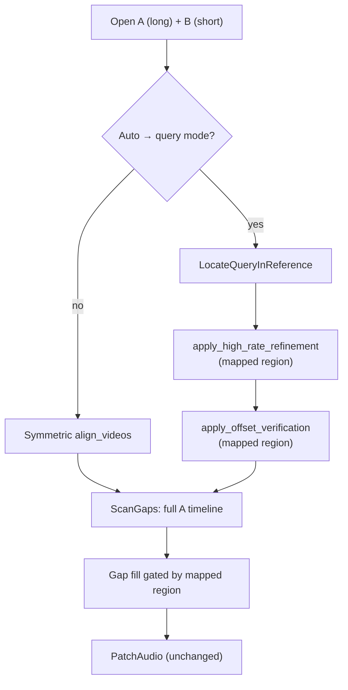

# Temporary plan: query-reference alignment (short clip vs long video)

> **Status:** Not started. Archive to `docs/archive/query-reference-alignment-plan.md` when shipped.

**Problem:** `clip-sync` and `clip-sync-repair` assume two recordings of roughly the same event with symmetric multi-clip fingerprint windows (default 15m start + end on long media). When **B is much shorter than A** (an excerpt, phone clip, or partial export), `clip_windows_with_options` yields **different window counts** → `align_extracted_pair` fails with `clip count mismatch`. Even when counts accidentally match, windows are anchored to each file’s start/end, so content that appears **mid-timeline** on the long file is never searched.

**Goal:** Support **query-reference localization**: treat the shorter input as a query fingerprint, search the longer reference timeline for the best match position, emit a global offset and **mapped coverage region**, then reuse the existing repair gap-scan / patch pipeline within that region.

**Primary use case (repair):**

- **A** = long recording with silent dropouts
- **B** = shorter clip with clean audio for one segment of the same event
- Find where B sits on A’s timeline → scan A for gaps → patch from B where B has coverage

**Workspace split:** Localization algorithm, domain types, and `AlignVideos` routing live in **`crates/clip-sync`**. Repair scan/report wiring in **`crates/clip-sync-repair`**. Optional standalone “locate only” output in **`crates/clip-sync-cli`**. **Do not** add a new crate or binary — extend existing tools (see [Extend vs new crate](#extend-vs-new-crate)).

---

## Current codebase baseline

Audit against the tree as of 2026-06-10.

| Area | Path | Current state | Target phase |
|------|------|---------------|--------------|
| **Symmetric align** | `crates/clip-sync/src/application/align_videos.rs` | Multi-clip extract + fingerprint; requires equal window counts | Q2 (branch, keep default path) |
| **Clip planning** | `crates/clip-sync/src/domain/policies.rs` | `clip_windows_with_options` — per-file duration, `effective_num_clips` | Q1 (query mode bypasses symmetric plan on reference) |
| **Clip count gate** | `align_videos.rs` `align_extracted_pair` | Hard error on window count mismatch | Q2 (skip when query mode) |
| **Chromaprint match** | `infrastructure/chromaprint/aligner.rs`, `matching.rs` | `match_fingerprints` handles unequal fingerprint lengths (substring match) | Q1 (reuse per search window) |
| **Sequential scan** | `application/ports.rs` `scan_mono_buckets`; `symphonia/extract.rs` `scan_mono_buckets_with_state` | Efficient forward decode for long files | Q1 (coarse search haystack) |
| **PCM discover** | `application/offset_refinement.rs` | Template slide within **pre-extracted clip pair**; coarse offset ≥15s, clip ≥20s | Q1 (extend haystack range for winner refine) |
| **Hold-out verify** | `application/offset_verification.rs` | Lag-0 check at hold-out window | Q2 (verify inside mapped region) |
| **High-rate refine** | `application/high_rate_refinement.rs` | Native-rate FFT tweak post-align | Q2 (run after query localize on mapped hold-out) |
| **AlignmentResult** | `domain/alignment.rs` | `start_overlap`, clips, recommended offset | Q1–Q2 (add `query_localization`, refresh overlap) |
| **Repair align** | `clip-sync-repair/.../aligner.rs` | `align_with_defaults` only | Q3 |
| **Gap scan** | `clip-sync-repair/.../scan_gaps.rs` | Full A timeline; `overlap = alignment.start_overlap` | Q3 (mapped region overlap + optional region filter) |
| **Gap fill** | `clip-sync-repair/.../gap_fill.rs` | Fill any gap where B has energy; no region gate | Q3 (report `outside_reference_coverage` skip reason) |
| **Patch** | `clip-sync-repair/.../patch_audio.rs` | Per-gap structure match — unchanged | — |
| **CLI repair** | `clip-sync-repair/.../cli/args.rs` | No query-mode flags | Q3 |
| **CLI analyzer** | `clip-sync-cli/.../cli/args.rs` | No locate-only mode | Q4 (optional) |
| **Corpus** | `tests/corpus/`, repair `tests/gap_corpus/` | Symmetric pairs only | Q4 |

**Naming:** **Query** = shorter file (typically B in repair). **Reference** = longer file (typically A in repair). Offset convention unchanged: seconds to **add to A’s timeline** to align with B (`b = a + offset`).

---

## Decisions

Locked before implementation. Change only with an explicit plan revision.

| Topic | Decision |
|-------|----------|
| **Product shape** | Extend **`clip-sync` + `clip-sync-repair` + optional `clip-sync-cli` flags** — no new crate/binary. |
| **Repair I/O** | Keep `VIDEO_A` = gaps (long), `VIDEO_B` = reference (short clip). Auto-detect query mode from durations; allow override via config/CLI. |
| **Mode selection** | `AlignmentMode::Auto \| Symmetric \| QueryReference`. **Auto** (default): use query mode when `dur_b < dur_a * query_min_duration_ratio` **or** symmetric clip window counts differ. Ratio default **0.5**. |
| **Which file is query** | Always the **shorter** duration (tie → symmetric). Repair convention: short B, long A. |
| **Search strategy (v1)** | **Coarse-to-fine:** (1) fingerprint full query clip; (2) sliding windows on reference via `scan_mono_buckets`; (3) Chromaprint match per window; (4) cluster candidates by anchor on A; (5) PCM refine top candidate(s); (6) optional high-rate + hold-out verify on mapped region. |
| **Coarse window length** | `L = min(query_prepared_duration, clip_length, reference_remaining)` — same prep pipeline as discovery (`prepare_clip_for_fingerprint`). |
| **Coarse stride** | Configurable `query_search_stride_secs` (default **60**). Stride ≤ window length; minimum stride **15** s. |
| **Anchor definition** | `anchor_a_secs` = A timeline position where query **t = 0** aligns. `recommended_offset_secs = -anchor_a_secs` (equivalent to existing sign convention). |
| **Mapped region** | A: `[anchor_a_secs, anchor_a_secs + query_duration_secs]` clamped to A duration. B: `[0, query_duration_secs]` clamped to B duration. Exposed as `TimelineOverlap` on `QueryLocalization.mapped_region`. |
| **Overlap field** | In query mode, set `AlignmentResult.start_overlap` from **mapped region** (not start-clip window). Repair `GapReport.overlap` follows. |
| **ClipMatch report** | Query mode emits **one synthetic `ClipMatch`** (label `Start`) describing the winning search window on A + match confidence — keeps JSON shape stable for tools that read `clips[0]`. |
| **Ambiguity** | Reuse `select_best_segment` cluster ambiguity (×0.5 confidence). Surface `query_localization.ambiguous: bool`. Do **not** hard-fail; warn in human output. |
| **Verification** | When `validation.verify_offset` on: hold-out **inside mapped region** on A (reuse `holdout_window_candidates` with discovery window = winning coarse window). Skip if mapped region shorter than `clip_length`. |
| **High-rate refine** | Run when enabled, **after** coarse+PCM localize, **before** verification — same order as symmetric path. Segment from mapped region, not file start. |
| **Gap scan scope** | Default **full A timeline** (gaps outside B coverage still reported). Add repair config `limit_fill_to_mapped_region` default **true** — gaps outside region stay in report but get `b_has_energy = false` / fill skip reason `outside_reference_coverage`. |
| **Alignment failure** | No match above threshold → `recommended_offset_secs: None`, scan A anyway (same as today). Exit **0** in repair report mode. |
| **Memory / perf** | Coarse search fingerprints windows incrementally; do **not** retain all window PCM. Cap scored windows per file (`query_max_windows_scored`, default **500**) with coarser stride fallback + warn. |
| **try_all_tracks** | Query mode: try all decodable pairs; pick highest localization confidence (same pattern as `align_best_track_pair`). |
| **min clip length** | Query clip must satisfy existing `MIN_CLIP_LENGTH` (60s) after prep, else skip query mode with clear error/skip reason (cannot fingerprint reliably). |
| **Symmetric path** | Unchanged when mode is `Symmetric` or Auto chooses symmetric. |
| **Phasing** | Q0 spike → Q1 lib core → Q2 lib integrate + refine/verify → Q3 repair → Q4 CLI + corpus → archive. |
| **User-facing report (query mode)** | Lead with **where the clip sits on the long file** — start/finish on A (and B) — not offset/overlap jargon. Offset and `TimelineOverlap` remain in JSON and for symmetric-mode compatibility; de-emphasize or omit offset in default human output on this path. |
| **Report labels (human)** | Prefer: `Clip on A: 45:00 – 53:00` (or `Match on video A: …`). Optional verbose: `Clip on B: 0:00 – 8:00`. Avoid leading with `offset -2700s` or `Overlap:` in default human repair/analyzer output. |
| **Report labels (JSON)** | Add optional friendly aliases alongside machine fields: `clip_on_a_start_secs` / `clip_on_a_end_secs` (mirror `mapped_region.video_a_*`) on `QueryLocalization`; keep `recommended_offset_secs` and `start_overlap` for scripts. |

---

## Config

### Library (`AlignConfig.alignment`)

Add fields to **`AlignmentConfig`** in `crates/clip-sync/src/application/config.rs`:

```rust
#[derive(Debug, Clone, Copy, PartialEq, Eq, Default, Serialize, Deserialize)]
#[serde(rename_all = "lowercase")]
pub enum AlignmentMode {
    #[default]
    Auto,
    Symmetric,
    QueryReference,
}

#[derive(Debug, Clone, PartialEq, Serialize, Deserialize)]
pub struct AlignmentConfig {
    // ... existing fields ...

    /// How to align when inputs differ greatly in length.
    #[serde(default)]
    pub mode: AlignmentMode,

    /// In Auto mode, treat shorter file as query when dur_short / dur_long < this ratio.
    #[serde(default = "default_query_min_duration_ratio")]
    pub query_min_duration_ratio: f64,

    /// Coarse search stride on the reference timeline (seconds).
    #[serde(default = "default_query_search_stride_secs")]
    pub query_search_stride_secs: f64,

    /// Maximum coarse windows to fingerprint per run (stride widens if exceeded).
    #[serde(default = "default_query_max_windows_scored")]
    pub query_max_windows_scored: u32,

    /// Minimum Chromaprint confidence to accept a localization candidate.
    #[serde(default = "default_query_min_match_score")]
    pub query_min_match_score: f32,

    /// Number of top coarse candidates to PCM-refine (1 = winner only).
    #[serde(default = "default_query_refine_top_k")]
    pub query_refine_top_k: u32,
}

fn default_query_min_duration_ratio() -> f64 { 0.5 }
fn default_query_search_stride_secs() -> f64 { 60.0 }
fn default_query_max_windows_scored() -> u32 { 500 }
fn default_query_min_match_score() -> f32 { 0.3 }
fn default_query_refine_top_k() -> u32 { 1 }
```

`AlignConfig::validate()`: require `query_search_stride_secs >= 15.0`, `0.0 < query_min_duration_ratio <= 1.0`, `query_refine_top_k >= 1`.

### Repair (`RepairConfig`)

Add to `crates/clip-sync-repair/src/infrastructure/config.rs`:

```rust
pub struct RepairConfig {
    // ... existing ...

    /// When query-reference alignment is used, only treat gaps inside the mapped B coverage
    /// region as fillable (gaps outside are still reported).
    #[serde(default = "default_true")]
    pub limit_fill_to_mapped_region: bool,
}
```

Repair default align config: set `alignment.mode = Auto` explicitly in `default_repair_align_config()` (document in repair TOML example).

### CLI flags

**`clip-sync-repair`** (`args.rs`):

| Flag | Maps to |
|------|---------|
| `--query-reference` | `alignment.mode = QueryReference` |
| `--symmetric-align` | `alignment.mode = Symmetric` |
| `--query-stride <SECS>` | `query_search_stride_secs` |
| `--no-limit-fill-region` | `limit_fill_to_mapped_region = false` |

**`clip-sync-cli`** (Phase Q4, optional):

| Flag | Maps to |
|------|---------|
| `--query-reference` / `--symmetric-align` | same as repair |
| `--query-stride <SECS>` | same |

TOML example (`tests/fixtures/repair.toml`):

```toml
[alignment]
mode = "auto"
query_search_stride_secs = 60
query_min_duration_ratio = 0.5

[repair]
limit_fill_to_mapped_region = true
```

---

## Types

All new domain types in **`crates/clip-sync/src/domain/alignment.rs`** (or `query_localization.rs` re-exported from `domain/mod.rs`).

```rust
/// How this alignment run chose its algorithm.
#[derive(Debug, Clone, Copy, PartialEq, Eq, Serialize)]
#[serde(rename_all = "lowercase")]
pub enum AlignmentModeUsed {
    Symmetric,
    QueryReference,
}

/// Result of searching a short query clip against a long reference timeline.
#[derive(Debug, Clone, PartialEq, Serialize)]
pub struct QueryLocalization {
    /// A timeline position where query t=0 aligns.
    pub anchor_a_secs: f64,
    /// Same as `mapped_region.video_a_start_secs` — explicit alias for human-oriented JSON.
    pub clip_on_a_start_secs: f64,
    /// Same as `mapped_region.video_a_end_secs`.
    pub clip_on_a_end_secs: f64,
    /// Same as `mapped_region.video_b_start_secs` (usually 0).
    pub clip_on_b_start_secs: f64,
    /// Same as `mapped_region.video_b_end_secs`.
    pub clip_on_b_end_secs: f64,
    /// Shared region implied by anchor + query duration (same shape as TimelineOverlap).
    pub mapped_region: TimelineOverlap,
    /// Coarse search stride actually used (may widen if window cap hit).
    pub search_stride_secs: f64,
    /// A timeline bounds of the winning coarse window.
    pub winning_window_start_secs: f64,
    pub winning_window_end_secs: f64,
    pub confidence: f32,
    #[serde(default)]
    pub ambiguous: bool,
    /// Coarse windows fingerprinted before cap/stride adjustment.
    pub windows_scored: u32,
    #[serde(skip_serializing_if = "Option::is_none")]
    pub skip_reason: Option<String>,
}

// AlignmentResult — add:
#[serde(skip_serializing_if = "Option::is_none")]
pub alignment_mode_used: Option<AlignmentModeUsed>,
#[serde(skip_serializing_if = "Option::is_none")]
pub query_localization: Option<QueryLocalization>,
```

**Repair gap skip reason** (extend `GapPatchSkipReason` or fill plan metadata in `domain/patch_result.rs`):

```rust
OutsideReferenceCoverage,
```

---

## Phases

### Phase Q0 — Spike (lib)

**Goal:** Prove coarse sliding fingerprint search finds a known anchor on synthetic media.

**Lib (`crates/clip-sync`)**

- [ ] Unit test helper: build long A (e.g. 30 min chirp/noise) + short B (5 min segment copied from A at known anchor, e.g. 45:00)
- [ ] Prototype function (test module or scratch): fingerprint B, scan A every 60s with window = B duration, score with `ChromaprintAligner::find_offset`
- [ ] Assert best anchor within **±2 s** of truth on spike fixture
- [ ] Assert symmetric path still fails or misaligns on same pair (clip count mismatch or wrong offset)
- [ ] Record: windows scored, runtime order-of-magnitude, whether stride=60 is sufficient for 2h reference

**CLI / repair:** none

### Phase Q1 — Core localization (lib only)

**Lib (`crates/clip-sync`)**

- [ ] `domain/query_localization.rs` — `compute_mapped_region(anchor_a, query_duration, dur_a, dur_b, offset) -> TimelineOverlap`
- [ ] `application/locate_query.rs` — **new** `LocateQueryInReference` use case:
  - Input: open sessions, tracks, `AlignConfig`, durations
  - Extract + prep full query clip (shorter file)
  - `scan_mono_buckets` on reference @ `target_sample_rate`
  - For each bucket: build window length L, fingerprint, match, convert segment → candidate `anchor_a_secs`
  - Cluster candidates (reuse lag clustering idea from `matching.rs` on anchor positions)
  - Respect `query_max_windows_scored` (widen stride + log warn)
  - PCM refine top `query_refine_top_k` via extended `refine_offset_in_haystack(left_window, right_query, prior_anchor)` in `offset_refinement.rs`
  - Return `QueryLocalization` + `ClipMatchEstimate`
- [ ] `build_query_alignment_result(...)` — synthetic single `ClipMatch`, `recommended_offset_secs`, `start_overlap = mapped_region`
- [ ] Unit tests: known anchor pass, ambiguous repeat (lower confidence), no match (confidence below threshold), query shorter than MIN_CLIP_LENGTH skip
- [ ] **`AlignVideos` not wired yet** — callable from tests and `locate_query` integration tests

**CLI / repair:** none

### Phase Q2 — Integrate into `AlignVideos` (lib)

**Lib (`crates/clip-sync`)**

- [ ] `resolve_alignment_mode(mode, dur_a, dur_b, plan_a, plan_b) -> AlignmentModeUsed` in `domain/policies.rs`
- [ ] `AlignVideos::execute()` branch at top (after open + track select):
  ```text
  if mode == QueryReference || (mode == Auto && should_use_query(...)):
      outcome = locate_query_track_pair(...)  // mirror align_best_track_pair structure
      apply_high_rate_refinement(...)         // segment inside mapped region
      apply_offset_verification(...)          // hold-out inside mapped region
      return
  else:
      existing symmetric path
  ```
- [ ] Set `result.alignment_mode_used`, `result.query_localization`
- [ ] `refresh_start_overlap` → in query mode use `mapped_region` helper instead of start clip window
- [ ] `default_pipeline.rs` / public facade: no API change (same `align_with_defaults`)
- [ ] Integration tests in `align_videos.rs`: query-mode chirp oracle; Auto detection; `--symmetric` override via config in test
- [ ] Export `AlignmentMode`, `QueryLocalization`, `AlignmentModeUsed` on `clip_sync` facade if needed by repair JSON consumers

**CLI (`clip-sync-cli`):** none required for repair path (Q3 handles repair CLI)

### Phase Q3 — Repair integration

**Repair (`crates/clip-sync-repair`)**

- [ ] `default_repair_align_config()`: document Auto mode; consider `num_clips = 1` when query mode expected (optional — Auto handles mismatch)
- [ ] CLI flags: `--query-reference`, `--symmetric-align`, `--query-stride`, `--no-limit-fill-region`
- [ ] `scan_gaps.rs`:
  - `overlap` from `alignment.start_overlap` (now mapped region in query mode)
  - `check_gap_offset_agreement_in_overlap`: use mapped region when `query_localization` present
  - When `limit_fill_to_mapped_region`: mark gaps outside `mapped_region` as not fillable (override `b_has_energy` or filter at fill-plan stage)
- [ ] `gap_fill.rs` / `patch_result.rs`: skip reason `outside_reference_coverage`
- [ ] `infrastructure/cli/output.rs` + `domain/alignment_report.rs` (shared formatters):
  - **Human (default):** lead with clip placement, not offset — e.g. `Match on A: 45:00 – 53:00  (8m clip, confidence 0.91)`
  - **Human (`--verbose`):** add B span, coarse-search stats, offset for debugging
  - **JSON:** pass through `query_localization` including `clip_on_a_*` / `clip_on_b_*`; keep `recommended_offset_secs` for scripts
  - Replace or subordinate repair `Overlap:` line in query mode — use `Match on A:` / `Clip coverage:` instead
  - Warn when `ambiguous == true`
- [ ] Integration tests:
  - Long A + short B with gap inside mapped region → fillable
  - Gap outside mapped region → reported, not patched when `limit_fill_to_mapped_region`
  - Clip count mismatch pair succeeds under Auto

**Lib:** none (unless Q2 gaps found)

### Phase Q4 — Analyzer CLI + corpus + documentation

**CLI (`clip-sync-cli`)**

- [ ] Mirror query-mode flags on analyzer for debugging
- [ ] Human/JSON lines for `query_localization` (reuse shared formatters from `domain/alignment_report.rs`)
- [ ] Default human output: **start/finish on A** as primary line; offset only with `--verbose`

**Corpus (alignment — `tests/corpus/`)**

- [ ] `manifest.toml` case `wav_query_reference_45min_anchor` — 60 min A, 8 min B embedded at 45:00; optional +3s clock skew variant
- [ ] `CorpusCase` extensions: `alignment_mode`, `expect_clip_on_a_start_secs`, tolerance
- [ ] `application/testing/corpus_fixtures.rs` — generator or committed WAV pair under repo size budget
- [ ] Wired into existing corpus test harness (same tier as `wav_leader_*` cases)

**Corpus (repair — `clip-sync-repair/tests/`)**

- [ ] Integration: `repair_query_mid_file_gap` — long A with gap inside clip coverage → patched
- [ ] Integration: `repair_query_gap_outside_coverage` — gap before clip anchor → skipped
- [ ] Optional gap-corpus manifest entry if generator can produce long+short pair without blowing size budget; otherwise integration-only with synthetic WAV (same pattern as existing chirp fixtures)

**Documentation**

- [ ] **README** — new subsection “Short clip against long recording”: when Auto/query mode triggers, example command, sample human output (`Match on A: …`), note that gaps outside clip coverage are reported but not filled
- [ ] **README** — symmetric vs query-mode flag table (`--query-reference`, `--symmetric-align`)
- [ ] **docs/corpus-validation.md** — describe `wav_query_reference_*` cases and how to run them
- [ ] **docs/development.md** — brief pointer if corpus env vars apply
- [ ] **BACKLOG.md** — link this plan until archived
- [ ] Archive this doc → `docs/archive/query-reference-alignment-plan.md`

---

## Design

### End-to-end flow (repair, query mode)



### Coarse search (reference timeline)

```text
query_clip = extract_mono(B, [0, dur_b)) → prepare → fingerprint → FP_Q

stride = config.query_search_stride_secs
L_secs = min(query_prepared_duration, clip_length)

scan_mono_buckets(A, bucket_secs = stride):
  for each bucket starting at pos:
    window = [pos, pos + L_secs) clamped to dur_a
    if window shorter than MIN_CLIP_LENGTH: continue
    FP_W = fingerprint(extract_mono(A, window) → prepare)
    estimate = aligner.find_offset(FP_W, FP_Q)   // left=window, right=query
    anchor_a = pos + estimate.offset_secs        // derive from segment offset1/item_duration
    record candidate(anchor_a, estimate.confidence, ambiguous)

cluster candidates by anchor_a (±2 s)
pick best by confidence (×0.5 if ambiguous)
if best.confidence < query_min_match_score: no recommendation
```

**Offset sign check:** After picking winner, set `recommended_offset_secs = -anchor_a_secs` and verify with `b_pos = a_pos + offset` at anchor.

**Window cap:** If `ceil(dur_a / stride) > query_max_windows_scored`, multiply stride by 2 until under cap (log `tracing::warn`).

### PCM refine (winner)

Extend `offset_refinement.rs`:

```text
refine_query_anchor(
  query_clip: MonoPcmClip,           // full prepared query
  reference_session, track_a,
  coarse_anchor_a: f64,
  search_radius_secs: f64,           // default max(15, 0.1 * query_duration)
) -> (anchor_a_refined, confidence)
```

- Extract reference haystack `[anchor - radius, anchor + query_duration + radius)`
- Reuse `pcm_discover_offset` / template sliding with query as template
- Update `QueryLocalization.anchor_a_secs` and `recommended_offset_secs`

### High-rate + verification in query mode

Same hooks as symmetric path; change **only** segment placement:

```text
discovery_windows = [ClipWindow::new(win_start, win_end)]  // winning coarse window on A
mapped_region = query_localization.mapped_region
pick hold-out / high-rate segment ∈ mapped_region (not file start)
Δ = recommended_offset_secs (post-PCM refine)
```

### Gap scan and fill (repair)

| Gap location | Report | Fillable when `limit_fill_to_mapped_region` |
|--------------|--------|---------------------------------------------|
| Inside mapped region, B has energy | Yes | Yes (existing gates) |
| Inside mapped region, B silent | Yes | No |
| Outside mapped region | Yes | No (`outside_reference_coverage`) |
| No alignment offset | Yes, no B coords | No |

`build_gap_fill_plan` unchanged structurally; add region check before `Gap::is_fillable()` or in `ScanGaps` when building `Gap` rows.

### Auto mode selection

```text
fn should_use_query(mode, dur_a, dur_b, windows_a, windows_b) -> bool:
  match mode:
    QueryReference => true
    Symmetric => false
    Auto =>
      let (short, long) = if dur_a <= dur_b { (a,b) } else { (b,a) }
      if short / long < query_min_duration_ratio: return true
      if windows_a.len() != windows_b.len(): return true
      return false
```

When Auto picks query mode, **query is always the shorter file** (typically B in repair).

### Interaction with existing features

| Feature | Query mode behavior |
|---------|---------------------|
| `num_clips`, `clip_length` | Ignored for planning on query path; `clip_length` caps coarse window L |
| `require_consistent_offsets` | N/A (single localization) |
| `prefer_start_clip` | N/A |
| `refine_offset_with_pcm` | Used inside `refine_query_anchor` |
| `refine_offset_high_rate` | Segment from mapped region |
| `verify_offset` | Hold-out inside mapped region |
| `check_clip_repetition` | Run on query clip + winning window; downgrade localization confidence |
| `try_all_tracks` | Pick best track pair by localization confidence |
| `scan_both` (repair) | Unchanged; cross-check uses mapped overlap |
| Patch structure match | Unchanged |

---

## Extend vs new crate

| Option | Verdict |
|--------|---------|
| **Extend `clip-sync` + `clip-sync-repair`** | ✅ **Recommended.** ~90% of repair pipeline (scan, fill plan, patch, WAV/mux) is reusable. |
| **New `clip-sync-locate` crate** | ❌ Thin wrapper; duplicates Symphonia/Chromaprint wiring in `default_pipeline.rs`. |
| **New repair binary** | ❌ Same UX (`A` gaps, `B` reference); splits config/tests for one mode flag. |
| **Optional `clip-sync --query-reference`** | ✅ Debug/locate-only convenience in Q4; not a separate product. |

---

## Tests

| Test | Phase | Crate | Asserts |
|------|-------|-------|---------|
| `coarse_search_finds_known_anchor` | Q0 | lib | Spike fixture anchor ±2 s |
| `compute_mapped_region_clamps_to_duration` | Q1 | lib | Region bounds |
| `locate_query_passes_mid_file_embed` | Q1 | lib | 45 min anchor, confidence ≥ threshold |
| `locate_query_fails_below_threshold` | Q1 | lib | Unrelated A/B → no recommendation |
| `locate_query_respects_window_cap` | Q1 | lib | Stride widens, `windows_scored` ≤ cap |
| `locate_query_ambiguous_lowers_confidence` | Q1 | lib | Repeated content → `ambiguous` |
| `resolve_alignment_mode_auto_ratio` | Q2 | lib | 8 min / 60 min → query |
| `resolve_alignment_mode_auto_clip_mismatch` | Q2 | lib | Different window counts → query |
| `align_videos_query_mode_integration` | Q2 | lib | End-to-end `execute()` JSON shape |
| `symmetric_path_unchanged_regression` | Q2 | lib | Equal-length corpus cases still pass |
| `repair_query_gap_inside_region_fillable` | Q3 | repair | Patch succeeds |
| `repair_query_gap_outside_region_skipped` | Q3 | repair | `outside_reference_coverage` |
| `repair_auto_no_clip_count_mismatch_error` | Q3 | repair | Long+short pair completes |
| `cli_query_reference_flags` | Q3 | repair | Config roundtrip |
| `corpus_query_reference_45min_anchor` | Q4 | lib | Manifest case |
| `cli_human_query_mode_start_finish_line` | Q4 | CLI | Default human shows A start–finish, not offset |
| `cli_human_query_mode_verbose_offset` | Q4 | CLI | Offset appears only with `--verbose` |
| `repair_json_clip_on_a_fields` | Q3 | repair | JSON includes `clip_on_a_start_secs` / `clip_on_a_end_secs` |

### Corpus case `wav_query_reference_45min_anchor`

| Field | Value |
|-------|-------|
| Generator | Long chirp A (3600 s); B = 480 s slice from A @ 2700 s |
| `alignment.mode` | `query_reference` |
| Assert | `\|anchor_a_secs - 2700\| ≤ 2` |
| Assert | `recommended_offset_secs ≈ -2700` |
| Assert | `mapped_region.shared_length_secs ≈ 480` |

---

## Output examples

### Human (repair, query mode)

**Default** — start/finish on the long file first; offset omitted:

```text
Match on video A: 45:00 – 53:00  (8m clip, confidence 0.91)

Gaps in video A (2 found, 1 repaired, 1 skipped, 0 unfillable):
  1   45:30 – 46:00   30.0s   patched
  2   10:00 – 10:30   30.0s   skipped (outside clip coverage)
```

**`--verbose`** — debugging fields including offset and B span:

```text
Mode:       query-reference
Match on A: 45:00 – 53:00
Clip on B:  0:00 – 8:00
Offset:     -2700.000s  (add to A to align with B)
Search:     60 windows @ 60s stride
```

Symmetric-mode repair output is unchanged (`Overlap:`, offset-first).

### JSON (`AlignmentResult` excerpt)

Machine-oriented fields preserved for scripts; friendly aliases on `QueryLocalization`:

```json
{
  "alignment_mode_used": "queryreference",
  "recommended_offset_secs": -2700.0,
  "query_localization": {
    "anchor_a_secs": 2700.0,
    "clip_on_a_start_secs": 2700.0,
    "clip_on_a_end_secs": 3180.0,
    "clip_on_b_start_secs": 0.0,
    "clip_on_b_end_secs": 480.0,
    "mapped_region": {
      "video_a_start_secs": 2700.0,
      "video_a_end_secs": 3180.0,
      "video_b_start_secs": 0.0,
      "video_b_end_secs": 480.0,
      "shared_length_secs": 480.0
    },
    "search_stride_secs": 60.0,
    "winning_window_start_secs": 2640.0,
    "winning_window_end_secs": 3120.0,
    "confidence": 0.91,
    "ambiguous": false,
    "windows_scored": 60
  }
}
```

---

## Risks and follow-ups (out of v1 scope)

| Risk | Mitigation in v1 | Follow-up |
|------|------------------|-----------|
| Repeated content → wrong anchor | Ambiguity flag + verify; warn user | Multi-anchor report; user picks |
| 2h reference × 60s stride = 120 windows | `query_max_windows_scored` + stride widen | Hierarchical search (coarse 5m → fine 30s) |
| Query < 60s | Hard skip with message | Lower MIN_CLIP_LENGTH for query-only preset |
| Clock drift over long mapped region | Single offset + per-gap structure match | Segment-wise offset (BACKLOG) |
| Full-file RAM on patch | Unchanged | Streaming WAV encode |
| Multiple disjoint clips | Not supported | Multi-query batch mode |

---

## References

- Prior discussion: arbitrary clip vs long video repair workflow (2026-06-10)
- Symmetric alignment: `crates/clip-sync/src/application/align_videos.rs`
- PCM discover: `crates/clip-sync/src/application/offset_refinement.rs`
- Hold-out verify: `docs/TEMP-offset-verification-plan.md`
- Repair pipeline: `docs/archive/repair-write-path-plan.md`
- Sequential decode: `crates/clip-sync/src/application/ports.rs` (`scan_mono_buckets`)
- Chromaprint matching: `crates/clip-sync/src/infrastructure/chromaprint/matching.rs`
- Gap fill (unchanged core): `crates/clip-sync-repair/src/application/patch_audio.rs`
