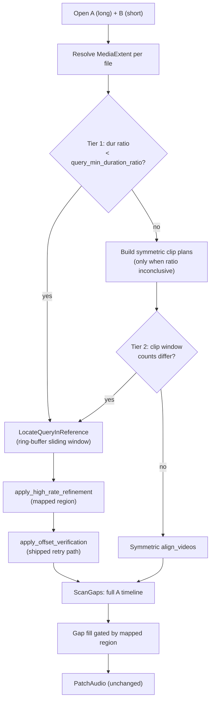

# Temporary plan: query-reference alignment (short clip vs long video)

> **Status:** Q2 complete (2026-06-15) — Q0 spike, Q1 localization engine, and Q2 (`AlignmentResult` fields, `build_query_alignment_result`, mode resolution, `AlignVideos` query/symmetric branch, report DTOs + formatter, JSON contract doc) all landed and tested (240 lib + repair + cli suites green; golden fixtures byte-identical). Next: **Q3** — repair integration (scan/fill gating by mapped region, CLI flags, human/JSON output). A few small Q2 deferrals (real-WAV execute oracle, A-as-query orientation, region-bounded hold-out) are noted in Q2b and folded into Q3/Q4. Design hardened 2026-06-15 (ring-buffer sliding-window model + stage-explicit tolerance tiers). Archive to `docs/archive/query-reference-alignment-plan.md` when shipped.

**Problem:** `clip-sync` and `clip-sync-repair` assume two recordings of roughly the same event with symmetric multi-clip fingerprint windows (default 15m start + end on long media). When **B is much shorter than A** (an excerpt, phone clip, or partial export), `clip_windows_with_options` yields **different window counts** → `align_extracted_pair` fails with `clip count mismatch`. Even when counts accidentally match, windows are anchored to each file’s start/end, so content that appears **mid-timeline** on the long file is never searched.

**Goal:** Support **query-reference localization**: treat the shorter input as a query fingerprint, search the longer reference timeline for the best match position, emit a global offset and **mapped coverage region**, then reuse the existing repair gap-scan / patch pipeline within that region.

**Primary use case (repair):**

- **A** = long recording with silent dropouts
- **B** = shorter clip with clean audio for one segment of the same event
- Find where B sits on A’s timeline → scan A for gaps → patch from B where B has coverage

**Workspace split:** Localization algorithm, domain types, and `AlignVideos` routing live in **`crates/clip-sync`**. Repair scan/report wiring in **`crates/clip-sync-repair`**. Optional standalone “locate only” output in **`crates/clip-sync-cli`**. **Do not** add a new crate or binary — extend existing tools (see [Extend vs new crate](#extend-vs-new-crate)).

---

## Cross-plan sequencing

**Prerequisites — land first:**

| Plan | Why it blocks this plan |
|------|-------------------------|
| [archive/media-session-redesign-plan.md](archive/media-session-redesign-plan.md) | Shipped 2026-06-11: `MediaSession` `&mut self`; `reset_io` removed; `MediaExtent`; scan policy in `application/media_scan.rs` |
| [archive/verification-hardening-plan.md](archive/verification-hardening-plan.md) | **Shipped (2026-06-11):** verify retry + `candidates_tried`, `clip_with_label`, `alignment_fixtures`, test-role split — see [corpus-validation.md](corpus-validation.md) § Validation diagnostics |

**Parallel (not blocking query mode):**

| Plan | Relationship |
|------|----------------|
| [archive/periodic-ambiguity-plan.md](archive/periodic-ambiguity-plan.md) | Symmetric pair mode: mod-**T** ambiguity on repeating **A**; query mode: `ambiguous` on repeating anchors in long **A** — align warning semantics in docs |

**Already shipped (rebase on these, do not re-litigate):**

- [archive/output-error-contract-plan.md](archive/output-error-contract-plan.md) — JSON contract v1 frozen; new fields require explicit revision (see [JSON contract revision](#json-contract-revision)).
- [archive/layer-purity-plan.md](archive/layer-purity-plan.md) — domain types carry **no serde**; JSON DTOs live in `application/report.rs`.

**Rebase checklist before Q0:** `&mut MediaSession`, `MediaExtent`, report DTO split, shipped verification retry path, `clip_with_label`, `json-output.md` revision procedure.

---

## Current codebase baseline

Audit against the tree **after** media-session redesign and verification hardening land. Pre-requisite snapshot: 2026-06-11 (layer-purity shipped; query mode not started).

| Area | Path | Current state (post-prereqs) | Target phase |
|------|------|------------------------------|--------------|
| **Symmetric align** | `application/align_videos.rs` | Multi-clip extract + fingerprint; requires equal window counts | Q2 (branch, keep default path) |
| **Clip planning** | `domain/policies.rs` | `clip_windows_with_options` — per-file `MediaExtent::effective()` | Q1 (query mode bypasses symmetric plan on reference) |
| **Clip count gate** | `align_videos.rs` `align_extracted_pair` | Hard error on window count mismatch | Q2 (skip when query mode) |
| **Chromaprint match** | `infrastructure/chromaprint/aligner.rs`, `matching.rs` | `match_fingerprints` handles unequal fingerprint lengths (substring match) | Q1 (reuse per search window) |
| **Sequential scan** | `ports.rs` `scan_mono_buckets` (`&mut self`); `symphonia/extract.rs` `scan_mono_buckets_with_state` | EOF-driven production scan on Symphonia; trait defaults in `application/media_scan.rs` | Q1 (**first production mono scan caller**) |
| **PCM discover** | `application/offset_refinement.rs` | `refine_offset_around_prior`, `pcm_discover_offset` on pre-extracted clips | Q1 (`refine_query_anchor` extracts haystack, then reuses PCM search) |
| **Hold-out verify** | `application/offset_verification.rs` | Retry up to 3 candidates; `candidates_tried`; `MediaExtent` on input | Q2 (delegate to shipped path; mapped-region placement) |
| **High-rate refine** | `application/high_rate_refinement.rs` | `MediaExtent` on input; no `reset_io` | Q2 (segment inside mapped region) |
| **AlignmentResult** | `domain/alignment.rs` | `start_overlap`, clips, `clip_with_label` / `start_clip()` | Q1–Q2 (add `query_localization`, `alignment_mode_used`) |
| **JSON report** | `application/report.rs` | `AlignmentReport` mirrors domain; no serde on domain | Q2–Q3 (add `QueryLocalizationReport`, contract revision) |
| **Repair align** | `clip-sync-repair/.../aligner.rs` | `align_with_defaults` only | Q3 |
| **Gap scan** | `clip-sync-repair/.../scan_gaps.rs` | Full A timeline; `overlap = alignment.start_overlap`; `&mut` sessions | Q3 (mapped region overlap + optional region filter) |
| **Gap fill** | `clip-sync-repair/.../gap_fill.rs` | Fill any gap where B has energy; no region gate | Q3 (`GapFillSkipReason::OutsideReferenceCoverage`) |
| **Patch** | `clip-sync-repair/.../patch_audio.rs` | Per-gap structure match — unchanged | — |
| **CLI repair** | `clip-sync-repair/.../cli/args.rs` | No query-mode flags | Q3 |
| **CLI analyzer** | `clip-sync-cli/.../cli/args.rs` | No locate-only mode; headline via `start_clip()` | Q4 (optional) |
| **Corpus** | `tests/corpus/`, repair `tests/` | Symmetric pairs only | Q4 (generated tier for query case) |

**Naming:** **Query** = shorter file (typically B in repair). **Reference** = longer file (typically A in repair). Offset convention unchanged: seconds to **add to A’s timeline** to align with B (`b = a + offset`).

**Tolerance tiers:** Localization is coarse-to-fine — assertions must match the stage, not reuse one number. Mirrors existing pipeline constants.

| Stage | Tolerance | Applies to |
|-------|-----------|------------|
| **Coarse** (Chromaprint sliding window) | **±2 s** | Q0 spike anchor, cluster radius (`PURE_TONE_REPEAT_LAG_TOLERANCE_SECS = 2.0`) |
| **Agreement** (verification / repair gap cross-check) | **±0.5 s** | `apply_offset_verification` gate (`OFFSET_AGREEMENT_TOLERANCE_SECS = 0.5`) |
| **Refined** (post-PCM-refine final anchor) | **±0.05 s** | `locate_query` final `anchor_a_secs`, corpus asserts (`TIGHT_TOLERANCE = 0.050`) |

Do **not** carry the coarse ±2 s into refined or corpus assertions — the value feeds the repair patcher and must also pass the ±0.5 s verification gate, so a ±2 s final assertion is both too loose and self-contradictory with the verify step this plan delegates to.

---

## Decisions

Locked before implementation. Change only with an explicit plan revision.

| Topic | Decision |
|-------|----------|
| **Product shape** | Extend **`clip-sync` + `clip-sync-repair` + optional `clip-sync-cli` flags** — no new crate/binary. |
| **Repair I/O** | Keep `VIDEO_A` = gaps (long), `VIDEO_B` = reference (short clip). Auto-detect query mode from **effective** durations; allow override via config/CLI. |
| **Mode selection** | `AlignmentMode::Auto \| Symmetric \| QueryReference`. **Auto** (default): use query mode when `dur_short / dur_long < query_min_duration_ratio` (effective durations) **or** symmetric clip window counts differ. Ratio default **0.5**. |
| **Which file is query** | Always the **shorter** effective duration (tie → symmetric). Repair convention: short B, long A. |
| **Search strategy (v1)** | **Coarse-to-fine:** (1) fingerprint full query clip; (2) **streaming sliding window** over reference via `scan_mono_buckets` + ring buffer; (3) Chromaprint match per window; (4) cluster candidates by anchor on A; (5) PCM refine top candidate(s); (6) optional high-rate + hold-out verify on mapped region. |
| **Decode vs window vs stride** | Three **distinct** quantities — do not conflate (see [Coarse search](#coarse-search-reference-timeline)). **`bucket_secs`** = decode granularity handed to the `scan_mono_buckets` callback (small + fixed, default **10**s). **`L`** = window length fingerprinted per score. **`stride`** = how far the window advances between scores (`query_search_stride_secs`). A ring buffer of length `L` is fed by `bucket_secs` chunks and scored every `stride`. |
| **Coarse window length** | `L = clamp(query_prepared_duration, MIN_CLIP_LENGTH, clip_length)`. **Invariant: `L ≥ query length`** — Chromaprint substring-matches the query *inside* the window, so the window must hold a full query's worth of audio. If `query_prepared_duration > clip_length`, cap **both** the query fingerprint and the window to `clip_length` (do **not** shrink `L` below the query). Same prep pipeline as discovery (`prepare_clip_for_fingerprint`). |
| **Coarse stride** | Configurable `query_search_stride_secs` (default **60**). Stride ≤ window length `L`; minimum stride **15** s. Independent of `bucket_secs`. |
| **Anchor definition** | `anchor_a_secs` = A timeline position where query **t = 0** aligns. `recommended_offset_secs = -anchor_a_secs` (equivalent to existing sign convention). |
| **Mapped region** | A: `[anchor_a_secs, anchor_a_secs + query_duration_secs]` clamped to `extent_a.effective()`. B: `[0, query_duration_secs]` clamped to `extent_b.effective()`. Exposed as `TimelineOverlap` on `QueryLocalization.mapped_region`. |
| **Overlap field** | In query mode, set `AlignmentResult.start_overlap` from **mapped region** (not start-clip window). Repair `GapReport.overlap` follows. |
| **ClipMatch report** | Query mode emits **one synthetic `ClipMatch`** (label **`Start`**) describing the winning search window on A + match confidence — aligns with `start_clip()` headline selection after verification hardening. |
| **Ambiguity** | Reuse `select_best_segment` cluster ambiguity (×0.5 confidence). Surface `query_localization.ambiguous: bool`. Do **not** hard-fail; warn in human output. |
| **Verification** | Delegate to shipped `apply_offset_verification` (retry up to 3 candidates, `candidates_tried`). Hold-out **inside mapped region** on A: call `holdout_window_candidates` with `duration = mapped_region.shared_length_secs` and discovery windows rebased to the region, then shift returned windows by `+video_a_start_secs` back to absolute A time (see [High-rate + verification](#high-rate--verification-in-query-mode)). **Not** `MediaExtent::effective()`. Skip if mapped region shorter than `clip_length`. |
| **Confidence ownership** | Chromaprint owns selection + ambiguity; PCM refine only adjusts the anchor. `QueryLocalization.confidence` = winning coarse Chromaprint cluster confidence (×0.5 if ambiguous), gates `query_min_match_score`, drives `start_clip()` headline. `refine_query_anchor` returns the refined anchor **only**; if its correlation peak disagrees with the coarse anchor by more than `search_radius`, keep the coarse anchor and set `ambiguous = true`. Final headline is post-verification when verification runs, else coarse. |
| **High-rate refine** | Run when enabled, **after** coarse+PCM localize, **before** verification — same order as symmetric path. Segment from mapped region, not file start. No `reset_io` (adapter recovers internally). |
| **Gap scan scope** | Default **full A timeline** (gaps outside B coverage still reported). Add repair config `limit_fill_to_mapped_region` default **true** — gaps outside region stay in report but are not fillable (`GapFillSkipReason::OutsideReferenceCoverage`). |
| **Alignment failure** | No match above threshold → `recommended_offset_secs: None`, scan A anyway (same as today). Exit **0** in repair report mode. |
| **Memory / perf** | Coarse search fingerprints windows incrementally; do **not** retain all window PCM. Cap scored windows per file (`query_max_windows_scored`, default **500**) with coarser stride fallback + warn. |
| **Scan re-entrancy** | `scan_mono_buckets` callback must **not** call back into the session (documented on `MediaSession` after media-session redesign). Fingerprint inside callback only. |
| **try_all_tracks** | Query mode: best-effort under a **global** `query_max_windows_scored` budget (not per-pair). Localize cheapest/first decodable pair first; if it clears a high bar (`confidence ≥ 2 × query_min_match_score` and not ambiguous), stop and use it. Only sweep remaining pairs when no pair clears the bar. Pick highest localization confidence. Differs from exhaustive symmetric `align_best_track_pair`. |
| **min clip length** | Query clip must satisfy existing `MIN_CLIP_LENGTH` (60s) after prep, else skip query mode with clear error/skip reason. If duration-less open is relaxed (media-session Phase 4), fail here when effective duration is still unknown. |
| **Symmetric path** | Unchanged when mode is `Symmetric` or Auto chooses symmetric. |
| **Phasing** | Q0 spike → Q1 lib core → Q2 lib integrate + refine/verify → Q3 repair → Q4 CLI + corpus → archive. |
| **Layer purity** | New domain types in `domain/` — **no serde**. Report DTOs + human formatters in `application/report.rs`. |
| **User-facing report (query mode)** | Lead with **where the clip sits on the long file** — start/finish on A (and B) — not offset/overlap jargon. Offset and `TimelineOverlap` remain in JSON and for symmetric-mode compatibility; de-emphasize or omit offset in default human output on this path. |
| **Report labels (human)** | Prefer: `Clip on A: 45:00 – 53:00` (or `Match on video A: …`). Optional verbose: `Clip on B: 0:00 – 8:00`. Avoid leading with `offset -2700s` or `Overlap:` in default human repair/analyzer output. |
| **Report labels (JSON)** | Friendly aliases on `QueryLocalizationReport`: `clip_on_a_start_secs` / `clip_on_a_end_secs` (mirror `mapped_region.video_a_*`); keep `recommended_offset_secs` and `start_overlap` for scripts. |

---

## Config

### Library (`AlignConfig.alignment`)

Add fields to **`AlignmentConfig`** in `crates/clip-sync/src/application/config.rs`:

```rust
#[derive(Debug, Clone, Copy, PartialEq, Eq, Default, Serialize, Deserialize)]
#[serde(rename_all = "lowercase")]
pub enum AlignmentMode {
    #[default]
    Auto,
    Symmetric,
    QueryReference,
}

#[derive(Debug, Clone, PartialEq, Serialize, Deserialize)]
pub struct AlignmentConfig {
    // ... existing fields ...

    /// How to align when inputs differ greatly in length.
    #[serde(default)]
    pub mode: AlignmentMode,

    /// In Auto mode, treat shorter file as query when dur_short / dur_long < this ratio.
    #[serde(default = "default_query_min_duration_ratio")]
    pub query_min_duration_ratio: f64,

    /// Coarse search stride on the reference timeline (seconds) — how far the
    /// window advances between scores. Independent of `query_decode_bucket_secs`.
    #[serde(default = "default_query_search_stride_secs")]
    pub query_search_stride_secs: f64,

    /// Decode granularity for the coarse scan: PCM chunk size handed to the
    /// `scan_mono_buckets` callback. Small + fixed; the window (length `L`) is
    /// accumulated from these chunks in a ring buffer. NOT the stride.
    #[serde(default = "default_query_decode_bucket_secs")]
    pub query_decode_bucket_secs: f64,

    /// Maximum coarse windows to fingerprint per run (stride widens if exceeded).
    #[serde(default = "default_query_max_windows_scored")]
    pub query_max_windows_scored: u32,

    /// Minimum Chromaprint confidence to accept a localization candidate.
    /// On the `[0,1]` `segment_confidence` scale (see `chromaprint/matching.rs`),
    /// NOT the raw `MATCH_SCORE_THRESHOLD = 10.0`.
    #[serde(default = "default_query_min_match_score")]
    pub query_min_match_score: f32,

    /// Number of top coarse candidates to PCM-refine (1 = winner only).
    #[serde(default = "default_query_refine_top_k")]
    pub query_refine_top_k: u32,
}

fn default_query_min_duration_ratio() -> f64 { 0.5 }
fn default_query_search_stride_secs() -> f64 { 60.0 }
fn default_query_decode_bucket_secs() -> f64 { 10.0 }
fn default_query_max_windows_scored() -> u32 { 500 }
fn default_query_min_match_score() -> f32 { 0.3 }
fn default_query_refine_top_k() -> u32 { 1 }
```

Add **`AlignmentConfig::validate()`** (or extend `AlignConfig::validate()` to call it): require `query_search_stride_secs >= 15.0`, `0.0 < query_min_duration_ratio <= 1.0`, `query_refine_top_k >= 1`, `query_decode_bucket_secs > 0.0`. Today `AlignConfig::validate()` only calls `clip.validate()` — wire alignment rules there.

### Repair (`RepairConfig`)

Add to `crates/clip-sync-repair/src/infrastructure/config.rs`:

```rust
pub struct RepairConfig {
    // ... existing ...

    /// When query-reference alignment is used, only treat gaps inside the mapped B coverage
    /// region as fillable (gaps outside are still reported).
    #[serde(default = "default_true")]
    pub limit_fill_to_mapped_region: bool,
}
```

Repair default align config: set `alignment.mode = Auto` explicitly in `default_repair_align_config()` (document in repair TOML example).

### CLI flags

**`clip-sync-repair`** (`args.rs`):

| Flag | Maps to |
|------|---------|
| `--query-reference` | `alignment.mode = QueryReference` |
| `--symmetric-align` | `alignment.mode = Symmetric` |
| `--query-stride <SECS>` | `query_search_stride_secs` |
| `--no-limit-fill-region` | `limit_fill_to_mapped_region = false` |

**`clip-sync-cli`** (Phase Q4, optional):

| Flag | Maps to |
|------|---------|
| `--query-reference` / `--symmetric-align` | same as repair |
| `--query-stride <SECS>` | same |

TOML example (`tests/fixtures/repair.toml`):

```toml
[alignment]
mode = "auto"
query_search_stride_secs = 60
query_decode_bucket_secs = 10
query_min_duration_ratio = 0.5

[repair]
limit_fill_to_mapped_region = true
```

---

## Types

### Domain (`crates/clip-sync/src/domain/`)

New types in **`domain/alignment.rs`** or **`domain/query_localization.rs`** (re-exported from `domain/mod.rs`). **No serde derives** (layer purity).

```rust
/// How this alignment run chose its algorithm.
#[derive(Debug, Clone, Copy, PartialEq, Eq)]
pub enum AlignmentModeUsed {
    Symmetric,
    QueryReference,
}

/// Result of searching a short query clip against a long reference timeline.
#[derive(Debug, Clone, PartialEq)]
pub struct QueryLocalization {
    /// A timeline position where query t=0 aligns.
    pub anchor_a_secs: f64,
    /// Same as `mapped_region.video_a_start_secs` — explicit alias for human-oriented output.
    pub clip_on_a_start_secs: f64,
    /// Same as `mapped_region.video_a_end_secs`.
    pub clip_on_a_end_secs: f64,
    /// Same as `mapped_region.video_b_start_secs` (usually 0).
    pub clip_on_b_start_secs: f64,
    /// Same as `mapped_region.video_b_end_secs`.
    pub clip_on_b_end_secs: f64,
    /// Shared region implied by anchor + query duration (same shape as TimelineOverlap).
    pub mapped_region: TimelineOverlap,
    /// Coarse search stride actually used (may widen if window cap hit).
    pub search_stride_secs: f64,
    /// A timeline bounds of the winning coarse window.
    pub winning_window_start_secs: f64,
    pub winning_window_end_secs: f64,
    pub confidence: f32,
    pub ambiguous: bool,
    /// Coarse windows fingerprinted before cap/stride adjustment.
    pub windows_scored: u32,
    pub skip_reason: Option<String>,
}

// AlignmentResult — add:
pub alignment_mode_used: Option<AlignmentModeUsed>,
pub query_localization: Option<QueryLocalization>,
```

`compute_mapped_region(anchor_a, query_duration, extent_a, extent_b) -> TimelineOverlap` clamps to **`MediaExtent::effective()`**, not raw container duration. **Negative-anchor convention** (matches `holdout_window_candidates`): clamp the region's A low end with `.max(0.0)`. If the refined anchor goes negative beyond ~`bucket_secs`, set `ambiguous = true` / skip rather than emit a region starting before A's start.

### Report DTOs (`crates/clip-sync/src/application/report.rs`)

Mirror domain fields on serializable report types; extend `AlignmentReport`:

```rust
#[derive(Debug, Clone, PartialEq, Serialize)]
#[serde(rename_all = "lowercase")]
pub enum AlignmentModeUsedReport { Symmetric, QueryReference }

#[derive(Debug, Clone, PartialEq, Serialize)]
pub struct QueryLocalizationReport { /* same fields as QueryLocalization */ }

// AlignmentReport — add:
#[serde(skip_serializing_if = "Option::is_none")]
pub alignment_mode_used: Option<AlignmentModeUsedReport>,
#[serde(skip_serializing_if = "Option::is_none")]
pub query_localization: Option<QueryLocalizationReport>,
```

Add **`format_query_localization_lines(...)`** alongside `format_high_rate_refinement_lines` / `format_offset_verification_lines`. Export on `clip_sync` facade for CLI and repair.

### Repair fill skip reason (`clip-sync-repair/src/domain/patch_result.rs`)

Gaps outside mapped region are **not planned for fill** — extend **`GapFillSkipReason`**, not `GapPatchSkipReason`:

```rust
pub enum GapFillSkipReason {
    // ... existing ...
    OutsideReferenceCoverage,
}
```

Update `docs/json-output.md` and repair golden fixture (`full_surface_repair.json`) per [JSON contract revision](#json-contract-revision).

### JSON contract revision

Per [json-output.md](json-output.md) revision procedure:

- [ ] Add `alignment_mode_used`, `query_localization` to `AlignmentReport` table (optional-absent keys).
- [ ] Add `outside_reference_coverage` to **GapFillSkipReason** enum in repair section.
- [ ] Regenerate `tests/fixtures/full_surface_alignment.json` and `full_surface_repair.json`.
- [ ] Note revision in changelog/commit (additive v1 extension).

---

## Phases

### Phase Q0 — Spike (lib)

**Goal:** Prove the **ring-buffer sliding window** localizes a known anchor within **±2 s** while holding memory to `O(L)` (one window), not `O(file)`. The buffering scheme — not the anchor math — is the real risk this spike retires.

> **Status: ✅ done (2026-06-15)** — `crates/clip-sync/src/application/locate_query_spike.rs`. Findings below.

**Lib (`crates/clip-sync`)**

- [x] Unit test helper: build long A (15 min chirp) + short B (3 min slice from A @ 9:00) — monotonic chirp keeps windows spectrally distinct (unambiguous truth anchor)
- [x] Prototype: fingerprint B; `scan_mono_buckets` on A with small `bucket_secs` (10s) feeding a length-`L` ring buffer scored every `stride`; match each window with `ChromaprintAligner::find_offset` — `&mut` fake session per post-redesign port
- [x] Assert best anchor within **±2 s** of truth on spike fixture (coarse tier — spike has no PCM refine; refined ±0.05 s is gated in Q1)
- [x] Assert peak live PCM retained is bounded by ~`L` (instrument ring buffer high-water mark) — guards the `O(L)` memory claim
- [x] Assert symmetric path still fails or misaligns on same pair (clip count mismatch or wrong offset)
- [x] Record: windows scored vs. `ceil((dur_a - L)/stride)`, runtime order-of-magnitude, whether stride=60 is sufficient for 2h reference

**Q0 findings:**

- ✅ Ring-buffer sliding window localizes the anchor **exactly** (540.000 s, well inside ±2 s) at **confidence 1.0**.
- ✅ Memory is `O(L)`: ring high-water = **180.0 s = exactly the window length**, vs. the 900 s file — the scheme never buffers the reference.
- ✅ `windows_scored = 13 = ceil((dur_a − L)/stride) + 1`, matching the window-cap formula.
- ✅ Symmetric clip planning yields **2 vs 1** windows on the long/short pair (the clip-count mismatch this feature removes).
- ⚠️ **Sign fix:** `find_offset(window, query)` returns `r` with `query_local = window_local + r`; the anchor is `pos − r`, **not** `pos + r` as the v1 draft had. Pseudocode + decisions corrected.
- ⏱️ ~15 s to fingerprint 13 windows of a 15-min reference at 11.025 kHz → a 2 h reference at stride 60 is ~120 windows ≈ minutes without the cap → **`query_max_windows_scored` + stride-widen is load-bearing, not optional**. Heavy spike tests are `#[ignore]`d (run with `--ignored`).

**CLI / repair:** none

### Phase Q1 — Core localization (lib only)

> **Status: ✅ core done (2026-06-15)** — localization engine landed and tested. **Split:** `build_query_alignment_result` + the `AlignmentResult` field additions are deferred to the **start of Q2** (they ripple across ~30 `AlignmentResult { … }` sites in 3 crates; cleaner as one focused change where `AlignVideos` actually populates them). All Q1 unit tests target the engine, not `AlignmentResult`, so the seam is clean.

**Config (landed):** `AlignmentMode` enum + `query_*` fields on `AlignmentConfig` (incl. `query_decode_bucket_secs`, default 10) + `AlignmentConfig::validate()` wired into `AlignConfig::validate()`.

**Lib (`crates/clip-sync`)**

- [x] `domain/query_localization.rs` — `compute_mapped_region(...)` (clamps to `effective()`, negative-anchor `.max(0.0)`), `QueryLocalization` (+ `from_anchor` / `skipped` / `recommended_offset_secs`), `AlignmentModeUsed`. **No serde.**
- [x] `application/locate_query.rs` — `locate_query_in_reference(&mut reference, &mut query, extents, config, deps)`:
  - Extract + prep full query clip (shorter file); skip with reason when `< MIN_CLIP_LENGTH` after prep
  - `scan_mono_buckets` on reference with small `query_decode_bucket_secs` — **first production mono scan caller**; callback fingerprints only (no re-entry)
  - Length-`L` ring buffer scored every `stride`; per window `anchor = pos − find_offset(window, query)` (Q0 sign)
  - Cluster candidates by anchor (±2 s); ambiguity = competing cluster ≥ 0.75× best at a different anchor → ×0.5 confidence
  - Respect `query_max_windows_scored` (widen stride ×2 + `tracing::warn`)
  - PCM refine winner via `refine_query_anchor` (extract haystack, reuse `refine_offset_around_prior`). **Deviation:** `refine_query_anchor` lives in `locate_query.rs`, not `offset_refinement.rs`, to keep the PCM module free of `MediaSession`.
  - Returns `QueryLocalization`
- [x] Unit tests (`locate_query/tests.rs`): known anchor pass (**refined ±0.05 s**), no match below threshold, query `< MIN_CLIP_LENGTH` skip, window-cap stride-widen, ambiguous repeat. Effective-duration clamp covered in `query_localization` domain tests.
- [x] **`AlignVideos` not wired yet** — `pub mod locate_query` marked `#[allow(dead_code)]` until Q2 (drop allow then; also re-export `AlignmentModeUsed` / `compute_mapped_region` at domain root then).
- [ ] **→ Q2:** `build_query_alignment_result(...)` — synthetic single `ClipMatch` (label `Start`), `recommended_offset_secs`, `start_overlap = mapped_region`; add `alignment_mode_used` / `query_localization` to `AlignmentResult` (~30 construction sites).

**CLI / repair:** none

### Phase Q2 — Integrate into `AlignVideos` (lib)

> **Status: Q2a done (2026-06-15)** — the `AlignmentResult` surface + decision/builder functions landed and tested (233 lib tests green). **Remaining (Q2b):** `AlignVideos::execute()` query/symmetric branch, report DTOs + formatters, facade formatter export, integration tests, JSON golden fixtures. The `execute()` wiring is deferred to a focused session (track selection, extent resolution, `try_all_tracks`, threading refine/verify with mapped-region placement).

**Q2a — landed:**

- [x] `build_query_alignment_result(localization, min_match_score)` in `domain/query_localization.rs` — synthetic single `Start` `ClipMatch`, `recommended_offset_secs`, `start_overlap = mapped_region`, sets `alignment_mode_used` / `query_localization`; skipped localization → un-aligned result that still records the run. Unit-tested.
- [x] Added `alignment_mode_used` / `query_localization` to `AlignmentResult`; updated all ~30 `AlignmentResult { … }` sites across the 3 crates (scripted insert after `offset_ambiguous_mod_secs`). Dropped the `query_localization` `#[allow(dead_code)]`; re-exported the domain items at the crate root (`build_query_alignment_result`, `compute_mapped_region`, `AlignmentModeUsed`, `QueryLocalization`).
- [x] `should_use_query_mode(...)` (two-tier, pure) in `domain/policies.rs` + `resolve_alignment_mode(mode, extents, window counts, ratio) -> AlignmentModeUsed` in `application/locate_query.rs`. Unit-tested (ratio, clip-count mismatch, equal-pair symmetric, explicit override). **Deviation:** `resolve_alignment_mode` lives in `application` (not `domain/policies.rs`) because it matches on `AlignmentMode` (an application-layer enum); the pure tier logic is the domain `should_use_query_mode`.

> **Status: ✅ Q2b done (2026-06-15)** — `AlignVideos` query/symmetric branch, report DTOs, formatter, exports, contract doc all landed; 240 lib + repair + cli suites green.

- [x] `AlignVideos::execute()` — `resolve_mode(...)` resolves track+extent per file and `resolve_alignment_mode(...)`; branches to `align_query_reference` (query localization → `build_query_alignment_result`) or the existing symmetric path. high-rate + verification run unchanged on the resulting `AlignmentOutcome` (winning coarse window as the discovery window; config-gated, so default analyzer is a no-op).
- [x] `result.alignment_mode_used` / `result.query_localization` set by `build_query_alignment_result` (start_overlap = mapped region directly, so no `refresh_start_overlap` change needed on the query path).
- [x] `application/report.rs` — `QueryLocalizationReport`, `AlignmentModeUsedReport`, `From` impls, `format_query_localization_lines` (leads with "Match on video A: …", offset/B-span only with diagnostics). Unit-tested incl. JSON shape.
- [x] Public facade exports (lib root): report DTOs + formatter; `AlignmentMode` already public via config.
- [x] Integration tests in `align_videos.rs`: Auto routes clip-count mismatch → query mode; symmetric mode still hard-errors on mismatch. (`resolve_alignment_mode` unit-tested in `locate_query/tests.rs`.)
- [x] JSON contract revision — `docs/json-output.md` updated (`alignment_mode_used`, `query_localization` + `QueryLocalization` table). Golden fixtures **unchanged** (new keys use `skip_serializing_if`, so symmetric output is byte-identical — 34 cli golden tests pass).

**Q2b deferrals (small, scoped):**

- [ ] **Real-WAV E2E query oracle through `execute()`** — folded into the Q4 corpus case (real fixtures + the 60-min generated case). The `locate_query` use-case tests already exercise real-chromaprint localization end-to-end; the execute branch is covered structurally by the Auto-routing test.
- [ ] **A-as-query orientation** — query mode currently requires A = the longer (reference) file; when query mode is selected but A is shorter, `execute()` falls back to symmetric with a logged note. The general A-shorter orientation (offset-sign flip + A/B remap of the localization) is a Q4 analyzer follow-up. The repair use case (A = long recording, B = short clip) is fully covered.
- [ ] **Mapped-region placement for high-rate/verify** — currently the winning coarse window is passed as the discovery window (inside the mapped region); the dedicated region-bounded hold-out placement from the Decisions table is deferred until Q3 repair exercises verification on the query path.

**CLI (`clip-sync-cli`):** none required for repair path (Q3 handles repair CLI)

### Phase Q3 — Repair integration

**Repair (`crates/clip-sync-repair`)**

- [ ] `default_repair_align_config()`: document Auto mode; consider `num_clips = 1` when query mode expected (optional — Auto handles mismatch)
- [ ] CLI flags: `--query-reference`, `--symmetric-align`, `--query-stride`, `--no-limit-fill-region`
- [ ] `scan_gaps.rs`:
  - `overlap` from `alignment.start_overlap` (mapped region in query mode)
  - `check_gap_offset_agreement_in_overlap`: use mapped region when `query_localization` present
  - When `limit_fill_to_mapped_region`: mark gaps outside `mapped_region` as not fillable → `GapFillSkipReason::OutsideReferenceCoverage`
- [ ] `gap_fill.rs` / `patch_result.rs`: `OutsideReferenceCoverage` variant + human label in `format_fill_skip_reason`
- [ ] `infrastructure/cli/output.rs` + lib `application/report.rs` (`format_query_localization_lines`):
  - **Human (default):** lead with clip placement, not offset — e.g. `Match on A: 45:00 – 53:00  (8m clip, confidence 0.91)` via `start_clip()` confidence
  - **Human (`--verbose`):** add B span, coarse-search stats, offset for debugging
  - **JSON:** `AlignmentReport` passes through `query_localization` including `clip_on_a_*` / `clip_on_b_*`
  - Replace or subordinate repair `Overlap:` line in query mode — use `Match on A:` / `Clip coverage:` instead
  - Warn when `ambiguous == true`
- [ ] Integration tests:
  - Long A + short B with gap inside mapped region → fillable
  - Gap outside mapped region → reported, `OutsideReferenceCoverage` when `limit_fill_to_mapped_region`
  - Clip count mismatch pair succeeds under Auto

**Lib:** none (unless Q2 gaps found)

### Phase Q4 — Analyzer CLI + corpus + documentation

**CLI (`clip-sync-cli`)**

- [ ] Mirror query-mode flags on analyzer for debugging
- [ ] Human/JSON lines for `query_localization` (reuse `format_query_localization_lines` from `clip_sync`)
- [ ] Default human output: **start/finish on A** as primary line; offset only with `--verbose`; headline confidence via `start_clip()`

**Corpus (alignment — `tests/corpus/`)**

- [ ] `manifest.toml` case `wav_query_reference_45min_anchor` — 60 min A, 8 min B embedded at 45:00 — **generated tier only** (too large for committed corpus; unrelated to verification hardening’s ~75 s committed case)
- [ ] `CorpusCase` extensions: `alignment_mode`, `expect_clip_on_a_start_secs`, tolerance
- [ ] `application/testing/corpus_fixtures.rs` — generator for long+short pair
- [ ] Wired into existing corpus test harness (`corpus_generated_cases` tier)

**Corpus (repair — `clip-sync-repair/tests/`)**

- [ ] Integration: `repair_query_mid_file_gap` — long A with gap inside clip coverage → patched
- [ ] Integration: `repair_query_gap_outside_coverage` — gap before clip anchor → skipped
- [ ] Synthetic WAV only (same pattern as existing chirp fixtures); no gap-corpus manifest unless size budget allows

**Documentation**

- [ ] **README** — new subsection “Short clip against long recording”: when Auto/query mode triggers, example command, sample human output (`Match on A: …`), note that gaps outside clip coverage are reported but not filled
- [ ] **README** — symmetric vs query-mode flag table (`--query-reference`, `--symmetric-align`)
- [ ] **docs/corpus-validation.md** — describe `wav_query_reference_*` (generated tier) and test roles
- [ ] **docs/development.md** — brief pointer if corpus env vars apply
- [ ] **BACKLOG.md** — link this plan until archived
- [ ] Archive this doc → `docs/archive/query-reference-alignment-plan.md`

---

## Design

### End-to-end flow (repair, query mode)



### Coarse search (reference timeline)

**Streaming sliding window.** `scan_mono_buckets` yields contiguous, non-overlapping `bucket_secs` PCM chunks (`media_scan.rs`). The window `L` is generally much larger than `bucket_secs`, so accumulate chunks in a ring buffer of length `L` and score every `stride`. Memory is `O(L)` (one window), never `O(file)` — satisfies the "do not retain all window PCM" decision; PCM comes only from the bucket stream (no second extract).

```text
query_clip = extract_mono(B, [0, extent_b.effective())) → prepare → fingerprint → FP_Q
query_prepared_duration = query_clip.duration_secs

bucket_secs = config.query_decode_bucket_secs   // small + fixed, default 10
stride      = config.query_search_stride_secs   // window advance, default 60
L_secs      = clamp(query_prepared_duration, MIN_CLIP_LENGTH, clip_length)  // INVARIANT: L >= query
dur_a       = extent_a.effective()

ring = ring buffer of mono PCM, capacity L_secs at target_sample_rate
next_score_pos = 0.0

scan_mono_buckets(A, bucket_secs):   // &mut session; callback must NOT re-enter session
  on_bucket(b):                       // b.start_secs, b.end_secs, b.pcm — contiguous
    ring.push(b.pcm); ring.trim_to_last(L_secs)
    while ring covers [next_score_pos, next_score_pos + L_secs] and end <= dur_a:
      win_pcm  = ring slice for that span
      FP_W     = fingerprint(prepare(win_pcm))      // fingerprint inside callback only
      estimate = aligner.find_offset(FP_W, FP_Q)    // left=window, right=query
      // find_offset returns r with query_local = window_local + r. window_local = a_abs - pos,
      // so anchor (a_abs where query_local=0) = pos - r. (Q0 spike confirmed; v1 draft had
      // `pos + r`, which is the wrong sign — recovers 0 instead of the true anchor.)
      anchor_a = next_score_pos - estimate.offset_secs
      record candidate(anchor_a, estimate.confidence, estimate.ambiguous)
      next_score_pos += stride
    // window-cap check (see below) may widen stride mid-scan

cluster candidates by anchor_a (±2 s)          // coarse tier; refined to ±0.05 s by PCM refine
pick best by confidence (×0.5 if ambiguous)
if best.confidence < query_min_match_score: no recommendation
```

**Offset sign check:** Per-window, `anchor_a = pos - find_offset(window, query).offset_secs` (see inline note above — Q0 confirmed). After picking winner, set `recommended_offset_secs = -anchor_a_secs` and verify with `b_pos = a_pos + offset` at anchor.

**Window cap:** windows scored ≈ `ceil((dur_a - L_secs) / stride)`. If this exceeds `query_max_windows_scored`, multiply stride by 2 until under cap (log `tracing::warn`). Under `try_all_tracks` the cap is **global** across pairs, not per-pair.

### PCM refine (winner)

Extend `offset_refinement.rs`:

```text
refine_query_anchor(
  query_clip: MonoPcmClip,           // full prepared query
  reference_session: &mut impl MediaSession,
  track_a: &AudioTrack,
  coarse_anchor_a: f64,
  query_duration_secs: f64,
  search_radius_secs: f64,           // default max(15, 0.1 * query_duration)
  resampler, correlator,
) -> (anchor_a_refined, confidence)
```

- `extract_mono` reference haystack `[anchor - radius, anchor + query_duration + radius)`
- Reuse `refine_offset_around_prior` / `pcm_discover_offset` with query as template
- Update `QueryLocalization.anchor_a_secs` and `recommended_offset_secs`

### High-rate + verification in query mode

Delegate to shipped `apply_high_rate_refinement` / `apply_offset_verification` — change **only** segment placement and input extents:

```text
mapped_region  = query_localization.mapped_region
region_a_start = mapped_region.video_a_start_secs
region_a_len   = mapped_region.shared_length_secs
Δ              = recommended_offset_secs (post-PCM refine)

if region_a_len < clip_length: skip verification   // decision: mapped region too short

// discovery window rebased into [0, region_a_len) space
disc = [ClipWindow::new(win_start - region_a_start, win_end - region_a_start)]
cands = holdout_window_candidates(region_a_len, disc, segment_length, Δ)
// shift each candidate by +region_a_start back to absolute A time
holdout = cands.map(|w| w.shift(region_a_start))
// verification: retry up to 3 candidates; report candidates_tried (verification hardening)
```

`holdout_window_candidates`' `duration` argument is the timeline it places windows within — pass `region_a_len` (mapped region), **not** `extent_a.effective().min(extent_b.effective())`, so hold-out stays inside the region as decided.

### Gap scan and fill (repair)

| Gap location | Report | Fillable when `limit_fill_to_mapped_region` |
|--------------|--------|---------------------------------------------|
| Inside mapped region, B has energy | Yes | Yes (existing gates) |
| Inside mapped region, B silent | Yes | No |
| Outside mapped region | Yes | No (`GapFillSkipReason::OutsideReferenceCoverage`) |
| No alignment offset | Yes, no B coords | No |

`build_gap_fill_plan` unchanged structurally; add region check in `ScanGaps` when building `Gap` rows or before `Gap::is_fillable()`.

### Auto mode selection

**Two-tier resolution** — avoids building a discardable symmetric plan in the common case. Tier 1 needs only durations (no clip planning). Tier 2 (clip-window counts) runs **only** when durations are near-equal, where the symmetric plan is cheap anyway.

```text
fn should_use_query(mode, extent_a, extent_b, plan_a, plan_b) -> bool:
  match mode:
    QueryReference => true
    Symmetric => false
    Auto =>
      // Tier 1 — duration ratio (no decode / no clip planning)
      let dur_a = extent_a.effective().as_secs_f64()
      let dur_b = extent_b.effective().as_secs_f64()
      let (short, long) = if dur_a <= dur_b { (dur_a, dur_b) } else { (dur_b, dur_a) }
      if short / long < query_min_duration_ratio: return true   // primary use case exits here
      // Tier 2 — only reached when lengths are similar
      if plan_a.windows.len() != plan_b.windows.len(): return true
      return false
```

When Auto picks query mode, **query is always the shorter file** (typically B in repair). Compute symmetric clip plans (`plan_a`/`plan_b`) lazily — only when Tier 1 is inconclusive — so the obvious query case never builds a plan it discards.

### Interaction with existing features

| Feature | Query mode behavior |
|---------|---------------------|
| `num_clips`, `clip_length` | Ignored for planning on query path; `clip_length` caps coarse window L |
| `require_consistent_offsets` | N/A (single localization) |
| `prefer_start_clip` | N/A |
| `refine_offset_with_pcm` | Used inside `refine_query_anchor` |
| `refine_offset_high_rate` | Segment from mapped region; `MediaExtent` inputs |
| `verify_offset` | Shipped retry path; hold-out inside mapped region; `candidates_tried` in JSON |
| `check_clip_repetition` | Run on query clip + winning window; downgrade localization confidence |
| `try_all_tracks` | Pick best track pair by localization confidence |
| `scan_both` (repair) | Unchanged; cross-check uses mapped overlap |
| Patch structure match | Unchanged |
| `clip_with_label` / `start_clip()` | Synthetic `Start` clip drives headline confidence |

---

## Extend vs new crate

| Option | Verdict |
|--------|---------|
| **Extend `clip-sync` + `clip-sync-repair`** | ✅ **Recommended.** ~90% of repair pipeline (scan, fill plan, patch, WAV/mux) is reusable. |
| **New `clip-sync-locate` crate** | ❌ Thin wrapper; duplicates Symphonia/Chromaprint wiring in `default_pipeline.rs`. |
| **New repair binary** | ❌ Same UX (`A` gaps, `B` reference); splits config/tests for one mode flag. |
| **Optional `clip-sync --query-reference`** | ✅ Debug/locate-only convenience in Q4; not a separate product. |

---

## Tests

| Test | Phase | Crate | Asserts |
|------|-------|-------|---------|
| `coarse_search_finds_known_anchor` | Q0 | lib | Spike fixture anchor ±2 s |
| `compute_mapped_region_clamps_to_effective_duration` | Q1 | lib | Region bounds vs `MediaExtent` |
| `locate_query_passes_mid_file_embed` | Q1 | lib | 45 min anchor refined to **±0.05 s**, confidence ≥ threshold |
| `locate_query_fails_below_threshold` | Q1 | lib | Unrelated A/B → no recommendation |
| `locate_query_respects_window_cap` | Q1 | lib | Stride widens, `windows_scored` ≤ cap |
| `coarse_search_ring_buffer_bounded_memory` | Q0/Q1 | lib | Live PCM high-water ≈ `L`, not `O(file)` |
| `locate_query_ambiguous_lowers_confidence` | Q1 | lib | Repeated content → `ambiguous` |
| `locate_query_scan_callback_no_reentry` | Q1 | lib | Bucket callback does not call session |
| `resolve_alignment_mode_auto_ratio` | Q2 | lib | 8 min / 60 min effective → query |
| `resolve_alignment_mode_auto_clip_mismatch` | Q2 | lib | Different window counts → query |
| `align_videos_query_mode_integration` | Q2 | lib | End-to-end `execute()` → `AlignmentReport` JSON shape |
| `symmetric_path_unchanged_regression` | Q2 | lib | Equal-length corpus cases still pass |
| `repair_query_gap_inside_region_fillable` | Q3 | repair | Patch succeeds |
| `repair_query_gap_outside_region_skipped` | Q3 | repair | `outside_reference_coverage` fill skip |
| `repair_auto_no_clip_count_mismatch_error` | Q3 | repair | Long+short pair completes |
| `cli_query_reference_flags` | Q3 | repair | Config roundtrip |
| `corpus_query_reference_45min_anchor` | Q4 | lib | Generated manifest case |
| `cli_human_query_mode_start_finish_line` | Q4 | CLI | Default human shows A start–finish, not offset |
| `cli_human_query_mode_verbose_offset` | Q4 | CLI | Offset appears only with `--verbose` |
| `repair_json_clip_on_a_fields` | Q3 | repair | JSON includes `clip_on_a_start_secs` / `clip_on_a_end_secs` |
| `full_surface_alignment_json_golden` | Q2 | CLI | Golden fixture regenerated with query fields absent by default |

### Corpus case `wav_query_reference_45min_anchor`

| Field | Value |
|-------|-------|
| Tier | **Generated only** (60 min + 8 min exceeds committed size budget) |
| Generator | Long chirp A (3600 s); B = 480 s slice from A @ 2700 s |
| `alignment.mode` | `query_reference` |
| Assert (refined) | `\|anchor_a_secs - 2700\| ≤ 0.05` (post-PCM-refine; ±0.05 s tier) |
| Assert (refined) | `\|recommended_offset_secs + 2700\| ≤ 0.05` |
| Assert | `\|mapped_region.shared_length_secs - 480\| ≤ 0.05` |

---

## Output examples

### Human (repair, query mode)

**Default** — start/finish on the long file first; offset omitted:

```text
Match on video A: 45:00 – 53:00  (8m clip, confidence 0.91)

Gaps in video A (2 found, 1 repaired, 1 skipped, 0 unfillable):
  1   45:30 – 46:00   30.0s   patched
  2   10:00 – 10:30   30.0s   skipped (outside clip coverage)
```

**`--verbose`** — debugging fields including offset and B span:

```text
Mode:       query-reference
Match on A: 45:00 – 53:00
Clip on B:  0:00 – 8:00
Offset:     -2700.000s  (add to A to align with B)
Search:     60 windows @ 60s stride
```

Symmetric-mode repair output is unchanged (`Overlap:`, offset-first).

### JSON (`AlignmentReport` excerpt)

Machine-oriented fields preserved for scripts; friendly aliases on `QueryLocalizationReport`:

```json
{
  "alignment_mode_used": "queryreference",
  "recommended_offset_secs": -2700.0,
  "query_localization": {
    "anchor_a_secs": 2700.0,
    "clip_on_a_start_secs": 2700.0,
    "clip_on_a_end_secs": 3180.0,
    "clip_on_b_start_secs": 0.0,
    "clip_on_b_end_secs": 480.0,
    "mapped_region": {
      "video_a_start_secs": 2700.0,
      "video_a_end_secs": 3180.0,
      "video_b_start_secs": 0.0,
      "video_b_end_secs": 480.0,
      "shared_length_secs": 480.0
    },
    "search_stride_secs": 60.0,
    "winning_window_start_secs": 2640.0,
    "winning_window_end_secs": 3120.0,
    "confidence": 0.91,
    "ambiguous": false,
    "windows_scored": 60
  }
}
```

---

## Risks and follow-ups (out of v1 scope)

| Risk | Mitigation in v1 | Follow-up |
|------|------------------|-----------|
| Repeated content → wrong anchor | Ambiguity flag + verify; warn user | Multi-anchor report; user picks |
| 2h reference × 60s stride = 120 windows | `query_max_windows_scored` + stride widen | Hierarchical search (coarse 5m → fine 30s) |
| Query < 60s | Hard skip with message | Lower MIN_CLIP_LENGTH for query-only preset |
| Clock drift over long mapped region | Single offset + per-gap structure match | Segment-wise offset (BACKLOG) |
| Full-file RAM on patch | Unchanged | Streaming WAV encode |
| Multiple disjoint clips | Not supported | Multi-query batch mode |
| MKV tail / under-reported duration | `MediaExtent::effective()` clamp on mapped region | Revisit if under-report warning fires on real media |

---

## References

- Prior discussion: arbitrary clip vs long video repair workflow (2026-06-10)
- Prerequisites: [archive/media-session-redesign-plan.md](archive/media-session-redesign-plan.md) (shipped), [archive/verification-hardening-plan.md](archive/verification-hardening-plan.md) (shipped)
- Layer purity (shipped): [archive/layer-purity-plan.md](archive/layer-purity-plan.md)
- JSON contract: [json-output.md](json-output.md)
- Symmetric alignment: `crates/clip-sync/src/application/align_videos.rs`
- PCM discover: `crates/clip-sync/src/application/offset_refinement.rs`
- Hold-out verify (shipped): [archive/offset-verification-plan.md](archive/offset-verification-plan.md)
- Report DTOs + human formatters: `crates/clip-sync/src/application/report.rs`
- Repair output: `crates/clip-sync-repair/src/infrastructure/cli/output.rs`
- Sequential decode: `crates/clip-sync/src/application/ports.rs` (`scan_mono_buckets`); production path `infrastructure/symphonia/extract.rs`
- Scan policy (post-redesign): `crates/clip-sync/src/application/media_scan.rs`
- Chromaprint matching: `crates/clip-sync/src/infrastructure/chromaprint/matching.rs`
- Gap fill (unchanged core): `crates/clip-sync-repair/src/application/patch_audio.rs`
