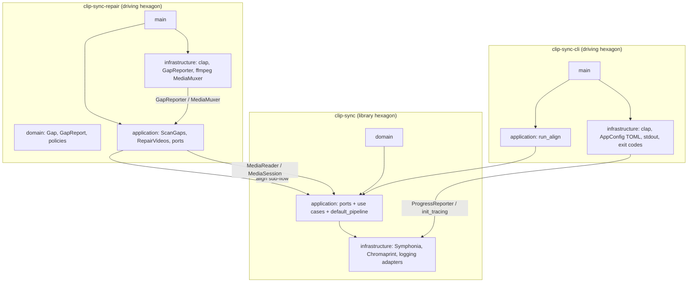

# Temporary plan: workspace refactor (core library + CLI + repair)

> **Status:** **Phases 1–4 complete (2026-06-08).** Archived migration plan. Phase 4 (report-only repair) shipped. **Phase 5 (write path) shipped** — [repair-write-path-plan.md](repair-write-path-plan.md) (R0–R5, 2026-06-09).  
> **Location:** Root `TEMP-*.md` for active work; move/archive when complete (see [BACKLOG.md](BACKLOG.md)).  
> **Architecture reference:** [PLAN.md](PLAN.md) describes the **target** workspace architecture; this file is the **migration** plan. Keep both in sync when decisions change.

**Problem:** `clip-sync` is a binary-only crate that mixes alignment engine, default adapters, and CLI in one tree. A future **repair** tool (align → scan gaps in video A → patch from aligned video B → write output) needs the same alignment pipeline without duplicating code or turning the analyzer into a file-mutating product.

**Goal:** Restructure into a **Cargo workspace** of three hexagonal crates:

1. **`clip-sync`** — library hexagon (domain + application + bundled default adapters).
2. **`clip-sync-cli`** — analyzer driving hexagon (thin application + CLI infrastructure); binary name **`clip-sync`**.
3. **`clip-sync-repair`** — repair driving hexagon (own domain/application + repair infrastructure); binary name **`clip-sync-repair`**.

No user-visible behaviour change for the analyzer until repair ships. Each phase must keep `cargo test` green.

---

## Decisions

Locked before implementation. Change only with an explicit plan revision.

| Topic | Decision |
|-------|----------|
| **Workspace vs single-crate `lib.rs`** | **Workspace** from the start. Avoids a second large move when `clip-sync-repair` lands. |
| **Library crate name** | **`clip-sync`** (Rust import: `clip_sync`). Binary crate **`clip-sync-cli`** installs binary **`clip-sync`**. Repair crate **`clip-sync-repair`** installs binary **`clip-sync-repair`**. |
| **Lib role** | **Alignment hexagon + bundled default adapters** — not a ports-only kernel. Symphonia/Chromaprint/logging adapters ship in the lib for shared use. |
| **Lib module visibility** | **`domain` / `application` / `infrastructure` are private** (`pub(crate)` or unexported). Public surface is a **facade** of `pub use` re-exports at `lib.rs` only. |
| **Default wiring** | **`application::default_pipeline::align_with_defaults(...)`** — optional composition helper. **`AlignVideos` + port traits** remain the primary API for tests and custom wiring. |
| **Analyzer scope** | `clip-sync-cli` remains **read-only** (report offset only). Writing patched files is **repair-only**. |
| **Repair ↔ analyzer coupling** | **Standalone executable.** Repair calls `align_with_defaults` (or `AlignVideos`) internally. **No** `--alignment-json` in v1. |
| **Config — align** | Lib **`AlignConfig`** `{ clip, alignment }`. Drives `AlignVideos`. |
| **Config — analyzer** | CLI **`AppConfig`** `{ align, output, logging }` in `clip-sync-cli`. `align` flattens via `#[serde(flatten)]`. **`OutputConfig`** is CLI-only. |
| **Config — logging** | **`LoggingConfig`** lives in lib **`infrastructure::logging`** (shared driving-adapter config). Used by both CLIs; **not** part of `AlignConfig`. |
| **Config — TOML loading** | Lib: **`load_align_config(path) -> AlignConfig`** only. CLI: **`load_app_config(path) -> AppConfig`**. Repair: **`load_repair_app_config(path) -> RepairAppConfig`**. Lib does **not** deserialize `AppConfig`. |
| **Config — repair** | Repair **`RepairConfig`** + **`RepairAppConfig { align, repair, logging }`** in repair crate only. |
| **Errors — align** | Lib **`AppError`** (+ port errors) unchanged. |
| **Errors — repair** | Repair **`RepairError`** in repair application; **`RepairError::Align(#[from] clip_sync::AppError)`** at boundary. Do not extend lib `AppError` with repair variants. |
| **Exit codes** | Analyzer: **`clip-sync-cli/infrastructure/cli/exit_code.rs`**. Repair: **`clip-sync-repair/infrastructure/cli/exit_code.rs`** (document in `error-mapping.md` Phase 4). |
| **CLI application layer** | **`run_align`** orchestration in `clip-sync-cli/src/application/` — not inline in `cli/mod.rs`. |
| **Repair hexagon** | Own **`domain/`**, **`application/`** (ports + use cases), **`infrastructure/`**. Lib is a **downstream dependency**, not the repair parent. |
| **Repair ports (Phase 4 define, Phase 5 impl)** | **`GapReporter`** (stdout human/JSON). **`MediaMuxer`** (ffmpeg subprocess in Phase 5). |
| **CLI-only code** | `infrastructure/cli/*` (args, output, exit_code, `run`) in **`clip-sync-cli`** only. |
| **ffmpeg in production** | **Repair only** (subprocess via `MediaMuxer` adapter). Lib and CLI do **not** require ffmpeg on PATH. |
| **Test helpers** | **`fakes`**, **`audio_fixtures`**, **`corpus_fixtures`** behind lib feature **`test-utils`**. **`ffmpeg_util`** in lib **`#[cfg(test)]`** (adapter tests + corpus generated tier). |
| **Corpus data** | **`tests/corpus/`** at **workspace root** — manifest, committed WAVs, fixture README only (not Rust tests). |
| **Corpus tests** | Stay in **lib** — they exercise `AlignVideos` + default adapters, not the CLI. **`corpus_root()`** = workspace `tests/corpus/` via shared path helper. Fix in **Phase 1**. |
| **CLI tests** | **`clip-sync-cli/tests/`** — driving-adapter only: TOML round-trip, stdout/JSON shape, exit codes; optional subprocess smoke. **No corpus harness in CLI.** |
| **Product docs** | Stay at workspace **`docs/`** + **`PLAN.md`** / **`BACKLOG.md`**. Update path references after moves; no per-crate README unless publishing. |
| **Features** | `he-aac` on lib; `ffmpeg-tests` on lib dev/integration tests only. |
| **Versioning / release** | Single workspace version for v1 (all crates `0.1.0`). Publish policy TBD. |
| **PLAN.md / BACKLOG** | [PLAN.md](PLAN.md) = target architecture (updated incrementally; complete by Phase 3). [BACKLOG.md](BACKLOG.md) — mark “Binary-only crate” done in Phase 2. |
| **Phase numbering** | **Migration phases** (this doc): 0–5 workspace extraction. Phase 4 = report-only repair (shipped). Phase 5 = write-path umbrella — **superseded** by [repair-write-path-plan.md](repair-write-path-plan.md) (R0–R5). |

---

## Hexagonal architecture

Three separate hexagons. Each binary **`main`** is a **composition root** for its crate only.



### Dependency rules

| Crate | May depend on | Must not depend on |
|-------|----------------|---------------------|
| **`clip-sync`** | domain ← application ← infrastructure (internal) | `clap`, ffmpeg, either CLI crate |
| **`clip-sync-cli`** | `clip_sync` **facade re-exports** + own application/infrastructure | `clip_sync::infrastructure::…` internals, repair crate |
| **`clip-sync-repair`** | `clip_sync` **facade re-exports** + own domain/app/infra | analyzer CLI crate, ffmpeg in lib |

### Anti-patterns (forbid in review)

- Repair copying or forking `align_videos.rs`.
- CLI or repair importing `clip_sync::infrastructure::symphonia::extract` (or any non-facade internal path).
- Lib deserializing **`AppConfig`** or owning **`OutputConfig`**.
- Repair use cases living in lib without an explicit shared-use-case decision.
- **`align_with_defaults`** as the *only* documented entry point — ports + `AlignVideos` must stay public.
- Putting repair-specific variants on lib **`AppError`**.

---

## Documents and tests

Split **data**, **harness code**, **test entry points**, and **documentation** deliberately. Cargo has no workspace-level `tests/` package — only member crates run `#[test]` functions.

### What the corpus actually validates

Today's corpus wires **`AlignVideos`** with **`SymphoniaMediaReader`** and Chromaprint adapters directly. It does **not** parse CLI flags or print stdout. Hexagonally that is a **library end-to-end integration test** (application use case + real infrastructure adapters), not an analyzer CLI acceptance test.

| If you need to validate… | Where it lives |
|--------------------------|----------------|
| `clip_windows`, PCM prep, merge policy | Lib **unit** tests (`domain/`, `application/`) with fakes |
| Symphonia decode, HE-AAC, seek | Lib **adapter** tests (`infrastructure/symphonia/`) |
| Manifest cases → offset tolerances | Lib **corpus** tests (`corpus_fixtures`) |
| `--format json`, exit codes, config TOML | **CLI** tests (`clip-sync-cli/tests/`) |
| Gap scan / mux | **Repair** tests (Phase 4+) |

**Recommendation:** keep corpus **in the library**, not in `clip-sync-cli`. Repair reuses the same align pipeline; lib corpus also guards repair's align sub-flow without duplicating cases.

### Asset layout (workspace root — do not move into a crate)

```text
tests/corpus/
  manifest.toml          # case ids, tiers, expected offsets
  README.md                # size budget, regenerate, run commands
  wav/                     # committed Tier-B binaries (~3.4 MB)

docs/
  corpus-matrix.md         # design matrix (↔ manifest)
  corpus-validation.md       # harness overview, CI commands, findings

scripts/
  generate_corpus.ps1        # regenerate tests/corpus/wav/
  generate_corpus.sh
```

**Why workspace root for fixtures:** shared by scripts, docs, and multiple crates; stable path for git size budget; not owned by one package's `CARGO_MANIFEST_DIR`.

**Do not** move `tests/corpus/` into `crates/clip-sync/tests/corpus/` — that ties binary fixtures to the lib crate path and breaks existing doc/script links.

### Harness code layout (lib)

```text
crates/clip-sync/src/application/testing/
  mod.rs                   # #[cfg(any(test, feature = "test-utils"))]
  fakes.rs                 # test-utils
  audio_fixtures.rs        # test-utils — chirp generators
  ffmpeg_util.rs           # #[cfg(test)] only — symphonia adapter tests + corpus generated tier
  corpus_fixtures.rs       # test-utils — manifest types, run_corpus_case, #[test] corpus_* fns

crates/clip-sync/src/testing_paths.rs   # optional: workspace_root(), corpus_root()
```

**`corpus_root()`** (single implementation, used everywhere):

```rust
pub fn workspace_root() -> PathBuf {
    PathBuf::from(env!("CARGO_MANIFEST_DIR")).join("../..")
}

pub fn corpus_root() -> PathBuf {
    workspace_root().join("tests").join("corpus")
}
```

Override for local/CI flexibility: env **`CLIP_SYNC_WORKSPACE_ROOT`** if set, else path above. External tier already uses **`CLIP_SYNC_CORPUS`**.

**`test-utils` feature:** exposes `fakes`, `audio_fixtures`, and optionally `corpus_fixtures` helpers for repair dev-dependencies. Corpus **`#[test]` functions** stay in lib (run via `cargo test -p clip-sync corpus_`).

**`ffmpeg_util`:** stays in lib **`#[cfg(test)]`**, not CLI — symphonia `media_reader_tests` and corpus generated tier both need it; keeps ffmpeg helpers next to the adapters they exercise.

### CLI test layout (driving adapter only)

```text
crates/clip-sync-cli/tests/
  config_roundtrip.rs      # AppConfig TOML deserialize / validate
  cli_output.rs            # human + JSON report shape (structural asserts)
  exit_codes.rs            # optional: map sample AppError → exit code
  cli_smoke.rs             # optional, #[ignore]: spawn clip-sync binary on fixture pair
```

CLI tests depend on **`clip-sync` with `test-utils`** only when they need synthetic WAV paths from `audio_fixtures` — not the full corpus harness.

### Repair test layout (Phase 4+)

```text
crates/clip-sync-repair/src/application/   # #[cfg(test)] mod tests with fakes
crates/clip-sync-repair/tests/             # optional integration: ScanGaps on synthetic dropout
```

Repair may add **`repair_corpus`** cases later under `tests/repair/` at workspace root if gap-fill fixtures grow; defer until Phase 5.

### Documentation map

Stable layout (see also [PLAN.md](PLAN.md) § Documentation):

| Location | Role |
|----------|------|
| `PLAN.md` | Target architecture |
| `TEMP-workspace-refactor-plan.md` | Migration only — archive after phases 1–3 |
| `docs/corpus-matrix.md` | Case design matrix |
| `docs/corpus-validation.md` | Harness overview + CI |
| `tests/corpus/README.md` | Fixture ops (regenerate, size budget) |
| `docs/archive/` | Historical — no path updates |
| `docs/TEMP-clip-self-repetition-plan.md` | Active feature plan → `docs/archive/clip-self-repetition-plan.md` when shipped |
| `docs/TEMP-offset-verification-plan.md` | Active feature plan → `docs/archive/offset-verification-plan.md` when shipped |

**Feature TEMP plans and the workspace refactor:** These stay at workspace **`docs/`** during implementation — they are **not** moved into `crates/clip-sync/` or any crate README. The refactor only changes **code path references** inside them (e.g. `src/application/` → `crates/clip-sync/src/application/`, CLI paths → `crates/clip-sync-cli/`). Update those when each feature lands, not during phases 1–3 unless you touch the files anyway.

### Documentation updates when code moves

| Document | Update when |
|----------|-------------|
| [docs/corpus-validation.md](docs/corpus-validation.md) | Phase 3 — commands → `cargo test -p clip-sync --features test-utils corpus_`; harness path → `crates/clip-sync/src/application/testing/corpus_fixtures.rs` |
| [tests/corpus/README.md](tests/corpus/README.md) | Phase 1 — generator path; `regenerate_committed_wav_fixtures` → `cargo test -p clip-sync …` |
| [docs/corpus-matrix.md](docs/corpus-matrix.md) | Only if case ids or tiers change |
| [PLAN.md](PLAN.md) | Phase 2 — workspace/module layout; Phase 3 — testing strategy + CI commands (if not already in PLAN) |
| [docs/error-mapping.md](docs/error-mapping.md) | Phase 4 — repair exit codes |
| Archived plans under `docs/archive/` | **No edits** — historical paths |

### CI commands (after refactor)

```powershell
cargo test -p clip-sync                              # unit + adapter + corpus committed/generated
cargo test -p clip-sync --features test-utils corpus_
cargo test -p clip-sync --features he-aac,test-utils corpus_   # + HE-AAC cases
cargo test -p clip-sync-cli                          # CLI adapter tests only
cargo test --workspace                               # all of the above
```

Default PR gate: **`cargo test -p clip-sync corpus_committed`** (or `corpus_` prefix) — no ffmpeg required.

### Rejected alternatives

| Option | Why not |
|--------|---------|
| Corpus harness in **lib only**, fixtures in **`crates/clip-sync/tests/corpus/`** | Breaks workspace scripts/docs; fixtures appear lib-owned |
| Corpus in **`clip-sync-cli`** | Mislabels layer — tests don't use CLI; repair wouldn't share harness |
| Rust tests at **workspace `tests/*.rs`** | No root `[package]` — Cargo won't run them |
| Separate **`clip-sync-integration-tests`** crate | Extra boilerplate for this repo size; revisit if CLI subprocess + corpus + repair E2E need one home |

---

## Target layout

```text
clip-sync/                              # workspace root
├── Cargo.toml                          # [workspace] members only
├── TEMP-workspace-refactor-plan.md
├── PLAN.md
├── BACKLOG.md
├── docs/                               # corpus-matrix, corpus-validation, error-mapping, …
├── scripts/                            # generate_corpus.ps1 / .sh
├── tests/
│   └── corpus/                         # DATA ONLY: manifest, README, wav/ (not Rust tests)
└── crates/
    ├── clip-sync/                      # LIBRARY HEXAGON
    │   ├── Cargo.toml
    │   └── src/
    │       ├── lib.rs                  # facade: pub use only; modules private
    │       ├── domain/
    │       ├── application/
    │       │   ├── align_videos.rs
    │       │   ├── config.rs           # AlignConfig, ClipConfig, AlignmentConfig
    │       │   ├── default_pipeline.rs # align_with_defaults
    │       │   ├── error.rs
    │       │   ├── high_rate_refinement.rs
    │       │   ├── offset_refinement.rs
    │       │   ├── ports.rs
    │       │   └── testing/            # fakes, audio_fixtures, corpus_fixtures (test-utils); ffmpeg_util (#[cfg(test)])
    │       ├── testing_paths.rs        # workspace_root(), corpus_root() — optional small module
    │       └── infrastructure/
    │           ├── chromaprint/
    │           ├── symphonia/
    │           ├── config/
    │           │   └── file.rs         # load_align_config only
    │           └── logging/            # LoggingConfig, init_tracing, StderrProgressReporter
    │
    ├── clip-sync-cli/                  # ANALYZER DRIVING HEXAGON
    │   ├── Cargo.toml
    │   ├── src/
    │   │   ├── main.rs                 # composition root → infrastructure/cli/run
    │   │   ├── application/
    │   │   │   ├── mod.rs
    │   │   │   └── run_align.rs        # AppConfig + paths → lib pipeline → AlignmentResult
    │   │   └── infrastructure/
    │   │       ├── cli/
    │   │       │   ├── mod.rs          # parse, load config, call run_align, print output
    │   │       │   ├── args.rs
    │   │       │   ├── output.rs
    │   │       │   └── exit_code.rs    # AppError → exit code
    │   │       └── config.rs           # AppConfig, OutputConfig, load_app_config
    │   └── tests/                      # driving-adapter tests only (no corpus)
    │       ├── config_roundtrip.rs
    │       └── cli_output.rs
    │
    └── clip-sync-repair/               # REPAIR DRIVING HEXAGON (Phase 4+)
        ├── Cargo.toml
        └── src/
            ├── main.rs                 # composition root
            ├── domain/
            │   ├── mod.rs
            │   ├── gap.rs              # Gap, GapReport
            │   └── policies.rs         # min gap, silence threshold (pure fns)
            ├── application/
            │   ├── mod.rs
            │   ├── ports.rs            # GapReporter, MediaMuxer
            │   ├── error.rs            # RepairError
            │   ├── scan_gaps.rs        # use case: align → scan → report
            │   ├── repair_videos.rs    # Phase 5: scan → fill → mux
            │   └── gap_fill.rs         # PCM splice (application + domain)
            └── infrastructure/
                ├── cli/
                │   ├── mod.rs
                │   ├── args.rs
                │   ├── output.rs       # impl GapReporter
                │   └── exit_code.rs    # RepairError → exit code
                ├── config.rs           # RepairAppConfig, RepairConfig, load_repair_app_config
                └── ffmpeg_mux.rs       # impl MediaMuxer (Phase 5)
```

---

## Library public API (facade)

`crates/clip-sync/src/lib.rs` — **no** `pub mod domain/application/infrastructure`:

```rust
mod domain;
mod application;
mod infrastructure;

// --- application ---
pub use application::config::{AlignConfig, AlignmentConfig, ClipConfig, ChromaprintPreset};
pub use application::{
    default_pipeline::align_with_defaults,
    AlignVideos, AlignVideosRequest, AlignVideosResponse,
    AppError, ConfigError,
};
pub use application::ports::{Aligner, Fingerprinter, MediaReader, MediaSession, ProgressReporter};

// --- domain (selected types) ---
pub use domain::{
    AlignmentResult, AudioTrack, ClipMatch, ClipMatchEstimate, ClipWindow, ClipLabel,
    DomainError, Fingerprint, MediaSource, MonoPcmClip,
};
pub use domain::pcm_preparation::{/* silence / peak helpers used by repair — see allow-list */};

// --- application helpers exposed for repair ---
pub use application::offset_refinement::{aligned_slice_starts, /* boundary correlation fns */};

// --- default adapter types (for custom composition roots) ---
pub use infrastructure::chromaprint::{ChromaprintAligner, ChromaprintFingerprinter};
pub use infrastructure::symphonia::SymphoniaMediaReader;
pub use infrastructure::config::file::load_align_config;
pub use infrastructure::logging::{init_tracing, LoggingConfig, LogLevel, ProgressMode, StderrProgressReporter};
```

`application/default_pipeline.rs`:

```rust
/// Default adapter wiring — same as clip-sync CLI composition root.
pub fn align_with_defaults(
    request: AlignVideosRequest,
    progress: &dyn ProgressReporter,
) -> Result<AlignVideosResponse, AppError> {
    let preset = request.config.clip.chromaprint_preset;
    let media_reader = SymphoniaMediaReader;
    let fingerprinter = ChromaprintFingerprinter::new(preset);
    let aligner = ChromaprintAligner::new(preset);
    let use_case = AlignVideos::new(&media_reader, &fingerprinter, &aligner, progress);
    use_case.execute(request)
}
```

**Stability rule:** `clip-sync-cli` and `clip-sync-repair` depend only on **`clip_sync::` facade re-exports** — never internal module paths.

### Repair facade allow-list

| Repair need | Lib export | Layer |
|-------------|------------|-------|
| Alignment | `align_with_defaults`, `AlignVideos`, `AlignConfig` | application |
| PCM extract | `MediaReader`, `MediaSession`, `SymphoniaMediaReader` | ports + adapter type |
| Silence / prep | `domain::pcm_preparation` re-exports | domain |
| Boundary correlation | `application::offset_refinement` re-exports | application |
| Slice alignment | `aligned_slice_starts` | application |
| Whole-timeline chunked extract | **New** `application::timeline_scan` helper (Phase 4) using `MediaSession` port internally — repair must not call symphonia extract | application |

Add `timeline_scan` in lib Phase 4 if gap scan cannot be built from repeated `extract_mono` calls alone.

---

## Config model

### Ownership

| Type | Layer | Crate |
|------|-------|-------|
| `ClipConfig`, `AlignmentConfig`, `AlignConfig` | Application (drives `AlignVideos`) | **lib** |
| `OutputConfig`, `OutputFormat` | Driving adapter | **clip-sync-cli** |
| `LoggingConfig`, `LogLevel`, `ProgressMode` | Shared driving adapter config | **lib** `infrastructure::logging` |
| `AppConfig` | Driving adapter | **clip-sync-cli** |
| `RepairConfig`, `RepairAppConfig` | Application + driving adapter | **clip-sync-repair** |

### Library: `AlignConfig`

```rust
#[derive(Debug, Clone, Default, PartialEq, Serialize, Deserialize)]
pub struct AlignConfig {
    #[serde(default)]
    pub clip: ClipConfig,
    #[serde(default)]
    pub alignment: AlignmentConfig,
}

impl AlignConfig {
    pub fn validate(&self) -> Result<(), ConfigError> { /* clip.validate() */ }
}
```

`AlignVideosRequest.config` is **`AlignConfig`** (not `AppConfig`).

Lib loader:

```rust
// infrastructure/config/file.rs
pub fn load_align_config(path: Option<&Path>) -> Result<AlignConfig, AppError>
```

Deserializes `[clip]` + `[alignment]` from a TOML file; ignores unknown top-level sections.

### CLI: `AppConfig`

```rust
// clip-sync-cli/src/infrastructure/config.rs
#[derive(Debug, Clone, Default, PartialEq, Serialize, Deserialize)]
pub struct AppConfig {
    #[serde(flatten)]
    pub align: clip_sync::AlignConfig,
    #[serde(default)]
    pub output: OutputConfig,
    #[serde(default)]
    pub logging: clip_sync::LoggingConfig,
}

pub fn load_app_config(path: Option<&Path>) -> Result<AppConfig, clip_sync::AppError>
```

TOML on disk **unchanged** — top-level `[clip]`, `[alignment]`, `[output]`, `[logging]` still deserialize into `AppConfig`.

**Phase 2 test:** round-trip deserialize from an existing example config file.

### Repair: `RepairAppConfig`

```toml
[clip]
# … same as analyzer …

[alignment]
# … same as analyzer …

[logging]
# … same as analyzer …

[repair]
min_gap_ms = 100
silence_peak_fraction = 0.01
min_fill_correlation = 0.35
crossfade_ms = 10
dry_run = true                      # default true until mux phase

[repair.output]
path = "repaired.mp4"               # required when dry_run = false
video_codec = "copy"
audio_codec = "aac"
```

v1 may accept CLI flags only; TOML loader optional in Phase 4.

---

## Error model

```text
lib:     library/OS → port error → AppError
cli:     AppError → exit_code.rs → stderr (existing table in error-mapping.md)
repair:  library/OS → RepairError (Align wraps AppError; Mux, Config, … local)
         RepairError → repair exit_code.rs → stderr
```

Repair **`ScanGaps`** returns `Result<GapReport, RepairError>`. Low-confidence alignment is **not** an error (same as analyzer).

---

## Repair application (sketch)

### Ports (`application/ports.rs`)

```rust
pub trait GapReporter {
    fn report(&self, report: &GapReport) -> Result<(), RepairError>;
}

pub trait MediaMuxer {
    fn mux_video_with_replaced_audio(
        &self,
        source_video: &Path,
        replacement_audio_wav: &Path,
        output: &Path,
        options: &MuxOptions,
    ) -> Result<(), MuxError>;
}
```

Phase 4: define traits + CLI `GapReporter` impl. Phase 5: `FfmpegMediaMuxer` impl.

### Use case: `ScanGaps`

```text
1. align_with_defaults(AlignVideosRequest { …, config: align }) → AlignmentResult
2. MediaReader.open(A), MediaReader.open(B) — lib ports
3. Chunked extract on A via MediaSession::extract_mono (or timeline_scan helper)
4. repair domain: detect silent runs (policies.rs)
5. Map B timeline via recommended_offset_secs; lib helpers for boundary correlation
6. Build GapReport; GapReporter.report (no direct println in use case)
```

### Use case: `RepairVideos` (Phase 5)

```text
ScanGaps → gap_fill (application) → write temp WAV → MediaMuxer.mux → output path
```

---

## Phases

### Phase 0 — Spike (optional, ≤ half day)

**Goal:** Validate workspace layout without moving all files.

- Add root `[workspace]` with one member under `crates/clip-sync`.
- Confirm `cargo test -p clip-sync` and a temporary binary still run.
- **Exit:** Go/no-go on workspace; no repair work.

### Phase 1 — Workspace + library hexagon (no behaviour change)

**Goal:** All engine code in `crates/clip-sync`; private modules + facade `lib.rs`.

| Step | Action |
|------|--------|
| 1.1 | Root `[workspace]` + `crates/clip-sync/Cargo.toml`; move deps (except `clap`). |
| 1.2 | `git mv src/{domain,application,infrastructure}` → `crates/clip-sync/src/` **except** `infrastructure/cli`. |
| 1.3 | Add private modules + facade `lib.rs` (no `pub mod infrastructure`). |
| 1.4 | Split `config.rs`: keep `AlignConfig` / clip / alignment in lib; **move `OutputConfig` out** (stub until Phase 2 — tests may still use full config temporarily). |
| 1.5 | Add `application/default_pipeline.rs` with `align_with_defaults` (extract wiring from today's `cli/mod.rs`). |
| 1.6 | Replace `load_optional_config_file(AppConfig)` with **`load_align_config`**; move full-file loader to Phase 2 CLI. |
| 1.7 | Add **`testing_paths`** (or equivalent): **`corpus_root()`** → workspace `tests/corpus/`; optional **`CLIP_SYNC_WORKSPACE_ROOT`** override. |
| 1.8 | Jump to Phase 2 in same PR if practical; else temporary root binary calling `clip_sync::…`. |
| 1.9 | `cargo test -p clip-sync`, `cargo clippy -p clip-sync`. |

**Deliverable:** Lib hexagon builds; unit tests green; no `clap` in lib deps.

### Phase 2 — Extract `clip-sync-cli` driving hexagon

**Goal:** Binary name `clip-sync`; zero functional diff vs pre-refactor.

| Step | Action |
|------|--------|
| 2.1 | Create `crates/clip-sync-cli` with `clap`, `toml`, `serde`; `[[bin]] name = "clip-sync"`. |
| 2.2 | Move `infrastructure/cli/*` → `infrastructure/cli/`; add `infrastructure/config.rs` with `AppConfig`, `OutputConfig`, `load_app_config`. |
| 2.3 | Add `application/run_align.rs`: wires lib pipeline from `AppConfig` + paths. |
| 2.4 | `infrastructure/cli/mod.rs`: parse args → load config → `init_tracing` → `run_align` → `output::print_success`; **`AppError` → `exit_code.rs`**. |
| 2.5 | `main.rs` = composition root only (`cli::run()`). |
| 2.6 | **`AlignVideosRequest` uses `AlignConfig`**; update lib + all tests. |
| 2.7 | Round-trip TOML test for `AppConfig` in CLI crate. |
| 2.8 | Remove root `src/` and root `[package]`. |
| 2.9 | Update [PLAN.md](PLAN.md) (three-crate hex diagram + module paths); [BACKLOG.md](BACKLOG.md) “Binary-only crate” → Done. |

**Deliverable:** `cargo run -p clip-sync-cli -- …` matches previous output. **`cargo test -p clip-sync corpus_`** still green (path fix from 1.7).

### Phase 3 — `test-utils` feature + CLI adapter tests + doc refresh

**Goal:** Gate shared test helpers; add CLI-only tests; update docs — **corpus stays in lib**.

| Step | Action |
|------|--------|
| 3.1 | Lib feature **`test-utils`**: export `fakes`, `audio_fixtures`, `corpus_fixtures` module; gate with `#[cfg(any(test, feature = "test-utils"))]`. |
| 3.2 | Keep **`corpus_fixtures`** and all **`corpus_*`** `#[test]` fns in lib; wire **`AlignConfig`** (not `AppConfig`) in `build_config`. |
| 3.3 | Keep **`ffmpeg_util`** in lib `#[cfg(test)]`; fix **`media_reader_tests`** to use it — no CLI imports. |
| 3.4 | Add **`clip-sync-cli/tests/`**: `config_roundtrip.rs`, `cli_output.rs` (and optional `exit_codes.rs`). |
| 3.5 | Update [docs/corpus-validation.md](docs/corpus-validation.md) and [tests/corpus/README.md](tests/corpus/README.md) — paths and `cargo test -p clip-sync …` commands. |
| 3.6 | Update [PLAN.md](PLAN.md) testing strategy table (corpus = lib E2E; CLI tests = driving adapter). |

**Deliverable:** `cargo test --workspace` green; corpus Tier A + B identical pass/fail vs pre-refactor; CLI adapter tests pass.

### Phase 4 — Scaffold `clip-sync-repair` (report-only)

**Goal:** Second driving hexagon; **no file writes**.

| Step | Action |
|------|--------|
| 4.1 | Add `crates/clip-sync-repair` with layer layout above; clap skeleton. |
| 4.2 | `RepairError`, `GapReporter` port, CLI output impl. |
| 4.3 | `ScanGaps` use case: `align_with_defaults` + chunked scan via lib ports. |
| 4.4 | Add lib **`timeline_scan`** helper if needed (Phase 4 lib PR or same PR). |
| 4.5 | Re-export allow-list helpers only; no symphonia internal imports. |
| 4.6 | `GapReporter` JSON + human output; exit **0** when analysis completes. |
| 4.7 | Unit tests: synthetic PCM dropout + aligned chirp pair (repair application + lib test-utils). |
| 4.8 | Document repair exit codes in [docs/error-mapping.md](docs/error-mapping.md). |
| 4.9 | Define **`MediaMuxer`** port (stub ok); no ffmpeg yet. |

**Deliverable:** `clip-sync-repair A B` prints gap report; inputs unchanged.

### Phase 5 — Repair write path (optional, separate PR)

> **Superseded:** Implement per [repair-write-path-plan.md](repair-write-path-plan.md) (R0–R5). The steps below are the original migration stub; kept for history only.

**Goal:** Patched output when user opts in.

| Step | Action |
|------|--------|
| 5.1 | `gap_fill`: splice B PCM into A with crossfade (application + domain). |
| 5.2 | `FfmpegMediaMuxer`: temp WAV + `ffmpeg -i A -i wav -map 0:v -map 1:a -c:v copy -c:a aac out`. |
| 5.3 | `RepairVideos` use case orchestrates scan → fill → mux via ports. |
| 5.4 | `--output PATH` + `--no-dry-run`; clear error when ffmpeg missing. |
| 5.5 | Integration test with ffmpeg (`#[ignore]` by default). |

**Deliverable:** End-to-end repair on chirp fixture with intentional dropout in A.

---

## `clip-sync-repair` behaviour summary

| Mode | Command | Depends on |
|------|---------|------------|
| Gap report (v1) | `clip-sync-repair A B` | lib align + scan use case |
| Patched file (v2) | `clip-sync-repair A B -o out.mp4 --no-dry-run` | + `MediaMuxer` / ffmpeg |

**Alignment:** in-process via lib — `offset_secs` = seconds to add to A to match B (same as analyzer).

**Not in v1 repair:** batch >2 files, video frame sync, splice review UI, `--alignment-json`.

---

## Cargo.toml sketches

### Root `Cargo.toml`

```toml
[workspace]
members = [
    "crates/clip-sync",
    "crates/clip-sync-cli",
    # "crates/clip-sync-repair",  # Phase 4
]
resolver = "2"
```

### `crates/clip-sync/Cargo.toml`

```toml
[package]
name = "clip-sync"
version = "0.1.0"
edition = "2021"
description = "Align two videos by comparing audio fingerprints (library)"
license = "Non-commercial"

[features]
default = []
he-aac = ["dep:fdk-aac", "dep:symphonia-core"]
test-utils = []

[dependencies]
# all current deps except clap
```

### `crates/clip-sync-cli/Cargo.toml`

```toml
[package]
name = "clip-sync-cli"
version = "0.1.0"
edition = "2021"

[[bin]]
name = "clip-sync"
path = "src/main.rs"

[dependencies]
clip-sync = { path = "../clip-sync" }
clap = { version = "4", features = ["derive"] }
serde = { version = "1", features = ["derive"] }
toml = "0.8"

[dev-dependencies]
clip-sync = { path = "../clip-sync", features = ["test-utils", "he-aac"] }
hound = "3"
tempfile = "3"
```

### `crates/clip-sync-repair/Cargo.toml` (Phase 4)

```toml
[package]
name = "clip-sync-repair"
version = "0.1.0"
edition = "2021"

[[bin]]
name = "clip-sync-repair"
path = "src/main.rs"

[dependencies]
clip-sync = { path = "../clip-sync" }
clap = { version = "4", features = ["derive"] }
serde = { version = "1", features = ["derive"] }
serde_json = "1"
toml = "0.8"
thiserror = "1"
tracing = "0.1"
tracing-subscriber = { version = "0.3", features = ["env-filter"] }

[dev-dependencies]
clip-sync = { path = "../clip-sync", features = ["test-utils"] }
```

---

## Tests

| Phase | Required checks |
|-------|-----------------|
| 1 | All lib tests pass; **`corpus_root`** points at workspace `tests/corpus/`. |
| 2 | CLI round-trip TOML; human/JSON output unchanged; **`cargo test -p clip-sync corpus_`** still green. |
| 3 | **`test-utils`** feature; CLI adapter tests; docs updated; corpus unchanged in lib. |
| 4 | Repair `ScanGaps` unit tests (synthetic dropout); `GapReporter` fakes. |
| 5 | Repair ffmpeg integration (`#[ignore]` without ffmpeg). |

**Regression bar:** Phase 3 completion requires corpus Tier A + B identical pass/fail vs pre-refactor (offsets within existing tolerances).

| Test type | Location |
|-----------|----------|
| Domain / use case (lib) | `crates/clip-sync` — fakes for ports |
| Adapter (lib) | symphonia/chromaprint module tests; `ffmpeg_util` in `#[cfg(test)]` |
| **Corpus (align E2E)** | **`crates/clip-sync`** — `application/testing/corpus_fixtures.rs`; data in **`tests/corpus/`** |
| CLI driving adapter | `clip-sync-cli/tests/` — config, output, exit codes |
| Repair use case | `clip-sync-repair` application tests + fakes for ports |
| Repair ffmpeg | `clip-sync-repair` infrastructure, `#[ignore]` |

---

## Risks and mitigations

| Risk | Mitigation |
|------|------------|
| Large mechanical diff | Single PR per phase; no logic changes Phase 1–2 except wiring extraction. |
| `AppConfig` / TOML breakage | CLI round-trip test; `#[serde(flatten)]` on `align`. |
| Duplicate align logic | Repair must call `align_with_defaults` / `AlignVideos`; code review + anti-pattern list. |
| `corpus_root` break on move | Fix in Phase 1.7; verify before Phase 2 merge. |
| Facade drift | Allow-list table; grep CI for `clip_sync::infrastructure::` in CLI/repair crates. |
| Memory pressure on gap scan | Chunked scan (60 s windows + overlap); document in `--help`. |
| Scope creep | No `ffmpeg` in `clip-sync-cli` deps; no file writes in analyzer. |

---

## Documentation updates (checklist)

- [ ] [PLAN.md](PLAN.md) — keep aligned with this plan (workspace layout, testing, config ownership); see Phase 2.9 / 3.6.
- [ ] [BACKLOG.md](BACKLOG.md) — “Binary-only crate” done (Phase 2); link this plan; repair section.
- [ ] [docs/corpus-validation.md](docs/corpus-validation.md) + [tests/corpus/README.md](tests/corpus/README.md) — lib harness path, `cargo test -p clip-sync corpus_` (Phase 3.5).
- [ ] [docs/error-mapping.md](docs/error-mapping.md) — repair exit codes (Phase 4).
- [ ] Archive to `docs/archive/workspace-refactor-plan.md` when Phases **1–3** complete (note repair 4–5 in archive header if still open).

---

## Completion verification

| Phase | Criterion |
|-------|-----------|
| **1** | `cargo test -p clip-sync` green; private modules + facade; no `clap`; `align_with_defaults` exists. |
| **2** | `cargo run -p clip-sync-cli -- A B` equivalent to pre-refactor; `run_align` + `load_app_config` in CLI. |
| **3** | Corpus in lib; CLI adapter tests added; `test-utils` documented; docs paths updated. |
| **4** | `clip-sync-repair A B` gap report; `RepairError` + `GapReporter`; `MediaMuxer` port defined. |
| **5** | Patched output — see [repair-write-path-plan.md](repair-write-path-plan.md) (WAV R4; ffmpeg mux R5). |

**Archive trigger:** Phases **1–4** → archived as “core extraction + report-only repair done”; write path tracked in [repair-write-path-plan.md](repair-write-path-plan.md) and [BACKLOG.md](../../BACKLOG.md).

---

## Recommended PR sequence

1. **PR A:** Phase 1 + 2 (workspace, lib hexagon, CLI hexagon) — highest priority.
2. **PR B:** Phase 3 (test-utils, CLI adapter tests, doc refresh — corpus stays in lib).
3. **PR C:** Phase 4 (repair hexagon, report-only) + lib `timeline_scan` if needed.
4. **PR D:** Repair write path — optional; follow [repair-write-path-plan.md](repair-write-path-plan.md) R0–R5 (not the Phase 5 stub below).

Do **not** combine PR A with repair logic.
