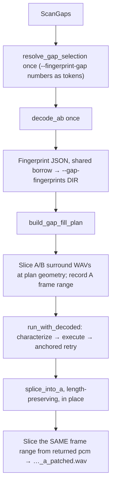

# TEMP — Gap listen WAVs (one-decode reassembly)

**Status:** draft plan, 2026-08-02; single-decode design **code-verified** against the repair crate
(see § 2.1 — assumptions, file:line, and what breaks if each flips). Working plan for calibration `--gap-listen [DIR]`
alongside `--gap-fingerprints DIR`: select gap(s) → write fingerprint JSON → export A/B
surround WAVs → **production** patch → export patched-region WAV — all from the same decode.

Companion: [gap-fingerprint.md](gap-fingerprint.md), [BACKLOG.md](../../BACKLOG.md) § *Equivalence
margin band* (“listen before believing”), seam/patch docs under `docs/`.

**Media hygiene:** WAVs of real media stay gitignored (`gap-files/` / temp). Fingerprint JSON stays
sample-free. No titles/paths in committed artifacts.

---

## 1. What “production patch drives the fix” means

There are **two different “would this patch?” engines** in the repair crate. They share decode and
frame math, but they are **not interchangeable** for applying a fill.

| Path | Entry | What it decides | Does it splice audio? |
|------|--------|-----------------|------------------------|
| **Production patch** | `PatchAudio::execute` / `preview` → `characterize_region` → `execute_region_spec` → `splice_into_a` | The **live seam gate** the tool uses when you pass `--wav` / `--mux`: dual-fit, residual gate, bracket search as wired in production | **Yes** (on write); preview stops before splice |
| **Fingerprint / oracle** | `--gap-fingerprints` → `characterize_gaps_from_decode` → `compute_region_measurements` (uses `oracle_*` helpers) | A **diagnostic** exhaustive characterization (`any_ok`, per-bracket `failure_stage`, lag axes, equivalence blocks). Explicitly **not** the production gate | **No** — JSON numbers only |

**“Production patch drives the fix”** means:

- The audio you hear in the **patched** WAV must come from the **same code path** that `--wav`
  uses to decide patch vs skip and to assemble the fill (`characterize_region` /
  `execute_region_spec` / `splice_into_a`).
- Fingerprint JSON still comes from `--gap-fingerprints` (same decode, **pre-splice** PCM). It must
  **not** choose the fill or perform the splice. Do not wire `oracle_score_fit_candidate` /
  fingerprint `outcome` into `splice_into_a`.

Why this matters: fingerprint `any_ok` and production skip/patch can disagree (by design — different
routing, short-circuits, and semantics). Listening to an oracle “would-be” fill would answer the
wrong question for the band experiment and for trust in real repairs.

```text
  decode_ab (once)
       │
       ├─► fingerprint JSON                 (--gap-fingerprints DIR; pre-splice)
       │
       ├─► slice A/B surround WAVs          (--gap-listen [WAV_DIR]; export only)
       │
       └─► PRODUCTION: characterize_region  ──► execute_region_spec ──► splice_into_a
                 ▲                                      │
                 │                                      └─► slice patched A surround WAV
                 └── this gate owns patch vs skip
                     (patched WAV omitted on skip)
```

---

## 2. Verdict on modularity

**Yes — modular enough to reassemble without a rewrite.** Production patch is already
decode → plan → characterize → execute → splice → write. Fingerprint dump is a parallel consumer of
`decode_ab`, not a second repair engine.

You do **not** need to break fingerprinting apart and rebuild repair inside it. When `--gap-listen`
is set (with `--gap-fingerprints`), add a **composition** that owns one decode and fans out to
fingerprint JSON / WAV export / production patch.

### 2.1 Verified against code (2026-08-02)

The single-decode design rests on these. Each was checked; if one flips, the cited step in §6 breaks.

| Assumption | Verified at | Consequence if it flips |
|------------|-------------|--------------------------|
| `GapCorpus` is fully owned — no lifetime parameter | `gap_fingerprint/schema.rs:254` | **Load-bearing.** If the corpus borrowed `DecodedAb`, fingerprint-then-patch on one decode would need a full clone of A (gigabytes) and the whole design would be dead. |
| `splice_into_a` is **length-preserving**, in place | `patch_audio/region.rs:2287–2335` — bails when the fill is shorter than the gap, otherwise crossfades in place | Post-splice frame indices would shift and the pre/patched WAV pair would stop being sample-aligned (§6 step 7). |
| `self.media_reader` is used exactly once in `PatchAudio::run` — the decode | `patch_audio/mod.rs:156` | The `run_with_decoded` split point (§6 step 6) would not be clean. |
| `decode_ab` resamples B's **rate** but never remixes its **channels** | `patch_audio/decode.rs:131–146` (`resample_interleaved(.., b_pcm_full.channels, ..)`) | See the B-layout rule in §5 — this one is a live trap, not a hypothetical. |
| Equivalence `drop` happens at **plan** time, not scan time | `domain/gap_fill.rs:533`, `domain/gap.rs:186` | Gap numbering is stable whether or not `skip_equivalent_gaps` is on, so band tokens from a gated dump stay valid under `--no-skip-equivalent-gaps` (§9). |
| `validate_pcm_for_wav` only checks layout + a 4 GiB classic-WAV ceiling | `infrastructure/pcm.rs:31–46` | Windowed exports sit far under it. That same ceiling is why full-length surround needs `--mux` — and why windowed export is the right shape here. |

---

## 3. What is already componentized

| Seam | Where | Reuse |
|------|-------|-------|
| Full decode | `patch_audio/decode.rs` `decode_ab` | Shared by `--wav` and `--gap-fingerprints` today (**separately** — two calls if both flags set) |
| Gap selection for patch | `domain/gap_fill.rs` `build_gap_fill_plan` + `--only-gaps` (on a listen run, `--fingerprint-gap` converted to the same tokens) | Real patch restriction |
| Decision vs fill | `patch_audio/region.rs` `characterize_region` → `GapRepairSpec` → `execute_region_spec` → `RegionPatch` | Production gate + fill PCM |
| Splice | `splice_into_a` | Mutates full A in place |
| WAV I/O | `infrastructure/wav_writer.rs` `WavPatchedAudioWriter` (hound) | No new crate |
| Fingerprint from PCM | `gap_fingerprint/measure.rs` `characterize_gaps_from_decode` | Diagnostic numbers only |

Per-gap windows **already exist in memory** during characterize/execute:

- **A:** refined throat + `gap_signature_context_secs` (default 3 s)
- **B:** `BExtractWindow` / haystack pad (`pad_lead` / `pad_tail` — same idea in fingerprint measure)
- **Fill:** `RegionPatch.b_samples` after a successful execute

They are just never packaged as `MultiChannelPcm` for export.

**But they are not reachable from a composition, and not available when you need them.** The
refined-edge geometry only exists *after* `characterize_region` produces a spec, and
`characterize_region` / `execute_region_spec` / `splice_into_a` are `pub(super)` inside
`patch_audio` (`region.rs:1404`, `:1259`, `:2287`). Worse, the anchored-retry pass
(`patch_audio/mod.rs:295–331`) can **replace** a patch after pass 2, so a spec captured early may be
superseded before the splice.

So v1 does **not** use refined geometry. It uses **plan** geometry, which is public and available
before the decode is handed over:

- `build_gap_fill_plan` is `pub` (`domain/gap_fill.rs:466`)
- `FillRegion.a_start_secs` / `a_end_secs` / `b_start_secs` / `b_end_secs` are public fields
  (`domain/gap_fill.rs:424–436`)

Two things move an edge past its plan bounds, not one *(corrected 2026-08-02, at implement time —
the original text counted only the first)*:

| Mover | Bound | Default |
|-------|-------|---------|
| Edge refinement | `GAP_EDGE_REFINE_SECS` (`patch_audio/mod.rs:50`) | 0.75 s |
| Seam-fail extension retry | `gap_end_extend_max_ms` / `gap_start_extend_max_ms` (`config.rs:241`) | 0.5 s, and `gap_{end,start}_extend_on_*_seam_fail` both default `true` (`config.rs:234–238`) |

So an edge can move up to **~1.25 s**, and the export pads ±3 s of context — a plan-geometry window
still **always** contains the final throat, with **≥1.75 s** of real context per side (not the
≥2.25 s this section originally claimed). The conclusion is unchanged: the window difference is
smaller than the padding, which is why chasing refined edges is not worth a callback into the
production engine (see §6 step 5 and §8). Revisit if either bound is raised past ~2 s, or if the
±3 s context default is lowered.

---

## 4. What is *not* the right glue

- **`--fingerprint-gap` did not patch — as shipped, on a listen run, it does.** *(Revised
  2026-08-02; the original plan routed selection through `--only-gaps`.)* On a plain
  `--gap-fingerprints` run it still only filters the dump. But `--gap-listen` **is a mode of the
  dump** — it errors without `--gap-fingerprints`, and the WAV stems *are* the corpus entry stems
  (`entry_stem`) — so taking a second selector from the patch side was the wrong seam. Listen now
  converts the `--fingerprint-gap` numbers into `--only-gaps` tokens (both 1-based) and resolves
  them with the same `resolve_gap_selection`, so the same set bounds the corpus *and*
  `build_gap_fill_plan`. Without that bound the production patch would characterize every gap in
  the pair — gate search is ~93% of wall clock, so "listen to three gaps" would cost a full repair.
  `--only-gaps` / `--skip-gaps` are rejected on a listen run, pre-scan.

  Cost of the switch: `--fingerprint-gap` is `Vec<usize>`, so the listen selector loses the range
  and timestamp grammar `--only-gaps` has. The band experiment is unaffected — `only_gaps_tokens`
  emits bare 1-based numbers — and the flag gained `value_delimiter = ','` so that output pastes in
  directly as `--fingerprint-gap 1,3,12`.

  It *is* a real filter, which is why `--gap-listen` requiring `--gap-fingerprints` costs nothing
  extra: `characterize_gaps` keeps only the selected gaps (`measure.rs:2766–2771`,
  `take_all = select.is_empty()`), and the expensive per-gap rebuild loop
  (`measure.rs:2348`) iterates the already-filtered `corpus.gaps`. A listen run over 5 gaps
  characterizes 5 gaps, not the movie.

  The three axes are independent, and **not** what `composition.rs:114–116` currently claims
  ("gaps named via `--fingerprint-gap` get full detail; the rest summary" — wrong on both halves):

  | Axis | Flag | Effect |
  |------|------|--------|
  | Which gaps | `--fingerprint-gap` | Filters the corpus. Empty ⇒ all gaps. |
  | Detail tier | *(none)* | Every gap that reaches the rebuild becomes `Full`; only gaps that bail early (no `mapped_b_span`, `measure.rs:2353`) stay `Summary` |
  | Extra fields | `--fingerprint-diagnostics` | `seam_probe`, `b_levels`, second-peak (`measure.rs:2062`, `:2097`) |

  Fix that doc comment while implementing — it is the same misleading-diagnostics class as the stale
  "re-fingerprint" warning in `report.rs`.
- **Fingerprint `any_ok` / oracle ≠ production gate.** Do not splice from fingerprint verdicts.
  Docs already warn `--repair-preview` ≠ fingerprint `any_ok`.
- **`--wav` + `--gap-fingerprints` today** = repair decode/patch/write, then a **second** decode for
  fingerprints. Not a shared pipeline; still no gap-surround clips.
- **`--gap-listen` does not own the JSON corpus path.** That remains `--gap-fingerprints DIR`.

---

## 5. Output contract (locked)

**Flags (split responsibility):**

| Flag | Owns | Notes |
|------|------|-------|
| `--gap-fingerprints DIR` | Fingerprint JSON corpus (`corpus.json`, per-gap JSON, `manifest.json`) | Existing; required when `--gap-listen` is present |
| `--gap-listen [DIR]` | Gap surround / patched WAVs only | Optional value (clap `num_args = 0..=1`). Requires `--gap-fingerprints`. |

**WAV directory resolution:**

| Invocation | WAV root |
|------------|----------|
| `--gap-fingerprints JSON_DIR --gap-listen WAV_DIR` | `WAV_DIR` |
| `--gap-fingerprints JSON_DIR --gap-listen` (no value) | `JSON_DIR` (same as fingerprint corpus). Emit an output/progress note when defaulting (e.g. `gap-listen: writing WAVs to <JSON_DIR>`). |
| `--gap-listen` without `--gap-fingerprints` | **Error** (same pattern as `--fingerprint-gap` requires `--gap-fingerprints`) |

For each selected gap, one listen run writes:

| Artifact | Where | When | Notes |
|----------|-------|------|-------|
| Fingerprint JSON (per-gap library file + roll-up `corpus.json` / `manifest.json`) | `--gap-fingerprints DIR` | **Always** for the selected set | Existing dump shape; measured on **pre-splice** PCM |
| `…_a_surround.wav` | WAV root | **Always** | A gap + context (default ±`gap_signature_context_secs`) |
| `…_b_surround.wav` | WAV root | **Always** when B maps | B mapped span + haystack pad; omit only if unfillable / no B map (log why) |
| `…_a_patched.wav` | WAV root | **When production patches** | Same A window after `splice_into_a`. On production **skip**: do **not** invent a fill — omit this file (A/B surrounds + JSON still written; skip visible in log + fingerprint `outcome`) |

So the common case is **JSON corpus + three WAVs per gap (A, B, patched)**. Skip gaps are two WAVs + JSON.
When WAV root equals JSON dir, WAVs sit beside the per-gap JSON (or in a `wav/` subdir — §10).

> **A listen run's corpus is a partial corpus.** Because the selector filters the dump (§4), the
> `corpus.json` a `--gap-listen` run writes covers **only the listened gaps**. That is the point —
> it keeps the run cheap — but it means a listen corpus is not the corpus of record for band
> analysis. Write it somewhere that won't be mistaken for a full-pair dump, or keep the roll-up
> tooling pointed at the full-run corpus.

> **The WAV directory holds licensed audio; the JSON does not.** Every `…_surround.wav` /
> `…_patched.wav` is decoded source material, so a listen WAV root is in the same class as
> `gap-files/`: **gitignored, ephemeral, never committed, never quoted in the repo or in memory.**
> The fingerprint JSON is sample-free and stays the durable artifact. Two practical consequences:
>
> - Point `--gap-listen` at a path already covered by `.gitignore`. Defaulting the WAV root to the
>   fingerprint dir (the no-value form) puts licensed audio next to committable JSON — convenient for
>   listening, a hazard at commit time. Prefer an explicit `WAV_DIR` under `gap-files/` for anything
>   that outlives the session.
> - Stems are `entry_stem`s — id prefixes and timestamps, not titles or filenames — so the *names*
>   are safe to quote in notes and logs even though the *files* are not. That is by construction
>   (§5), not luck; keep it that way if the naming authority ever changes.

**Stems come from the fingerprint, so they can only be built after step 4.** Per-gap JSON is named by
`entry_stem` (`measure.rs:2938`; was the private `entry_filename` before the §7.5 refactor —
`pub(crate)` and extension-free now), `<a8>_<b4>_t<hh-mm-ss>_g<idx>_<tier>_<verdict>` + `.json`,
where `a8`/`b4` are `SourceMeta` id prefixes and `tier` / `verdict` come from the **built**
`GapFingerprint`. So the WAV stem is not derivable from the gap alone — the export must look its gap
up in the corpus by `index`. Two consequences:

- `entry_filename` baked `.json` into the format string. Split it into a stem builder + extension so
  WAVs and JSON share one naming authority (§7). **Done** — `entry_stem`.
- A gap with no fingerprint entry has **no stem** (layout-mismatch refusal returns `gaps` empty).
  Folded into the §10 open item.

### 5.1 WAV construction rules (get these wrong and the file is garbage)

**B's channel count is B's, not A's.** `decode_ab` resamples B to A's **rate** but never remixes its
**channels** (`decode.rs:131–146`). So `b_samples_full` is interleaved at **B's layout, A's rate**:

| Field on the B surround `MultiChannelPcm` | Source |
|---|---|
| `channels` | `DecodedAb::b_channels` — **not** `a_pcm.channels`, and **not** `sources.b.native_channels` |
| `sample_rate` | `a_pcm.sample_rate` (post-resample) |

> **Revised at implement time (item 5).** This row originally said
> `decoded.sources.b.native_channels`. That is wrong in a subtle way: `SourceDescriptor::of` reads
> `track.channels`, i.e. **container/probe** metadata, so striding a real PCM buffer by it trusts the
> probe to agree with the decoder. `DecodedAb` now carries `b_channels`, captured from the decoded
> `MultiChannelPcm` before the resample branch moves `b_pcm_full.samples` (resampling preserves
> channel count, so it is correct on both branches). A workspace-wide grep confirmed the listen
> export was the **only** site striding real PCM by probe metadata — everywhere else
> `native_channels` is provenance or the layout-mismatch gate. The exhaustive `DecodedAb` destructure
> in `patch_audio/mod.rs` (`b_channels: _`) is the compile-time guard that a future field gets the
> same scrutiny.

On the normal path the two layouts coincide, because `characterize_gaps_from_decode` refuses a
layout mismatch outright (`measure.rs:2215`, surfaced at `composition.rs:167`). The trap is exactly
the mismatched pair: A's channel count would scramble the interleaving into a plausible-length,
wrong-sounding file. Comment this mixed-provenance pair at the call site.

**Slice metadata.** `MultiChannelPcm` fields are all public and it derives `Clone`
(`multichannel_pcm.rs:6–20`), so a window is a plain struct literal. On a slice:

- `compressed_bytes: None` and `decoded_frame_count: None` — both describe the *whole* decode;
  copying them makes `measured_bitrate_bps()` lie about the window.
- **Keep `source_bit_depth`** — it drives `resolve_output_bit_depth` at `wav_writer.rs:16`.
- Index by **frames**, so `samples.len() % channels == 0` holds for `validate_pcm_layout`.

**Layout-mismatch pairs.** The fingerprint corpus comes back provenance-only with `gaps` empty —
`--gap-listen` **refuses the whole run** (§10.1).

---

## 6. Recommended reassembly (concrete)

Add **`--gap-listen [DIR]`** (calibration feature) as a **WAV side channel** on
`--gap-fingerprints`, not a second corpus owner. When both are set, one decode fans out to JSON /
WAV export / production patch (third WAV from production splice).

1. **Validate:** `--gap-listen` requires `--gap-fingerprints DIR`. Resolve WAV root = listen `DIR` if
   present, else the fingerprint `DIR`. Note the resolved WAV path when defaulting.
2. **One selector — `--fingerprint-gap`** *(revised 2026-08-02; the original text below routed
   selection through `--only-gaps`, see §4)*. Listen cannot run without the dump, so it takes the
   dump's selector and refuses `--only-gaps` / `--skip-gaps` pre-scan. Convert the 1-based numbers to
   `--only-gaps` tokens, then follow the original recipe unchanged from "call `resolve_gap_selection`
   **once**". Going through the token resolver rather than `resolve_fingerprint_gap_select` is
   deliberate: it is what `build_gap_fill_plan` already consumes, and its 0-and-out-of-range wording
   is identical. What is lost is the range/timestamp grammar; the band experiment's tokens
   (`equivalence_calibration`'s `only_gaps_tokens`, `bin/equivalence_calibration.rs:641`) are bare
   1-based numbers, and `--fingerprint-gap` now takes `value_delimiter = ','`, so they paste in
   directly.

   > *Original:* Accept the **`--only-gaps` token grammar**, not bare numbers: it is
   > `Vec<String>` supporting 1-based numbers, `START-END` identity ranges, `START..END` containment
   > ranges, and timestamps (`domain/gap_fill.rs:84–128`). Call `resolve_gap_selection` **once** to
   > get a 0-based `GapSelection`, and feed both consumers from it — production selection directly,
   > and the fingerprint `select` (also 0-based) derived from the same set. Do not keep two
   > independent lists.

   *Needs a small addition:* `GapSelection.selected` is private with only `is_selected` /
   `is_filtered` exposed (`gap_fill.rs:15–82`) — add an iterator over the selected indices.
3. **One decode:** `decode_ab` once into `DecodedAb`.
4. **Fingerprint JSON (same decode, pre-splice):** `characterize_gaps_from_decode` for the
   selected gaps → write under `--gap-fingerprints DIR` (existing writer). Fingerprint **before**
   splice so numbers match an unpatched dump. The returned `GapCorpus` is fully owned (§2.1), so it
   does not pin `decoded` and step 6 may move it.
5. **Pre-patch WAVs, sliced by the caller — no callbacks.** Build the plan
   (`build_gap_fill_plan`, same `crossfade_ms` / `skip_equivalent_gaps` / selection the request will
   use — see the trap below), then for each selected region slice from full PCM **before** handing
   the decode over:
   - A: `[a_start_secs - context, a_end_secs + context]` from `FillRegion` — **plan** geometry, per §3.
     For a selected gap with **no** `FillRegion`, fall back to `Gap.video_a_start_secs` /
     `video_a_end_secs` ± context and emit A only (§10.1)
   - B: `[b_start_secs - context, b_end_secs + context]` — same ±`gap_signature_context_secs` as A so
     the pair is comparable by ear (§10.1) — at **B's** channel count per §5.1
   - Write via `WavPatchedAudioWriter` under the WAV root, e.g. `…_a_surround.wav`,
     `…_b_surround.wav`

   Record the A window's **frame range**; step 7 reuses it verbatim.
6. **Production patch, one decode.** Split the decode out of `PatchAudio::run`. The empty-plan early
   return (`patch_audio/mod.rs:98–120`) already sits *before* the decode, so the decode at `:156` is
   the first statement of a clean second half:

   ```rust
   fn run(&self, request, crossfade_ms, kind) -> Result<PatchAudioResult, RepairError> {
       let plan = build_gap_fill_plan(...);
       if plan.regions.is_empty() { /* unchanged early return */ }
       let decoded = decode_ab(self.media_reader, &request.report, self.progress)?;
       self.run_with_decoded(request, plan, crossfade_ms, kind, decoded)
   }

   pub(crate) fn run_with_decoded(&self, …, plan: GapFillPlan, decoded: DecodedAb)
       -> Result<PatchAudioResult, RepairError>
   ```

   `execute` / `preview` are untouched and production behavior is byte-identical. Listen mode calls
   `decode_ab` itself, fingerprints against `&decoded.a_pcm` (shared borrows only —
   `CharacterizeAbPcm` at `composition.rs:157–161`), then moves `decoded` into `run_with_decoded`.
   The splice's `&mut` comes strictly after the fingerprint's `&`, so the borrows sequence cleanly.

   **Trap:** pass the `plan` *into* `run_with_decoded` rather than letting both sides call
   `build_gap_fill_plan` independently. Two calls with drifting arguments (`crossfade_ms`,
   `skip_equivalent_gaps`, selection) would silently export windows that don't match what was
   patched.
7. **Post-patch WAV:** for each gap that production patched, slice the **frame range recorded in
   step 5** out of the returned `PatchAudioResult.pcm` (already `Some(a_pcm)`,
   `patch_audio/mod.rs:391`) → `…_a_patched.wav` under the WAV root. Because `splice_into_a` is
   length-preserving (§2.1), the pre and patched WAVs are sample-aligned **by construction** —
   nothing depends on spec geometry, so a patch replaced by the anchored-retry pass cannot
   invalidate a window captured earlier.

Licensing: WAVs under gitignored `gap-files/` / temp; JSON corpus stays sample-free.



The ordering is load-bearing: fingerprint (shared borrow) → export (shared borrow) → move `decoded`
into the patch (mutable). Anything that exports *after* the splice would read patched audio.

---

## 7. Thin work to add (not a rewrite)

1. **`run_with_decoded` split** (§6 step 6) — mechanical, no behavior change. `decode_ab` is already
   `pub(crate)` (`decode.rs:68`) and is the only `self.media_reader` use in `run`.
2. **Export helper** — slice interleaved frames into `MultiChannelPcm` + write (reuse
   `WavPatchedAudioWriter`), honoring the §5.1 field rules.
3. ~~**A fourth `PendingAfterScan` arm**~~ — **RETRACTED 2026-08-02, before implementation.** The
   premise was that listen routes through `run_repair`. It does not: the fingerprint dump is called
   from `composition.rs:72–81`, *after* `run_repair_with_defaults` returns, and owns its own
   `decode_ab` (`composition.rs:128`). For the canonical invocation (no `--wav` / `--mux` — the shape
   `measure-gap-fingerprints.ps1` uses) `pending_repair_write` returns `None`, so `run_repair` takes
   the `PendingAfterScan::None` arm and **never decodes at all**. That invocation is already one
   decode today, and listen fits entirely inside the `calibration`-gated dump function:

   ```text
   run_repair(...)        // PendingAfterScan::None — no decode
   run_gap_listen(...)    // the ONE decode; replaces dump_gap_fingerprints
   ```

   `run_repair.rs` and `PendingAfterScan` are **unchanged** — no `#[cfg]`'d arm, and no
   calibration-only config threaded through a non-calibration orchestration module.

   The arm would only have earned its keep for `--wav`, which is now rejected (item 7).
4. **`GapSelection` accessor** — iterator over selected indices (§6 step 2).
5. **Shared naming authority** — `entry_filename` / `entry_verdict` / `detail_tier_str` / `hms` are
   private fns in `measure.rs:2841–2887`, gated `#[cfg(any(feature = "calibration", test))]`, and
   `entry_filename` hardcodes `.json`. Refactor to `entry_stem(source, gap) -> String` +
   callers appending `.json` / `_a_surround.wav` / …, and raise it to `pub(crate)` so the export
   helper can reach it. Without this the WAVs cannot share stems with the JSON, which is the whole
   ears ↔ JSON join.
6. **Visibility — settled, pick the second option.** "Call into the same internals from composition"
   is *not* available: the region functions are `pub(super)` and `PatchAudio::run` owns the decode.
   The only workable shape is `PatchAudio` gaining the run-with-existing-decode entry from §6 step 6.
   With caller-side slicing (§6 step 5) no export callbacks are needed, so nothing widens beyond
   `run_with_decoded` and no diagnostic concern enters the patch hot loop.
7. **CLI validation** — reject `--gap-listen` without `--gap-fingerprints` (mirror
   `--fingerprint-gap` in `validate_fingerprint_flags`, `cli/mod.rs:272`), plus the run-mode
   rejections settled in §10.1: error on `--repair-preview`, `--mux`, **and `--wav`** (§10.1
   revision) — one rule, three flags. Not `--dry-run`: see the retraction in §10.1.
8. **No windowed decode for v1** — full decode is already paid; region WAVs are cheap slices.
   Seeking-only decode can stay a later optimization.

**Expectation on cost:** *(revised 2026-08-02)* the "two sequential decodes" framing applies only to
`--wav` / `--repair-preview`, which listen now rejects. On the canonical no-output-flags invocation
there is **one decode today and one after** — listen buys no decode-wall-clock saving there; what it
buys is the production-patched WAV, which no invocation can produce today. Peak RSS stays roughly
flat against the ~15 GB seen on real-media corpus runs: A is mutated in place, and the only extra
live data is a handful of seconds-long window buffers.

---

## 8. What not to do

- Do not drive splice from fingerprint oracle / `compute_region_measurements`.
- Do not embed PCM in fingerprint JSON.
- Do not treat “reuse `--wav` + `--gap-fingerprints`” as the solution — double decode, no surround
  clips.
- Do not make `--gap-listen` a second owner of the JSON corpus path.
- **Do not thread export callbacks through `PatchAudio::run`** to reach refined-edge geometry. It
  also achieves one decode, but it puts a diagnostic concern inside the production engine and its
  hot loop — to buy a window shift (≤0.75 s) smaller than the ±3 s padding. Caller-side slicing at
  plan geometry (§6 step 5) gets the same listening result with no new surface.
- Do not let the export path and `run_with_decoded` build the fill plan independently (§6 step 6).

---

## 9. Fit to current backlog

For the equivalence-band “listen before trusting” experiment ([BACKLOG.md](../../BACKLOG.md)):
`--gap-fingerprints … --gap-listen` with `--no-skip-equivalent-gaps` and the banded gap tokens
gives A/B context + the **production** patched surround without a full-movie listen or a second
fingerprint pass.

---

## 10. Open at implement time — **all resolved, see §10.1**

Kept as the record of what was open and where each landed; none of these is outstanding.

| Was open | Resolved as |
|----------|-------------|
| WAV layout under the WAV root: siblings of per-gap JSON (when co-located) vs a `wav/` subdir — stems must join either way | **Siblings.** `<stem>_a_surround.wav` etc. next to `<stem>.json`; no subdir |
| **Layout-mismatch pairs** (`characterize_gaps_from_decode` refuses, corpus provenance-only with `gaps` empty — `measure.rs:2215`): write raw A/B WAVs, or refuse? No patched WAV either way, since the plan is empty | **Refuse the whole run** (§10.1) — unnamed clips that join to no fingerprint are a trap |
| **B pad width** for `…_b_surround.wav`: mapped span + fixed pad vs the exact spec-derived `b_extract` haystack | **Mapped span ± `gap_signature_context_secs`** (§10.1) — same shape as A, so the pair is comparable by ear |

## 10.1 Decisions (settled 2026-08-02)

**Run-mode interactions.** For reference, what `--gap-fingerprints` does today:

| With | Today's `--gap-fingerprints` behavior |
|------|----------------------------------------|
| `--mux` | Dump **skipped**, warning printed (`composition.rs:73–77`) |
| `--wav` | Both run — repair + WAV write, then a **second** decode for the dump |
| `--repair-preview` | Both run — preview (decode, characterize, no splice), then a **second** decode |
| `--dry-run` / no output flags | Scan only; the dump's decode is the only patch-path decode |

The canonical corpus script passes neither `--wav` nor `--mux`
(`scripts/measure-gap-fingerprints.ps1:154`), so "no output flags" is already the established dump
shape. `--gap-listen` resolves as:

| With | `--gap-listen` behavior | Rationale |
|------|--------------------------|-----------|
| *(no output flags)* | **The normal case.** Scan → one decode → JSON + WAVs | Matches the established dump invocation |
| `--wav` | **Error.** *(revised 2026-08-02 — was "allowed, satisfied from the same run".)* | Satisfying it in one decode requires suppressing `run_repair`'s `Write` arm (threading listen-ness into `pending_after_scan`) and re-implementing `RepairVideos`' `has_patches` output gate in the calibration path — real plumbing for a combination the corpus workflow never uses (`scripts/measure-gap-fingerprints.ps1:154` passes neither `--wav` nor `--mux`). Rejecting it keeps all four run-mode rejections one rule. Revisit if a listen run ever wants the full-timeline WAV too. |
| `--repair-preview` | **Error.** | Preview returns before execute (`patch_audio/mod.rs:221–246`), so `…_a_patched.wav` is impossible. Silently degrading to two WAVs would be the same misleading-diagnostics class as §4. |
| `--dry-run` | **Allowed** (retracted 2026-08-02, at implement time). | There is no `--dry-run` flag. `dry_run` defaults to `true` (`config.rs:535`) and is *cleared* by `--wav` / `--mux`, so it is set on every legal listen run. Rejecting it would reject the "normal case" row above. |
| `--mux` | **Error**, not the existing warn-and-ignore. | `--gap-listen` is an explicit diagnostic request; silently dropping it wastes a multi-hour run. This deliberately diverges from the `--mux` / `--gap-fingerprints` precedent, which is arguably the same bug. |

**Gaps selected but not planned** — `build_gap_fill_plan` drops unfillable / unmapped gaps, and
equivalence-`drop` gaps when `skip_equivalent_gaps` is on (`gap_fill.rs:533`), so they have no
`FillRegion` and no plan geometry. **Fall back to raw `Gap.video_a_start_secs` /
`video_a_end_secs` ± context for an A-only surround.** This works: those fields are public and are
what the fingerprint's own refine step starts from (`measure.rs:2359–2360`). They are *unrefined*
scan bounds, but the ±3 s padding swallows the difference — same argument as plan-vs-refined in §3.
The gap still has a fingerprint entry (the dump works off the decode, not the plan), so it still has
a stem. No patched WAV, obviously.

> Optional, not adopted in v1: B is also available for these gaps whenever `gap.mapped_b_span()` is
> `Some` (`measure.rs:2353`). A-only is the decision; note it here so the option isn't rediscovered.

**Layout-mismatch pairs** — **refuse the whole run** with the mismatch message, rather than writing
raw A/B WAVs. There is no corpus (hence no stems), no plan, and no patched WAV; a run that emits
only unnamed A/B clips would be a trap, not a diagnostic.

**B surround pad** — **mapped span ± `gap_signature_context_secs`**, i.e. the *same* ±3 s window A
gets, so the two WAVs are the same shape and directly comparable by ear.

> Considered and rejected as the default: the fingerprint haystack pad
> (`pad_lead = context + fill_border_search_secs + fill_align_margin_secs`,
> `pad_tail = context + max(fill_extract_tail_slack_secs, fill_align_margin_secs) + fill_border_search_secs + fill_align_margin_secs`
> — `measure.rs:2757–2764`). At defaults that is **14 s lead / 15 s tail**, a ~29 s B clip against a
> ~7 s A clip. It answers "what could the search have drawn from", which is a *debugging* question;
> "listen before believing" is a *comparison* question. Keep the formula documented — `FingerprintConfig`
> is `pub` with `pub` fields (`measure.rs:404–417`) so a `--gap-listen-wide-b` could adopt it later
> without new plumbing.

---

## 11. Test plan

The single-decode refactor touches the production patch path, so the first two are non-negotiable.

| What | How | Guards against | Landed as |
|------|-----|----------------|-----------|
| **`run_with_decoded` is behavior-neutral** | Existing `patch_audio_integration` / `w5_timing_offset` suites must pass unchanged — no new assertions needed, the split is only correct if nothing moves | The refactor silently changing production patch output | existing suites, re-run green |
| **Pre/patched WAVs are sample-aligned and differ only inside the gap** | Fixture pair with a known gap: assert the two A WAVs have identical length, are sample-identical outside `[gap_start - crossfade, gap_end + crossfade]`, and differ inside | The length-preserving assumption (§2.1) breaking; a future fill mode that resizes | `pre_and_patched_windows_are_sample_aligned_and_differ_only_inside_the_gap` |
| **B WAV channel count follows B** | Unit test on the export helper with `a_channels != b_channels` | The §5.1 interleaving trap — the failure is audible, not a panic, so no existing test would catch it | `slice_window_strides_by_the_buffers_own_channel_count` (`gap_listen::export`) |
| **One decode, not two** | Count `decode_ab` calls (test `MediaReader` counting `open`) for a listen run | Silent regression to the double-decode path | `gap_listen_decodes_the_pair_exactly_once` |
| **Stems join** | Assert every emitted WAV's stem has a corpus JSON sibling with the same stem | The `entry_stem` refactor (§7.5) drifting the two namings apart | `gap_listen_writes_surround_and_patched_wavs_joined_to_the_corpus` |
| **Selector parity** | Same tokens produce the same gap set in the corpus and in the patch plan | The forbidden two-list drift (§6 step 2) | `one_selector_drives_both_the_corpus_and_the_patch` |
| **Unplanned gaps still exportable** (added at implement time) | A selected gap that `build_gap_fill_plan` drops still gets its A/B surround clips, and no `…_a_patched.wav` | The §10.1 "selected but not planned" row degrading to silent omission | `unplanned_gap_still_gets_an_a_only_clip` |
| **The production summary survives the call** (added at implement time, §12) | `run_gap_listen` returns the `PatchAudioResult`; assert it is not `preview` and records the patch | The verdicts behind the clips being discarded — clips without reasons | `the_run_returns_the_production_summary_for_reporting` |
| **Empty plan still returns a reason per gap** (added at implement time, §12) | Unmapped-only fixture: the short-circuit returns a whole-report table of `NotPlanned` | The short-circuit printing a run that looks like it had no gaps | `an_empty_plan_still_returns_a_reason_per_gap` |
| **No-op splice is detectable** (added at implement time, §12.1) | `window_digest` unit tests: one changed sample, prefix vs. whole, `-0.0` vs `0.0`. The healthy path is covered by the sample-alignment test above; the firing path is not exercised end-to-end | A `Patched` gap whose "after" clip is the "before" clip, read as "the repair sounds bad" | `window_digest_detects_a_single_changed_sample`, `window_digest_separates_a_window_from_its_prefix`, `window_digest_is_bitwise_not_numeric` (`gap_listen::export`) |
| **A gate-refused gap gets both surround clips and no patched clip** (added at implement time, §12.2) | Donor at a different frequency + `disable_structure_trust`, asserting `Skipped` plus `_a_surround` / `_b_surround` present and `_a_patched` absent. **`#[ignore]`d** — see §12.2 | Synthesizing a patched clip from the oracle when production produced no patch; dropping the donor clip a refusal can only be judged against | `a_gate_refused_gap_gets_both_surround_clips_and_no_patched_clip` (ignored; run with `-- --ignored`) |
| **A layout-mismatched pair refuses the whole run** (added at implement time, §10.1) | A stereo / B mono: assert the run errors rather than emitting unnamed clips | Clips that cannot be joined back to any fingerprint | `a_layout_mismatched_pair_refuses_the_whole_run` |
| **An unbounded run warns before it decodes** (added at implement time, item 7) | Projection unit tests: three padded clips per selected gap, unknown indices ignored, degenerate gaps floored at their padding, threshold in band | A bare `--gap-listen` on a big corpus quietly writing gigabytes of WAV, discovered after the decode | `projection_counts_three_padded_clips_per_selected_gap`, `projection_ignores_indices_with_no_gap`, `projection_floors_degenerate_gaps_at_their_padding`, `warn_threshold_is_in_the_intended_band` (`gap_listen`) |
| **`--gap-listen` is wired through `composition.rs`** (added at implement time, item 14) | Real binary on a chirp pair with A muted 30–60 s: all three clips written to the named dir, every stem joins a corpus JSON, and the gap table reports **`1 repaired`** | The dispatch never being reached, or the returned `PatchAudioResult` being dropped instead of folded into `RepairRunOutcome.patch_result` — both invisible to tests that call `run_gap_listen` directly | `gap_listen_is_wired_through_composition_and_reports_its_verdicts` (`cli_gap_listen`) |
| **Listen selector is `--fingerprint-gap`** (added at implement time, §4) | Pre-scan validation: `--only-gaps` / `--skip-gaps` rejected (flag *and* TOML key), `--fingerprint-gap 3,7` accepted and converted to an `Only` selection | The two-list drift, and paying a scan to learn about a flag conflict | `gap_listen_rejects_a_second_gap_selector_before_the_scan`, `gap_listen_accepts_fingerprint_gap_and_it_bounds_the_plan` (`infrastructure::cli`) |

Integration tests live in `crates\clip-sync-repair\tests\gap_listen_integration.rs`
(`#![cfg(feature = "calibration")]`); the CLI-level wiring test in
`crates\clip-sync-repair\tests\cli_gap_listen.rs`; the window-slicing unit tests sit next to the code
in `application\gap_listen\export.rs`, and the flag-validation tests in
`infrastructure\cli\mod.rs::cli_override_tests`.

**Considered and declined: a one-decode assertion at the CLI level** (item 15). `--gap-listen`
decoding the pair exactly once is already pinned by `gap_listen_decodes_the_pair_exactly_once`,
which counts `open` calls on a test `MediaReader`. Across a process boundary there is no counter to
read: the only proxies are wall-clock or log-scraping, and both would fail for reasons unrelated to
a second decode. A flaky guard on a property already covered exactly is worse than no second guard.

---

## 12. Reporting the production verdicts (added 2026-08-02)

The clips say *whether* a gap was patched. They cannot say **why not** — and "why not" is the whole
question the margin-band experiment is asking. `run_gap_listen` therefore returns the production
`PatchAudioResult`, and `run_inner` folds it into `RepairRunOutcome.patch_result` before
`print_repair_outcome`.

- **Nothing is overwritten.** A listen run takes `run_repair`'s `PendingAfterScan::None` arm and
  never decodes, so that slot is `Ok(None)`.
- **No new rendering.** The listen run gets the ordinary gap table, identical in shape to
  `--repair-preview`'s, and `--format json` for free.
- **No false output claim.** `output_written` downstream is derived from
  `config.repair.output.{wav_path,video_path}`, both `None` on a listen run because `--wav` / `--mux`
  are rejected.
- **The empty-plan short-circuit returns a summary too**, built by the same
  `empty_plan_write_result` the executor's own empty-plan path uses, so skipping the executor cannot
  make the table disagree with a full run's.

### 12.1 No-op-splice detection (item 2)

A gap can report `Patched` and still have had **nothing spliced into it**. `splice_into_a`
early-returns on an out-of-range or inverted destination, or when the fill is shorter than the gap
(`region.rs:2287–2335`), but the `Patched` verdict is decided *upstream* of it. The failure is
silent, and the `…_a_patched.wav` it produces is byte-identical to `…_a_surround.wav` — the "after"
clip *is* the "before" clip. For a feature whose entire purpose is "listen before believing", that
is the worst possible failure: you hear an unrepaired gap and conclude the repair sounds bad.

**This is a pre-existing engine footgun, uncovered by this work, not introduced by it.** Fixing the
verdict itself is out of scope here (it would change production patch reporting); `--gap-listen`
detects the symptom instead.

- The pre-splice A window's `window_digest` (64-bit, over `f32::to_bits`, length folded in) is held
  on `PendingWindow` and compared to the patched window's. A digest rather than the samples because
  the splice consumes the decode and mutates A in place; holding every pre-window would cost
  megabytes per gap for a comparison that needs 8 bytes.
- On a match: an `eprintln!` **warning** naming the gap and the file, plus a count in the closing
  summary line. `eprintln!` and not `progress.phase` because phase output is suppressible
  (`StderrProgressReporter::new(config.logging.progress)`) and this one says the engine's own verdict
  disagrees with what it wrote — same precedent as the `--mux` warning (`composition.rs:80`).
- The file is **still written**. The identical file is the evidence.

Coverage is honest about its limits: `window_digest`'s three unit tests cover the detection basis
(single changed sample, prefix vs. whole, bitwise not numeric), and
`pre_and_patched_windows_are_sample_aligned_and_differ_only_inside_the_gap` proves the healthy path
does not trip it. The firing path itself is not exercised end-to-end — forcing a real no-op splice
needs an engine-level fault injection that does not exist yet.

### 12.2 A gate-refused gap costs minutes of oracle (measured 2026-08-02)

The gate-refusal test (item 12) took **~350 s** and was `#[ignore]`d. The reason is worth recording,
because it is a property of `--gap-listen` on real media, not a fixture artifact.

Forcing the refusal needs `PatchTestOptions { disable_structure_trust: true }`, not just a bad
donor: with structure trust on, `structure_trusted: true` short-circuits the waveform check and the
engine reports `pre/post_correlation: 1.0` **without consulting the waveform at all**. A pure-noise
donor still came back `Patched`. Same lever as
`patch_audio_integration::patch_audio_skips_when_structure_trust_disabled_and_waveform_disagrees`.

`CLIP_SYNC_SPAN_TIMING` breakdown of the 350 s:

```text
anchor_matchability   time.busy=42.0s  x5 brackets   <- fingerprint dump oracle
  local_anchor_xcorr  time.busy=21.9s
  local_anchor_xcorr  time.busy=22.0s
patch_audio           time.busy=654ms                <- the refusal being asserted
  characterize:char_gate_search  time.busy=128ms
  patch_gap  outcome="skipped" skip_reason="CorrelationBelowThreshold {
      pre_correlation: 2.56e-5, post_correlation: -1.22e-5, min_correlation: 0.5 }"
```

**The gate refuses in 0.65 s.** Everything else is the per-bracket oracle in the *fingerprint dump*
that a listen run does first.

**This is a dump cost, not a refusal cost, and not a `--gap-listen` cost.** The per-bracket loop
(`measure.rs:1680`) is gated on `tier == DetailTier::Full` and runs over every feasible bracket
**unconditionally** — no part of it is triggered by the gate refusing. Consequences:

- A plain **`--gap-fingerprints`** run pays exactly the same thing; `--gap-listen` inherits it only
  because it always runs the dump first. Same result as the 8g.5 deferral (dump cost = per-bracket
  oracle, ~82% of wall clock), reached without any listen involvement.
- A plain **production repair** does not: it evaluates the gate once per gap, not once per bracket.
  Caveat — `anchor_matchability` lives in the shared seam gate behind `if anchor_seam_bracket`
  (`patch_region.rs:1642`), so production can pay it once per gate evaluation when anchor-seam
  bracketing is active. It was inactive on this run.

What the non-matching donor changes is the **per-bracket** cost, not whether the loop runs: A is
identical in the fast matching-donor tests, so the bracket set is the same and the whole difference
is inside the search — a quick lock against a matching donor, an exhaustive scan against a
mismatched one.

Two hypotheses were measured and **both refuted**:

- *Bounding the fill search* (`fill_border_search_secs` 30 → 3.5, gap-end extension off): 344 s → 334 s.
- *Shrinking the timeline* (20 s → 7 s): 334 s → 354 s. `local_anchor_xcorr` stays ~20 s per call at
  both lengths, so the cost is not timeline-bounded.

Consequence for the experiment: on real media, **every gap the gate refuses adds minutes of anchor
oracle to a listen run** — and refused gaps are exactly the ones the margin-band experiment selects.
Budget for it, or find a way to cheapen the dump's oracle on a non-matching donor. This is the same
per-bracket oracle recorded as ~82% of dump wall-clock in the 8g.5 deferral, reached here by a
different route. Not addressed in this plan.

Tiering: `#[ignore]` in place rather than a `validation-tests` / `diagnostic-tests` target. Those
tiers are for real-codec calibration sweeps and human-review dumps respectively; this is an ordinary
contract test that happens to drag an expensive oracle behind it. The cheap half of its contract
("no patched clip when there is no patch") stays in the default run via
`unplanned_gap_still_gets_an_a_only_clip`; only the gate-refusal route is ignored.

Considered and **not** adopted: writing `patch_summary.json` into the WAV directory. `PatchSummary`
is `Serialize` and licensing-safe (timestamps only, no paths), and it would make the listen dir
self-describing. But `--format json` already covers the machine-readable need; revisit only if the
WAV directory needs to travel separately from the console log.

Media hygiene applies to fixtures too: use synthetic/committed fixtures, not corpus media.
