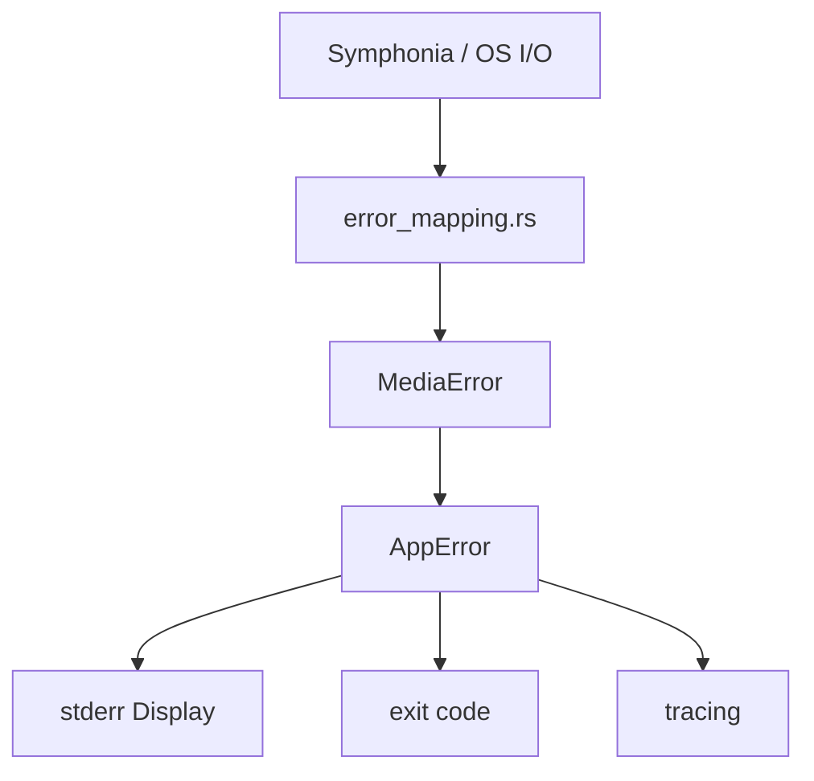

# Error mapping

This document describes how errors flow through `clip-sync`, how library failures are mapped to application errors, what users see on stderr, and what appears in diagnostic logs. For the success-path JSON contract see [json-output.md](json-output.md).

## Overview

```text
library / OS error
    → port error (MediaError, FingerprintError, …)  [original error kept via source()]
        → AppError
            → user message (stderr, via Display)
            → exit code
            → tracing span (debug detail)
```

Port errors carry the underlying library error as a type-erased `source()` (`Option<Arc<dyn Error + Send + Sync>>`): programmatic consumers can walk the standard `Error::source()` chain from `AppError` down to the original `SymphoniaError` / `io::Error` / `toml::de::Error`. The stderr `Display` line is unchanged — sources only add chain depth, never message text.

Hexagonal rule: **domain and application layers never depend on Symphonia, Chromaprint, or other infrastructure crates.** Adapters map external failures at the infrastructure boundary.

Implementation references:

| Layer | Location |
|-------|----------|
| Error enums (lib) | `crates/clip-sync/src/application/error.rs`, `crates/clip-sync/src/domain/error.rs` |
| Symphonia mapping | `crates/clip-sync/src/infrastructure/symphonia/error_mapping.rs` |
| Analyzer exit codes | `crates/clip-sync-cli/src/infrastructure/cli/exit_code.rs` |
| Analyzer CLI output on failure | `crates/clip-sync-cli/src/infrastructure/cli/mod.rs` |
| Repair error enum | `crates/clip-sync-repair/src/application/error.rs` |
| Repair exit codes | `crates/clip-sync-repair/src/infrastructure/cli/exit_code.rs` |

## Exit codes — `clip-sync` (analyzer)

| Code | Category | When |
|------|----------|------|
| 0 | Success | Alignment report printed to stdout |
| 2 | Config | Invalid or unreadable configuration |
| 3 | Domain | Business rule violation (e.g. no audio tracks selected) |
| 4 | Media | File I/O, probe, decode, or seek failure |
| 5 | Fingerprint | Fingerprint generation failure |
| 6 | Alignment | Alignment engine failure |

All non-zero codes print a single user-safe line to **stderr**. The process does not print a report to stdout on failure.

## Exit codes — `clip-sync-repair` (repair)

`RepairError` wraps both lib `AppError` and repair-specific variants.

| Code | `RepairError` variant | When |
|------|-----------------------|------|
| 0 | — | Gap analysis complete (gaps found or not) |
| 2 | `Config(String)` | Invalid config, argument, or validation failure (including `--mux` without `ffmpeg-mux` build feature) |
| 3 | `Domain(DomainError)` | No decodable audio track in A or B, or video A duration unknown during gap scan (`InvalidDuration`) |
| 4 | `Media(MediaError)`, `Io(std::io::Error)`, or `Write(std::io::Error)` | File I/O, decode failure during gap scan/patch, or WAV write failure |
| 5 | `Align(AppError)` | Any failure from the alignment sub-flow |
| 6 | `Mux(String)` | ffmpeg missing on PATH, non-zero ffmpeg exit, or mux stderr message (R5, `--mux` / `repair.output.video_path`) |

Low-confidence alignment (no matching segment) is **not** an error — the gap report still prints with `recommended_offset_secs: null` and `b_has_energy: false` for all gaps.

## User messages

Messages come from the error enums' `Display` implementations (`application/error.rs`; hand-written for the source-carrying enums so that `source()` exposes the wrapped error directly). Examples:

| AppError | Typical stderr output |
|----------|----------------------|
| `Config(FileRead { path, .. })` | `failed to read config file: <path>` |
| `Config(Parse { detail, .. })` | `failed to parse config: <detail>` |
| `Config(InvalidValue { field, reason })` | `invalid config value for \`<field>\`: <reason>` |
| `Domain(NoAudioTracks)` | `no audio tracks found` |
| `Domain(InvalidDuration)` | `invalid media duration` |
| `Domain(EmptyClip)` | `empty clip` |
| `Media(FileNotFound(path))` | `file not found: <path>` |
| `Media(UnsupportedFormat { detail, .. })` | `unsupported format: <detail>` |
| `Media(OpenFailed { detail, .. })` | `failed to open media: <detail>` |
| `Media(DecodeFailed { track, detail, .. })` | `decode failed on track <track>: <detail>` |
| `Media(SeekFailed { detail, .. })` | `seek failed: <detail>` |
| `Fingerprint(InvalidPcm(detail))` | `invalid PCM: <detail>` |
| `Fingerprint(EngineFailed { detail, .. })` | `fingerprint engine failed: <detail>` |
| `Alignment(EngineFailed(detail))` | `alignment engine failed: <detail>` |

Variants whose failures originate in a library or the OS additionally carry that error as `source()` (`UnsupportedFormat`, `OpenFailed`, `DecodeFailed`, `SeekFailed`, `Fingerprint::EngineFailed`, `Config::FileRead`, `Config::Parse`). `FileNotFound`, `Unsupported`, `InvalidPcm`, `InvalidValue`, and the domain errors have no underlying error and return `None`.

### Alignment vs “no match”

A **low-confidence alignment** (clips do not line up) is **not** an error. The tool returns exit code **0** and prints an alignment report with `aligned: false` and `recommended_offset_secs: none`.

The Chromaprint adapter returns `Ok(ClipMatchEstimate { confidence: 0.0, .. })` when fingerprints are empty, no segment is selected, or confidence is below threshold. `AlignmentError` has a single variant, `EngineFailed`, for library failures during comparison (e.g. fingerprint too long). Ambiguous multi-cluster matches are expressed via reduced confidence, not a separate error variant.

---

## Domain errors

Pure business rules; no I/O or library context.

| Variant | Source | Maps to |
|---------|--------|---------|
| `NoAudioTracks` | `select_best_track()` when track list is empty | `AppError::Domain` → exit 3 |
| `InvalidDuration` | `clip_windows()` when duration is zero | `AppError::Domain` → exit 3 |
| `EmptyClip` | Reserved for empty clip policy violations | `AppError::Domain` → exit 3 |

---

## Media errors (Symphonia adapter)

### Variants

| MediaError | Meaning |
|------------|---------|
| `FileNotFound` | Path does not exist |
| `UnsupportedFormat` | Container, codec, or feature not supported; no audio tracks |
| `OpenFailed` | Could not open, stat, or probe file; invalid file type; permission denied |
| `DecodeFailed { track, detail }` | Decoder or clip extraction failed |
| `SeekFailed` | Could not seek to clip start |

### Symphonia → MediaError

Mapping is implemented in `error_mapping.rs`. Every mapped error attaches the original `SymphoniaError` (or inner `io::Error`) as `source()` in addition to the formatted detail string.

#### I/O (`map_io_error`)

| Condition | MediaError |
|-----------|------------|
| `ErrorKind::NotFound` | `FileNotFound` |
| `ErrorKind::PermissionDenied` | `OpenFailed` (permission denied) |
| Other I/O | `OpenFailed` (includes operation name: `open`, `stat`, `probe`) |

#### Probe (`map_probe_error`)

| SymphoniaError | MediaError |
|----------------|------------|
| `IoError` | Via `map_io_error` |
| `Unsupported(feature)` | `UnsupportedFormat` |
| `DecodeError(msg)` | `OpenFailed` (malformed media) |
| `SeekError(kind)` | `SeekFailed` |
| `LimitError(limit)` | `OpenFailed` |
| `ResetRequired` | `OpenFailed` |

#### Open session (`SymphoniaMediaReader::open`)

| Condition | MediaError |
|-----------|------------|
| Not a regular file (directory, etc.) | `OpenFailed` |
| Probe failure | See probe table |
| No audio tracks after probe | `UnsupportedFormat` |
| Duration could not be determined | `OpenFailed` |

#### Decoder create (`map_decoder_create_error`)

| SymphoniaError | MediaError |
|----------------|------------|
| `Unsupported(feature)` | `UnsupportedFormat` (unsupported codec) |
| Other | `DecodeFailed` |

#### Seek to clip start (`map_seek_error`)

| SymphoniaError | MediaError |
|----------------|------------|
| `SeekError(kind)` | `SeekFailed` (includes seek time and track) |
| `Unsupported(feature)` | `SeekFailed` |
| Other | `SeekFailed` |

Seek error kinds:

| `SeekErrorKind` | Message fragment |
|-----------------|------------------|
| `Unseekable` | stream is not seekable |
| `ForwardOnly` | stream can only be seeked forward |
| `OutOfRange` | requested seek timestamp is out-of-range |
| `InvalidTrack` | invalid track id |

#### Decode loop (`map_decode_loop_error`)

| SymphoniaError | MediaError |
|----------------|------------|
| `IoError(UnexpectedEof)` | `DecodeFailed` (unexpected end of stream) |
| `IoError(other)` | `DecodeFailed` |
| `DecodeError(msg)` | `DecodeFailed` |
| `SeekError(kind)` | `SeekFailed` |
| `Unsupported(feature)` | `UnsupportedFormat` |
| `LimitError(limit)` | `DecodeFailed` |
| `ResetRequired` | `DecodeFailed` |

`ResetRequired` during normal decode is handled internally (decoder reset + continue). It only surfaces if mapping is invoked for an unexpected reset.

#### Extract validation (before decode)

| Condition | MediaError |
|-----------|------------|
| Empty clip window (`end <= start`) | `DecodeFailed` |
| Track id not in file | `DecodeFailed` |
| Missing sample rate or channels | `DecodeFailed` |
| Window too short for any samples | `DecodeFailed` |
| No samples decoded | `DecodeFailed` |
| Partial clip (`got N of M samples`) | `DecodeFailed` |

---

## Fingerprint errors (Chromaprint adapter)

| Variant | When |
|---------|------|
| `InvalidPcm` | Empty clip, sample rate below minimum (~1001 Hz), or fingerprint produced no items |
| `EngineFailed` | Chromaprint library failure (e.g. resampler setup, fingerprint too long) |

Maps to `AppError::Fingerprint` → exit **5**.

---

## Alignment errors (Chromaprint adapter)

| Variant | When |
|---------|------|
| `EngineFailed` | Chromaprint `match_fingerprints` failure (e.g. fingerprint too long) |

Low-confidence alignment (no segment above threshold) returns `Ok(ClipMatchEstimate { confidence: 0.0, .. })`, not an error. There is no `NoMatch` error variant — "clips did not match" is a successful result with zero confidence.

Maps to `AppError::Alignment` → exit **6**.

---

## Config errors

| Variant | When |
|---------|------|
| `FileRead { path, source }` | `--config` file missing or unreadable (`source` = the `io::Error`) |
| `Parse { detail, source }` | TOML parse failure (`source` = the `toml::de::Error`) |
| `InvalidValue { field, reason }` | Validation failure (e.g. `clip_length` &lt; 1 min) |

Maps to `AppError::Config` → exit **2**. Checked at startup before any media work.

---

## Diagnostic logging

Infrastructure logs failures with **tracing** before returning to the caller.

### Media adapter log levels

| MediaError | Level | Message |
|------------|-------|---------|
| `FileNotFound` | `warn` | `media file not found` |
| `UnsupportedFormat` | `warn` | `unsupported media format or codec` |
| `OpenFailed` | `error` | `failed to open or probe media` |
| `DecodeFailed` | `error` | `failed to decode media` |
| `SeekFailed` | `error` | `failed to seek in media` |

Structured fields on failure: `path`, `operation`, optional `track`, `detail`.

Operations: `open`, `stat`, `probe`, `create_decoder`, `seek`, `decode`, `extract`.

Success paths log at **debug**: `media operation succeeded`, plus extract/open metadata (track count, duration, sample counts).

### Enabling debug output

```bash
# Log level flag
clip-sync --log-level debug video_a.mp4 video_b.mp4

# Or environment filter
RUST_LOG=clip_sync=debug clip-sync video_a.mp4 video_b.mp4
```

On any failure the CLI also emits:

```text
DEBUG clip_sync: clip-sync failed error=<user Display message>
```

Full Symphonia and internal details appear in the structured media logs above, not in the user stderr line.

---

## Flow diagram



---

## Maintenance

When adding a new failure path:

1. Choose the correct **port error** variant (or add a variant with plan update).
2. Map library errors in the appropriate adapter module, not in domain/application.
3. Log via `fail_media()` / `log_media_failure()` for media, or equivalent for other adapters.
4. Add a row to this document and a unit test in `error_mapping.rs` where applicable.
