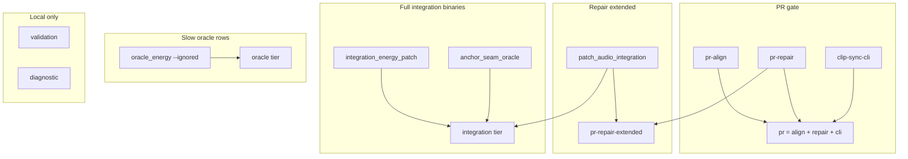

# Test tiers

How to run the clip-sync workspace test matrix using `scripts/test-tier.ps1`.

**Related:** [development.md](development.md) (build, Cargo features, integration binary matrix, `#[ignore]` scheduling, env vars), [test-acceptance-glossary.md](test-acceptance-glossary.md) (SD/SP/EC/RG row IDs), [test-tier-remainder.md](test-tier-remainder.md) (open infrastructure work), [corpus-validation.md](corpus-validation.md) (corpus sign-off).

Run all commands from the **repo root** (PowerShell):

```powershell
.\scripts\test-tier.ps1 -Tier <name> [-Package <crate>] [-Nocapture]
```

---

## Quick reference

| When | Command | Wall time (typical) |
|------|---------|---------------------|
| **CI / every PR** | `.\scripts\test-tier.ps1 -Tier pr` | ~5–8 min |
| Repair smoke only | `.\scripts\test-tier.ps1 -Tier pr-repair` | ~5–8 min |
| Repair + sine seam grid | `.\scripts\test-tier.ps1 -Tier pr-repair-extended` | ~20–25 min |
| **Widest regression** (not diagnostic) | See [§ Composite profiles](#composite-profiles) | ~25–35 min |
| Before release / large validation change | `.\scripts\test-tier.ps1 -Tier validation -Package workspace` | **~5–8 h** (debug; see below) |
| CSV dumps / sweeps (no assertions) | `.\scripts\test-tier.ps1 -Tier diagnostic -Package workspace -Nocapture` | varies |

See [development.md § Versioning and release](development.md#versioning-and-release) for semver bumps and the release checklist.

**CI today:** `.github/workflows/ci.yml` runs `check-repair-test-manifest.ps1` then `-Tier pr` only.

---

## Two kinds of “tier”

### Execution tiers (what tests *are*)

Four bins — use the [tier decision rule](development.md#tier-decision-rule) when placing new tests:

| Tier | Asserts pass/fail? | In default PR? | Cargo feature |
|------|-------------------|----------------|---------------|
| **unit** | yes | yes (repair lib) | — |
| **integration** | yes | yes (subset) | — |
| **validation** | yes | no (local only) | `validation-tests` (repair) |
| **diagnostic** | no (emit CSV / golden) | never | `diagnostic-tests` (repair) |

**oracle** is a *label* (`oracle_` prefix), not a fifth tier. Oracle tests schedule as **integration** or **validation**; `test-tier.ps1 -Tier oracle` is a **runner profile** for slow `oracle_energy` `#[ignore]` rows.

### Script tiers (what `test-tier.ps1` runs)

`test-tier.ps1` composes `cargo test` invocations. Names overlap with execution tiers but also include **PR slices** (`pr`, `pr-repair`, …).



---

## Script tier reference

### PR and repair slices

| `-Tier` | `-Package` | What runs |
|---------|------------|-----------|
| **`pr`** | `workspace` only | `pr-align` + `pr-repair` + `clip-sync-cli` tests |
| **`pr-align`** | `clip-sync` | `corpus_committed` (alignment committed corpus) |
| **`pr-repair`** | `clip-sync-repair` | Repair lib + fixtures lib + harness lib + integration smokes (see below) + `golden_baseline_smoke` |
| **`pr-repair-extended`** | `clip-sync-repair` | `pr-repair` + `patch_audio_integration` (~15 min) |

**`pr-repair` integration binaries:** `config_roundtrip`, `scan_gaps_integration`, `cli_wav_integration`, `query_reference_integration`, `integration_residual_gate_smoke`, `integration_floor_oracle_smoke`, `integration_gap_corpus` (non-ignored rows), `integration_energy_smoke`, `oracle_energy` (non-ignored rows), `seam_residual_corpus`, `wav_bit_depth_integration`, `golden_baseline_smoke`, `cli_mux_integration` (non-ignored, when `ffmpeg` on PATH).

**Not in PR** (run via `integration` or `oracle` tiers): `patch_audio_integration`, `integration_energy_patch`, `anchor_seam_oracle`, `oracle_energy --ignored`.

### Execution-tier runners

| `-Tier` | `-Package` | What runs |
|---------|------------|-----------|
| **`unit`** | `workspace`, `clip-sync-repair`, `clip-sync` | `clip-sync-repair --lib`, `clip-sync-repair-fixtures --lib`, and/or `clip-sync --lib` |
| **`integration`** | `workspace`, `clip-sync-repair`, `clip-sync-cli` | Repair integration + oracle **binaries only** (no `--lib`, no `validate_*` / `diag_*`) |
| **`oracle`** | `workspace`, `clip-sync-repair` | `oracle_energy` then `oracle_energy -- --ignored` |
| **`validation`** | `workspace`, per-crate | Repair: `validate_*`, `golden_baseline_invariance`, gap corpus `#[ignore]` filters, mux e2e `#[ignore]`; align: `clip-sync` corpus `#[ignore]` filters |
| **`diagnostic`** | `workspace`, per-crate | Repair: all `diag_*` + `seam_residual_oracle` + named slow `#[ignore]` rows; align: fixture regen, slow PCM, etc. |

**`integration` repair binaries** (superset of PR integration tests): all `pr-repair` integration binaries **plus** `patch_audio_integration`, `integration_energy_patch`, `anchor_seam_oracle`. Omits lib units, harness lib, and `golden_baseline_smoke` (those are in `pr-repair` / `unit`).

### Stubs (not implemented)

`validation-align`, `diagnostic-align` — error until Phase 2b (`clip-sync` binary split). See [test-tier-remainder.md](test-tier-remainder.md).

### Parameters

| Flag | Values | Notes |
|------|--------|-------|
| `-Package` | `workspace` (default), `clip-sync-repair`, `clip-sync`, `clip-sync-cli` | Some tiers require a specific package (e.g. `pr` → `workspace` only) |
| `-Nocapture` | switch | Passes `--nocapture` to `cargo test` (useful for diagnostic CSV output) |

---

## Composite profiles

Use these when a single script tier is not enough.

### Widest regression (not diagnostic)

Repo-only assertion coverage: PR gate + full repair integration binaries + slow oracle rows. Does **not** run validation (`validate_*`, external corpus) or diagnostic (`diag_*`) tiers.

```powershell
.\scripts\test-tier.ps1 -Tier pr
.\scripts\test-tier.ps1 -Tier integration -Package clip-sync-repair
.\scripts\test-tier.ps1 -Tier oracle -Package clip-sync-repair
```

Expect ~25–35 min in debug (dominated by `patch_audio_integration`, run twice if you run both `pr` via extended path — `integration` includes it; `pr` alone does not unless you use `pr-repair-extended` instead of bare `pr-repair` inside `pr`).

**Leaner variant** (repair only, no alignment CLI):

```powershell
.\scripts\test-tier.ps1 -Tier pr-repair-extended
.\scripts\test-tier.ps1 -Tier integration -Package clip-sync-repair
.\scripts\test-tier.ps1 -Tier oracle -Package clip-sync-repair
```

### Pre-release (everything local except diagnostic)

Requires `ffmpeg` on PATH; external corpus env vars optional (skipped rows stay ignored).

```powershell
.\scripts\check-repair-test-manifest.ps1
.\scripts\test-tier.ps1 -Tier pr
.\scripts\test-tier.ps1 -Tier validation -Package workspace
```

Add `-Tier diagnostic` when regenerating CSVs or golden surfaces.

### Validation tier wall time

**Not in CI** — run locally before releases or large fit/patch/codec changes. Times below are **debug** builds on a typical dev machine with `ffmpeg` on PATH and `.\scripts\fetch_corpus_sources.ps1` already run. Release builds are faster but the tier is still dominated by real-codec encode/decode and corpus I/O.

| Command | Typical wall time | Notes |
|---------|-------------------|--------|
| `-Tier validation -Package clip-sync-repair` | **~4–5 h** | Dominated by `validate_floor_oracle` (Wikimedia/Musopen codec matrix) |
| `-Tier validation -Package clip-sync` | **~30–90 min** | `corpus_generated` + optional `corpus_external` / query-reference rows |
| `-Tier validation -Package workspace` | **~5–8 h** | Repair block + alignment block sequentially |

**Repair validation breakdown** (single `cargo test` batch):

| Binary / step | Order of magnitude |
|---------------|-------------------|
| `validate_floor_oracle` | **~4 h** (7 tests; `source_gap_oracle_floor_csv` alone ~35 min) |
| `validate_residual_gate` | ~4 min |
| `validate_patch_audio` | ~1–2 min |
| `golden_baseline_invariance` (`--ignored`) | seconds (needs local `gap-files/…`) |
| `integration_gap_corpus` ignored rows | ~2–5 min |
| `cli_mux_integration` ignored mux e2e | ~1 min |

**Alignment validation** adds `corpus_generated` (~15–30 min for all generated rows), plus optional long rows (`corpus_query_reference_45min`, external corpus) when env vars are set — those can add **tens of minutes** each.

**Leaner pre-release** when you only changed repair fit/patch:

```powershell
.\scripts\test-tier.ps1 -Tier pr
.\scripts\test-tier.ps1 -Tier validation -Package clip-sync-repair
```

**Full sign-off** (release checklist in [development.md § Versioning and release](development.md#versioning-and-release)):

```powershell
.\scripts\check-repair-test-manifest.ps1
.\scripts\test-tier.ps1 -Tier pr
.\scripts\test-tier.ps1 -Tier validation -Package workspace
```

### Clippy (matches CI + full harness compile)

```powershell
cargo clippy -p clip-sync-repair --all-targets -- -D warnings
cargo clippy -p clip-sync-repair-harness -- -D warnings
# optional: compile-check validation/diagnostic binaries
cargo clippy -p clip-sync-repair --all-targets --features validation-tests,diagnostic-tests -- -D warnings
```

---

## Prerequisites by tier

| Need | Tiers affected |
|------|----------------|
| Rust stable | all |
| `ffmpeg` on PATH | `cli_mux_integration`, validation floor oracle, alignment `corpus_generated` / `corpus_external`, many diagnostic rows |
| `ffprobe` on PATH | `mux_writes_video` (validation) |
| `.\scripts\fetch_corpus_sources.ps1` | `validate_floor_oracle` |
| `CLIP_SYNC_CORPUS` | alignment external corpus (`validation`) |
| `CLIP_SYNC_GAP_CORPUS` | `gap_corpus_external` (`validation`) |

`golden_baseline_invariance` and `gap_repair_spec_diff` no longer need any external corpus — since Phase 3 of
the gap-fixture-corpus plan they run on committed curated fixtures (`pr-repair`, media-free). The
`gap-fingerprint-stats` calibration bin still takes `gap-files/` dirs as CLI args, but no test does.

---

## Ad-hoc `cargo test` (single binary or filter)

Prefer `test-tier.ps1` for tier runs. For one-off debugging:

```powershell
# Single integration binary
cargo test -p clip-sync-repair --test patch_audio_integration

# One test by name
cargo test -p clip-sync-repair --test oracle_energy u1_f1_bool_unified_finds_pause_one

# Ignored row
cargo test -p clip-sync-repair --test oracle_energy -- --ignored --nocapture

# Feature-gated validation binary
cargo test -p clip-sync-repair --features validation-tests --test validate_residual_gate
```

**Repair crate note:** `autotests = false` — bare `cargo test -p clip-sync-repair` runs **`--lib` only**, not integration binaries. Use `--test <binary>` or the script.

**Do not use** `cargo test --tests` when you mean integration-only — Cargo still runs `--lib`. Use the script or an explicit `--test` list ([development.md](development.md#default--ci-commands)).

---

## `#[ignore]` and scheduling

- Feature-gated `validate_*` / `diag_*` binaries: no `#[ignore]`; the Cargo feature controls compilation.
- Shared integration binaries: `#[ignore = "tier:oracle|validation|diagnostic — …"]` on slow rows; the script selects by binary + `--ignored` or name filters (not by parsing the reason string).

Full filter table: [development.md § Ignore scheduling](development.md#ignore-scheduling).

---

## Where tests live

| Location | Examples |
|----------|----------|
| `crates/*/src/**` `#[cfg(test)]` | Unit tests, policy oracles |
| `crates/clip-sync-repair/tests/*.rs` | Integration / validation / diagnostic **binaries** (`[[test]]` in `Cargo.toml`) |
| `crates/clip-sync-repair-harness/` | Shared runners imported by tier binaries |
| `crates/clip-sync` lib tests | Alignment corpus (Phase 2b will split into `tests/` binaries) |

Integration binary matrix (acceptance IDs, PR column): [development.md § Repair integration binary matrix](development.md#repair-integration-binary-matrix).
